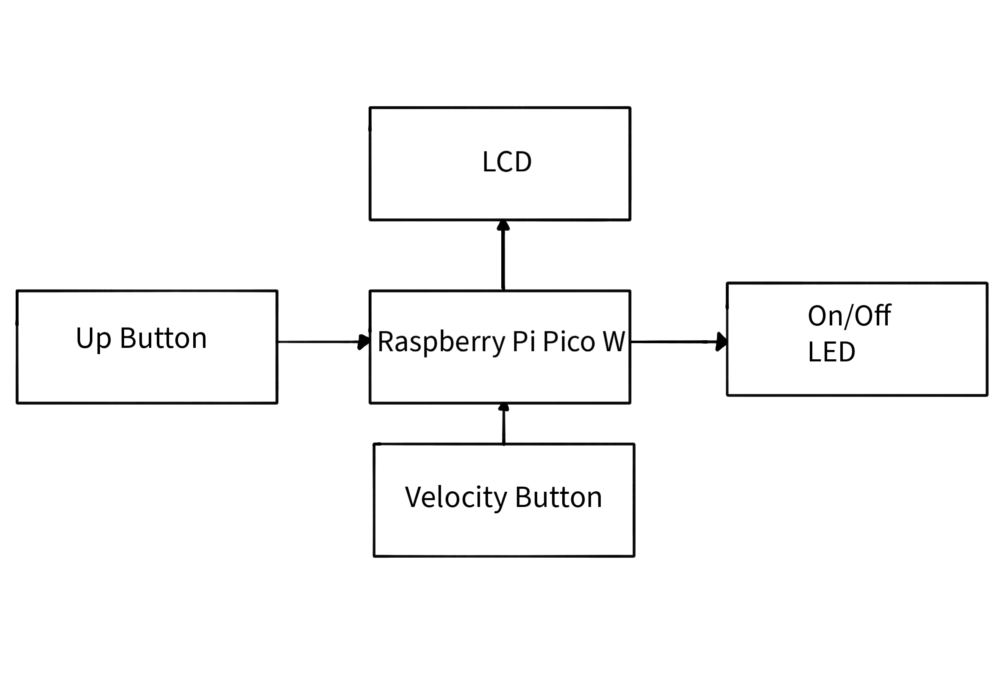
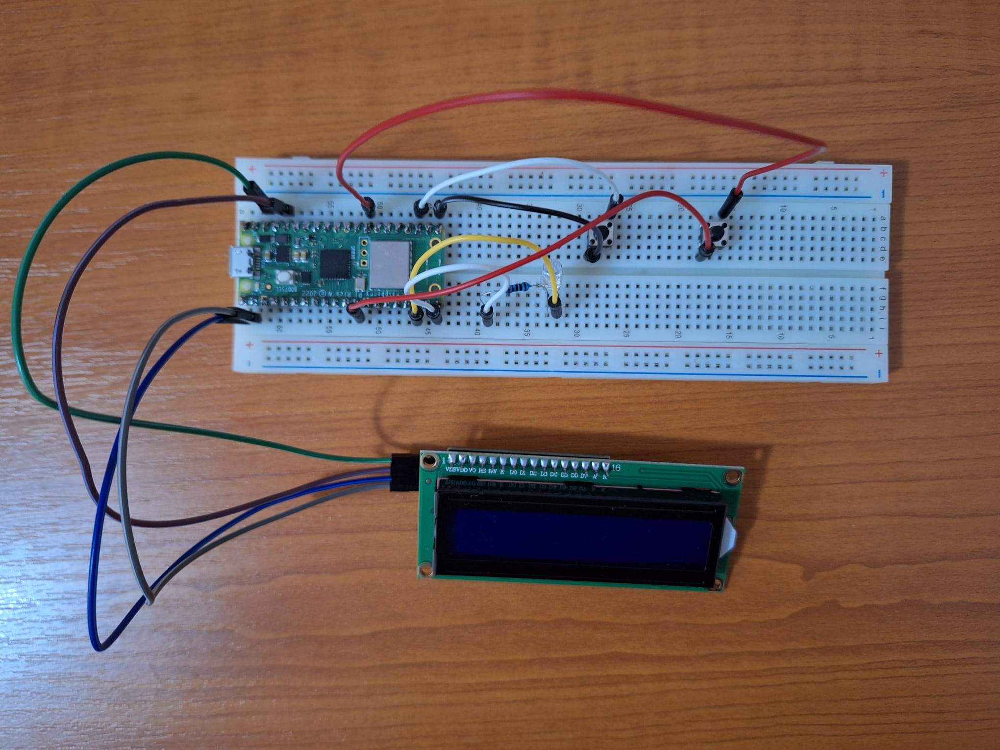
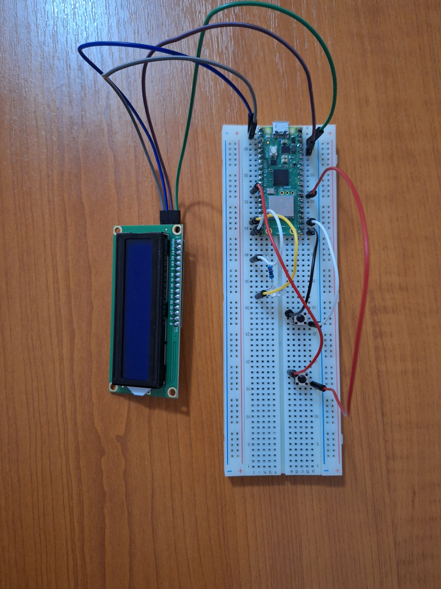
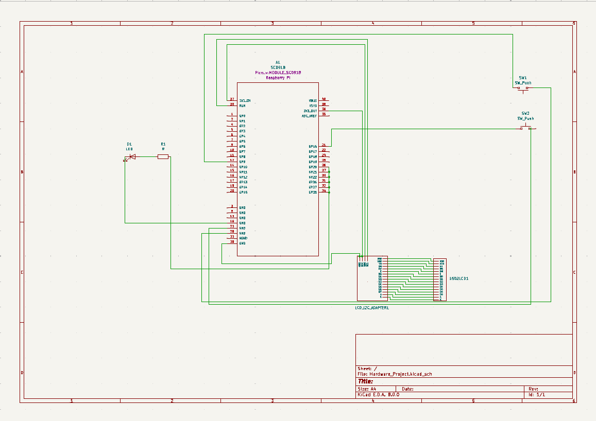

# Game Console
 A compact game console for user-friendly games like Snake or the Chrome dinosaur game, designed for offline entertainment.
:::info 

**Author**: POSTELNECU Ioana \
**GitHub Project Link**: https://github.com/UPB-FILS-MA/project-IoanaP0711

:::

## Description

My idea is to have the ability to play user-friendly games-such as Snake or the one with the dinosaur on Chrome, when you don't have a connection- on a tiny and simple game console. It consists in a breadboard, where's attached the Raspberry Pi, a LCD screen, a LED to show if the console is powered on or off and the buttons. There's one for the velocity and four for left/right/up/down, similarly to a regular gaming console or just one for going up(based on what game I'm going to write I'll either put one button or four). 

## Motivation

I've decided to choose this project, because ever since I was a kid, I've used to play video games and I've told myself that I'll learn how to make one from scratch. On top of that, for many years my desire for playing has been decreasing, because even though I like the games, I'm getting bored of them, so I want to create one at some point, that keeps me playing it. To sum up, I want to make this as my project, because I want to understand the basics of game development, in order to actually start designing and developing my own game. 

## Architecture 



This project's architecture revolves around the Raspberry Pi Pico W as the microcontroller, executing the game code. The LCD screen 1602 module serves as the display interface for the game graphics. An LED is integrated to signify the console's power status. User input is facilitated through buttons, with one controlling velocity and the other managing movement. To construct and test the circuit, a breadboard and jumper wires are employed, allowing seamless connectivity between components. Here are some photos of the actual hardware:



## Log

<!-- write every week your progress here -->

### Week 6 - 12 May

I've started to assemble the hardware and to work on the KiCAD schematic, as well as starting to write the code, by using the Bevy framework.

### Week 7 - 19 May

I've done the KiCAD schematic and because I couldn't find the symbol for the 1602 I2C display in the given KiCAD libraries, I've created one for the project.

### Week 20 - 26 May

## Hardware

1. **Raspberry Pi Pico W**: Microcontroller board used for running the code
2. **LCD screen 1602 module**: used for displaying the actual game
3. **LED**: shows when the console is on or off
4. **Buttons**: one for velocity and one for up and down
5. **Breadboard**: needed for building and testing the circuit
6. **Jumper wires**: needed for connecting the components

In this project, Raspberry Pi Pico W runs the game code, while the LCD screen 1602 module displays the game. An LED indicates power status, and buttons control velocity and movement. A breadboard and jumper wires connect the components for testing and construction.

### Schematics



### Bill of Materials

<!-- Fill out this table with all the hardware components that you might need.

The format is 
```
| [Device](link://to/device) | This is used ... | [price](link://to/store) |

```

-->

| Device | Usage | Price |
|--------|--------|-------|
| [Rapspberry Pi Pico W](https://www.raspberrypi.com/documentation/microcontrollers/raspberry-pi-pico.html) | The microcontroller | [35 RON](https://www.optimusdigital.ro/en/raspberry-pi-boards/12394-raspberry-pi-pico-w.html) |
| [1602 LCD](https://www.optimusdigital.ro/en/lcds/2894-1602-lcd-with-i2c-interface-and-blue-backlight.html) | LCD Screen | [16.34 RON](https://www.optimusdigital.ro/en/lcds/2894-1602-lcd-with-i2c-interface-and-blue-backlight.html) |
| [ Button 6x6x6](https://www.optimusdigital.ro/ro/butoane-i-comutatoare/1119-buton-6x6x6.html?search_query=butoane+&results=197) | Buttons for controls | [0.36 RON](https://www.optimusdigital.ro/ro/butoane-i-comutatoare/1119-buton-6x6x6.html?search_query=butoane+&results=197) |
| [Breadboard, Wires](https://kits.plusivo.com/microcontroller-starter-kit/claim.html) |Breadboard with 830 points, Wires | [74.99 RON](https://www.optimusdigital.ro/ro/kituri/12333-kit-plusivo-microcontroller-starter.html?search_query=plusivo+microcontroller+starter+kit&results=3) |
TOTAL : 126.69 RON 

## Software

| Library | Description | Usage |
|---------|-------------|-------|
| [embassy-rp](https://github.com/embassy-rs/embassy/tree/main/embassy-rp) | RP2040 peripherals | Used for accessing the peripherals of the microcontroller  |
| [embassy-hal](https://github.com/embassy-rs/embassy) | Hardware Abstraction Layer | Interfaces with Raspberry Pi Pico W hardware |
| [embassy-sync](https://github.com/embassy-rs/embassy/tree/main/embassy-sync) | Synchronization primitives | Used for syncronizing asynchronous tasks |
| [ag-lcd](https://github.com/mjhouse/ag-lcd) | Display library | Used for writing to the display |
| [wasmi](https://github.com/wasmi-labs/wasmi) | Game Framework | Game Engine used for the development of the game/ WebAssembly Interpreter |


## Links

<!-- Add a few links that inspired you and that you think you will use for your project -->

1. [tutorials for creating a game + libraries](https://arewegameyet.rs/) 
2. [game engine that works with Rust and WebAssembly](https://github.com/bevyengine/bevy/tree/latest)
3. [step by step tutorial on how to create a game by using Rust and Bevy](https://www.youtube.com/watch?v=E9SzRc9HkOg)
4. [understanding and starting to use wasmi](https://blog.knoldus.com/hosting-wasm-modules-in-rust-easily-using-wasmi/#hosting-in-rust)
5. [book on how to create a game with Rust and WebAssembly](https://www2.irb.hr/korisnici/zskoda/hoffmanWasmRust.pdf)
6. [libraries for Rust and Bevy(in case I'm using Bevy I've decided to put all the info for Wasmi & Bevy too)](https://lib.rs/game-development)
