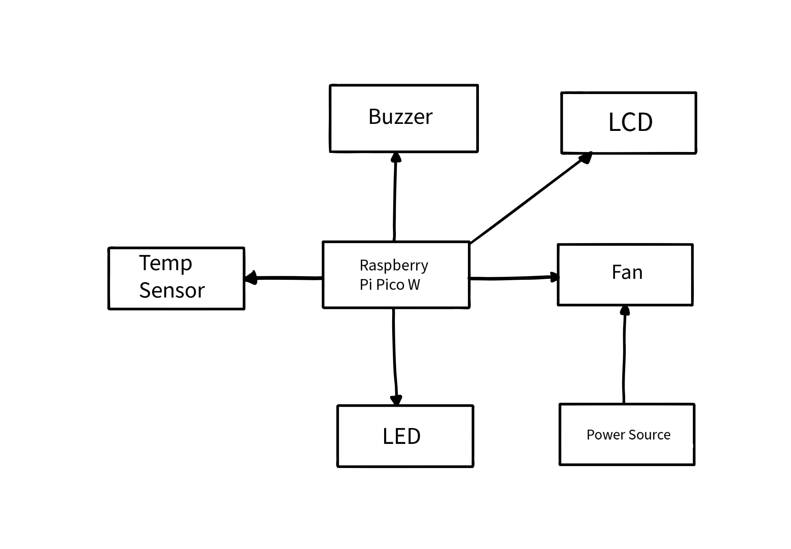
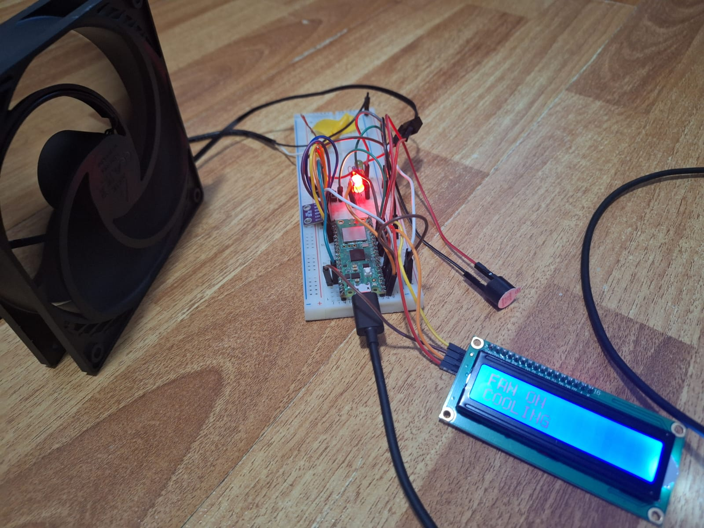
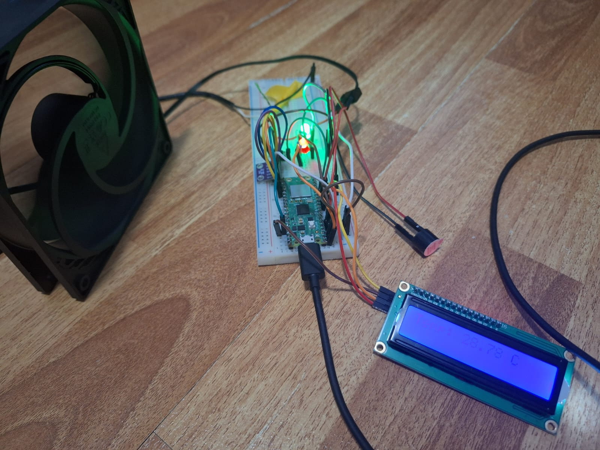

# Cooling Station
 Adjustable fan that is powered by a smart thermostat

:::info 

**Author**: Postelnecu Ioana \
**GitHub Project Link**: https://github.com/UPB-FILS-MA/project-IoanaP0711

:::

## Description

Cooling station is a practical way to cool-off on a hot summer day. Made to stand on your desk with a big fan to cool off any programmer. With an easy and fast Rust powered software can be easily reprogrammed in order to cool-off your room, no matter how hot it is. It is powered with two bright LEDs and a Buzzer that will let you know when the temperature gets to the set threshold. No more need of desk fans or thermometers when you can use the Cooling Station to automatically keep you cool.

## Motivation

This idea came to be on a hot summer day, when I was sitting at my desk working on my laptop, thinking... what if there was a fun way to build a fan that can cool you off whenever the temperature gets too high. Knowing that my laptop generates a lot of heat, and that my desk is right in the way of the radiating hot sun, I knew this was the right idea of a project.

## Architecture 

1. **Raspberry Pi Pico W**: Microcontroller board used for processing and sending the data to all devices
2. **LCD screen 1602 module**: Used for displaying the live temperature and usage instructions
3. **LED**: Shows when the temperature is lower than the threshold or over it (blinks when approaching limit temperature)
4. **Buttons**: Used for controlling fan speed once the temperature is above certain threshold
5. **Buzzer**: Beeps louder and louder when temperature is rising until the threshold
6. **Breadboard**: Needed for building and testing the circuit
7. **Jumper wires**: Needed for connecting the components

&nbsp;

## Log

<!-- write every week your progress here -->

### Week 12 - 18 Aug

I came with the idea, ordered the pieces and started looking into potential software implementations.

### Week 19 - 25 Aug

Put the hardware together and started initial software testing. Made the KiCad schematic.

### Week 26 - 1 Sep

Finished hardware, and did the last few touches to the software code done in Rust. Also, started writing the journey of getting this idea, turned to a real, functional thing, into the documentation you are reading right now.

## Hardware

The project is based on the Raspberry Pi Pico W, which is the brain of the whole operation. Together with the BMP280 temperature sensor, the two LEDs used for visual temperature warnings, the buzzer for acoustic warnings, and the LCD for written instructions and live temperature, while the fan has the role of the cooler agent.

:::info 

In this project, Raspberry Pi Pico W is used for `processing` the `temperature data`, and depending on it, the MCU will `power on` the component assembly `accordingly`. This results in proper temperature `announcements` and a good cooling when `necessary`.
The board will not power the fan at first, unless the threshold is `reached`, doing a `regulated` cool of the temperature, `adjusting` the fan `speeds` depending on `ambiental temperature`. If the temperature is `near` or `above` the threshold and the user does not consider the cooling good enough or that is too fast, the `button` can also be used for `manual adjustments` that are `saved` while the temperature is `oscillating` between the `alert` values.

:::

**Pictures**

Here are some photos of the actual hardware:

<table>
<tr>
 <td>
  

</td>
<td>
 

</td>
<td>

</td>
</tr>
</table>
<table>
<tr>
 <td>
  

</td>
<td>
 

</td>
<td>

</td>
</tr>
</table>

### Schematics

### Bill of Materials

| Device | Usage | Price |
|--------|--------|-------|
| [Rapspberry Pi Pico W](https://www.raspberrypi.com/documentation/microcontrollers/raspberry-pi-pico.html) | The microcontroller | [35 RON](https://www.optimusdigital.ro/en/raspberry-pi-boards/12394-raspberry-pi-pico-w.html) |
| [1602 LCD](https://www.optimusdigital.ro/en/lcds/2894-1602-lcd-with-i2c-interface-and-blue-backlight.html) | LCD Screen | [16.34 RON](https://www.optimusdigital.ro/en/lcds/2894-1602-lcd-with-i2c-interface-and-blue-backlight.html) |
| [ Button 6x6x6](https://www.optimusdigital.ro/ro/butoane-i-comutatoare/1119-buton-6x6x6.html?search_query=butoane+&results=197) | Buttons for controls | [0.36 RON](https://www.optimusdigital.ro/ro/butoane-i-comutatoare/1119-buton-6x6x6.html?search_query=butoane+&results=197) |
| [Electronic Components Starting Kit](https://kits.plusivo.com/microcontroller-starter-kit/claim.html) |Kit with electronical components | [74.99 RON](https://www.optimusdigital.ro/ro/kituri/12333-kit-plusivo-microcontroller-starter.html?search_query=plusivo+microcontroller+starter+kit&results=3) |
| Breadboard with 830 points | Connects components | In-Kit |
| Buzzer | Connects components | In-Kit |
| LED x 2| Electrical Component | In-Kit |
| 220KΩ x 2| Electrical Component | In-Kit |
| Wires | Connects components | In-Kit |
| [Pressure sensor Barometric BMP280 GY](https://components101.com/sensors/gy-bmp280-module) | Pressure Sensor | [8.49 RON](https://www.optimusdigital.ro/ro/senzori-senzori-de-presiune/1666-modul-senzor-de-presiune-barometric-bmp280.html?search_query=BMP280&results=11) |
| [120x120 PWM Fan](https://www.arctic.de/media/8c/5d/bd/1693305992/Spec_Sheet_P12_PWM_EN.pdf) | Fan | [26.99 RON](https://www.emag.ro/ventilator-arctic-p12-pwm-black-black-120mm-acfan00119a/pd/DZT5RTMBM/) |
| [5-12 Power Source](https://www.arctic.de/media/8c/5d/bd/1693305992/Spec_Sheet_P12_PWM_EN.pdf) | Power Source | [10.41 RON](https://www.emag.ro/sursa-de-alimentare-12v-1a/pd/DFMG13BBM/?ref=history-shopping_374985296_18482_1) |
 

## Software

| Library | Description | Usage |
|---------|-------------|-------|
| [embassy-rp](https://crates.io/crates/embassy-rp) | Embassy Hardware Abstraction Layer (HAL) for the Raspberry Pi RP2040 microcontroller | Used for `initializing` hardware PINs and protocols used by devices such as the Display, Buzzer, LCDs, Fan and Sensor. |
| [embassy-embedded-hal](https://crates.io/crates/embassy-embedded-hal) | Collection of utilities to use `embedded-hal` and `embedded-storage` traits with Embassy. | Dependency of `embassy-rp` used for adding `embedded-hal` traits to embassy |
| [embassy-time](https://embassy.dev/) | Instant and Duration for embedded no-std systems, with async timer support | Stops code execution for a definite time period |
| [embassy-executor](https://crates.io./crates/embassy-executor) | async/await executor designed for embedded usage | Used for spawning/tasking asynchronous functions like `main` and tasking functions like `logger-task` |
| [lcd1602-driver](https://crates.io/crates/lcd1602-driver) | An embedded-hal based driver for the LCD1602 display | Used for defining and customizing display's `traits` and `features` |
| [heapless](https://crates.io/crates/heapless) | `static` friendly data structures that don't require dynamic memory allocation | Used for variables `unsigned` to `String` conversion |

## Links

1. [How to use BMP280 GY over SPI with a Pico Microcontroller using Rust](https://embedded-rust-101.wyliodrin.com/docs/lab/06)
2. [How to make Temperature Controlled Fan Using Arduino and DHT11](https://www.youtube.com/watch?v=eg8AlYlV0PM)
3. [How to Use the Adafruit BMP280 Sensor](https://www.instructables.com/How-to-Use-the-Adafruit-BMP280-Sensor-Arduino-Tuto/)
4. [BMP280: Measure Temperature, Pressure and Altitude](https://projecthub.arduino.cc/SurtrTech/bmp280-measure-temperature-pressure-and-altitude-6002cd)
