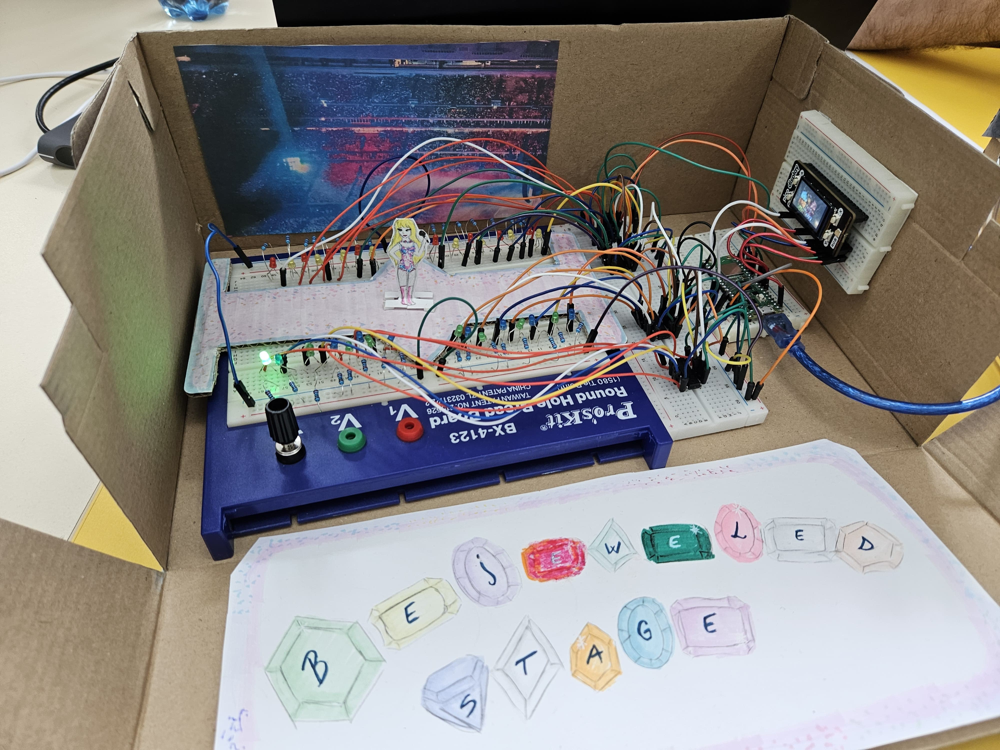

# Bejeweled Stage
This project invites you to take part in the experience of a miniature concert where technology meets creativity.
:::info 

**Author**: SURUGIU Ioana-Monica \
**GitHub Project Link**: https://github.com/UPB-FILS-MA/project-msrgq

:::

## Description

Bejeweled Stage consists in a miniature concert with lights and visuals. Its functionality comes from 4 shift registers that control 8 LEDs each, in total 32, using a cascade of flip-flops where the output of one flip-flop is connected to the input of the next. They also share a single clock signal, making the data stored in the system to shift from one to the next. The stage is designed between 2 rows of 16 LEDs, making it look like light bracelets in a stadium. I also used a Display, that communicates with the LCD Display via SPI. All of these components are connected to a Raspberry Pi Pico.

## Motivation

As someone who has always been captivated by music, art, the creation and work behind building a stage for a tour, Bejeweled Stage represents the perfect fusion of my passions. I decided to make this project, because I've always loved concert lights, for example bracelets that sparkle bringing to life a whole stadium. I wanted to bring the concert experience, the light bracelets being the LEDs. This project allows me to channel my creativity on transforming abstract concepts into a sensory experience. Integraing a microcontroller and using shift registers and multimedia elements (still images), will expand my technical skills. 


## Architecture 


Each shift register handles 8 LEDs, and with four shift registers connected in a cascade configuration, a total of 32 LEDs are managed. The shared clock signal ensures that data bits move from one to the next, creating specific light patterns. The LCD display, controlled via the SPI protocol, provides a platform for showing complementary visuals or information. The SPI connection involves CD_CS, LCD_DC, LCD_SCLK, and LCD_MOSI on the Raspberry Pi Pico, which acts as the central controller.

## Log

<!-- write every week your progress here -->

### Week 6 - 12 May
I connected all the components and made the electronic circuit according to the shape of the stage and tested it. 

### Week 7 - 19 May
I made the KiCad Schematic for the project. Because I couldn't find any symbol for Pico Display Pack, I created it and added to the schematic.
I created the stage and added it to the circuit having now the final shape of it.

### Week 20 - 26 May
I started the software and finished it, while also doing final improvements to my project.

## Hardware

1. **Raspberry Pi Pico W Microcontroller**: It coordinates the Display and Shift registers' actions.
2. **LEDs**: They light up in response to the audio input.
3. **Pico Display**: It is the visual output device. 
4. **Shift registers**: They are used to control the LEDs.
5. **Breadboard**: It is used for building the circuit.
6. **Wires**: They are used for connecting the components.

### Schematics


### Final Look



### Bill of Materials

<!-- Fill out this table with all the hardware components that you might need.

The format is 
```
| [Device](link://to/device) | This is used ... | [price](link://to/store) |

```

-->

| Device | Usage | Price |
|--------|--------|-------|
| [Rapspberry Pi Pico W](https://www.raspberrypi.com/documentation/microcontrollers/raspberry-pi-pico.html) | The microcontroller | [35 RON](https://www.optimusdigital.ro/en/raspberry-pi-boards/12394-raspberry-pi-pico-w.html) |
| [Pico Display Pack](https://shop.pimoroni.com/products/pico-display-pack?variant=32368664215635)| The display | [110 RON](https://www.optimusdigital.ro/en/others/12150-pico-display-pack.html) |
| [LEDs] | Electronic Components | [40 RON](hhttps://www.optimusdigital.ro/ro/kituri/11970-set-led-uri-asortate-plusivo-500-buc-led-uri-100-buc-rezistoare-i-pcb-bonus.html?search_query=led&results=818) |
| [Wires] | Electronic Components | [7 RON](https://www.optimusdigital.ro/ro/fire-fire-mufate/884-set-fire-tata-tata-40p-10-cm.html?search_query=fire&results=437) |
| [2x Breadboards] | Electronic Components | [20 RON](https://www.optimusdigital.ro/ro/prototipare-breadboard-uri/8-breadboard-830-points.html?search_query=breadboard&results=145) |
| [4x Shift Registers 74hc595](https://www.alldatasheet.com/datasheet-pdf/pdf/12198/ONSEMI/74HC595.html) | Electronic Components | [8 RON ](https://www.optimusdigital.ro/en/others/2448-registru-de-deplasare-74hc595-dip-16.html) |
| [32x Resistors 220 ohm] | Electronic Components | [5 RON ](https://www.optimusdigital.ro/ro/kituri/11970-set-led-uri-asortate-plusivo-500-buc-led-uri-100-buc-rezistoare-i-pcb-bonus.html?search_query=led&results=818) |


## Software

| Library | Description | Usage |
|---------|-------------|-------|
| [pwm](https://docs.embassy.dev/embassy-nrf/git/nrf52840/pwm/index.html) | Pulse-Width modulation | Used for controlling the brightness of LEDs |
| [embedded-graphics](https://github.com/embedded-graphics/embedded-graphics) | 2D graphics library | Used for drawing to the display |

## Links

<!-- Add a few links that inspired you and that you think you will use for your project -->

1. [Where I got my idea from](https://wired.me/technology/the-tech-behind-taylor-swift-concert-wristbands/)
2. [LEDs project with shift registers](https://www.youtube.com/watch?v=c5dpqXnZFqw&t=223s/ )
...