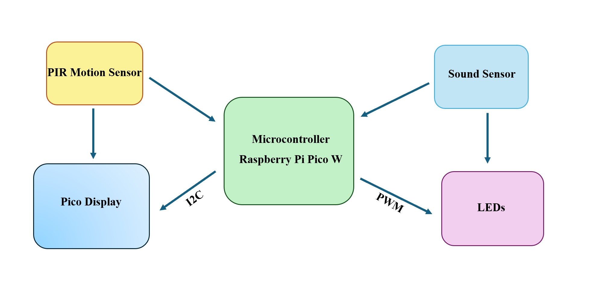
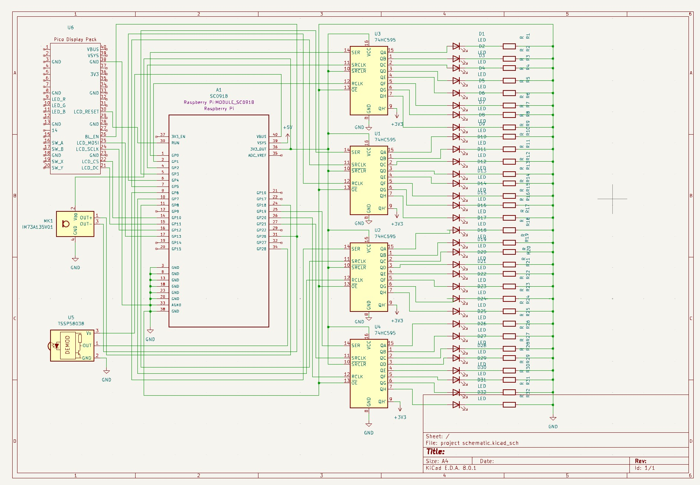
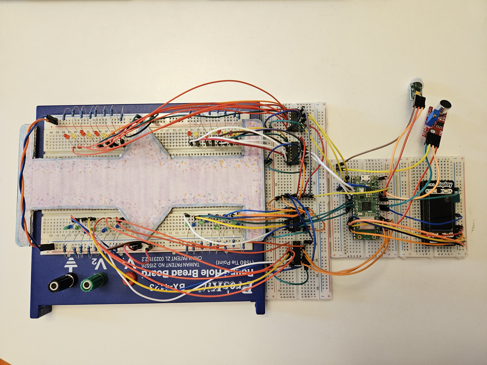
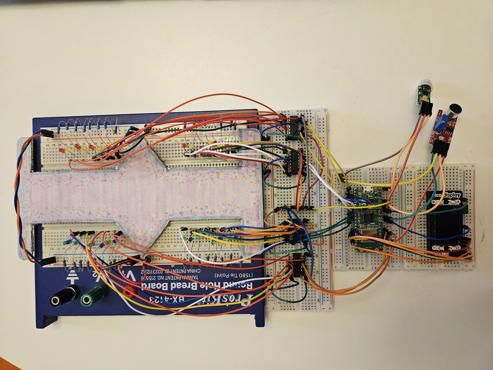
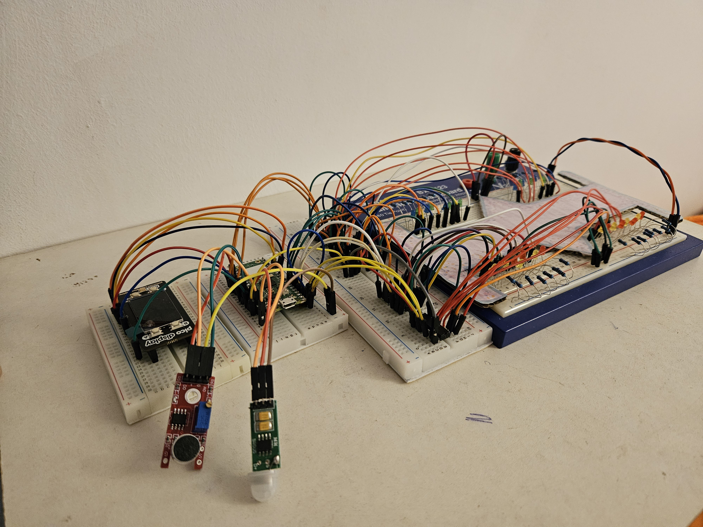

# Bejeweled Stage
This project invites you to take part in the experience of a miniature concert where technology meets creativity.
:::info 

**Author**: SURUGIU Ioana-Monica \
**GitHub Project Link**: https://github.com/UPB-FILS-MA/project-msrgq

:::

## Description

Bejeweled Stage will be implemented using Raspberry Pi Pico W. As the audio sensor detects music played, the LED lights burst to life and using PWM I'll control their brightness. The Pico Display will show up images and visuals when the PIR sensor will detect movements around the stage. 

## Motivation

As someone who has always been captivated by music, art, the creation and work behind building a stage for a tour, Bejeweled Stage represents the perfect fusion of my passions. I decided to make this project, because I've always loved concert lights, for example bracelets that sparkle bringing to life a whole stadium. I wanted to bring the concert experience, the light bracelets being the LEDs. This project allows me to channel my creativity on transforming abstract concepts into a sensory experience. Integrating sensors, a microcontroller and multimedia elements (still images), will expand my technical skills. 


## Architecture 



The project's arhitecture shows that the Raspberry Pi Pico W is the central unit that coordinates the other components' actions. The audio sensor serves as the primary input device, detecting sound and converts it into electrical signals. They are processed by the Raspberry Pi Pico to determine the intensity and rhythm of the played music. Then, the LEDs connected to the Raspberry Pi Pico through PWM (Pulse Width Modulation) pins, light up in response to the audio input. The Passive Infrared (PIR) sensor detects motion within its field of view. When it's detected, a signal is sent to the Raspberry Pi Pico, indicating the presence of motion in the environment. Pico Display communicates with the Raspberry Pi Pico via the I2C protocol. Upon receiving signals from the PIR sensor, the Raspberry Pi Pico calls the Pico Display to show images.

## Log

<!-- write every week your progress here -->

### Week 6 - 12 May
I connected all the components and made the electronic circuit according to the shape of the stage and tested it. 

### Week 7 - 19 May
I made the KiCad Schematic for the project. Because I couldn't find any symbol for Pico Display Pack, I created it and added to the schematic.
I created the stage and added it to the circuit having now the final shape of it.

### Week 20 - 26 May

## Hardware

1. **Raspberry Pi Pico W Microcontroller**: It interfaces with the audio sensor, PIR sensor, LEDs, and Pico Display, coordinating their actions.
2. **Audio Sensor**: Detects sound
3. **PIR Sensor**: Detects motion
4. **LEDs**: They light up in response to the audio input.
5. **Pico Display**: It is the visual output device. 
6. **Breadboard**: It is used for building the circuit.
7. **Wires**: They are used for connecting the components.

### Schematics






### Bill of Materials

<!-- Fill out this table with all the hardware components that you might need.

The format is 
```
| [Device](link://to/device) | This is used ... | [price](link://to/store) |

```

-->

| Device | Usage | Price |
|--------|--------|-------|
| [Rapspberry Pi Pico W](https://www.raspberrypi.com/documentation/microcontrollers/raspberry-pi-pico.html) | The microcontroller | [35 RON](https://www.optimusdigital.ro/en/raspberry-pi-boards/12394-raspberry-pi-pico-w.html) |
| [Pico Display Pack](https://shop.pimoroni.com/products/pico-display-pack?variant=32368664215635)| The display | [110 RON](https://www.optimusdigital.ro/en/others/12150-pico-display-pack.html) |
| [Audio Sensor](https://components101.com/modules/lm393-sound-detection-sensor-module) | Sensor | [3 RON](https://www.optimusdigital.ro/ro/senzori/12982-modul-senzor-de-sunet-cu-microfon.html?search_query=senzor+de+sunet&results=33) |
| [PIR Sensor](https://cdn-learn.adafruit.com/downloads/pdf/pir-passive-infrared-proximity-motion-sensor.pdf) | Sensor | [9.24 RON](https://www.optimusdigital.ro/ro/senzori-senzori-pir/1498-senzor-pir-in-miniatura-hc-sr505.html?search_query=senzor+pir&results=41) |
| [LEDs] | Electronic Components | [40 RON](hhttps://www.optimusdigital.ro/ro/kituri/11970-set-led-uri-asortate-plusivo-500-buc-led-uri-100-buc-rezistoare-i-pcb-bonus.html?search_query=led&results=818) |
| [Wires] | Electronic Components | [7 RON](https://www.optimusdigital.ro/ro/fire-fire-mufate/884-set-fire-tata-tata-40p-10-cm.html?search_query=fire&results=437) |
| [2x Breadboards] | Electronic Components | [20 RON](https://www.optimusdigital.ro/ro/prototipare-breadboard-uri/8-breadboard-830-points.html?search_query=breadboard&results=145) |
| [4x Shift Registers 74hc595](https://www.alldatasheet.com/datasheet-pdf/pdf/12198/ONSEMI/74HC595.html) | Electronic Components | [8 RON ](https://www.optimusdigital.ro/en/others/2448-registru-de-deplasare-74hc595-dip-16.html) |
| [32x Resistors 220 ohm] | Electronic Components | [5 RON ](https://www.optimusdigital.ro/ro/kituri/11970-set-led-uri-asortate-plusivo-500-buc-led-uri-100-buc-rezistoare-i-pcb-bonus.html?search_query=led&results=818) |


## Software

| Library | Description | Usage |
|---------|-------------|-------|
| [pwm](https://docs.embassy.dev/embassy-nrf/git/nrf52840/pwm/index.html) | Pulse-Width modulation | Used for controlling the brightness of LEDs |
| [embedded-graphics](https://github.com/embedded-graphics/embedded-graphics) | 2D graphics library | Used for drawing to the display |

## Links

<!-- Add a few links that inspired you and that you think you will use for your project -->

1. [Tutorial for activating LEDs with sound sensor](https://hackaday.io/project/192479-raspberry-pi-sound-activated-led)
2. [Using a display with a motion detector](https://www.youtube.com/watch?v=dQY6hNA53oM)
3. [Where I got my idea from](https://wired.me/technology/the-tech-behind-taylor-swift-concert-wristbands/)
...