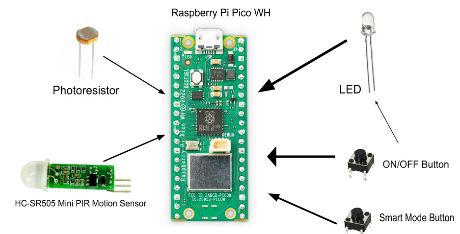
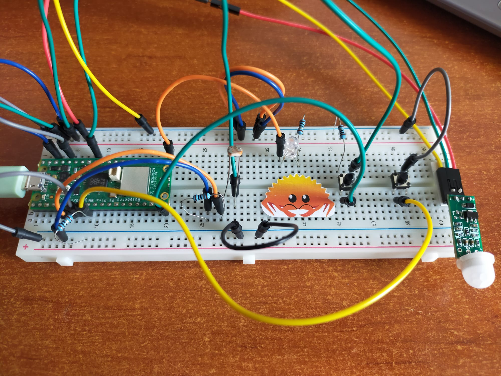
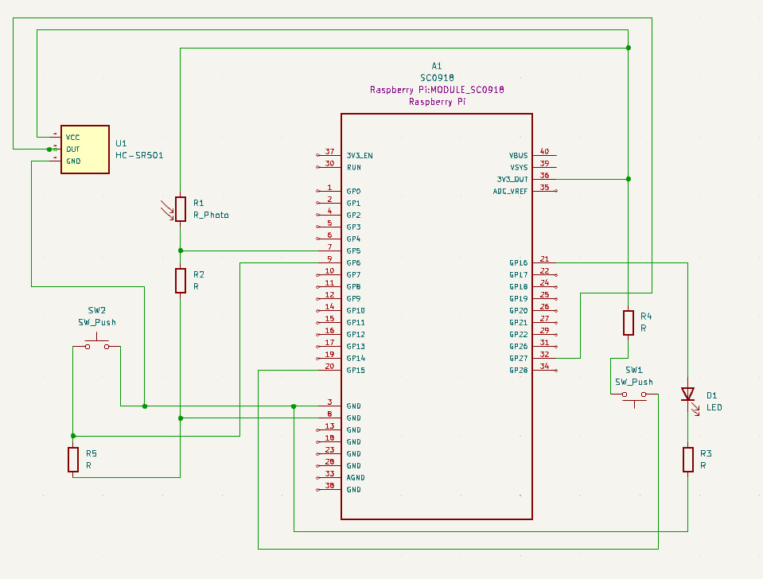

# Smart Lamp
The prototype of a lamp with multiple functionalities.

:::info 

**Author**: Bădică Ioana-Miruna \
**GitHub Project Link**: [Smart Lamp](https://github.com/UPB-FILS-MA/project-jojomojo22)

:::

## Description

The project consists of a LED that turns on the light automatically when it detects movement and only when it is dark. Besides, it should still have its regular "lamp" function, so it will have a button to turn it on "smart" mode. 

## Motivation

I have chosen this project because I wanted to implement something that could turn into a bigger project later such as using a real lamp instead of a LED, or implementing new functions like (if I were to use a RGB LED) to add a remote controller to switch the colors of the light from far away.

## Architecture 
Components \
  -> Raspberry Pi Pico W: Microcontroller \
  -> Mini PIR HC-SR505 Sensor: Detects movement around the sensor \
  -> Photo Resistor: Used to detect the light intensity around the resistor 

Connections \
  -> Both the PIR HC-SR505 sensor and the photo resistor are connected to the Raspberry Pi Pico W \
  -> The LED is also connected to the Rapberry Pi Pico W \
  -> The buttons are connected to the LED and also to the Raspberry Pi Pico W in order to send a signal when to get the data from the sensor and photo resistor


## Log

<!-- write every week your progress here -->

### Week 6 - 12 May
Managed to get all the components for the project and searched for documentation for each component.

### Week 7 - 19 May
Assembled all the hardware components together, did the KiCad schematic and started the software rust program.

### Week 20 - 26 May

## Hardware

Diagram of Hardware components



Picture of hardware components 



### Schematics

KiCad Schematic



### Bill of Materials

<!-- Fill out this table with all the hardware components that you might need.

The format is 
```
| [Device](link://to/device) | This is used ... | [price](link://to/store) |

```

-->

| Device | Usage | Price |
|--------|--------|-------|
| [Rapspberry Pi Pico W](https://www.raspberrypi.com/documentation/microcontrollers/raspberry-pi-pico.html) | The microcontroller | [39 RON](https://www.optimusdigital.ro/en/raspberry-pi-boards/12395-raspberry-pi-pico-wh.html?search_query=Raspberry+Pi+Pico+WH+&results=34) |
| [Mini PIR Sensor HC-SR505](https://pdf1.alldatasheet.com/datasheet-pdf/download/1284342/ETC1/HC-SR505.html) | The motion sensor | [9 RON](https://www.optimusdigital.ro/ro/senzori-senzori-pir/1498-senzor-pir-in-miniatura-hc-sr505.html) |
| [Photo Resistor](https://docs.particle.io/assets/datasheets/makerkit/photoresistor.pdf) | Light detector | [9 RON](https://www.optimusdigital.ro/ro/senzori-senzori-pir/1498-senzor-pir-in-miniatura-hc-sr505.html) |
| Button | | [2 x 0.4 RON](https://www.optimusdigital.ro/ro/butoane-i-comutatoare/1119-buton-6x6x6.html) |
| Jumper wires | | [8 RON](https://www.optimusdigital.ro/ro/fire-fire-mufate/12-set-de-cabluri-pentru-breadboard.html) |
| Breadboard | | [5 RON](https://www.optimusdigital.ro/ro/prototipare-breadboard-uri/44-breadboard-400-points.html) |
| LED | | [0.4 RON](https://www.optimusdigital.ro/ro/optoelectronice-led-uri/696-led-rou-de-3-mm-cu-lentile-difuze.html?search_query=led&results=818) |


## Software

| Library | Description | Usage |
|--------|--------|-------|
| [pir-motion-sensor](https://github.com/mateusz-szczyrzyca/pir-motion-sensor) | Library for the PIR sensor | Used to simplify the process of reading data from the PIR sensor and to avoid having to write low-level code to interact with the sensor |
| [embassy-rs](https://github.com/embassy-rs/embassy) | Embassy-rs framework | Used to simplify bare-metal rust |


## Links

<!-- Add a few links that inspired you and that you think you will use for your project -->

1. [Motion Detection with a Raspberry Pi Pico](https://www.youtube.com/watch?v=h0eotQQlndI)
2. [How to make a Light Sensor Circuit using a Photoresistor and a Raspberry Pi](https://www.youtube.com/watch?v=IOyYQ34C2y0)
3. [Turn on an LED using a button](https://www.youtube.com/watch?v=NWdvy4TF5oQ&list=PL2FhPdFCh6gw2PUhPNx3PkhFGsIyIAs5V&index=4)

