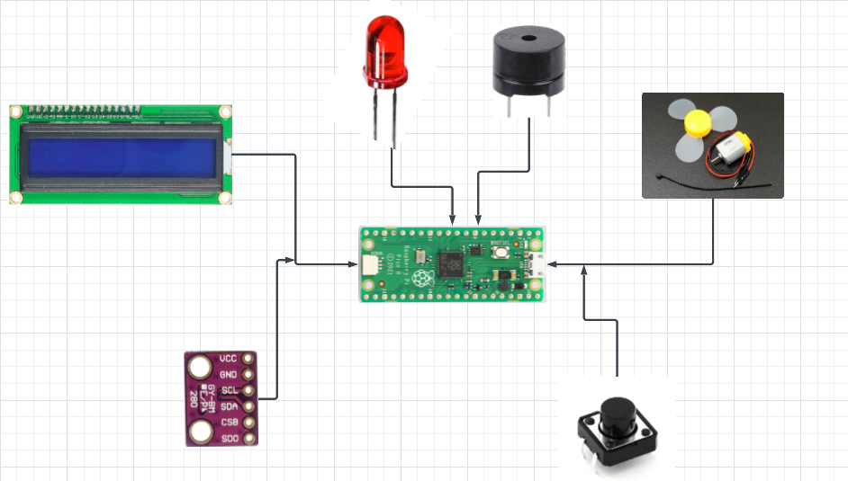
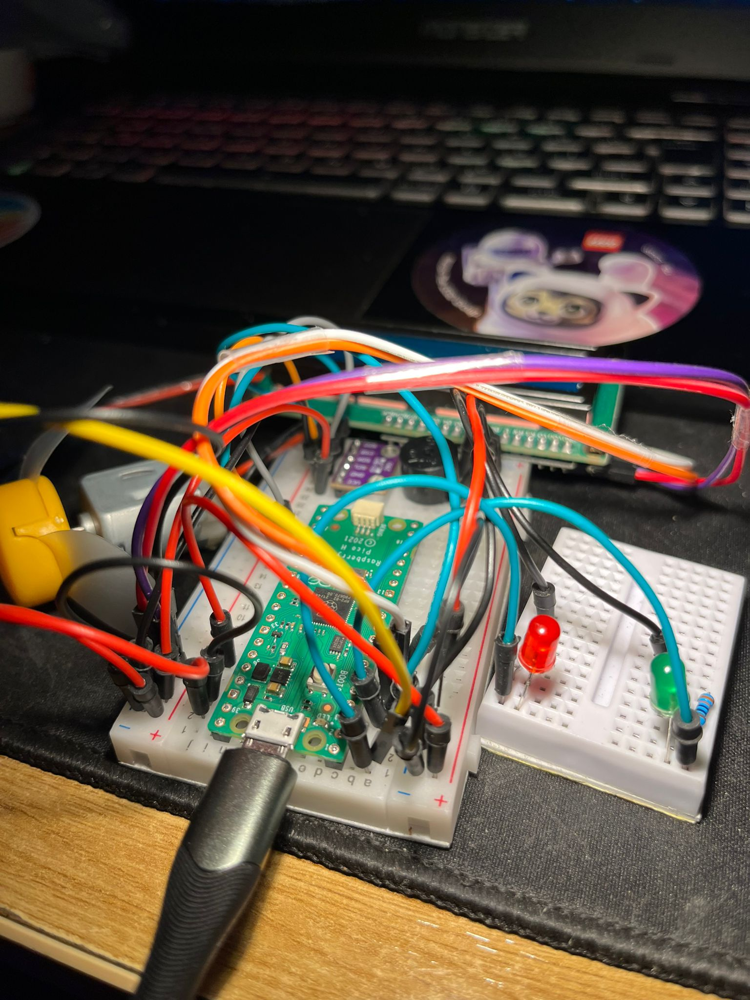
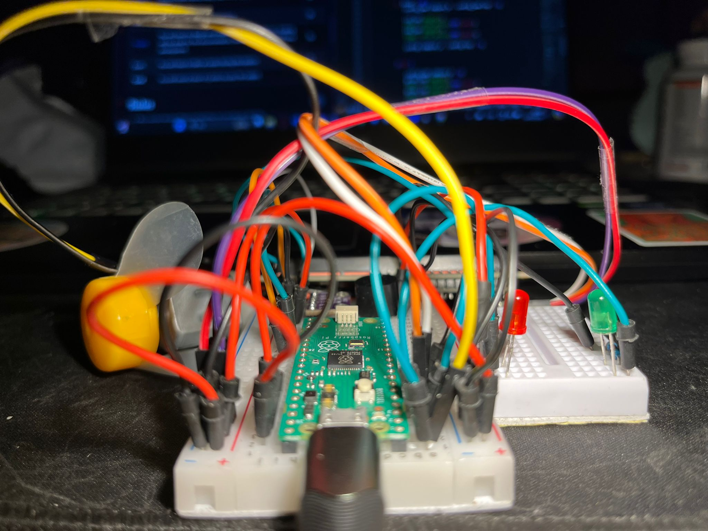
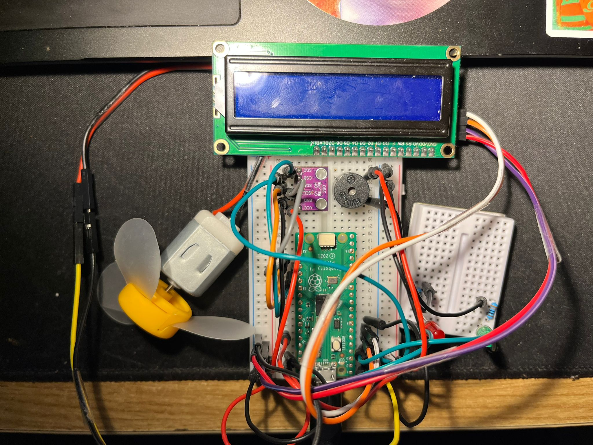
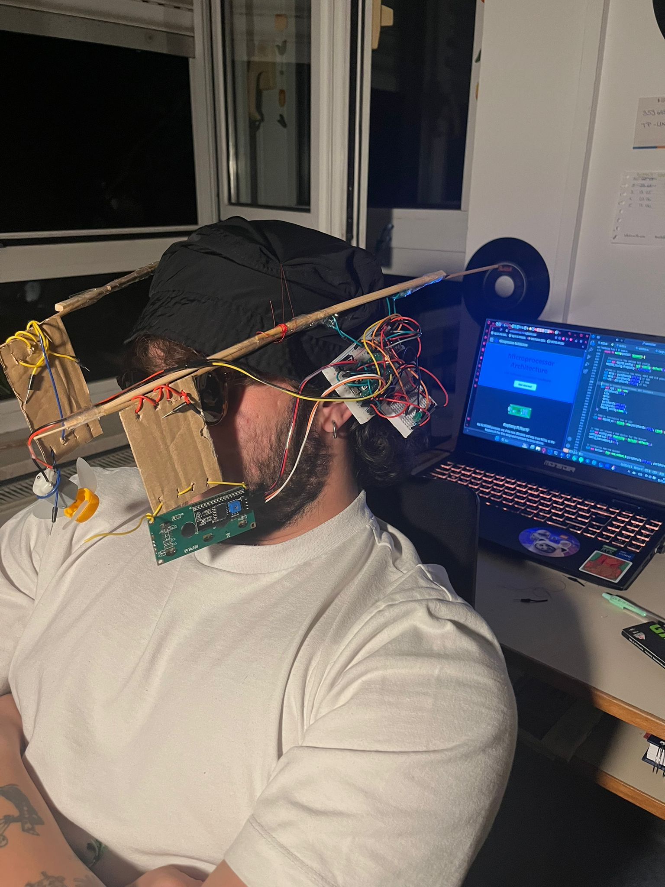
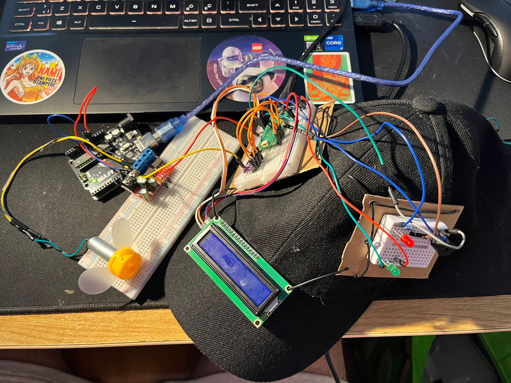
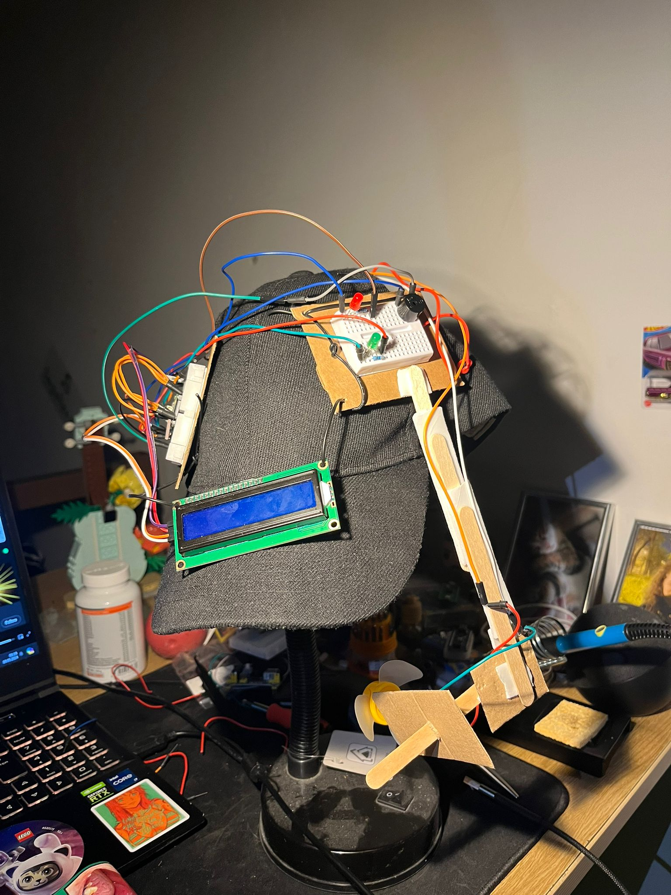
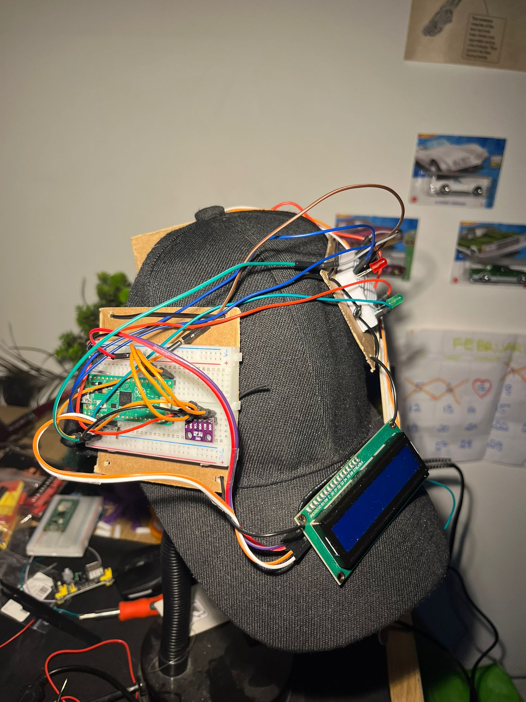
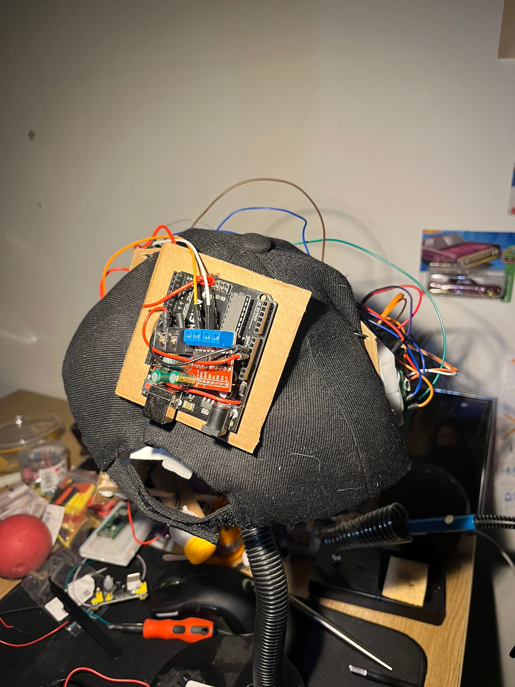
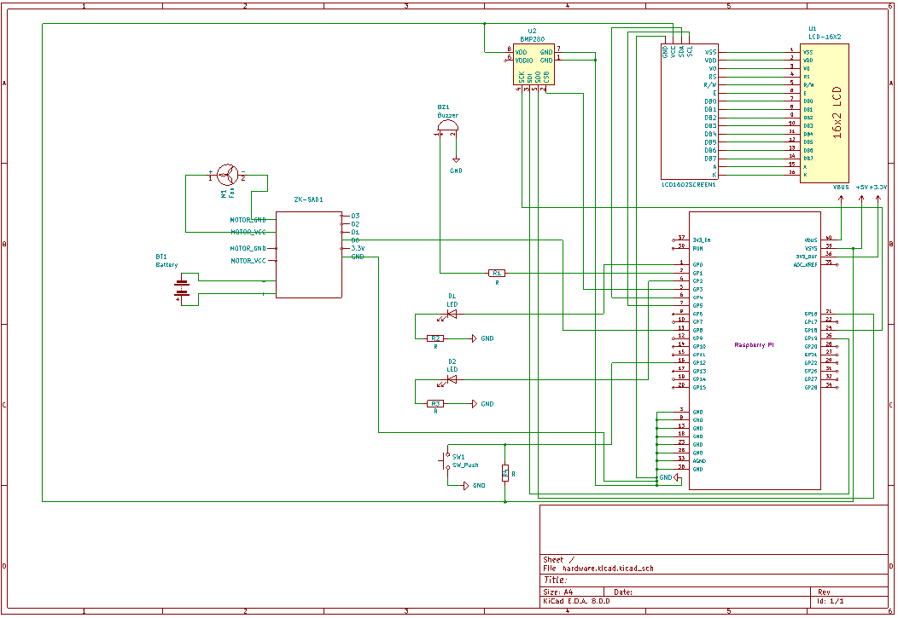

# Smart Summer Hat

Rust-powered Portable Smart Summer Hat


:::info 

**Author**: Kaan UGUR \
**GitHub Project Link**: https://github.com/UPB-FILS-MA/project-kaanmeister

:::

## Description

  Beat the heat with my innovative SmartSummer Hat powered by Rasberry Pi Pico and programmed in Rust language. This project combines practical functionality with modern technology to provide a refreshing solution for those really hot summer days.

**Features:**

  **1-Temperature Sensing**: Equipped with a precise temperature sensor, Smart Summer Hat continuously monitors the temperature to ensure your comfort.
  
  **2-Activate Cooling**: When the temperature rises above the hat springs into action. A DC motor, cleverly disguised as a fan, kicks in to provide instant relief from the heat.
  
  **3-Visual and Audible Alerts**: Stay informed about changing temperatures with a built-in LCD display that showcases the current temperature in Celcius. Moreover, a buzzer emits a warning sound when temperatures reach uncomfortable levels.
  
  **4-User Interaction**: Take control of your comfor with the press of a button. When the temperature alarm sounds, users have the option to activate the cooling fan by simply pressing a button located on the hat.
 
  **5-LED Indicator**: A red LED indicator illuminates when temperatures soar, providing a visual cue alongisde the audible alert, ensuring you never miss a warning.

**How it Works:**

  Using Rust Programming language, my Rasberry Pi Pico-based system reads the temperature data from the sensor every second. If the temperature exceeds the predefined threshold, the system triggers both visual and audible alerts, Users are prompted to activate the cooling fan by pressing the button. Once activated, the DC Motor converts electrical energy into a refreshing breeze, offering instant relief from the heat.

**Benefits:**

  **1-Comfort on the GO:** Smart Summer Hat ensures comfort wherever you go.
  
  **2-Customizable Design:** the Smart Summer Hat can be custmized to suit individual preferences and style, making it a versatile accessory for any summertime activity.

**Conclusion:**
  
  Say goodbye to sweltering summer days and hello to cool comfort with Smart Summer Hat. Experience the perfect blend of technology and convenience as you stay cool and refreshed wherever your adventures take you!
  
  
    


## Motivation

As someone who hates hot weather, the idea for the Smart Summer Hat was born out of my own frustration with sweltering temperatures. The Smart Summer Hat is more than just a project. it is a personal quest to reclaim comfort, improving programming skills, enjoy the outdoors, and make a positive difference in the world.


## Architecture 
Project will look more or less like the following diagram:




*The project has the following architecture:*
  
  **1-Rasberry Pi Pico:** The core of the system, Rasberry Pi Pico serves as the microcontroller unit (MCU) that manages all operations of the project. It interacts with and controls all the components.
  
  **2-Temperature Sensor:** Connected to the Rasberry Pi Pico via I2C (Inter-Integrated Circuit), The temperature sensor continuously monitors the ambient temperature.
  
  **3-DC Motor (FAN):** The DC motor functions as a fan to provide airflow when activated. Connected to the Rasberry Pi Pico via PWM (Pulse Width Modulation).
  
  **4-LCD Display:** The LCD display serves as the user interface, showcasing the current temperature in Celcius. Connected to the Rasberry Pi Pico via I2C.
  
  **5-Buzzer:** The buzzer serves as an audible alert system. Connected to the Rasberry Pi Pico via PWM. The buzzer's fequency and intensity can be modulated to emit different warning sounds based on the temperature level.
  
  **6-LED Indicator:** The LED indicator offers a visual cue to accompany the audible alert. It is directly controlled by the Rasberry Pi Pico's GPIO pins.
  
  **7-Button:** When pressed, the button triggers the Rasberry Pi Pico to activate the cooling fan. Connected to the Rasberry Pi Pico's GPIO pins.
  

## Log

<!-- write every week your progress here -->

### Week 6 - 12 May


- I already had the all components and I tried to learn something more about Rust fundamentals.
- I kept getting errors and I tried to solve them sometimes it took even hours, with debuging them I actually learned the logic behind it.
- I tried to solve more things and if it was possible added more things for hardware and software parts.

### Week 7 - 19 May

- I improved the hardware part and made the connections more understandable.
- I worked on prototype to show main idea I tried to make it somehow with using even chopsticks and incenses.
- At the same time still did not make all the components work and I am still working on the codes.


### Week 7 - 19 May
- Until now I kept working on hardware more to find better idea.
- I still had some problems with software part but I solved and project is apparently fully functional.
- I improved the prototype and I made the last - touches the project's hardware part is also done.
- I will detail the parts with using some pictures.

### Week 20 - 26 May

## Hardware

*Hardware Components used in the Smart Summer Hat project:*
 
  **1-Rasberry Pi Pico:** Microcontroller unit responsible for managing all operations.
  
  **2-Temperature Sensor:** Monitors ambient temperature and communicates with the Rasberry Pi Pico
  
  **3-DC Motor (Fan):** Provides airflow for cooling.
  
  **4-LCD Display:** Shows the current temperature in Celcius.
  
  **5-Buzzer:** Emits warning sounds.
  
  **6-LED:** Provides visual alerts.
  
  **7-Button:** Enable user interaction, triggering actions such as activating the cooling fan.
  
  **8-A Hat:** A prototype hat to make the project portable.


  **Additional Pictures of Project.**
  
  Pictures of the hardware.
  
  

  From front                             | From top
  :--------------------------------------|--------------------------------------:
   | 

  **Additional Pictures of the prototype**

  This is just a unprofessionally prototype to show the **main idea.** I am still working on it.

  Prototype from side                                             | Prototype from front
  :-----------------------------------------------------|-----------------------------------------------------:
 | 

**After submitting the prototype to show the main idea, I worked on the project more and I have the final looking under below!**

*Picture of the project before building.*
I decided to use a battery for my project ( More spesifically for the Motor Driver ) instead of using a baterry I decided to use Arduino. ( Only 5V and GND Pins are used!)


*Picture of the project from front*


*Picture of the project from side*


*Picture of the project from back*

  

  

  

### Schematics


Schematic of the project on KiCad Application.




### Bill of Materials

<!-- Fill out this table with all the hardware components that you might need.

The format is 
```
| [Device](link://to/device) | This is used ... | [price](link://to/store) |

```

-->

| Device | Usage | Price |
|--------|--------|-------|
| [Rapspberry Pi Pico H](https://www.raspberrypi.com/documentation/microcontrollers/raspberry-pi-pico.html) | The microcontroller | [42 RON](https://www.optimusdigital.ro/ro/placi-raspberry-pi/12393-raspberry-pi-pico-h.html?search_query=pico+H&results=32) |
| [BMP 280](https://cdn-shop.adafruit.com/datasheets/BST-BMP280-DS001-11.pdf) | Temperature Sensor | [10 RON](https://www.optimusdigital.ro/ro/senzori-senzori-de-presiune/1777-modul-senzor-de-presiune-barometric-bmp280.html?search_query=bmp280&results=11) |
| [DC Motor (FAN)](https://datasheetspdf.com/datasheet-pdf/917194/775-5520F-CC.html) | DC Motor for FAN | [10 RON](https://www.bitmi.ro/motor-dc-3v-6v-pentru-proiecte-electronice-10651.html?gad_source=1&gclid=EAIaIQobChMIhsGZpandhQMVEplQBh0msAG5EAQYCCABEgLS5vD_BwE) |
| [1602 Display](https://html.alldatasheet.com/html-pdf/1574132/CRYSTAIFONTZ/LCD-1602A/1009/1/LCD-1602A.html) | LCD Display | [25 RON](https://www.bitmi.ro/electronica/ecran-lcd1602-cu-modul-i2c-iic-10487.html) |
| Jumper Wires (Female - Female)  | Female - Female Wires for connections | [7 RON](https://www.bitmi.ro/componente-electronice/40-fire-dupont-mama-mama-30cm-10503.html) |
| Jumper Wires | Male - Male Wires for connections | [8 RON](https://www.bitmi.ro/componente-electronice/set-de-65-fire-dupont-tata-tata-9-16-cm-10638.html) |
| Breadboard | x2 Breadboard for all other connections | [18 RON](https://www.bitmi.ro/componente-electronice/breadboard-830-puncte-mb-102-10500.html) |
| [Buzzer Set (Active - Passive)](https://components101.com/misc/buzzer-pinout-working-datasheet) |Active and Passive Buzzer Components| [5 RON](https://ardushop.ro/ro/electronica/194-buzzer.html?search_query=buzzer&results=16) |
| LED SET  | Leds | [16 RON](https://www.bitmi.ro/electronica/set-200-led-uri-de-diferite-culori-3-mm-5-mm-10508.html) |
| Button | Push Button | [1 RON](https://ardushop.ro/ro/home/97-buton-mic-push-button-trough-hole.html?search_query=button&results=18) |


## Software

| Library | Description | Usage |
|---------|-------------|-------|
| [ag-lcd](https://github.com/mjhouse/ag-lcd) | Display Library | Used for I2C LCD Display |
| [embassy-rp](https://github.com/embassy-rs/embassy/tree/main/embassy-rp) | RP2040 Peripherals | Used for accessing the peripherals|
| [embassy-time](https://github.com/embassy-rs/embassy/tree/main/embassy-time) | Time Library | Used for Timeouts and Delays |
| [PWM](https://docs.embassy.dev/embassy-nrf/git/nrf52840/pwm/index.html) | Pulse-Width Modulation | Used for Buzzer |
| [embassy-executor](https://docs.embassy.dev/embassy-executor/git/std/index.html) | Executor for Rust Embedded Systems | Used for task scheduling and asynchronous programming |
| [embassy-usb-logger](https://docs.embassy.dev/embassy-usb-logger/git/default/index.html) | USB Logger for embassy | Used for logging messages over USB |
| [GPIO](https://docs.embassy.dev/embassy-stm32/git/stm32c011d6/gpio/index.html) | GPIO  | Used for interacting with GPIO Pins |
| [embassy-usb-logger](https://docs.embassy.dev/embassy-usb-logger/git/default/index.html) | USB Logger for embassy | Used for logging messages over USB |


## Links

<!-- Add a few links that inspired you and that you think you will use for your project -->

1. [Pinouts for RP](https://pinout.xyz/pinout/1_wire)
2. [Crates](https://crates.io)
3. [Rust for Embedded Systems](https://docs.rs)
4. [RP2040 Datasheet](https://datasheets.raspberrypi.com/rp2040/rp2040-datasheet.pdf)
5. [Embassy Documents](https://embassy.dev/book/dev/index.html)
6. [Rust For Embedded Wyliodrin](https://embedded-rust-101.wyliodrin.com)
7. [How to use Motor Driver](https://www.youtube.com/watch?v=W_Wm28nQAYA&t=425s)
...
