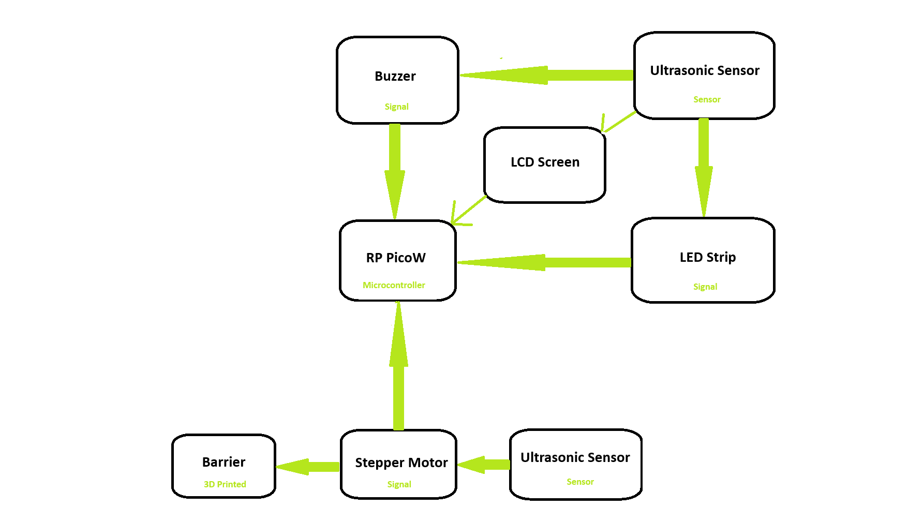

# Project Name
Parking sensor with barrier control

:::info 

**Author**: Rosoiu Luca \
**GitHub Project Link**: https://github.com/UPB-FILS-MA/project-LucaRosoiu

:::

## Description

The project consists of a smart parking sensor which will detect the presence of other objects and will emmit sound and light signals when the distance is within a certain range. The signals will grow in intensity and be more frequent the closer the said object is, until it reaches the climax, at which point the emmited light is at maximum intensity and the sound is static.

Moreover, the project includes a barrier control system, which will consist of a barrier with an attached sensor that will be lifted once it detects an object get within its range. When that happens, a countdown timer will start until the barrier goes back down, just like a real life parking barrier.

## Motivation

I have been interested in cars for as long as I can remember, so I have been thinking about a way to make this project be related to a component of a real car. Therefore, I took this as an opportunity to learn how parking sensors and parking barriers work in real life.

## Architecture 



## Log

<!-- write every week your progress here -->

### Week 6 - 12 May

### Week 7 - 19 May

### Week 20 - 26 May

## Hardware

A doppler sensor will represent the base of both the parking sensor and the barrier control sensor. For the parking sensor, it will light up an LED that will gradually increase in intensity and will trigger a buzzer that will emmit sounds that will increase in frequency up until the "climax", when it emmits a static sound. As for the barrier control sensor, it will lift the barrier up and start a countdown until the barrier goes back down.

### Schematics

Place your KiCAD schematics here.

### Bill of Materials

<!-- Fill out this table with all the hardware components that you might need.

The format is 
```
| [Device](link://to/device) | This is used ... | [price](link://to/store) |

```

-->

| Device | Usage | Price |
|--------|--------|-------|
| [Rapspberry Pi Pico W](https://www.raspberrypi.com/documentation/microcontrollers/raspberry-pi-pico.html) | The microcontroller | [35 RON](https://www.optimusdigital.ro/en/raspberry-pi-boards/12394-raspberry-pi-pico-w.html) |
| [Doppler Sensor](https://www.nivetec.com.br/arquivos/Manual_Nivus_Sensor_KDA_us_Nivetec.pdf) | This will be at the base of both the parking sensor and the parking barrier sensor | [8 RON](https://www.optimusdigital.ro/ro/senzori-senzori-de-distanta/2039-senzor-de-proximitate-cu-microunde.html) |
| Barrier | This will be the trigger of the doppler sensor (might need 3d printing) | RON |
| [LED](https://www.diodeled.com/technical-documents/) | The LED | [1 RON](https://componenteonline.ro/led-5mm-3v-galben-rotund-141002?product_id=147244) |
| [Buzzer](https://www.arduino.cc/reference/en/libraries/buzzer/) | The Buzzer | [2 RON](https://www.optimusdigital.ro/ro/audio-buzzere/635-buzzer-activ-de-3-v.html) |


## Software

| Library | Description | Usage |
|---------|-------------|-------|
| [st7789](https://github.com/almindor/st7789) | Display driver for ST7789 | Used for the display for the Pico Explorer Base |
| [embedded-graphics](https://github.com/embedded-graphics/embedded-graphics) | 2D graphics library | Used for drawing to the display |

## Links

<!-- Add a few links that inspired you and that you think you will use for your project -->

1. [link](https://www.youtube.com/watch?v=rDsevkPFaKI&ab_channel=AkaSoggyBunz)
2. [link](https://www.instructables.com/Raspberry-Pi-Park-Sensor/)
3. [link](https://www.youtube.com/watch?v=Ko_pbHlJ1mE&ab_channel=SaiAnirudhG)
