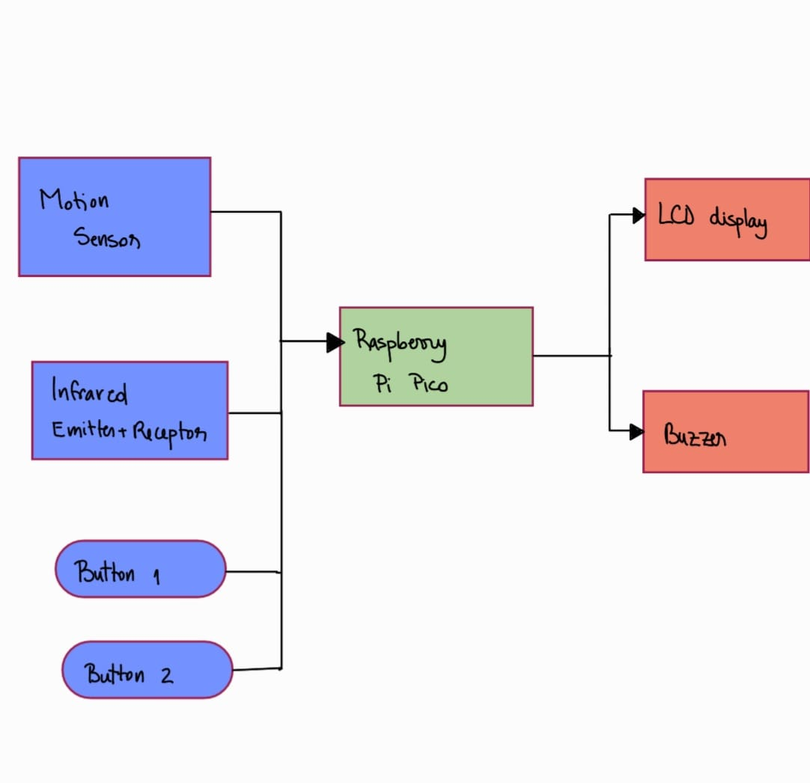
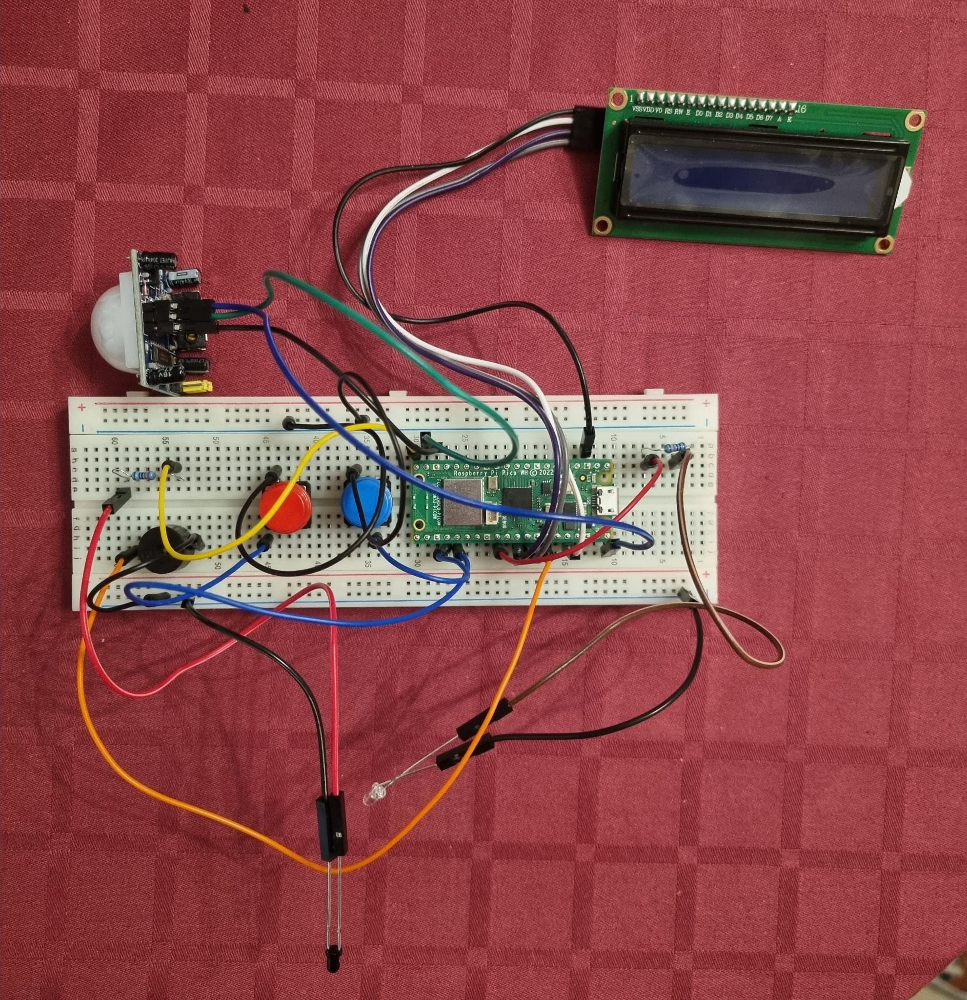
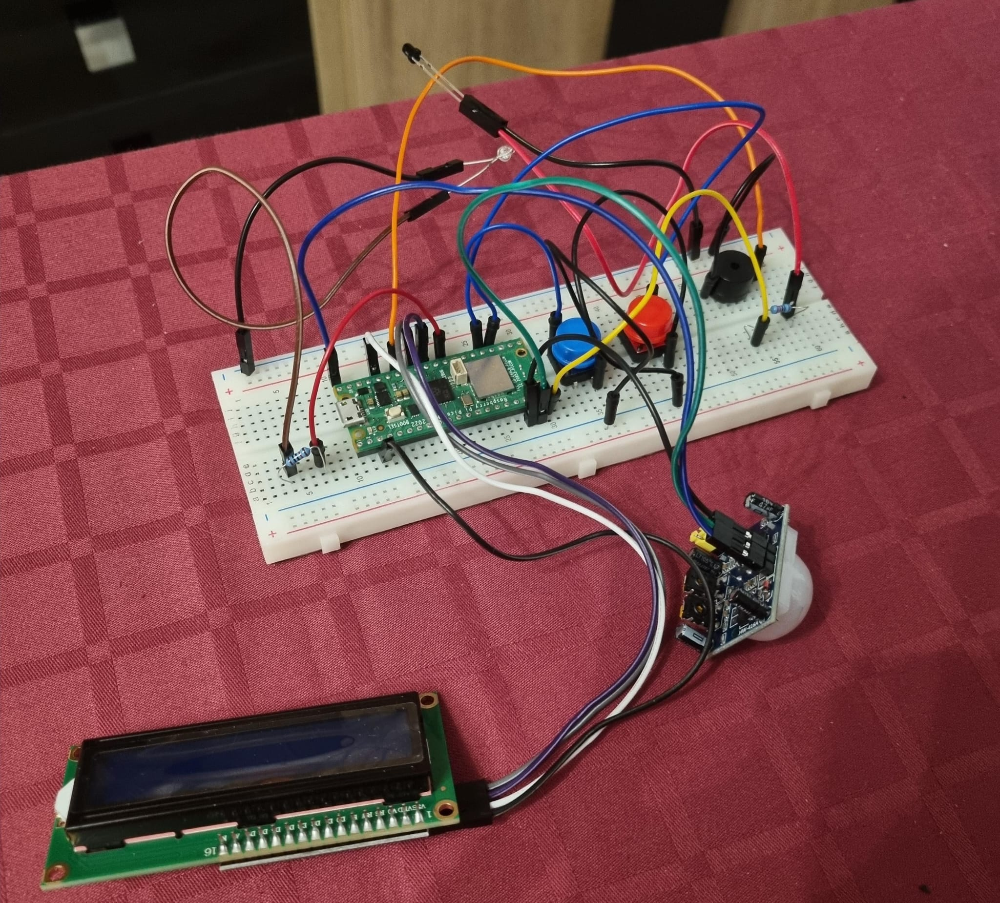
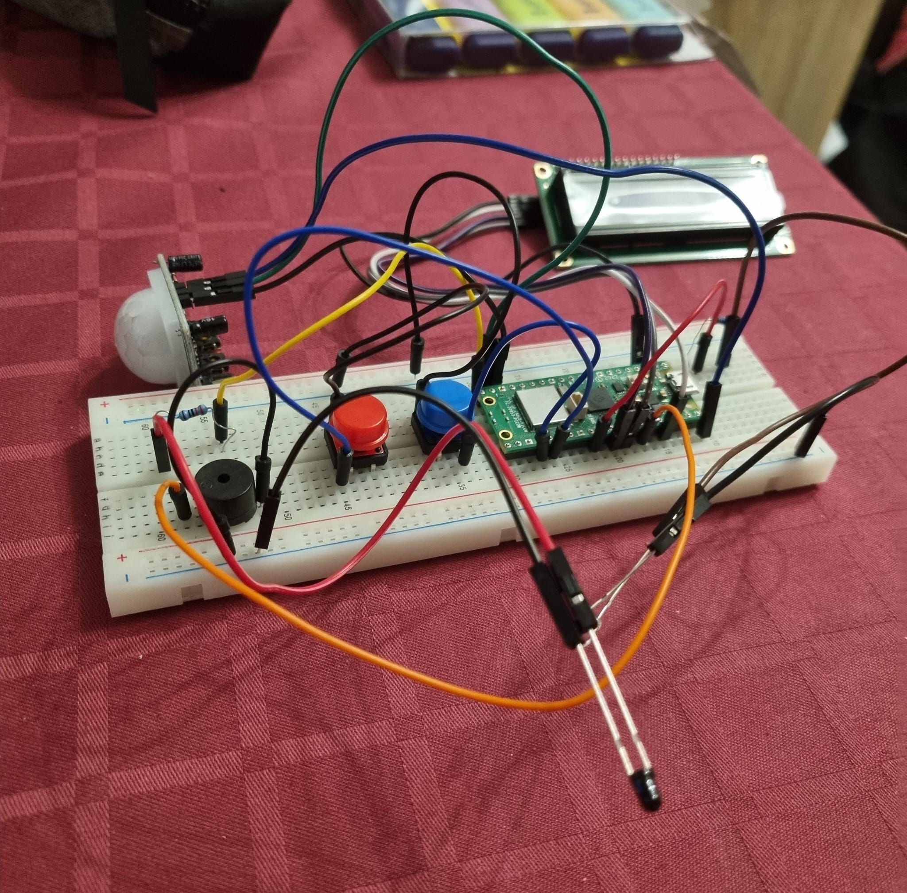
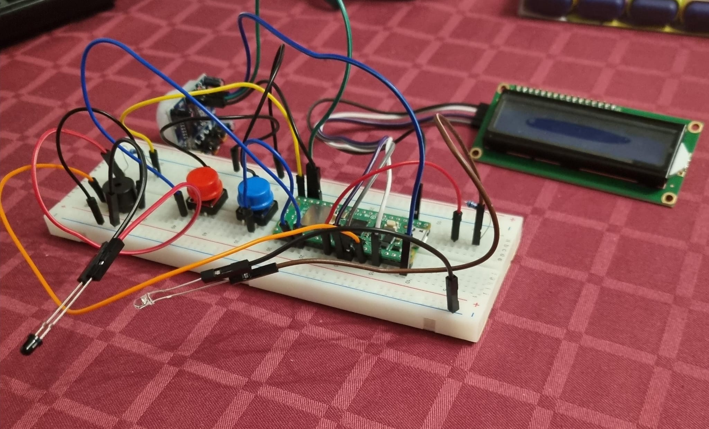
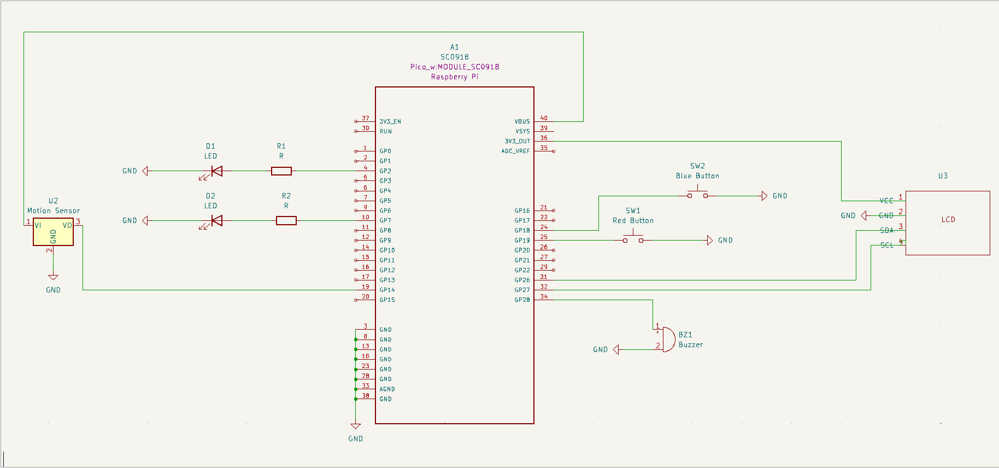

# Smart Piggy Bank
Smart Piggy Bank with Coin Detection and Display

:::info 

**Author**: Stefan Madalina-Eliana \
**GitHub Project Link**: https://github.com/UPB-FILS-MA/project-MadalinaEliana

:::

## Description

This project, the Smart Piggy Bank, is designed to modernize the traditional concept of a piggy bank by integrating digital technology to enhance user interaction and functionality. It utilizes a Raspberry Pi Pico microcontroller to orchestrate the core functions of coin detection, total amount calculation, and user interaction through visual and auditory feedback.

The primary feature of this Smart Piggy Bank is its ability to detect coins as they are inserted, using custom sensors tailored to recognize different coin sizes and values. Each detected coin's value is automatically calculated and added to a running total, which is displayed on an LCD screen. This allows users to easily track their savings without the need to manually count the contents.

An innovative addition to the traditional piggy bank model is the integration of a motion sensor. This sensor serves a dual purpose: conserving energy and enhancing user convenience. When the sensor detects motion near the piggy bank, it activates the LCD display, illuminating the current total amount saved. This feature ensures the display is only active when needed, making the device more energy-efficient.

The piggy bank also includes a buzzer that emits a sound every time a coin is inserted. This auditory feedback not only confirms the successful deposit of a coin but also adds an element of interactivity.

## Motivation

I wanted to create the Smart Piggy Bank to merge traditional savings methods with the sophisticated capabilities of modern technology. My goal was to introduce an interactive element to the mundane task of saving coins, transforming it into an engaging and educational experience. By utilizing the Raspberry Pi Pico, I aim to use the power of these advanced tools to enhance the functionality of a simple device. This project provides a meaningful way to explore how everyday objects can be revitalized through innovation, making them more intuitive and impactful in our digital age.

## Architecture 




## Log

<!-- write every week your progress here -->

### Week 6 - 12 May

### Week 7 - 19 May

### Week 20 - 26 May

## Hardware

1. Raspberry Pi Pico: Microcontroller board powered by the RP2040 chip, designed for high performance and flexible digital interfacing, ideal for embedded projects.

2. Infrared Pair Tube: This component includes an infrared emitter and receiver that detect the presence and type of coins by measuring the interruption of an infrared light beam. It's crucial for accurate coin detection and classification.

3. LCD Screen: These are liquid crystal displays that support I2C communication, which simplifies the wiring and control via the Raspberry Pi Pico. The 16x2 model displays two lines of 16 characters, providing clear and readable output for the amount of money saved.

4. Motion Sensor: A passive infrared (PIR) motion sensor used to detect movement in the environment. It's utilized here to activate the LCD screen when it senses motion nearby, making the device more energy-efficient and user-friendly by displaying information only when needed.

5. Buzzer: An electronic device that produces sound when voltage is applied; used here to emit a beep or tune each time a coin is detected, providing auditory confirmation of a successful deposit.






### Schematics



### Bill of Materials

<!-- Fill out this table with all the hardware components that you might need.

The format is 
```
| [Device](link://to/device) | This is used ... | [price](link://to/store) |

```

-->

| Device | Usage | Price |
|--------|--------|-------|
| [Rapspberry Pi Pico WH](https://www.raspberrypi.com/documentation/microcontrollers/raspberry-pi-pico.html) | The microcontroller | [35 RON](https://www.optimusdigital.ro/ro/placi-raspberry-pi/12395-raspberry-pi-pico-wh.html?search_query=raspberry+pi+pico&results=24) |
| [Round Button] | This is used for manual user input, such as resetting counts or changing modes. | [3.08 RON](https://www.optimusdigital.ro/ro/butoane-i-comutatoare/1114-buton-cu-capac-rotund-rou.html?search_query=buton&results=222) |
| [Infrared Emitter + Receiver] | Used to detect coins by breaking the IR beam. | [0.54 RON](https://www.optimusdigital.ro/ro/componente-electronice-receptoare-infrarosu/705-receptor-infrarosu-de-3-mm-pentru-lungime-de-unda-940-nm.html?search_query=receptor+infrarosu&results=20) |
| [Buzzer] | Emits sound when a coin is inserted to provide auditory feedback. | |
| [16x2 I2C LCD] | Displays the total amount of money saved. | [33.99 RON](https://www.optimusdigital.ro/ro/optoelectronice-lcd-uri/1136-lcd-2004-cu-backlight-albastru.html?gad_source=1&gclid=Cj0KCQjwxeyxBhC7ARIsAC7dS3-Qf5cekWEScZiDQvQEt5ZFOEm3Y5Ty_3i3VFLw6l-llnHUKpS4nYkaAnPiEALw_wcB) |
| [HC-SR501 Motion Sensor] | Activates the LCD when motion is detected to save energy and improve user interaction. | [7.68 RON](https://www.optimusdigital.ro/ro/senzori-senzori-pir/106-modul-senzor-pir-hc-sr501.html?gad_source=1&gclid=Cj0KCQjwxeyxBhC7ARIsAC7dS39bTgepMVDjn8A53e0VwB8dttoQCh4KciRB8oqSpSxeXmAg39AL_WEaAsspEALw_wcB) |
| [Resistors Kit] | Voltage regulation within the device. | [14.59 RON](https://www.optimusdigital.ro/ro/componente-electronice-rezistoare/10928-plusivo-kit-250-buc-rezistoare.html?search_query=rezistoare&results=75) |
| [Jumper Wires] | Connections between the components on a breadboard or in the final assembly. | [17.29 RON](https://www.optimusdigital.ro/ro/fire-fire-mufate/12-set-de-cabluri-pentru-breadboard.html?search_query=cabluri&results=662) |


## Software

| Library | Description | Usage |
|---------|-------------|-------|
| [rp2040-hal](https://github.com/rp-rs/rp-hal) | Hardware abstraction layer for the RP2040 microcontroller, written in Rust. | Provides the basic framework for controlling the hardware on the Raspberry Pi Pico, including GPIO pins, I2C communication, and more. |
| [embedded-hal](https://github.com/rust-embedded/embedded-hal) | Provides a set of traits for embedded programming, which standardizes the interface to core peripherals. | Used for creating portable embedded applications and for interfacing with the LCD, sensors, and other peripherals. |
| [embedded-graphics](https://github.com/embedded-graphics/embedded-graphics) | A 2D graphics library that works with no_std and limited resources. | Used for drawing text, shapes, and images on the LCD display. |
| [panic-halt](https://github.com/knurling-rs/panic-halt) | A panic handler for embedded applications that halts the microcontroller on a panic. | Ensures that the system safely stops executing in case of a software fault. |
| [infrared](https://github.com/jonas-schievink/infrared) | A Rust library for sending and receiving infrared signals on microcontrollers. | To handle the IR communication for coin detection, facilitating the interface with the infrared pair tube. |
| [rppico](https://crates.io/crates/rp-pico) | Rust libraries providing access to the Raspberry Pi's GPIO, SPI, I2C, and more. | Essential for interacting with the HC-SR501 motion sensor and controlling the buzzer. |
| [u8g2](https://github.com/u8glib/u8g2) | A monochrome graphics library for embedded devices. | Might be used for more complex graphics needs on the I2C LCD if `embedded-graphics` does not suffice. |


## Links

<!-- Add a few links that inspired you and that you think you will use for your project -->

1. [Github Example](https://github.com/DKARDU/coinbox)
2. [Youtube Video](https://www.youtube.com/watch?v=6BF9copnfS4&ab_channel=DKARDU)
...
