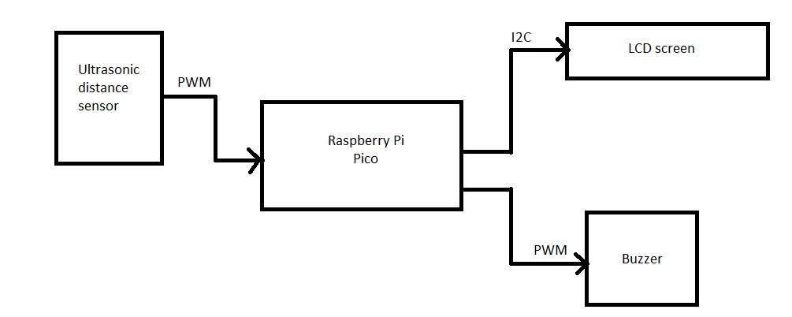
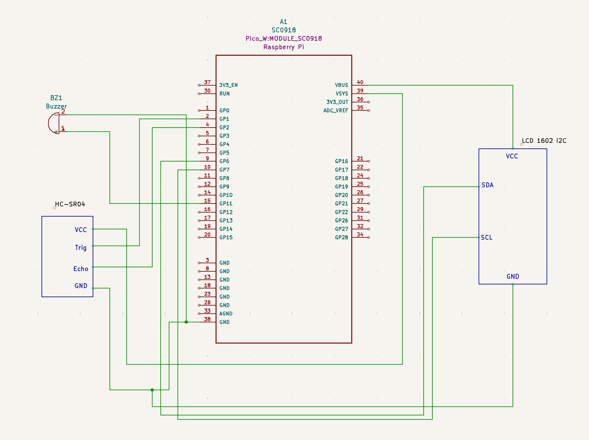

# Proximity Sensor
A sensor that measures the distance

:::info 

**Author**: Iubitu Mara \
**GitHub Project Link**: https://github.com/UPB-FILS-MA/project-MaraIubitu.git

:::

## Description

A proximity sensor designed for safety and awareness. It accurately detects nearby objects and alerts users visually and audibly through a progressive buzzer and LCD screen. Ideal for navigating tight spaces or vehicles, it offers comprehensive spatial awareness, reducing the risk of accidents.

## Motivation

While researching for project ideas, I came across a parking sensor and a distance measuring project and I thought it would be interesting to try and combine these two ideas.

## Architecture 



## Log

<!-- write every week your progress here -->

### Week 6 - 12 May
Got the components for the project and made the documentation part.
### Week 7 - 19 May
I did some more research for the hardware and made the KiCad schematics.
### Week 20 - 26 May

## Hardware

I am using a Pico MCU to recieve the distance measured by the HR-SC04 proximity sensor, while sending the data to an LCD screen. Additionally, the buzzer is connected to the sensor, changing its intensity based on the distance from the outside object.

### Schematics



### Bill of Materials

<!-- Fill out this table with all the hardware components that you might need.

The format is 
```
| [Device](link://to/device) | This is used ... | [price](link://to/store) |

```

-->

| Device | Usage | Price |
|--------|--------|-------|
| [Rapspberry Pi Pico W](https://www.raspberrypi.com/documentation/microcontrollers/raspberry-pi-pico.html) | The microcontroller | [35 RON](https://www.optimusdigital.ro/en/raspberry-pi-boards/12394-raspberry-pi-pico-w.html) |
| [Senzor Ultrasonic de Distanță HC-SR04+](https://www.optimusdigital.ro/ro/senzori-senzori-ultrasonici/2328-senzor-ultrasonic-de-distana-hc-sr04-compatibil-33-v-i-5-v.html?search_query=hc-sr04&results=33) | The distance sensor | [15 RON](https://www.optimusdigital.ro/ro/senzori-senzori-ultrasonici/2328-senzor-ultrasonic-de-distana-hc-sr04-compatibil-33-v-i-5-v.html?search_query=hc-sr04&results=33) |
| [Breadboard](https://www.optimusdigital.ro/ro/prototipare-breadboard-uri/8-breadboard-830-points.html?search_query=breadboard&results=145) | The breadboard | [10 RON](https://www.optimusdigital.ro/ro/prototipare-breadboard-uri/8-breadboard-830-points.html?search_query=breadboard&results=145) |
| [Wires](https://www.optimusdigital.ro/ro/fire-fire-mufate/12-set-de-cabluri-pentru-breadboard.html?search_query=breadboard&results=145) | The wires | [8 RON](https://www.optimusdigital.ro/ro/fire-fire-mufate/12-set-de-cabluri-pentru-breadboard.html?search_query=breadboard&results=145) |
| [LCD screen](https://www.optimusdigital.ro/ro/optoelectronice-lcd-uri/62-lcd-1602-cu-interfata-i2c-si-backlight-galben-verde.html?search_query=LCD+1602+cu+Interfata+I2C+si+Backlight+Albastru&results=2) | The screen | [15 RON](https://www.optimusdigital.ro/ro/optoelectronice-lcd-uri/62-lcd-1602-cu-interfata-i2c-si-backlight-galben-verde.html?search_query=LCD+1602+cu+Interfata+I2C+si+Backlight+Albastru&results=2) |
| [Buzzer](https://www.optimusdigital.ro/ro/audio-buzzere/12247-buzzer-pasiv-de-33v-sau-3v.html?search_query=buzzer&results=62) | The buzzer | [2 RON](https://www.optimusdigital.ro/ro/audio-buzzere/12247-buzzer-pasiv-de-33v-sau-3v.html?search_query=buzzer&results=62) |
| [Resistors](https://www.optimusdigital.ro/ro/componente-electronice-rezistoare/33-rezistoare-set.html?search_query=rezistente&results=115) | The resistors | [15 RON](https://www.optimusdigital.ro/ro/componente-electronice-rezistoare/33-rezistoare-set.html?search_query=rezistente&results=115) |

## Software

| Library | Description | Usage |
|---------|-------------|-------|
|[pwm](https://docs.embassy.dev/embassy-nrf/git/nrf52840/pwm/index.html)|Pulse-width modulation |Used for controlling the buzzer's sound intensity |
|[embassy-executor](https://docs.embassy.dev/embassy-executor/git/std/index.html)|Asynchronous executor for Rust embedded systems| Used for task scheduling and asynchronous programming|
|[embassy-rp](https://docs.embassy.dev/embassy-rp/git/rp2040/index.html)| Peripheral access library |Used for initializing and interacting with peripherals |
|[log](https://docs.embassy.dev/embassy-usb-logger/git/default/index.html)|Logging facade |Used for logging messages |
| [embassy-sync](https://github.com/embassy-rs/embassy/tree/main/embassy-sync) | Synchronization primitives | Used for syncronizing asynchronous tasks |
| [ag-lcd](https://github.com/mjhouse/ag-lcd) | Display library | Used for writing to the display |

## Links

<!-- Add a few links that inspired you and that you think you will use for your project -->

1. [Proximity Sensor With Raspberry Pi Pico W and HC-SR04](https://www.bekirbilge.com/blog/2022/12/03/parking-sensor-with-raspberry-pi-pico-w-and-hc-sr04/)
2. [Raspberry Pi Pico and Proximity Sensor](https://www.instructables.com/Raspberry-Pi-Pico-and-Proximity-Sensor/)
3. [Measuring distance accurately with a Raspberry Pi and a HC-SR04 sensor](https://www.youtube.com/watch?v=5U1DCcJfwH4)
4. [How to Use the HC-SR04 Ultrasonic Sensor with Raspberry Pi](https://youtu.be/JvQKZXCYMUM?si=4Tzn40Ns30Ax0ocM)
