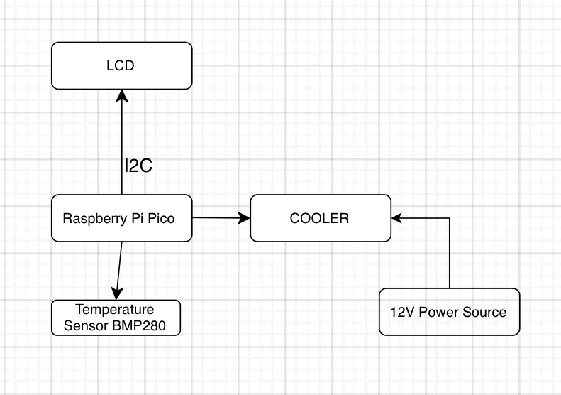

# Kalman Temperature Alert System

Temperature alert system using the Kalman Filter for perfect accuracy

_Author_: Fotescu Maria-Irina, Economu Teo-Antonio

_GitHub Project Link_: https://github.com/UPB-FILS-MA/project-economuteo

:::

## Description

We are looking to have a clock that presents the current time and the temperature on a LCD 1602 which has an I2C interface. We will set a certain threshold on the sensor. If the temperature surpases this limit, the buzzer will start ringing and the cooler will try to cool down the sensor in order to bring the temperature back to optimal levels. In order for us to be informed about the temperature increase, the display will show a warning message and the buzzer will start ringing once the threshold is reached. For a very accurate measurement, we are going to use the Kalman Filter.

## Motivation

We are both loving mathematics, so the idea of combining complex mathematics with the Rust language and all the hardware part really drives us and keeps us going forward in pursuing an amazing project.

## Architecture

## Log

<!-- write every week your progress here -->

### Week 6 - 12 May

### Week 7 - 19 May

### Week 20 - 26 May

## Hardware

The hardware utilized includes a Raspberry Pi Pico microcontroller, a breadboard as the main board, an LCD 1602 with I2C Interface for display, a Barometric BMP280 GY pressure sensor, a buzzer, and various connectors along with an 80mm cooler.

### Schematics

Place your KiCAD schematics here.

### Bill of Materials

<!-- Fill out this table with all the hardware components that you might need.

The format is

| [Device](link://to/device) | This is used ... | [price](link://to/store) |

-->

| Device                                                                                                  | Usage               | Price                                                                                                                                                                                                                                                                                |
| - | - | - |
| [Rapspberry Pi Pico](https://www.raspberrypi.com/documentation/microcontrollers/raspberry-pi-pico.html) | The microcontroller | [39 RON](https://www.optimusdigital.ro/en/raspberry-pi-boards/12394-raspberry-pi-pico-w.html)                                                                                                                                                                                        |
| [Breadboard](https://components101.com/sites/default/files/component_datasheet/Breadboard%20Datasheet.pdf)                                                                                              | Main board          | [0 RON(Already had this)](https://www.emag.ro/kit-plusivo-microcontroller-starter-programabil-in-arduino-ide-x001fpqyl1/pd/DKJN9VMBM/?utm_source=mobile%20app&utm_medium=ios&utm_campaign=share%20product)                                                                           |
| [LCD 1602 with I2C Interface](https://www.waveshare.com/wiki/LCD1602_I2C_Module)                                                                             | Display             | [16,34 RON](https://www.optimusdigital.ro/ro/optoelectronice-lcd-uri/2894-lcd-cu-interfata-i2c-si-backlight-albastru.html)                                                                                                                                                           |
| [Pressure sensor Barometric BMP280 GY](https://components101.com/sensors/gy-bmp280-module)                                                                    | Pressure Sensor     | [8,49 RON](https://www.optimusdigital.ro/ro/senzori-senzori-de-presiune/1666-modul-senzor-de-presiune-barometric-bmp280.html?search_query=BMP280&results=11)                                                                                                                         |
| [Buzzer](https://www.farnell.com/datasheets/2171929.pdf)                                                                                                  | Buzzer              | [0 RON (Already had this)](https://www.emag.ro/kit-plusivo-microcontroller-starter-programabil-in-arduino-ide-x001fpqyl1/pd/DKJN9VMBM/?utm_source=mobile%20app&utm_medium=ios&utm_campaign=share%20product)                                                                          |
| 4 Mother-Father wires 30 cm                                                                             | Connectors          | [0 RON(Already had this)](https://www.emag.ro/kit-plusivo-microcontroller-starter-programabil-in-arduino-ide-x001fpqyl1/pd/DKJN9VMBM/?utm_source=mobile%20app&utm_medium=ios&utm_campaign=share%20product)                                                                           |
| 6 Father-Father wires                                                                                   | Connectors          | [0 RON(Already had this)](https://www.emag.ro/kit-plusivo-microcontroller-starter-programabil-in-arduino-ide-x001fpqyl1/pd/DKJN9VMBM/?utm_source=mobile%20app&utm_medium=ios&utm_campaign=share%20product)                                                                           |
| [Cooler 80mm](https://www.nteinc.com/fans/80x80.pdf)                                                                                             | Cooler              | [10,83 RON](https://www.optimusdigital.ro/ro/altele/4906-cooler-carcasa.html?search_query=cooler&results=14&HTTP_REFERER=https%3A%2F%2Fwww.optimusdigital.ro%2Fro%2Fcautare%3Fcontroller%3Dsearch%26orderby%3Dposition%26orderway%3Ddesc%26search_query%3Dcooler%26submit_search%3D) |

## Software

| Library                                  | Description                        | Usage                              |
| ---------------------------------------- | ---------------------------------- | ---------------------------------- |
| [VsCode](https://code.visualstudio.com/) | Integrated Development Environment | Integrated Development Environment |
| [Rust](https://www.rust-lang.org/)       | Programming Language               | Programming Language               |
| [Embassy](https://embassy.dev/)          | Framework                          | Framework                          |

More to come as we are developing our project!

## Links

<!-- Add a few links that inspired you and that you think you will use for your project -->

1. [Kalman Filter](https://www.intechopen.com/chapters/76884)
