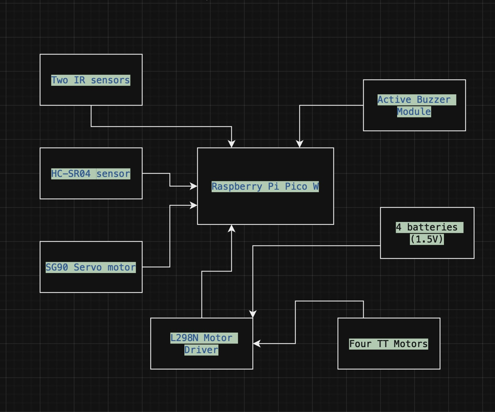

# Ferrari Line Follower and Obstacle Avoider Car 

A smart Ferrari-inspired autonomous car that navigates and avoids obstacles with precision.

:::info 

**Author**: Ionescu Maria-Magdalena \
**GitHub Project Link**: https://github.com/UPB-FILS-MA/project-IonescuMariaMagdalena 

:::

## Description
This project combines the functionality of both line following and obstacle avoidance. The car utilizes sensors to detect both lines on the ground and obstacles in its path, allowing it to make real-time decisions to follow a drawn path while avoiding collisions. The Ferrari Line Follower and Obstacle Avoider Car is a robotic vehicle designed to autonomously follow a specified path marked by lines on the ground while avoiding obstacles encountered along the way. It integrates sensors, actuators, and a microcontroller to achieve this functionality. The car's ability to dynamically adapt its behavior based on environmental cues sets it apart as an autonomous agent. Whether faced with sudden changes in terrain or obstacles, the car recalibrates its trajectory in real-time. The car employs a combination of line following algorithms and obstacle detection techniques to navigate its environment effectively.

## Motivation
The motivation behind the Ferrari Line Follower and Obstacle Avoider Car project is to craft an intelligent autonomous agent. This car possesses the ability to dynamically adapt its behavior in response to its surroundings, a feat that sets it apart as in robotics. Whether traversing diverse terrains or encountering different obstacles, the car demonstrates agility, recalibrating its trajectory in real-time to navigate with precision. 
By engaging in this project, I want to explore the frontiers of autonomous robotics and contribute to the advancement of technology in meaningful and impactful ways. Also, I've always been a huge fan of cars, especially Ferraris and it's a chance to show my DIY skills and dive into the world of robotics and electronics. 

## Architecture 

The architecture should sort of look like this. I will be using a white cardbox with a black line for the path and different objects as obstacles. 
This project is a smart car using a Raspberry Pi Pico W and various sensors and components. It has the following strucure:

 - The Raspberry Pi Pico W is a microcontroller board based on the RP2040 microcontroller chip developed by Raspberry Pi, that manages the project's operations, controlling the servo motor, processing sensor data, and handling other components.
 - HC-SR04 ultrasonic distance sensor + mounting bracket: This sensor emits ultrasonic pulses and measures the time it takes for the pulses to bounce back from obstacles, allowing the car to detect objects in its path. The mounting bracket holds the sensor in a fixed position, ensuring accurate readings.
 - SG90 Servo motor: The servo motor is responsible for controlling the steering mechanism of the car. It can rotate to specific angles, allowing the car to change direction based on input from the microcontroller.
 - Two IR sensors FC-123: These infrared sensors detect infrared light reflected off surfaces, enabling the car to follow a predefined path by detecting lines or markings on the ground.
 - Pololu QTRX-HD-06A Reflective IR Sensor: This reflective IR sensor detects contrasts in reflectivity, aiding in line following or edge detection tasks.
 - L298N Motor Driver: The motor driver controls the speed and direction of the motors, converting signals from the microcontroller into power outputs for the motors.
 - Active Buzzer Module: The buzzer module produces audible alerts or tones, which can be used for signaling purposes, such as indicating when an obstacle is detected.

## Log
<!-- write every week your progress here -->

### Week 6 - 12 May
I uploaded the project documentation. Then, I received the order for the parts and started working on the car. Also, I began working on the Kicad schematic. 

### Week 7 - 19 May
I finished the car, I soldered wires to the motors, connected the pico with the other parts and added the driver, Mr. Duckerson. Furthermore, I started to work at the software.
### Week 20 - 26 May

## Hardware
Rapspberry Pi Pico W, Four wheels, Four TT Motors, Four AA batteries (1.5V) + mounting device, HC-SR04 ultrasonic distance sensor + mounting bracket, SG90 Servo motor, Two IR sensors FC-123, Pololu QTRX-HD-06A, Reflective IR Sensor, L298N Motor Driver, Mini Breadboard, Active Buzzer Module, Male-female, male-male, female-female wires, Switch l Insulating electrical tape, Double-sided adhesive white tape, Connectors and screws, Chassis, Pin headers.

[Photo1](img1.jpeg)
[Photo2](img2.jpeg)
[Photo3](img3.jpeg)
[Photo4](img4.jpeg)
[Photo5](img5.jpeg)

### Schematics
Place your KiCAD schematics here.

### Bill of Materials
| Device | Usage | Price |
|--------|--------|-------|
| [Rapspberry Pi Pico W](https://www.raspberrypi.com/documentation/microcontrollers/raspberry-pi-pico.html) | The microcontroller | [35 RON](https://www.optimusdigital.ro/en/raspberry-pi-boards/12394-raspberry-pi-pico-w.html) |
| [L298N Motor Driver](https://ardushop.ro/ro/electronica/84-l298n-punte-h-dubla-dual-h-bridge-motor-dcsteppe.html?gad_source=1&gclid=Cj0KCQjwn7mwBhCiARIsAGoxjaLLSL30GmBm03YwrOLTLWe7udlgA_18JR-vSDqgFOe0J-D9ATSX3VUaAuQ6EALw_wcB)| the motor | [11,5 RON](https://ardushop.ro/ro/electronica/84-l298n-punte-h-dubla-dual-h-bridge-motor-dcsteppe.html?gad_source=1&gclid=Cj0KCQjwn7mwBhCiARIsAGoxjaLLSL30GmBm03YwrOLTLWe7udlgA_18JR-vSDqgFOe0J-D9ATSX3VUaAuQ6EALw_wcB)|
|[IR Sensor](https://ardushop.ro/ro/electronica/41-modul-senzor-ir-infrarosu-evita-obstacole.html?gad_source=1&gclid=Cj0KCQjwn7mwBhCiARIsAGoxjaJNlwDUtcQS4_9cpYyxwKY2GxpJVmUqcW12zFnIP_sfgO4vtYXc3jAaAqKLEALw_wcB)| Infrared Sensor - obstacle avoidance |[8,78 RON](https://ardushop.ro/ro/electronica/41-modul-senzor-ir-infrarosu-evita-obstacole.html?gad_source=1&gclid=Cj0KCQjwn7mwBhCiARIsAGoxjaJNlwDUtcQS4_9cpYyxwKY2GxpJVmUqcW12zFnIP_sfgO4vtYXc3jAaAqKLEALw_wcB)|
|[Kit Sasiu](https://www.sigmanortec.ro/Kit-sasiu-Smart-Car-4WD-p136281803)| KIT SASIU SMART CAR 4WD |[75,05 RON](https://www.sigmanortec.ro/Kit-sasiu-Smart-Car-4WD-p136281803)|
|[Motor](https://ardushop.ro/ro/electronica/64-motor-dc-3v-6v-cu-reductor-148.html?gad_source=1&gclid=Cj0KCQjwn7mwBhCiARIsAGoxjaJXP9MsuC9_ixrErYdm3rwvy6QaV9Mg9xgH_vNHQ80j6zl8tMQ1UiUaAhIMEALw_wcB)| Powering the circuit |[4,82 RON](https://ardushop.ro/ro/electronica/64-motor-dc-3v-6v-cu-reductor-148.html?gad_source=1&gclid=Cj0KCQjwn7mwBhCiARIsAGoxjaJXP9MsuC9_ixrErYdm3rwvy6QaV9Mg9xgH_vNHQ80j6zl8tMQ1UiUaAhIMEALw_wcB)|
|[SERVOMOTOR SG90 360 GRADE, CONTINUU](https://www.sigmanortec.ro/servomotor-sg90-360-continuu)| Micro servomotor |[11,90 RON](https://www.sigmanortec.ro/servomotor-sg90-360-continuu)|
|[SUPORT SENZOR ULTRASUNETE HC-SR04](https://www.sigmanortec.ro/suport-senzor-ultrasunete-hc-sr04)| suport |[3,95 RON](https://www.sigmanortec.ro/suport-senzor-ultrasunete-hc-sr04)|
[Senzor Infraroșu Reflectiv Pololu QTRX-HD-06A](https://www.optimusdigital.ro/ro/senzori-senzori-optici/7234-senzor-infrarou-reflectiv-pololu-qtrx-hd-06a.html)| IR sensors | [29,99 RON](https://www.optimusdigital.ro/ro/senzori-senzori-optici/7234-senzor-infrarou-reflectiv-pololu-qtrx-hd-06a.html)|
[Senzor ultrasonic HC-SR04](https://www.optimusdigital.ro/ro/senzori-senzori-ultrasonici/9-senzor-ultrasonic-hc-sr04-.html)| distance sensors | [6,49 RON](https://www.optimusdigital.ro/ro/senzori-senzori-ultrasonici/9-senzor-ultrasonic-hc-sr04-.html)|

## Software
| Library | Description | Usage |
|---------|-------------|-------|
|[embassy-executor](https://docs.embassy.dev/embassy-executor/git/std/index.html)|Asynchronous executor for Rust embedded systems| Used for task scheduling and asynchronous programming|
|[embassy-time](https://embassy.dev/book/dev/time_keeping.html)|Time management library  |Used for time-based operations|
|[embassy-rp](https://docs.embassy.dev/embassy-rp/git/rp2040/index.html)| Peripheral access library |Used for initializing and interacting with peripherals |
|[log](https://docs.embassy.dev/embassy-usb-logger/git/default/index.html)|Logging facade |Used for logging messages |
|[embassy-usb-logger](https://docs.embassy.dev/embassy-usb-logger/git/default/index.html)|USB logger implementation for embassy  |Used for logging messages over USB  |
|[embassy-net](https://github.com/embassy-rs/embassy) | Networking library | Manages Wi-Fi communications |
|[gpio](https://docs.embassy.dev/embassy-stm32/git/stm32c011d6/gpio/index.html)|GPIO manipulation |Used for interacting with GPIO pins |

## Links

1. [example of a car](https://ocw.cs.pub.ro/courses/pm/prj2023/danield/linetracer)
2. [video of constructing a car](https://www.youtube.com/watch?v=4PQgjjOqJa4)
3. [soft help](https://forums.raspberrypi.com/viewtopic.php?t=174980)