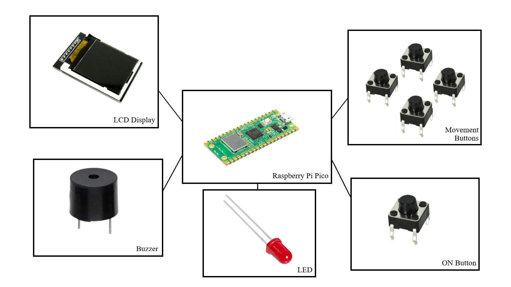
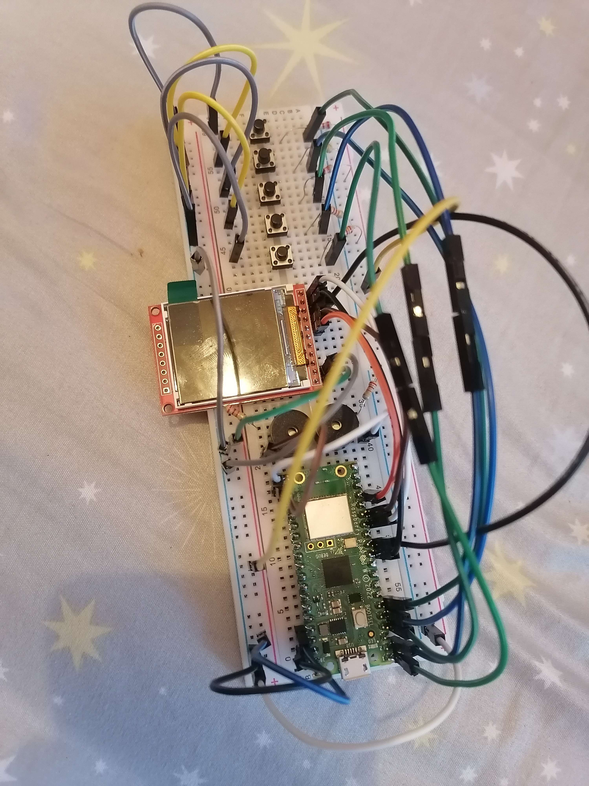
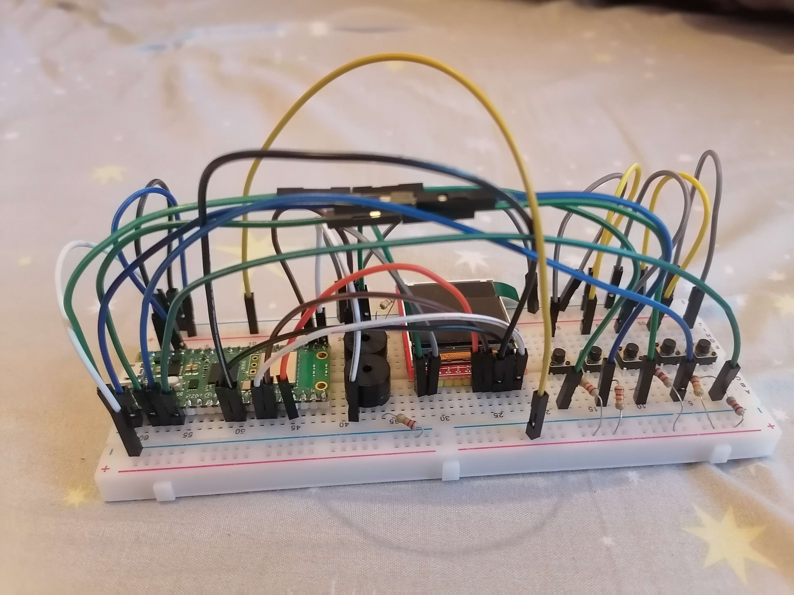
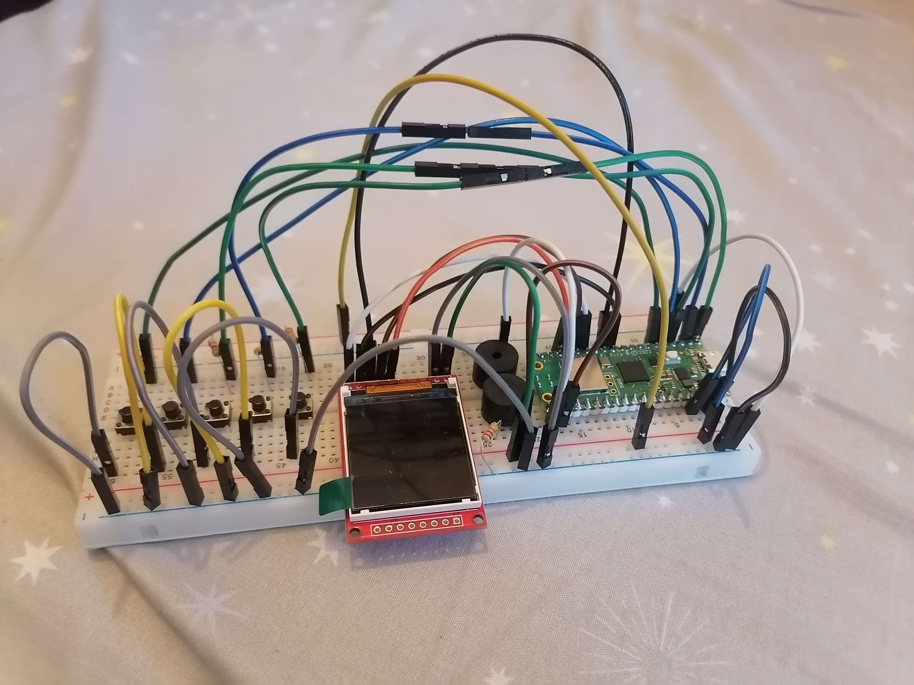
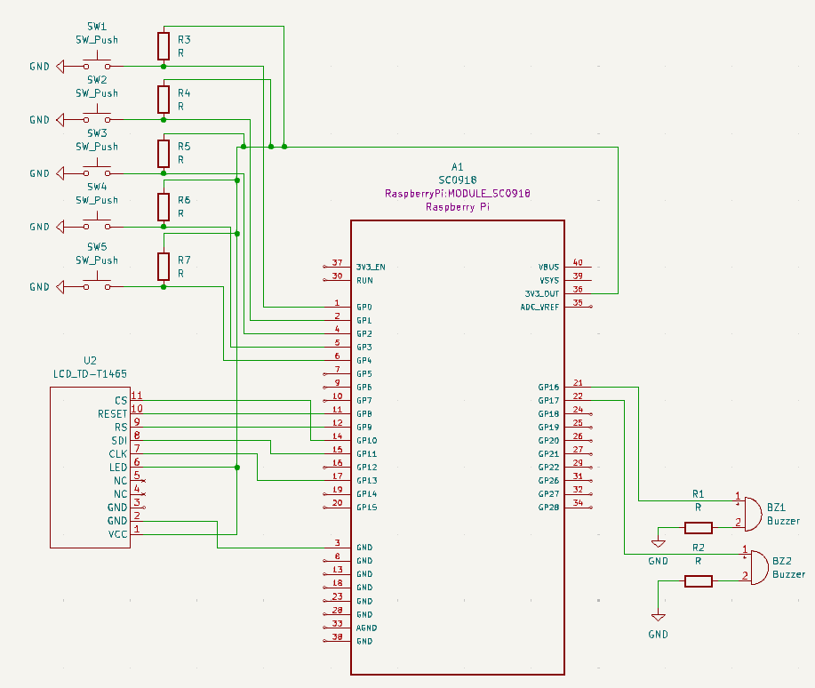

# Snakes and Apples
My project has the goal of using a Raspberry Pi to simulate the old video game Snake.


:::info 
**Author**: Radu Matei \
**GitHub Project Link**: https://github.com/UPB-FILS-MA/project-matei7-7
:::


## Description

In my project I want to recreate the original game simply known as "Snake" on a Raspberry Pi,
using an LCD display as a screen and four buttons as the movements of the player-controlled snake. 
The fifth and final button will only be for starting the game. The game consists
of a snake that can move up, left, down or right and of randomly generating apples that the snake 
has to eat in order to get bigger and, therefore, gain a higher score. The display will work using
Embedded-graphics, displaying for the whole duration of the game the game area, where apples can spawn
and the player can move to get them, and at the top, separated from the rest of the game, there will
be a score counter and a current high score. The game stops when the snake collides with its own head
or one of the borders. During the game, buzzers will be used to create sound effects when gaining score
or dying, and for the background music.

## Motivation

Ever since I was a child, I have been playing video games - from the first ever look over my dad's shoulder to see
what he was doing on the computer I was hooked. I've been playing them my whole life ever since, and since 
high school, where I discovered coding and that I was very good at it, my dream became very clear to me:
creating video games. I have done my fair share of coding problems and even games in Unity, and the
software part is what I really love. And now, I have the opportunity to make a game, code it, and
then make a physical machine that will run my game. Physically. That sounds amazing and, even if
hardware is not really my specialty, I will do my best to make the best game I can.

## Architecture 




## Log

<!-- write every week your progress here -->

### Week 6 - 12 May
 - created index.md
 - made a prototype of the KiCad schematic
 - starting to experiment with cardboard boxes and other things that could be used as a cover for the wiring and the hardware
### Week 7 - 19 May
 - ordered the physical pieces
 - assembled them on a breadboard
 - didn't find my LCD as a KiCad component, not even with Mouser's site, so made my own custom LCD using KiCad
 - finalized KiCad schematic
### Week 20 - 26 May

## Hardware

 - Raspberry Pi Pico W \
A microcontroller for the project - takes input from the buttons and displays the game scene accordingly

 - LCD Display \
A display that shows a grid for the snake to move through, the snake, the apples, and at the top the score and the current high score - microcontroller takes care of the software and displays it on the LCD ST7735

- Buzzer/Buzzers \
These are used for background music and sound effects when dying, gaining score and when achieving a high-score - microcontroller sends signals when a specific event happens

- Buttons \
These are used to control the snake - they are put in a N/W/S/E formation and represent every movement that the player can do; the fifth button is just for starting the game - these send signals to the microcontroller

This is the current prototype of my project, changes are 100% going to happen - a mask is going to be put to hide the hardware and the screen + the buttons will be moved to a separate breadboard to be more easily accessed for the user:







### Schematics



### Bill of Materials

<!-- Fill out this table with all the hardware components that you might need.

The format is 
```
| [Device](link://to/device) | This is used ... | [price](link://to/store) |

```

-->

| Device | Usage | Price |
|--------|--------|-------|
| [Rapspberry Pi Pico W](https://www.raspberrypi.com/documentation/microcontrollers/raspberry-pi-pico.html) | The microcontroller | [35 RON](https://www.optimusdigital.ro/en/raspberry-pi-boards/12394-raspberry-pi-pico-w.html) |
| [LCD SPI Display](https://www.optimusdigital.ro/ro/index.php?controller=attachment&id_attachment=196) | The display - ST7735 | [30 RON](https://www.optimusdigital.ro/ro/optoelectronice-lcd-uri/870-modul-lcd-144.html) |
| [3.3V Buzzer](https://components101.com/misc/buzzer-pinout-working-datasheet) | Buzzers for sound effects and background music | [2 RON / Buzzer](https://www.optimusdigital.ro/ro/audio-buzzere/12247-buzzer-pasiv-de-33v-sau-3v.html) |
| Buttons | 4 Buttons for the movement buttons + 1 Button for ON switch | [2 RON](https://www.optimusdigital.ro/ro/butoane-i-comutatoare/1119-buton-6x6x6.html) |
| Wires | Wires for connecting the hardware | [7 RON](https://www.optimusdigital.ro/ro/fire-fire-mufate/884-set-fire-tata-tata-40p-10-cm.html) |
| Bredboard | Bredboard for connecting the hardware | [10 RON](https://www.optimusdigital.ro/ro/prototipare-breadboard-uri/8-breadboard-830-points.html) |
| Resistors | Resistors | [0.1 RON](https://www.optimusdigital.ro/ro/componente-electronice-rezistoare/848-rezistor-025w-22k.html) |

## Software

| Library | Description | Usage |
|---------|-------------|-------|
| [ST7735](https://github.com/sajattack/st7735-lcd-rs) | Display driver for ST7735 | Used for the display for the Pico Explorer Base |
| [embedded-graphics](https://github.com/embedded-graphics/embedded-graphics) | 2D graphics library | Used for drawing to the display |

## Links

<!-- Add a few links that inspired you and that you think you will use for your project -->

1. [Snake (Video Game)](https://en.wikipedia.org/wiki/Snake_(video_game_genre))
2. [Snake - Code for C++](https://www.geeksforgeeks.org/snake-code-cpp/)
3. [Youtube link for custom KiCad schematic](https://www.youtube.com/watch?v=7tRxwx7hZnQ)
