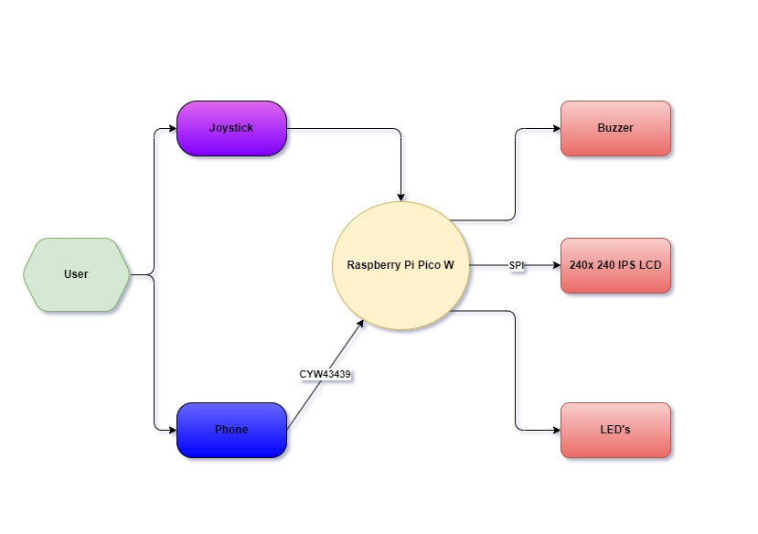
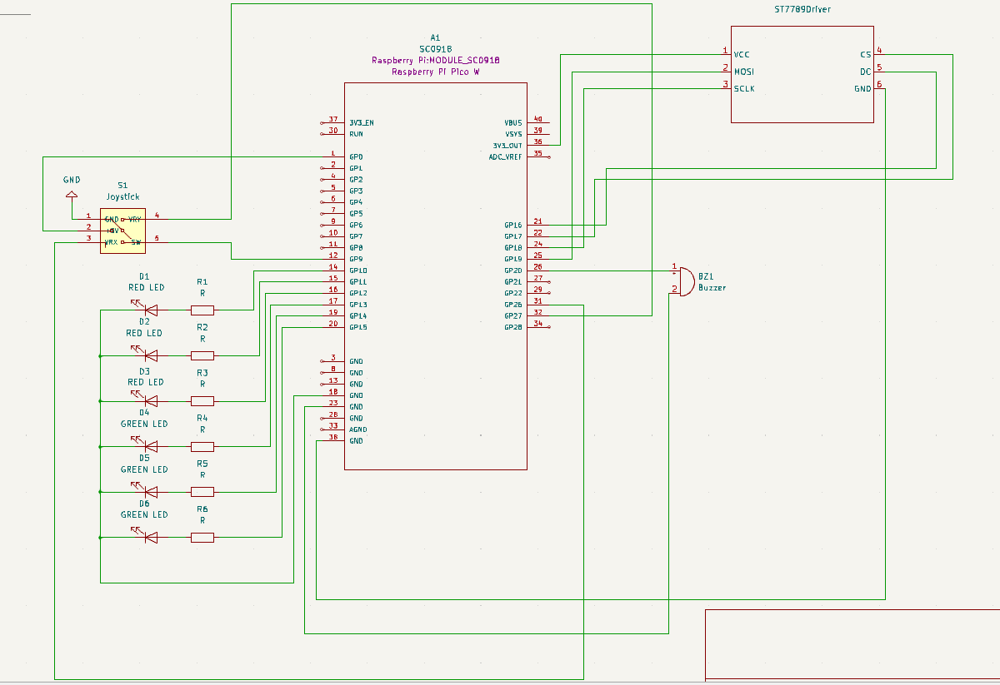

# RUST TICTACTOE (+Wireless Control)

:::info 

**Author**: Petrec Matei-Teodor \
**GitHub Project Link**: https://github.com/UPB-FILS-MA/project-Petrecm

:::

## Description

This project presents the classic game of Tic-Tac-Toe by embedding it into an interactive hardware platform using a Raspberry Pi Pico. The game is displayed on a physical 3x3 matrix on an LCD screen, where players use an analog joystick either their Phone connected to wifi to navigate and confirm their moves. The objective of Tic-Tac-Toe is simple: each of the two players takes turns to mark the spaces in a 3×3 grid with their own symbols (X&O). The winner is the first player to achieve a row, column, or diagonal of three consecutive marks.

## Motivation

I chose to work on the Tic-Tac-Toe project because it perfectly combines my love for classic games with my growing interest in technology and programming. The project, powered by the Raspberry Pi Pico, allows me to explore the complexity of electronic components and software design in a hands-on manner. I’m particularly excited about the challenge of integrating a joystick, wifi module of the pico W and a display, which adds a physical interaction element to the digital game. This test is not just about recreating a game I enjoy and I thought about because I like Ancient Egypt, it's about pushing my abilities in software and hardware design to new limits and crafting an enjoyable experience that enhances my rust skills and provides a tangible, fun product to bring people together.

## Architecture 



The diagram shows the setup of the Interactive Tic-Tac-Toe Game System, built with the Raspberry Pi Pico W. This is a list with all the components and their functionality presented in the representation:

1) Raspberry Pi Pico W: The central controller for the Tic-Tac-Toe game. | Manages input and output operations and processes game logic.
It initializes the game by setting up the LCD display and configuring initial states for LEDs and the joystick/phone control.

2) Joystick: Serves as the primary input device for the player. | Connected directly to the Raspberry Pi Pico W, allowing the user to navigate the game interface. | Has the functionality when pressed to confirm selected move on the screen.

3) Phone (via CYW43439): Connects to the Raspberry Pi Pico W through the CYW43439 WiFi chip.
The inclusion of the CYW43439 allows the game to have connectivity feature to transmit game input control from phone (←↑↓→)

4) 240x240 IPS LCD: Displays the game state and user interface. | Connected to the Raspberry Pi Pico W via SPI (Serial Peripheral Interface), facilitating fast data transfer for real-time display updates. | 

5) Buzzer: Provides auditory feedback for game events, such as invalid moves or game conclusions. | Triggered by specific game conditions programmed into the Raspberry Pi Pico W.

6) LEDs: Indicate various game states and functions, such as player turns or game outcomes. | Controlled directly by the Raspberry Pi Pico W to reflect real-time game changes.


<!-- 
 -->

## Log

<!-- write every week your progress here -->

### Week 6 - 12 May

### Week 7 - 19 May

### Week 20 - 26 May

## Hardware

Raspberry Pi Pico W: Manages all game operations and processes inputs and outputs.
Joystick: User input device for navigating and selecting positions on the game grid.
LCD IPS Module Screen: Displays the game grid and player moves.
Buzzer: Emits sound signals for alerts and notifications during gameplay.
LEDs: Indicate game status, player turns, and outcomes.
Breadboard: Platform for assembling and connecting electronic components.
Wires: Conduct electrical connections between components (Female-to-Male, Female-to-Female, and Male-to-Male).
Resistors: Control and limit the flow of electrical current to other components, protecting them from damage (10KΩ joystick / 220Ω LEDs).
Micro USB Cable: Connects the Raspberry Pi Pico W to a power supply.

### Schematics



### Bill of Materials

<!-- Fill out this table with all the hardware components that you might need.

The format is 
```
| [Device](link://to/device) | This is used ... | [price](link://to/store) |

```

-->

| Device | Usage | Price |
|--------|--------|-------|
| [Rapspberry Pi Pico W](https://www.raspberrypi.com/documentation/microcontrollers/raspberry-pi-pico.html) | The microcontroller with Wi-Fi connectivity | [35 RON](https://www.optimusdigital.ro/en/raspberry-pi-boards/12394-raspberry-pi-pico-w.html) |
| [LCD Module](https://www.waveshare.com/wiki/1.3inch_LCD_Module) | Display | [71.59 RON](https://www.emag.ro/ecran-lcd-waveshare-1-54-inch-240x240-compatibil-cu-raspberry-pi-arduino-albastru-1-54inchlcdmodulewaveshare18079/pd/DVXYXQMBM/l) |
| [Joystick] (https://www.atrinelec.com/download/datasheet/joystick_module(Atrinelec.com).pdf) | Bi-axial module for movement and confirming action | [5,35 RON](https://www.optimusdigital.ro/ro/senzori-senzori-de-atingere/742-modul-joystick-ps2-biaxial-negru-cu-5-pini.html) |
| [LEDs (different colors)](https://www.farnell.com/datasheets/1498852.pdf) | Using different color LEDs we state player row and game winner | [0.5 RON per LED](https://ardushop.ro/ro/electronica/299-led-5mm.html?search_query=LED&results=242) |
| [Buzzer](https://components101.com/misc/buzzer-pinout-working-datasheet) | Goes off when a wrong movement is detected and when game is finished | [4 RON](https://ardushop.ro/ro/electronica/194-buzzer.html?search_query=buzzer&results=16) |
| [Female-to-Female Wires](https://www.optimusdigital.ro/en/wires-with-connectors/880-fire-colorate-mama-mama-10p-10-cm.html?search_query=wires&results=565) | For connections | [3 lei per pack](https://www.optimusdigital.ro/en/wires-with-connectors/880-fire-colorate-mama-mama-10p-10-cm.html?search_query=wires&results=565) |
| [Male-to-Male Wires](https://www.optimusdigital.ro/en/wires-with-connectors/885-wires-male-male-10p-10cm.html?search_query=wires&results=565) | For connections | [9 lei for 3 packs](https://www.optimusdigital.ro/en/wires-with-connectors/885-wires-male-male-10p-10cm.html?search_query=wires&results=565) |
| [Female-to-Male Wires](https://ardushop.ro/ro/electronica/23-40-x-dupont-cables-female-male-10cm.html?search_query=fire&results=203) | For connections | [5 lei per pack](https://ardushop.ro/ro/electronica/23-40-x-dupont-cables-female-male-10cm.html?search_query=fire&results=203) |
| [Breadboard](https://components101.com/sites/default/files/component_datasheet/Breadboard%20Datasheet.pdfn) | To assembly and connect different components on it | [10 RON](https://ardushop.ro/ro/electronica/33-breadboard-830.html?search_query=breadboard&results=31) |
| [Micro USB Cable](https://www.optimusdigital.ro/en/usb-cables/4576-cablu-albastru-micro-usb.html?search_query=usb+to+micro+usb&results=516) | To power the Raspberry Pi Pico W | [3 lei](https://www.optimusdigital.ro/en/usb-cables/4576-cablu-albastru-micro-usb.html?search_query=usb+to+micro+usb&results=516) |
| [10KΩ Resistors](https://ardushop.ro/ro/electronica/211-rezistenta-14w-1-buc.html#/96-valoare_rezistenta-10k) | For the Joystick | [0.5 lei for 2](https://ardushop.ro/ro/electronica/211-rezistenta-14w-1-buc.html#/96-valoare_rezistenta-10k) |
| [220Ω Resistors](https://ardushop.ro/ro/electronica/211-rezistenta-14w-1-buc.html#/83-valoare_rezistenta-220r) | For the LEDs | [1 lei for 3](https://ardushop.ro/ro/electronica/211-rezistenta-14w-1-buc.html#/83-valoare_rezistenta-220r) |

## Software

| Library | Description | Usage |
|---------|-------------|-------|
| [st7789](https://github.com/almindor/st7789) | Display driver for ST7789 | Used for the display for the Pico Explorer Base |
| [embedded-graphics](https://github.com/embedded-graphics/embedded-graphics) | 2D graphics library | Used for drawing to the display |
| [embassy_executor](https://github.com/embassy-rs/embassy) | Provides an executor for running asynchronous tasks concurrently | Execute asynchronous tasks concurrently  |
| [pwm](https://docs.embassy.dev/embassy-nrf/git/nrf52840/pwm/index.html)|Pulse-width modulation |Used for controlling the buzzer's sound intensity |
| [embassy-time](https://embassy.dev/book/dev/time_keeping.html)|Time management library  |Used for time-based operations such as delays |
| [embassy-rp](https://docs.embassy.dev/embassy-rp/git/rp2040/index.html)| Peripheral access library |Used for initializing and interacting with peripherals |
| [gpio](https://docs.embassy.dev/embassy-stm32/git/stm32c011d6/gpio/index.html)|For general-purpose input/output pin manipulation | This is fundamental for interfacing with buttons, LEDs, and potentially the joystick. |

## Links

<!-- Add a few links that inspired you and that you think you will use for your project -->

1. [Youtube](https://www.youtube.com/watch?v=nTjrw7LEu5E&pp=ygUTYXJkdWlubyAgIHRpY3RhY3RvZQ%3D%3D)
2. [Youtube](https://www.youtube.com/watch?v=U741QL8LzZM&t=3595s&pp=ygUbdGljdGFjdG9lIHJhc3BiZXJyeSBwaSBwaWNv)
3. [Youtube](https://www.youtube.com/watch?v=80g4MKgLtKc&pp=ygUbdGljdGFjdG9lIHJhc3BiZXJyeSBwaSBwaWNv)
4. [OCW.CS.PUB.RO](https://ocw.cs.pub.ro/courses/pm/prj2023/drtranca/x_si_o)
5. [Github] (https://github.com/cristiancristea00/tic-tac-toe)
