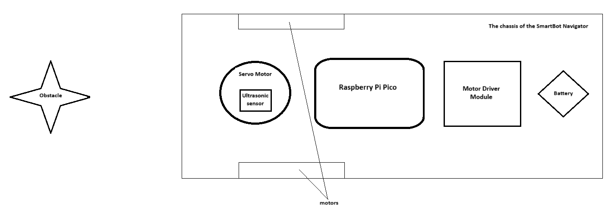
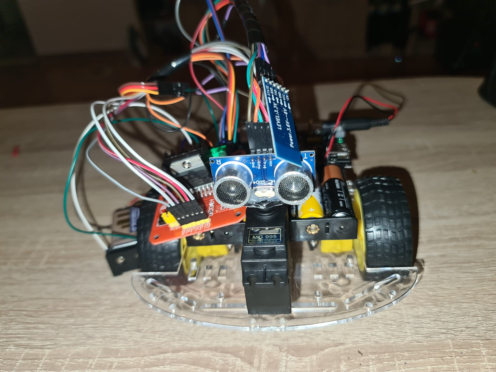
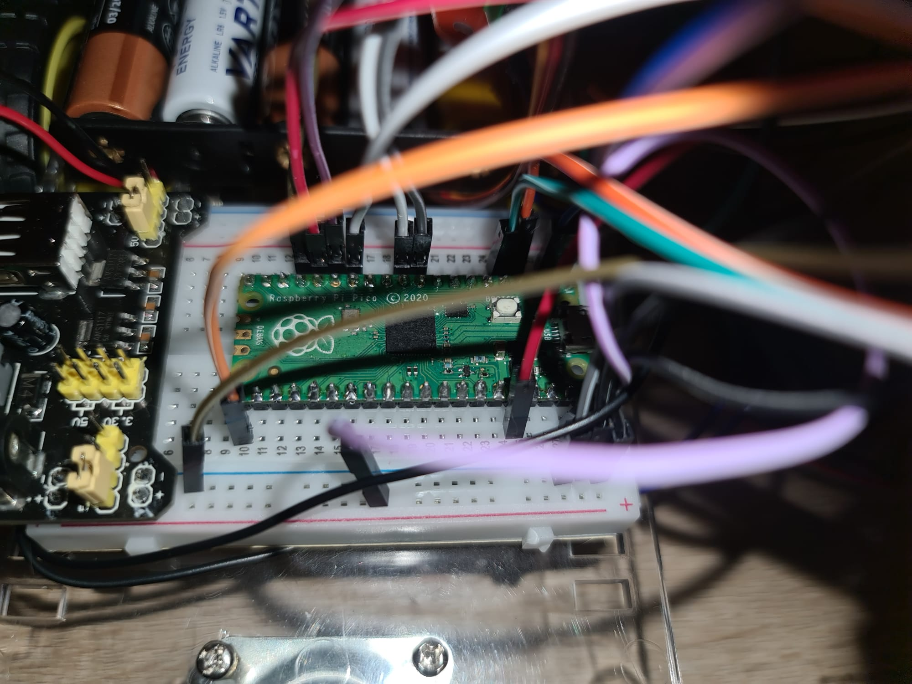
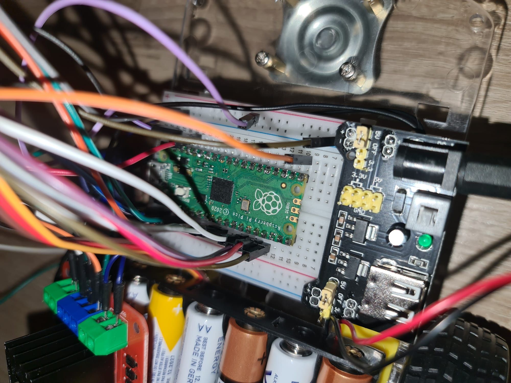
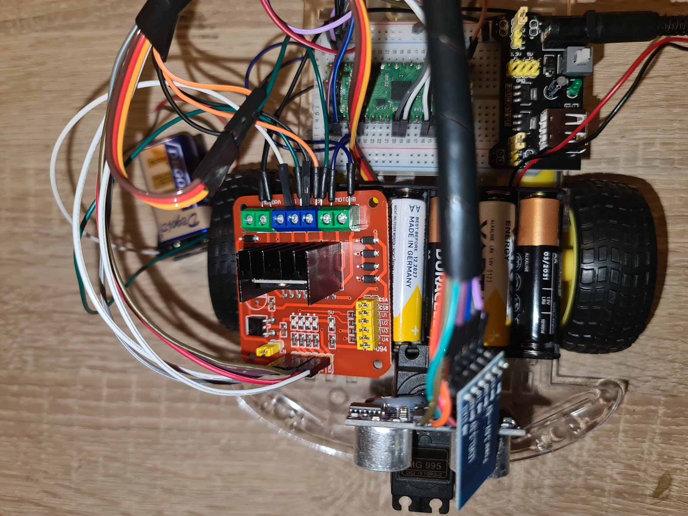
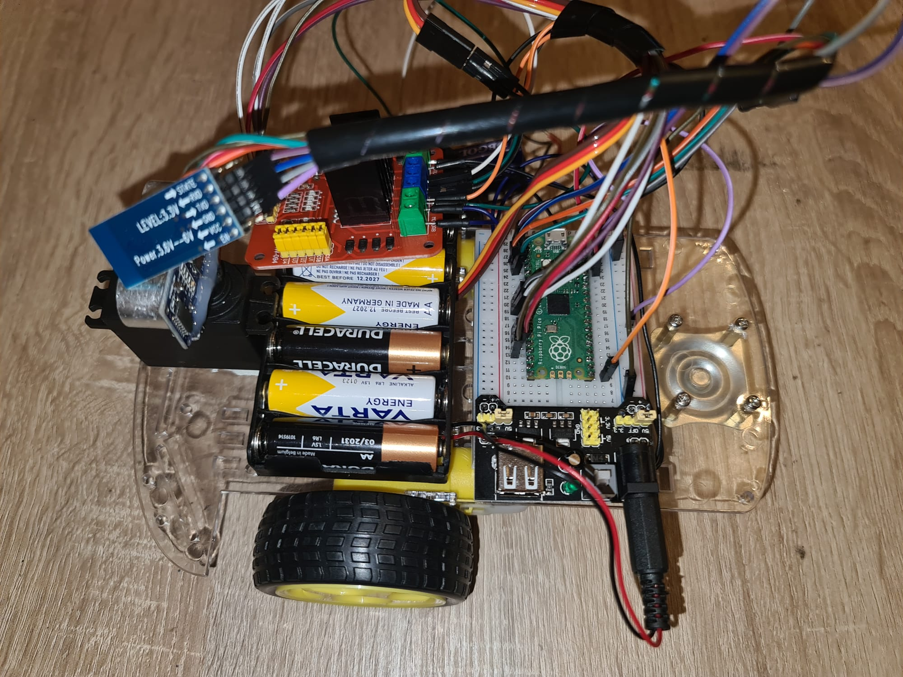
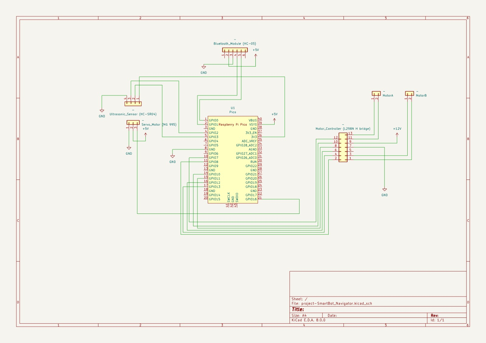

# SmartBot Navigator
An autonomous indoor robot equipped with a 180-degree rotating ultrasonic sensor, powered by a Raspberry Pi Pico, and transmitting real-time data via Bluetooth.


:::info 

**Author**: Mihaela-Raluca Dorobanțu \
**GitHub Project Link**: https://github.com/UPB-FILS-MA/project-Raluca3012

:::

## Description

The SmartBot Navigator is an innovative autonomous robot designed to navigate indoor environments without physical contact, ensuring efficient and precise movement throughout the area. It leverages sensors such as the HC-SR04 ultrasonic sensor to measure distances and navigate around obstacles efficiently. The sensor, mounted on an MG995 servo motor, provides a sweeping 180-degree view, enabling comprehensive spatial analysis. Here are the core features of the SmartBot Navigator based on environmental conditions it detects:

- **Obstacle Detected**: When the robot encounters an obstacle, signaling the need to reroute.
- **Path Clear**: When there are no obstructions in its path, indicating safe passage.
- **Narrow Passage**: When the robot navigates through tight spaces.
- **Recharge Needed**: When the battery level is low, indicating the need to return to its charging station.

This autonomous robot includes a Bluetooth module for real-time data transmission to a PC, allowing users to monitor the robot remotely. The design prioritizes efficiency, activating sensors and navigation systems only when necessary to conserve power and extend operational periods.

## Motivation

The motivation behind the SmartBot Navigator is to advance the capability of autonomous robots in accurately understanding and navigating indoor spaces. This robot serves as a valuable tool in fields requiring detailed spatial awareness, such as robotics research and advanced automation.


## Architecture 



1. **SmartBot Navigator Unit:**
   - The core of the system, this unit houses all operational components. It’s designed to navigate indoor spaces autonomously using various sensors and actuators.

2. **HC-SR04 Ultrasonic Sensor:**
   - Mounted on top of the unit, this sensor measures distances using ultrasonic waves. It’s crucial for detecting obstacles.

3. **MG995 Servo Motor:**
   - This servo motor controls the rotation of the HC-SR04 sensor, allowing it to cover a 180-degree field. This wide range enhances the robot’s ability to detect and navigate around obstacles efficiently.

4. **HW-094 Motor Controller:**
   - Manages the two motors that drive the robot’s wheels. This controller adjusts the speed and direction based on the navigation algorithm’s outputs, ensuring smooth and efficient movement.

5. **Bluetooth Module:**
   - Enables wireless communication between the SmartBot Navigator and a PC. This module facilitates real-time transmission of operational data, allowing for remote monitoring and control of the robot.

6. **Raspberry Pi Pico:**
   - Serves as the brain of the operation. This microcontroller integrates data from sensors, manages the execution of navigation algorithms, and oversees Bluetooth communications.

7. **Power Supply:**
   - Two separate battery blocks power the system:
     - One battery pack powers the Raspberry Pi Pico, ensuring that the central computing resources are maintained.
     - The second battery pack supplies power to the motor controller and servo, which require higher current for operation.

8. **Chassis with 3 Wheels and 2 Motors:**
   - Provides the physical structure and mobility for the SmartBot. The chassis is designed with three wheels, two for propulsion and one for stability, allowing agile and precise movements within complex indoor environments.

The architecture of the SmartBot Navigator is designed to ensure robust operation, efficient power management, and precise navigation, making it highly effective for autonomous indoor movement.

## Log

<!-- write every week your progress here -->

### Week 6 - 12 May
- I made the documentation of the project.
- I procured the hardware components.

### Week 13 - 19 May
- I added KiCAD Schematics.
- I assembled the initial rendition of this robot for the purposes of showing a rough initial image.

### Week 20 - 26 May

## Hardware

- **Power Supply:** I chose to use it because it helps me in the debugging process, as I can switch from 3.3V to 5V on the fly without worrying about overvolting my components.
- **HC-SR04 Ultrasonic Sensor:** It sends out ultrasonic waves and times how long it takes for the echo to come back. To avoid accidents while navigating around objects, the robot needs to be able to calculate their distance. This data assists in this process.
- **MG995 Servo Motor:** The HC-SR04 ultrasonic sensor's angle is operated by the MG995 servo motor. The servo allows the SmartBot to scan a large area in front of it and provide a thorough overview of its surroundings by turning the sensor up to 180 degrees. 
- **L298N Dual H Bridge Motor Controller:** The wheels of the SmartBot are controlled by the L298N controller. It permits the robot to modify its motors' speed and direction in response to navigational commands that can be obtained by sensor inputs. This part makes sure the robot moves smoothly and reacts correctly to the environment it encounters.
- **Bluetooth Module HC-05:** The SmartBot Navigator may interact wirelessly with a PC or other Bluetooth-enabled devices due to the HC-05 Bluetooth module. 
- **Chassis with 3 Wheels and 2 Motors:** The SmartBot's mobility and physical structure are provided by the chassis. It facilitates accurate movements in indoor spaces with two powered wheels and one caster wheel for stability. 
- **Breadboard:** It's used to connect every pin on the hardware components.
- **Raspberry Pi Pico:** It serves as the robot's microcontroller, analyzing all sensory input, managing motor operations, and handling communications. It activates the software that analyzes ultrasonic data to find openings and obstacles and then controls the motor controllers and servo to steer the robot in the appropriate direction.

Here are some photos of the robot










### Schematics




### Bill of Materials

<!-- Fill out this table with all the hardware components that you might need.

The format is 
```
| [Device](link://to/device) | This is used ... | [price](link://to/store) |

```

-->

| Device | Usage | Price |
|--------|--------|-------|
| [Rapspberry Pi Pico](https://www.raspberrypi.com/documentation/microcontrollers/raspberry-pi-pico.html) | The microcontroller | [33 RON](https://www.emag.ro/microcontroller-raspberry-pi-rp2040-pico/pd/DKQQWNMBM/) |
| [HC-SR04 Ultrasonic Sensor](https://cdn.sparkfun.com/datasheets/Sensors/Proximity/HCSR04.pdf) | Measures distances | [18 RON](https://www.emag.ro/senzor-ultrasonic-hc-sr04-cl09/pd/DS0C5JBBM/) |
| [MG995 Servo](https://components101.com/motors/mg995-servo-motor) | Allows the sensor to rotate 180-degree for full-range scanning | [39 RON](https://www.emag.ro/motor-servo-mg995-11kg-180grade-cl845/pd/DZSHBRBBM/) |
| [HW-094 Motor Controller](https://www.gotronic.fr/pj2-35233-eng-1776.pdf) | Manages the operation of the robot's motors	| [27 RON](https://www.emag.ro/modul-l298n-cu-punte-h-dubla-cl26/pd/D2ZZ5JBBM/)|
| [Bluetooth Module](https://components101.com/wireless/hc-05-bluetooth-module) | Facilitates data transfer to PC | [29 RON](https://www.emag.ro/modul-bluetooth-hc-05-cl263/pd/D0966JBBM/?utm_campaign=share_product&utm_source=mobile_dynamic_share&utm_medium=android) |
| [Battery Pack (for Motor Controller)](https://) | Supplies energy to the motors and servo | [3 RON](https://www.emag.ro/suport-cu-fire-pentru-baterii-9v-oky0252-1/pd/D6R726MBM/) |
| [Source (for Raspberry Pi Pico) + Breadbord + Wires](https://) | Provides power to the microcontroller  | [35 RON](https://www.emag.ro/kit-breadboard-830-gauri-65-fire-modul-tensiune-alimentare-mb102-tri273/pd/DY1YP6BBM/) |


## Software

| Library | Description | Usage |
|---------|-------------|-------|
| [rp2040-hal](https://github.com/rp-rs/rp-hal) | RP2040 microcontroller support | Enables control of GPIOs and PWM, essential for interfacing with sensors and motors |
| [embedded-hal](https://github.com/rust-embedded/embedded-hal) | A Hardware Abstraction Layer (HAL) for embedded systems | Offers interfaces for digital input and output, useful for managing sensor signals |
| [defmt](https://github.com/knurling-rs/defmt) | Efficient logging for embedded systems | Enables detailed logging for system diagnostics and debugging during development |
| [embassy](https://github.com/embassy-rs/embassy) | Asynchronous runtime for embedded systems | Supports non-blocking tasks, improving efficiency in managing multiple operations like sensor reading and motor control |
## Links

<!-- Add a few links that inspired you and that you think you will use for your project -->

1. [Pet Robot](https://www.instructables.com/Build-Your-Own-Desktop-Pet-Robot-With-Arduino/)
2. [Distance Sensor Detector](https://ocw.cs.pub.ro/courses/pm/prj2023/abirlica/bogdan-toma)
3. [Bluetooth Car](https://ocw.cs.pub.ro/courses/pm/prj2014/amusat/bluetooth-car)
