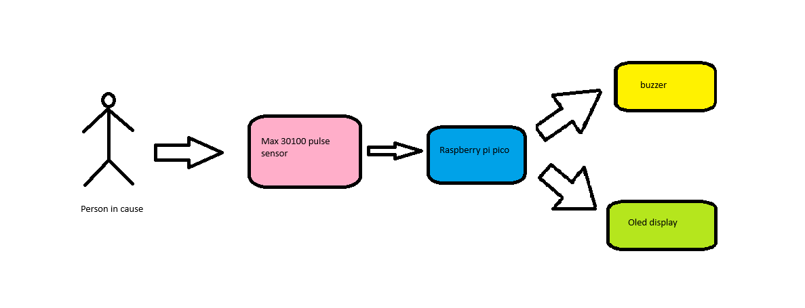

## Pulse Oximeter Health Monitoring

A device providing real-time measurement of blood oxygen levels for proactive health tracking.


**Author**: Buga Mihai
**GitHub Project Link**: https://github.com/UPB-FILS-MA/project-MishulicaZeu


## Description

I want to make a pulse oximeter with a Oled display. The purpose of the project is to monitor a person's pulse and oxygenation.


## Motivation
I choose this project because I wanted to make something what it could be usefull also later in life outside getting my grade.

## Architecture 



## Log

<!-- write every week your progress here -->

### Week 6 - 12 May
Gathering information about the project.
Starting to work on the schematic.
### Week 7 - 19 May
Building the project.
Finishing the schematic.
### Week 20 - 26 May

## Hardware

The hardware part consisted of the following steps:

1. Powered the Raspberry Pi Pico through the USB port of the laptop.
2. Connected the LCD and verified its functionality.
3. Connected the pulse sensor.
4. Displayed the data received from the MAX30100 sensor on the LCD screen.
5. Added a buzzer that emits a sound each time the pulse sensor detects a heartbeat.


### Schematics


### Bill of Materials

<!-- Fill out this table with all the hardware components that you might need.

The format is 
```
| [Device](link://to/device) | This is used ... | [price](link://to/store) |

```

-->

| Device | Usage | Price |
|--------|--------|-------|
| [Raspberry Pi Pico W](https://www.raspberrypi.com/documentation/microcontrollers/raspberry-pi-pico.html)| The microcontroller | [35 RON](https://www.optimusdigital.ro/en/raspberry-pi-boards/12394-raspberry-pi-pico-w.html) |
| [Buzzer](https://miketrebilcock.github.io/js-gpiozero/Buzzer.html) | Used for creating sound | [5 RON](https://www.bitmi.ro/module-electronice/modul-buzzer-activ-compatibil-arduino-10397.html) |
| [Breadboard 830 puncte MB-102](https://static.cs.tme.eu/2018/03/5aaa4f5a91b79/Lecture_1_The_Breadboard.pdf) | To assamble the project |  [9 RON](https://www.bitmi.ro/componente-electronice/breadboard-830-puncte-mb-102-10500.html) |
| [Modul senzor pulsoximetru MAX30102](https://www.analog.com/media/en/technical-documentation/data-sheets/max30102.pdf) | To measure-heart-rate-and-spo2 | [16 RON](https://www.bitmi.ro/senzori-electronici/modul-senzor-pulsoximetru-max30102-10803.html)|

## Software

| Library | Description | Usage |
|---------|-------------|-------|
| [to be added] | to be added | to be added |
| [to be added] | to be added | to be added |

## Links

<!-- Add a few links that inspired you and that you think you will use for your project -->

1. [inspired](https://all3dp.com/2/easy-simple-arduino-projects/)
2. [project ideea](https://projecthub.arduino.cc/SurtrTech/measure-heart-rate-and-spo2-with-max30102-eb4f74)
...
