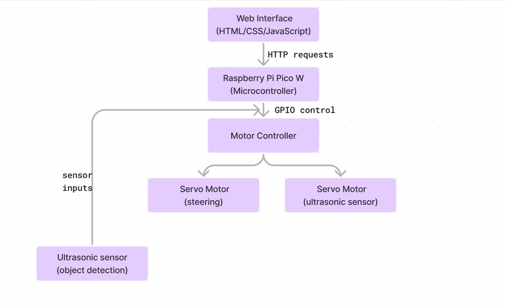
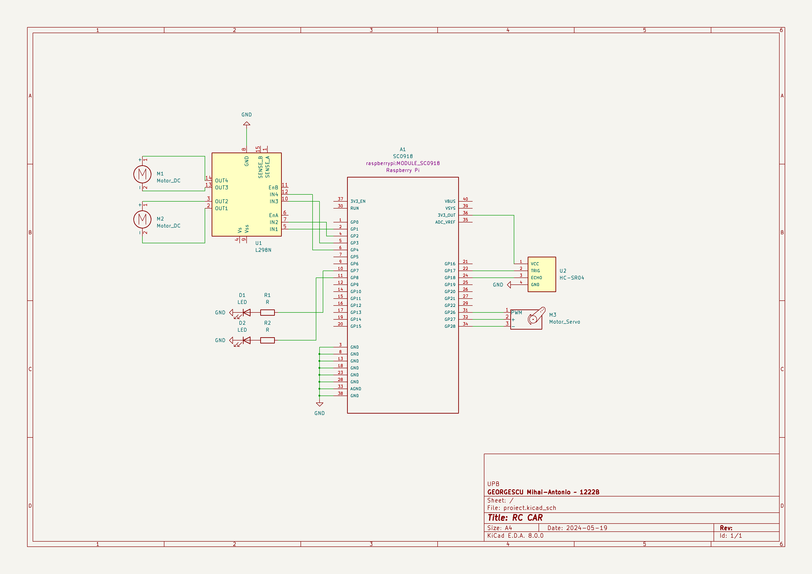

# RC Car 
A RC Car controlled by a Web Application
:::info 

**Author**: Mihai-Antonio GEORGESCU \
**GitHub Project Link**: https://github.com/UPB-FILS-MA/project-sadtoni/

:::

## Description

+ Using the Raspberry Pi Pico W microcontroller, I built a remote-controlled car, operated via a web application.

+ The connection is realized with Pico’s integrated Wi-Fi capabilities, since it is ten times faster than using Bluetooth and is easier to control via a web browser on an iPhone.

+ On the bonnet, an ultrasonic sensor is placed to provide distance information to the user, allowing them to control the car even if it is out of sight.

## Motivation

The motivation behind my RC Car project comes from my desire to play, create and explore, and building the project gives me the opportunity to learn by building and coding everything from scratch.

## Architecture 

## Log

<!-- write every week your progress here -->

### Week 6 - 12 May

+ I placed the orders for the components, and I started to plan on how the car will look and function.

### Week 7 - 19 May

+ Started to assembly the car components.
+ Did the KiCad schematic for the car.

### Week 20 - 26 May

## Hardware

+ Raspberry Pi Pico W:

Description: A microcontroller board based on the Raspberry Pi RP2040 chip, featuring Wi-Fi connectivity.
Function: Serves as the central control unit for the RC car, processing inputs and controlling outputs to various components.

+ L298N Motor Driver:

Description: A dual H-bridge motor driver module capable of controlling the speed and direction of two DC motors.
Function: Interfaces between the Raspberry Pi Pico W and the motors, allowing for control of motor operations through GPIO pins.

+ Servomotors:

Description: Rotary actuators that allow for precise control of angular position, typically used for steering and other precise movements.
Function: Used for controlling the direction of the RC car.

+ Ultrasonic Sensor:

Description: A sensor that uses ultrasonic waves to measure the distance to an object.
Function: Mounted on a servo motor to scan the environment and detect obstacles, providing data for obstacle avoidance.

+ LEDs:

Description: Light-emitting diodes used as headlights.
Function: Provide illumination and visual feedback, connected to GPIO pins GP7 and GP8.

+ Buzzer:

Description: An electronic device that produces sound.
Function: Used for auditory signals or alerts.

+ Aluminum Chassis:

Description: The structural frame of the RC car made from aluminum.
Function: Provides a sturdy and lightweight structure to mount all the components.

+ Shopping Cart Wheel:

Description: A free-spinning wheel similar to those found on shopping carts.
Function: Provides stability and support to the rear of the RC car.

### Schematics

### Bill of Materials

| Device | Usage | Price |
|--------|--------|-------|
|1 x [Mini Aluminum Premium Twin Robot Mini Kit](https://www.optimusdigital.ro/en/robot-kits/3161-mini-aluminum-premium-twin-robot-mini-kit.html?search_query=0104110000027986%09&results=1)|The kit contains the chassis, two servomotors and a wheel|[69 RON](https://www.optimusdigital.ro/en/robot-kits/3161-mini-aluminum-premium-twin-robot-mini-kit.html?search_query=0104110000027986%09&results=1)| 
|1 x [Rapspberry Pi Pico W](https://www.raspberrypi.com/documentation/microcontrollers/raspberry-pi-pico.html) | The microcontroller | [35 RON](https://www.optimusdigital.ro/en/raspberry-pi-boards/12394-raspberry-pi-pico-w.html) |
|1 x [L298N Motor Driver](https://www.optimusdigital.ro/en/brushed-motor-drivers/145-l298n-dual-motor-driver.html?search_query=L298N&results=4) | Control motor motion | [9 RON](https://www.optimusdigital.ro/en/brushed-motor-drivers/145-l298n-dual-motor-driver.html?search_query=L298N&results=4)|
|1 x [DC-DC Boost Module ](https://www.optimusdigital.ro/en/chargers/7340-dc-dc-boost-module-with-microusb-input-charging-function-for-li-ion-batteries-and-usb-outputs.html?search_query=baterie&results=1) | Connecting the batteries to the board | [13 RON](https://www.optimusdigital.ro/en/chargers/7340-dc-dc-boost-module-with-microusb-input-charging-function-for-li-ion-batteries-and-usb-outputs.html?search_query=baterie&results=1)|
|2 x [9V Alkaline Battery Varta 6LR61 4922](https://www.optimusdigital.ro/en/9-v-pp3-batteries/3151-9v-alkaline-battery-varta-6lr61-4922-4008496559862.html)|The juice supplying the car |[13 RON](https://www.optimusdigital.ro/en/9-v-pp3-batteries/3151-9v-alkaline-battery-varta-6lr61-4922-4008496559862.html)|
|1 x [Mounting Bracket for HC-SR04 Ultrasonic Sensor (Red)](https://www.optimusdigital.ro/en/holders-and-mounting-accessories/7104-mounting-bracked-for-hc-sr04-ultrasonic-sensor-red.html?search_query=0104210000045369%09&results=1)|Holds the ultrasonic sensor| [2 RON](https://www.optimusdigital.ro/en/holders-and-mounting-accessories/7104-mounting-bracked-for-hc-sr04-ultrasonic-sensor-red.html?search_query=0104210000045369%09&results=1)|
|1 x [HC-SR04 Ultrasonic Sensor](https://www.optimusdigital.ro/en/ultrasonic-sensors/9-hc-sr04-ultrasonic-sensor.html?search_query=ultrasonic&results=87)|Radar for the car |[7 RON](https://www.optimusdigital.ro/en/ultrasonic-sensors/9-hc-sr04-ultrasonic-sensor.html?search_query=ultrasonic&results=87)|
|2 x [400p HQ Breadboard](https://www.optimusdigital.ro/en/breadboards/44-400p-hq-breadboard.html?search_query=breadboard&results=415)|Accomodate hardware devices |[10 RON](https://www.optimusdigital.ro/en/breadboards/44-400p-hq-breadboard.html?search_query=breadboard&results=415)|
|1 x [Male-Male Wires](https://www.optimusdigital.ro/en/wires-with-connectors/884-set-fire-tata-tata-40p-10-cm.html)|Do the connection |[7 RON](https://www.optimusdigital.ro/en/wires-with-connectors/884-set-fire-tata-tata-40p-10-cm.html)|
|1 x [FS90 Micro Servomotor with Plastic Reducer](https://www.optimusdigital.ro/en/servomotors/3165-fs90-micro-servomotor-with-plastic-reducing.html?search_query=servomotor&results=111)|Rotates the ultrasonic sensor |[27 RON](https://www.optimusdigital.ro/en/servomotors/3165-fs90-micro-servomotor-with-plastic-reducing.html?search_query=servomotor&results=111)|
|1 x [5 V Passive Buzzer](https://www.optimusdigital.ro/en/buzzers/634-5v-passive-buzzer.html?search_query=buzzer&results=87)|Honk |[2 RON](https://www.optimusdigital.ro/en/buzzers/634-5v-passive-buzzer.html?search_query=buzzer&results=87)|
|1 x [10 mm Hexagonal Head Screw](https://www.optimusdigital.ro/en/screws-and-nuts/5756-m6x10-mm-hexagonal-head-screw.html?search_query=screw&results=746)|Fixing the components in place |[1 RON](https://www.optimusdigital.ro/en/screws-and-nuts/5756-m6x10-mm-hexagonal-head-screw.html?search_query=screw&results=746)|

## Software

## Links

1. [Instructables | Arduino RC Car Project](https://www.instructables.com/Arduino-RC-Car-Project/)
2. [OCW CS PUB | Grave Digger (Monster Car)](https://ocw.cs.pub.ro/courses/pm/prj2017/ddragomir/bogdan_adrian.ene)
3. [YouTube | How to make an ultrasonic Radar](https://youtu.be/xngpwyQKnRw?si=VdglGKJKZDccrtuA)
4. [YouTube | Create an RC Robot Car Using Pi Pico W and Robo Pico | Control it with a Webpage](https://youtu.be/RFEyYCotwzM?si=uECjVORqA3PXx5x8)
5. [YouTube | Rust on ESP32 - Building an RC car in ESP-RS: The controller](https://youtu.be/CkjBdgiNRfc?si=QGZxqSq4LfnAQ8TG)
6. [YouTube | Rust on ESP32 - Servo intro & deep dive](https://youtu.be/-kRTRKL39pE?si=Uimh3aOyvrsSkAzS)
7. [Joseph Yiu, The De nitive Guide to ARM® Cortex®-M0 and Cortex-M0+ Processors, 2nd Edition](https://ctipub.sharepoint.com/:f:/s/12filsla2s2ame/Eq7HAUGk41BDkWn9AriDgooBL-SkHCnE4o_WfwC7Dex1eA?e=tUY1hP)
