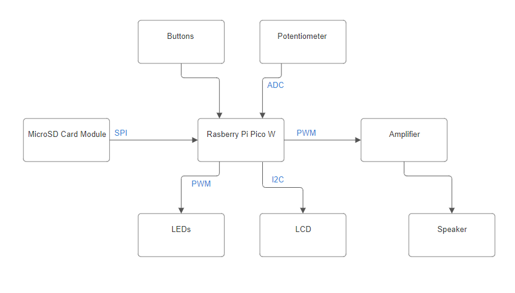
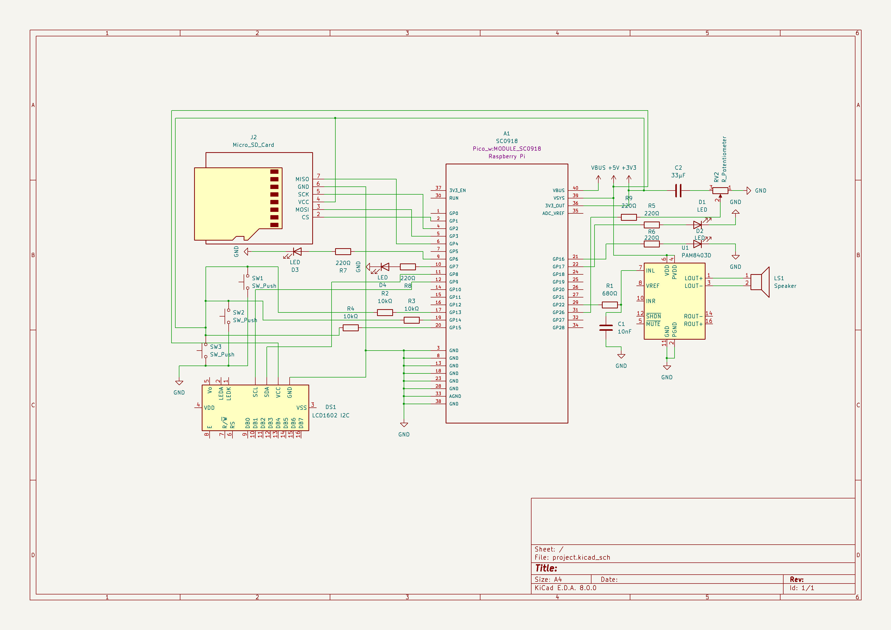
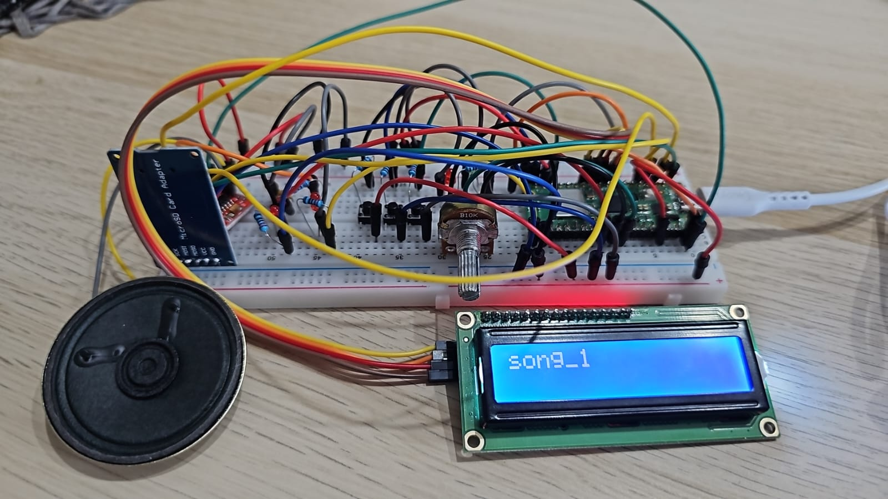
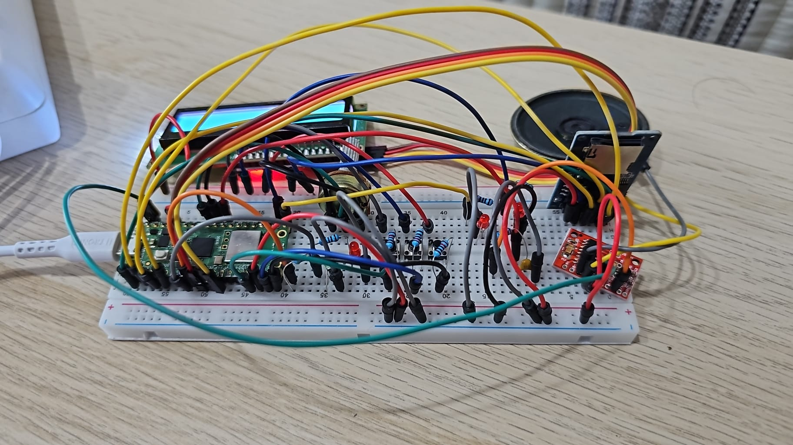
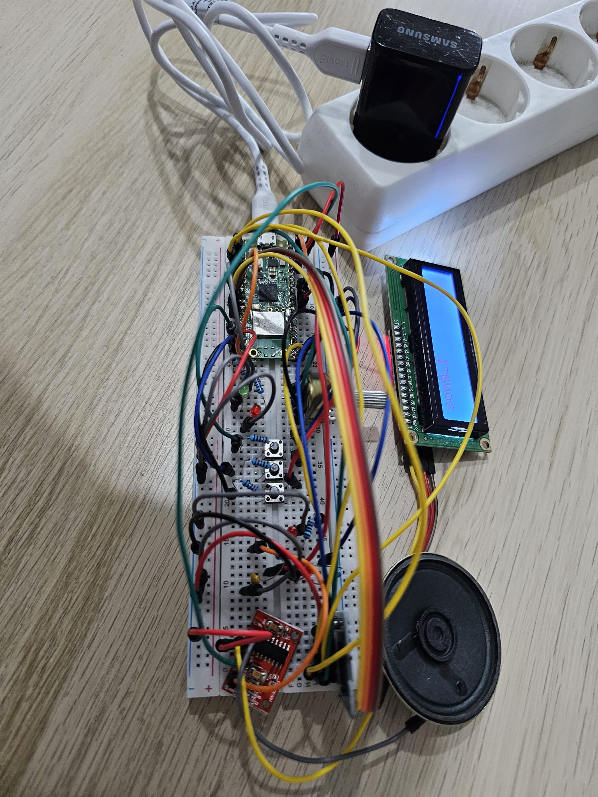

# Music Player
Compact music player with microSD input, outputting to a speaker, featuring controls for play, pause, skip, and volume.

:::info 

**Author**: Pasaroiu Mihai Octavian \
**GitHub Project Link**: https://github.com/UPB-FILS-MA/project-12mihai05.git

:::

## Description

This project is a compact music player built with a Raspberry Pi Pico W and programmed in Rust. It uses an SPI-connected microSD module to read songs, playing them through a speaker with an amplifier for clear audio output. The music will be outputted as PWM through a speaker. The user interface consists of push buttons for basic controls (next song, previous song, and play/pause), a potentiometer for smooth volume adjustment, and an I2C LCD screen that displays the current song's title. 
Additionally, a set of PWM-controlled LEDs offers a dynamic visual representation of the music's intensity, with brightness varying based on the PWM duty cycle of the audio output to the speaker.

## Motivation

Building a music player with a Raspberry Pi Pico W using Rust allowed me to work on a project that I could personally enjoy, while also learning valuable skills in microcontroller programming and hardware integration. I like to listen to music, and it seemed interesting to create a project that combines technology with something I love. Plus, it's a great way to make something cool that I can show off to my friends.

## Architecture 



## Log

<!-- write every week your progress here -->

### Week 6 - 12 May
Make the hardware part and work for the software.
### Week 7 - 19 May
Continue developing the software part.
### Week 20 - 26 May

## Hardware

This project utilizes a Raspberry Pi Pico to facilitate digital audio playback from a 32GB microSD card formatted in FAT32, interfaced via SPI protocol. The audio output is delivered through a 1W speaker powered by a PAM8403 Class D Stereo Mini Amplifier, enhanced by an RC filter comprising a 680-ohm resistor and a 10nF capacitor, which filters frequencies above 23.4kHz. Visual augmentation is achieved through four LEDs, controlled by PWM signals that vary in intensity corresponding to the audio output's duty cycle, providing a dynamic representation of sound intensity. User interaction is managed through a 1602 LCD display, operating on the I2C protocol, which displays the current song title. The system also incorporates three push-buttons connected to the microcontroller's GPIO pins with 10k-ohm pull-up resistors, assigned to play/pause functionality and navigation between tracks. Additionally, a potentiometer is integrated for volume control, offering user-adjustable audio output levels.

### Schematics

  
  
  
  

### Bill of Materials

<!-- Fill out this table with all the hardware components that you might need.

The format is 
```
| [Device](link://to/device) | This is used ... | [price](link://to/store) |

```

-->

| Device | Usage | Price |
|--------|--------|-------|
| [Rapspberry Pi Pico W](https://www.raspberrypi.com/documentation/microcontrollers/raspberry-pi-pico.html) | The microcontroller | [35 RON](https://www.optimusdigital.ro/en/raspberry-pi-boards/12394-raspberry-pi-pico-w.html) |
| [1602 LCD](https://www.waveshare.com/datasheet/LCD_en_PDF/LCD1602.pdf) | LCD Display | [16.34 RON](https://www.optimusdigital.ro/ro/optoelectronice-lcd-uri/2894-lcd-cu-interfata-i2c-si-backlight-albastru.html?search_query=LCD+1602+cu+Interfata+I2C+si+Backlight+Albastru&results=2) |
| [Amplifier](https://www.mouser.com/datasheet/2/115/PAM8403-247318.pdf) | Boosts audio output | [3.99 RON](https://www.optimusdigital.ro/ro/audio-amplificatoare-audio/165-amplificator-in-miniatura.html) |
| Buttons | Play/Pause and previous/next song | [2.16 RON](https://www.optimusdigital.ro/ro/butoane-i-comutatoare/1119-buton-6x6x6.html) |
| Different color leds | Visual representation of the music's intensity | [6 RON](https://www.optimusdigital.ro/ro/optoelectronice-led-uri/696-led-rou-de-3-mm-cu-lentile-difuze.html?search_query=LED+Ro%C8%99u+de+3+mm+cu+Lentile+Difuze&results=2) |
| Wires | Connects electronic components | [13.79 RON](https://www.optimusdigital.ro/ro/fire-fire-mufate/12-set-de-cabluri-pentru-breadboard.html) |
| Breadboard | Component integration | [9.98 RON](https://www.optimusdigital.ro/ro/fire-fire-mufate/12-set-de-cabluri-pentru-breadboard.html) |
| Potentiometer | Adjust volume | [2.36 RON](https://www.optimusdigital.ro/ro/componente-electronice-potentiometre/901-rezistor-variabil-10k-wh148.html?search_query=Rezistor+Variabil+10k+WH148+%28Poten%C8%9Biometru%29&results=2) |
| Speaker | Outputs the song | [4.27 RON](https://www.optimusdigital.ro/ro/audio-difuzoare/2147-difuzor-de-1-w.html?search_query=Difuzor+de+1+W&results=100) |
| Resistors | Limits current flow | [14.99 RON](https://www.optimusdigital.ro/ro/componente-electronice-rezistoare/33-rezistoare-set.html) |
| MicroSD Card Module | Reads the song from the microSD| [4.39 RON](https://www.optimusdigital.ro/ro/componente-electronice-rezistoare/33-rezistoare-set.html) |
| Capacitor | Low-pass filter(RC) | [0.39 RON](https://www.optimusdigital.ro/en/capacitors/2749-capacitor-10nf.html) |


## Software

| Library | Description | Usage |
|---------|-------------|-------|
| [embedded-sdmmc-rs](https://github.com/rust-embedded-community/embedded-sdmmc-rs) | MicroSD card management | Used for reading the files from microSD |
| [ag-lcd](https://github.com/mjhouse/ag-lcd) | LCD display driver | Used for displaying the name of the song playing |

## Links

<!-- Add a few links that inspired you and that you think you will use for your project -->

1. [How to connect SD Card to Raspberry Pi Pico using SPI](https://www.youtube.com/watch?v=JrYT7aJnP_I)
2. [How to use the LCD using I2C](https://www.tomshardware.com/how-to/lcd-display-raspberry-pi-pico)
3. Check and search for dependecies: [1](https://docs.rs/), [2](https://crates.io/)
4. [Example of how to play music using PWM](https://bandarra.me/2022/08/02/Play-Music-with-the-Raspberry-Pi-Pico-and-Rust/)
5. [Audio output circuit example](https://www.hackster.io/news/learn-how-to-use-pwm-to-generate-an-audio-signal-from-your-raspberry-pi-pico-00347dece8b8)