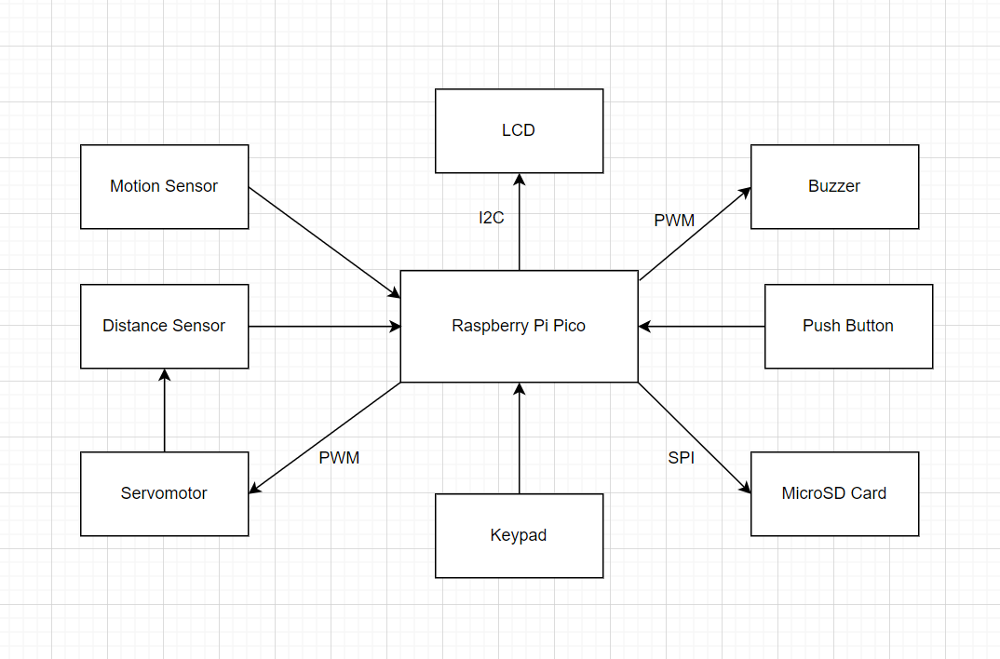
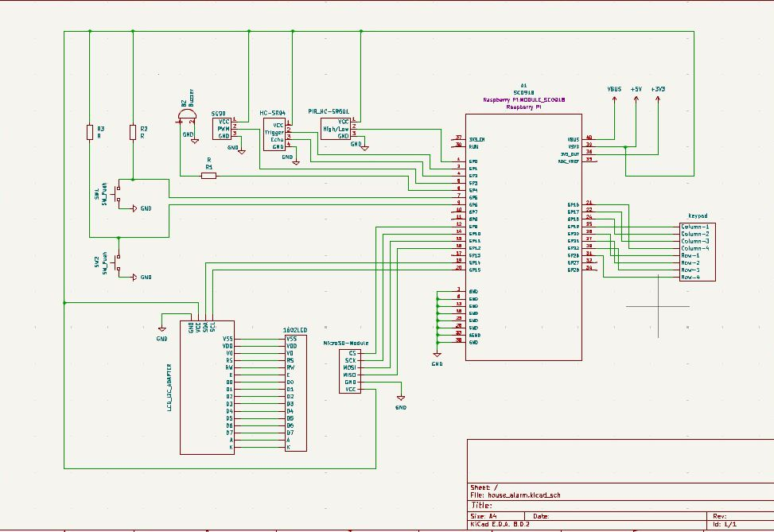
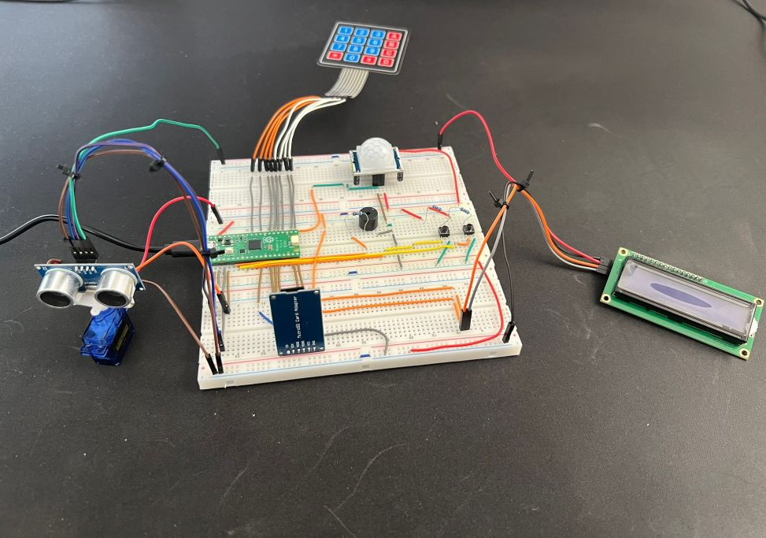
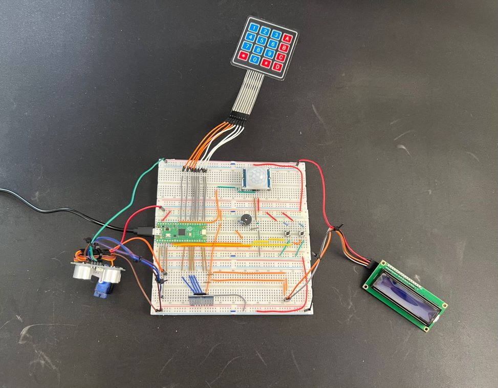

# House Alarm

A house alarm system combining motion detection, proximity monitoring and event logging.

:::info 

**Author**: Smarandache Mihai \
**GitHub Project Link**: https://github.com/UPB-FILS-MA/project-Mihai1803

:::

## Description

A house alarm system triggered by motion detection and proximity monitoring. It includes the following features:

- Detection of motion presence using a motion sensor
- Proximity monitoring using a distance sensor mounted on a servomotor rotating 180 degrees
- Activation of a buzzer alarm when motion is detected and the presence is close enough
- Deactivation of the buzzer alarm by entering a code using a keypad
- Displaying the entered code on an LCD screen
- Logging of detection events to a MicroSD card
- Automatic shutoff of the buzzer alarm if the code is not entered within 1 minute

## Motivation

I chose this as my first embedded project because it allows me to put into practice the skills and knowledge that I have gained throughout this course. Implementing a house alarm system involves integrating various components such as motion sensors, distance sensors, keypad input, and the LCD display, thus allowing me to apply concepts ranging from hardware interfacing to software development.

Moreover, this project presents a real-life application that can be scaled and potentially benefit others by enhancing security measures in homes.

Overall, this project not only consolidates my learning but also offers a solution to a practical problem.

## Architecture 

The project has the following architecture:
 - __Raspberry Pi Pico:__ The Pico has the role of connecting all the components between them
 - __LCD:__ Connected to the Pico via I2C, the LCD provides an interface for displaying system statuses, messages and inputs
 - __Motion and Distance Sensors:__ These sensors detect motion and proximity separately. They provide input to the pico about potential intruders
 - __Servormotor:__ The servormotor is controlled by the Pico through PWM and it serves as a platform for mounting the distance sensor so that it can rotate 180°
 - __Buzzer:__ Controlled by PWM, the buzzer is triggered when motion is detected in proximity to the sensors. It acts as an audible alarm
 - __Keypad and Push Button:__ The keypad allows the user to input a code to disarm the alarm. Aditionally, a stop button provides a manual override to stop the alarm if necessary
 - __MicroSD Card:__ Used for data logging and storage, the MicroSD card records system events, sensor reading and alarm triggers




## Log

<!-- write every week your progress here -->

### Week 6 - 12 May
 - Uploaded the initial documentation for the project
 - Began assembling the hardware
 - Started working on the software

### Week 7 - 19 May
 - Completed the hardware
 - Updated the documentation for the hardware milestone
 - Continued developing the software

### Week 20 - 26 May

## Hardware

The hardware setup for this project consists of a Raspberry Pi Pico microcontroller as the main control unit. It utilizes a PIR HC-SR501 motion sensor and an HC-SR04 ultrasonic distance sensor to detect potential intruders. The ultrasonic distance sensor is mounted on an SG90 servomotor, which rotates 180 degrees to provide a broader detection range.

For data logging and storage, a microSD module is used to log on a MicroSD every alarm trigger and store the disarm code of the alarm system. Users can input the disarm code using a 4x4 matrix keypad, and a 1602 LCD display is used to show the input code, alarm triggers, and system messages.

To provide control, there are two push buttons: one for submitting the code entered via the keypad and another for manually stopping the alarm.

### Schematics




### Hardware pictures





### Bill of Materials

<!-- Fill out this table with all the hardware components that you might need.

The format is 
```
| [Device](link://to/device) | This is used ... | [price](link://to/store) |

```

-->

| Device | Usage | Price |
|--------|--------|-------|
| [Rapspberry Pi Pico W](https://www.raspberrypi.com/documentation/microcontrollers/raspberry-pi-pico.html) | The microcontroller | [35 RON](https://www.optimusdigital.ro/en/raspberry-pi-boards/12394-raspberry-pi-pico-w.html) |
| [PIR HC-SR501](https://components101.com/sites/default/files/component_datasheet/HC%20SR501%20PIR%20Sensor%20Datasheet.pdf) | Motion Sensor | [6 RON](https://www.optimusdigital.ro/ro/senzori-senzori-pir/106-modul-senzor-pir-hc-sr501.html?search_query=pir+senzo&results=40) |
| [HC-SR04](https://www.handsontec.com/dataspecs/HC-SR04-Ultrasonic.pdf) | Distance Sensor | [15 RON](https://www.optimusdigital.ro/ro/senzori-senzori-ultrasonici/2328-senzor-ultrasonic-de-distana-hc-sr04-compatibil-33-v-i-5-v.html?search_query=senzor+de+distant&results=206) |
| [SG90 180°](https://robojax.com/learn/arduino/robojax-servo-sg90_datasheet.pdf) | Servomotor | [12 RON](https://www.optimusdigital.ro/ro/motoare-servomotoare/2261-micro-servo-motor-sg90-180.html?search_query=SG90&results=12) |
| [1602 LCD](https://www.waveshare.com/datasheet/LCD_en_PDF/LCD1602.pdf) | LCD Display | [15 RON](https://www.optimusdigital.ro/ro/optoelectronice-lcd-uri/62-lcd-1602-cu-interfata-i2c-si-backlight-galben-verde.html?search_query=lcd&results=206) |
| [Keypad](https://cdn.sparkfun.com/assets/f/f/a/5/0/DS-16038.pdf) | Keypad | [7 RON](https://www.optimusdigital.ro/ro/senzori-senzori-de-atingere/470-tastatura-matriceala-4x4-cu-conector-pin-de-tip-mama.html?search_query=keypad&results=5) |
| MicroSD Module | MicroSD Card Slot Module | [5 RON](https://www.optimusdigital.ro/en/memories/1516-microsd-card-slot-module.html) |
| Activ Buzzer | Buzzer | [1.5 RON](https://www.optimusdigital.ro/ro/audio-buzzere/635-buzzer-activ-de-3-v.html?search_query=buzzer&results=61) |
| Push Button | Button | [1 RON](https://www.optimusdigital.ro/ro/butoane-i-comutatoare/1119-buton-6x6x6.html?search_query=buton&results=222) |
| Jumper Wires | Connecting components | [7 RON](https://www.optimusdigital.ro/ro/fire-fire-mufate/884-set-fire-tata-tata-40p-10-cm.html?search_query=set+fire&results=110) |
| Breadboard | Project board | [10 RON](https://www.optimusdigital.ro/ro/prototipare-breadboard-uri/8-breadboard-830-points.html?search_query=breadboard&results=145) |


## Software

| Library | Description | Usage |
|---------|-------------|-------|
| [embassy-rp](https://github.com/embassy-rs/embassy/tree/main/embassy-rp) | RP2040 pheripherals | Used for accesing the pheripherals of the microcontroller  |
| [embassy-time](https://github.com/embassy-rs/embassy/tree/main/embassy-time) | Time Library | Used for creating timeouts and delays |
| [embassy-futures](https://github.com/embassy-rs/embassy/tree/main/embassy-futures) | Futures library | Used for asynchronous development |
| [embassy-sync](https://github.com/embassy-rs/embassy/tree/main/embassy-sync) | Synchronization primitives | Used for syncronizing asynchronous tasks |
| [embassy-embedded-hal](https://github.com/embassy-rs/embassy/tree/main/embassy-embedded-hal) | I2C and SPI busses for embedded hal implemented in embassy | Used to create a SPI bus for the MicroSD |
| [heapless](https://github.com/rust-embedded/heapless) | Data structures that don’t require dynamic memory allocation| Using Strings from this library |
| [ag-lcd](https://github.com/mjhouse/ag-lcd) | Display library | Used for writing to the display |
| [embedded-sdmmc-rs](https://github.com/rust-embedded-community/embedded-sdmmc-rs) | SD Card library | Used for writing to the MicroSD |

## Links

<!-- Add a few links that inspired you and that you think you will use for your project -->

1. https://howtomechatronics.com/projects/arduino-security-alarm-system-project/
2. https://www.instructables.com/Arduino-Motion-Sensing-Alarm/

