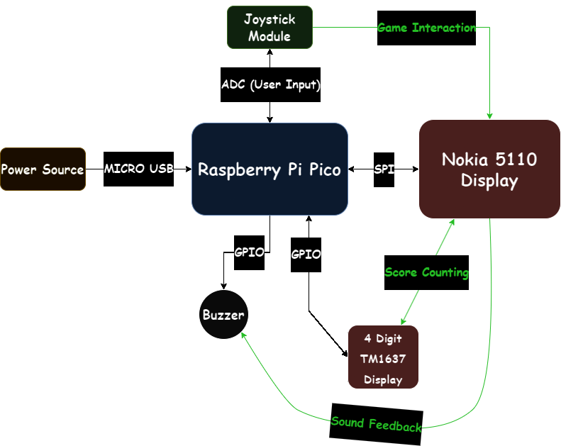
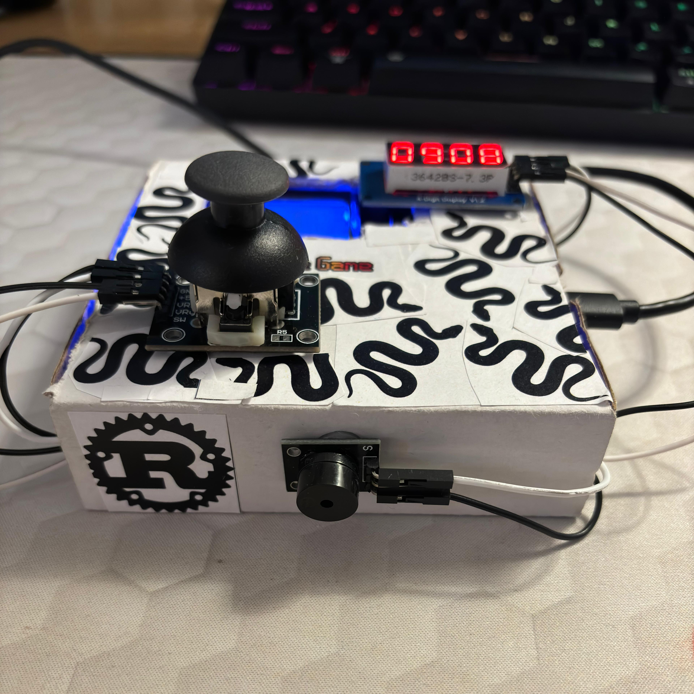

# Pico Snake Game
A game in rust that resembles the classic Snake Game from the Nokia 5110 phones era.

:::info 

**Author**: Mihai-Septimiu Tigaeru \
**GitHub Project Link**: https://github.com/UPB-FILS-MA/project-septimium

:::

## Description

This projects resembles the classic Snake Game from the old Nokia phones, having the same rules and mechanics. You control the Snake using a 2-axis joystick. Your score is updated live on a 4 digit display, that goes until 9999. For every interaction with "food" or walls, there is a buzzer which will play a sound. If you hit yourself or a wall, it's game over and you have to start again. The game itself is displayed on an actual Nokia 5110 LCD display. Good luck and enjoy!

## Motivation

I've chosen this project mainly because I've always wanted to create a fully functional game from zero, including hardware and I've always liked the idea of retro-themed stuff. Also, by looking on the internet and finding out that there's actual Nokia displays that can be easily used with microcontrollers I've instantly thought about one of the most popular Nokia games, Snake, and how cool it would be to recreate it using Rust.

## Architecture 

## Log

### Week 6 - 12 May

- Created the documentation of the project
- Added KiCAD Schematic
- Added 3 new libraries

### Week 13 - 19 May

- Modified KiCAD Schematic
- Modified a library
- Managed to configure all the components of the project in Rust
- Finished Hardware
- Designed the aspect of the project

### Week 20 - 26 May

TBD 

## Hardware

- **Joystick Module** is used for controlling the snake (interacting with the game) and it's connected to ADC pins such that the analog voltage is converted to digital values.
- **Passive Buzzer** is used for *beeping* in various situations (sound feedback from the game).
- **Nokia 5110 Display** is used for displaying the game itself.
- **TM1637 Module** is used for keeping track of the score while playing.
- **Raspberry Pi Pico H** is used as the main component (microcontroller) responsible for processing input data.
- **Breadboard** is used for connecting every pin of the hardware components.

### Schematics

### Bill of Materials

| Device | Usage | Price |
|--------|--------|-------|
[Rapspberry Pi Pico H](https://www.raspberrypi.com/documentation/microcontrollers/raspberry-pi-pico.html) | The microcontroller | [40 RON](https://www.bitmi.ro/placi-de-dezvoltare/placa-de-dezvoltare-raspberry-pi-pico-h-rp2040-264kb-ram-10848.html) |
| [2-axis (XY) Joystick Module](https://cse.unl.edu/~jfalkinburg/cse_courses/2024/336/JOYSTICK_MODULE.pdf) | Game Interactions | [6 RON](https://www.bitmi.ro/module-electronice/modul-joystick-cu-2-axe-x-y-10454.html) |
| [Breadboard 400](https://docs.sunfounder.com/projects/sf-components/en/latest/component_breadboard.html) | Hardware Pins Connections | [9 RON](https://www.bitmi.ro/electronica/breadboard-400-puncte-pentru-montaje-electronice-rapide-10633.html) |
| [Pasive Buzzer Module](https://www.thegeekpub.com/wiki/sensor-wiki-ky-006-passive-piezo-buzzer-module/) | Sounds | [4 RON](https://www.bitmi.ro/module-electronice/modul-buzzer-pasiv-ky-006-10678.html) |
| [LCD Nokia 5110 Display 84x48](https://mecrisp-stellaris-folkdoc.sourceforge.io/nokia-5110.html) | Game Displaying | [24 RON](https://cleste.ro/ecran-nokia-5110-84x48.html) |
| [LED Display Module with Serial Interface (TM1637)](https://robojax.com/learn/arduino/robojax-TM1637_display_manual.pdf) | Score Counting | [11 RON](https://www.sigmanortec.ro/modul-display-led-cu-interfata-seriala-tm1637) |
| [Dupont Wires M-M](https://www.farnell.com/datasheets/3178883.pdf) | Connections | [7 RON](https://www.bitmi.ro/componente-electronice/40-x-fire-dupont-tata-tata-20cm-10511.html) |
| [Dupont Wires F-F](https://www.farnell.com/datasheets/3178883.pdf) | Connections | [6 RON](https://www.bitmi.ro/componente-electronice/40-x-fire-dupont-mama-mama-20cm-10509.html) |
| [Dupont Wires M-F](https://www.farnell.com/datasheets/3178883.pdf) | Connections | [6 RON](https://www.bitmi.ro/componente-electronice/40-x-fire-dupont-tata-mama-20cm-10512.html) |
| [Jumper Wires Kit](https://www.farnell.com/datasheets/3178883.pdf) | Connections | [9 RON](https://ardushop.ro/ro/home/1374-set-jumper-breadboard-140.html) |
| [Micro USB Cable](https://www.techtarget.com/whatis/definition/micro-USB) | Power | [8 RON](https://ardushop.ro/ro/electronica/397-cablu-usb-micro.html?search_query=micro+usb&results=383) |

## Software

| Library | Description | Usage |
|---------|-------------|-------|
| [embassy](https://github.com/embassy-rs/embassy) | Rust framework for embedded programming |  Used for writing correct, safe and asynchronous code, particularly targeted at embedded systems |
| [pcd8544](https://crates.io/crates/pcd8544) | Rust crate for PCD8544 displays | Used for initiliazing and writing on the PCD8544 display |
| [tm1637-embedded-hal](https://crates.io/crates/tm1637-embedded-hal) | Rust crate for TM1637 microcontroller | Used for controlling the TM1637 module |
| TBD | TBD | TBD |
| TBD | TBD | TBD |
| TBD | TBD | TBD |

## Links

1. [Arduino Snake Game Project](https://www.youtube.com/watch?v=nXdEqbL_6jg)
2. [Nokia5110 LCD interfacing with Raspberry Pi Pico using SPI](https://www.youtube.com/watch?app=desktop&v=Ll23kHzQrtA)
3. [Snake Game with Rust](https://www.youtube.com/watch?v=AYfehnFklkA)
