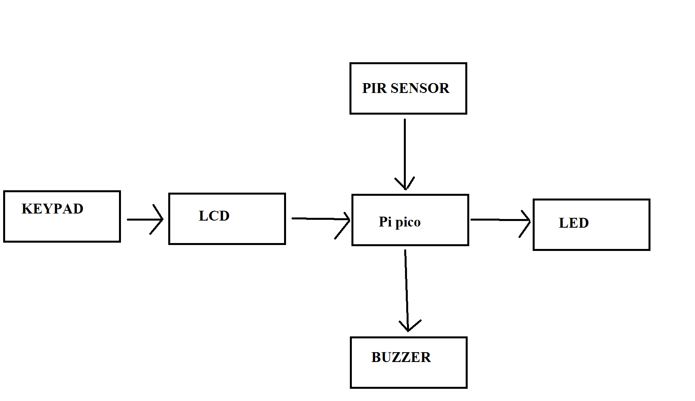
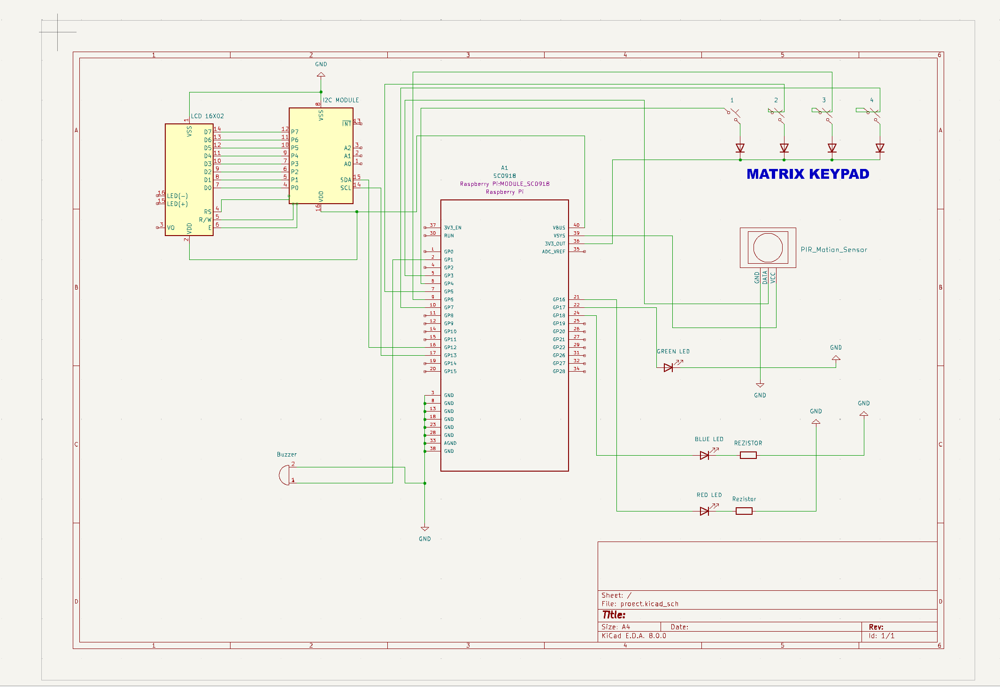
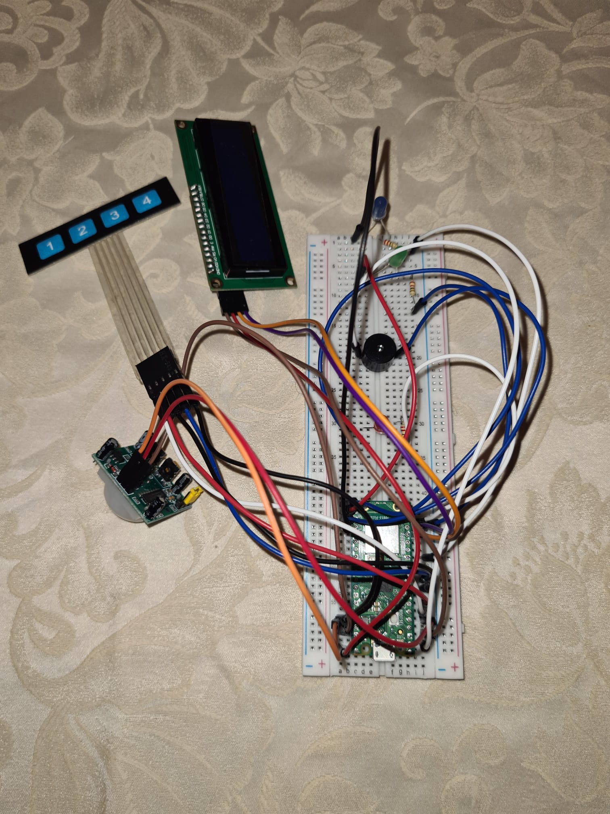
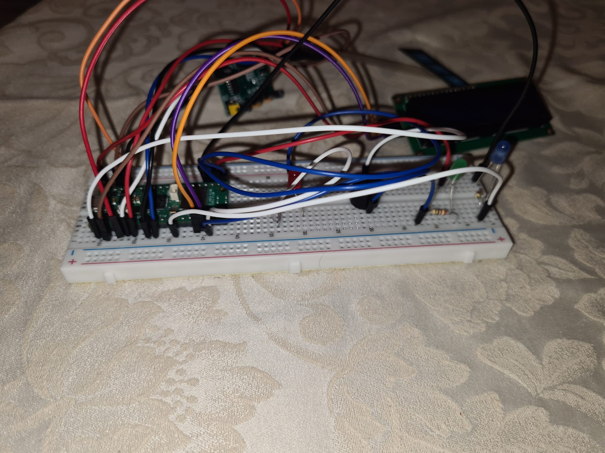
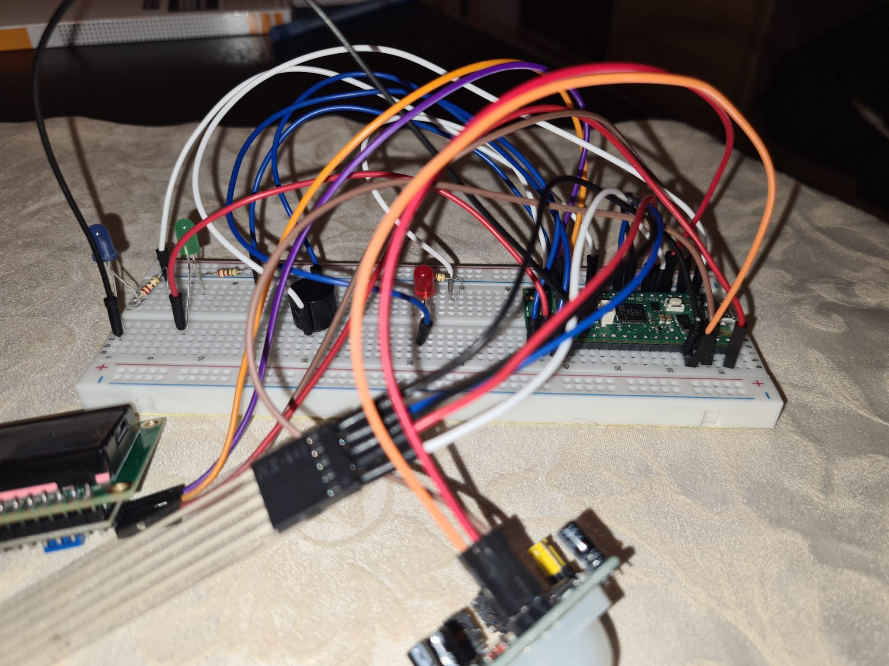
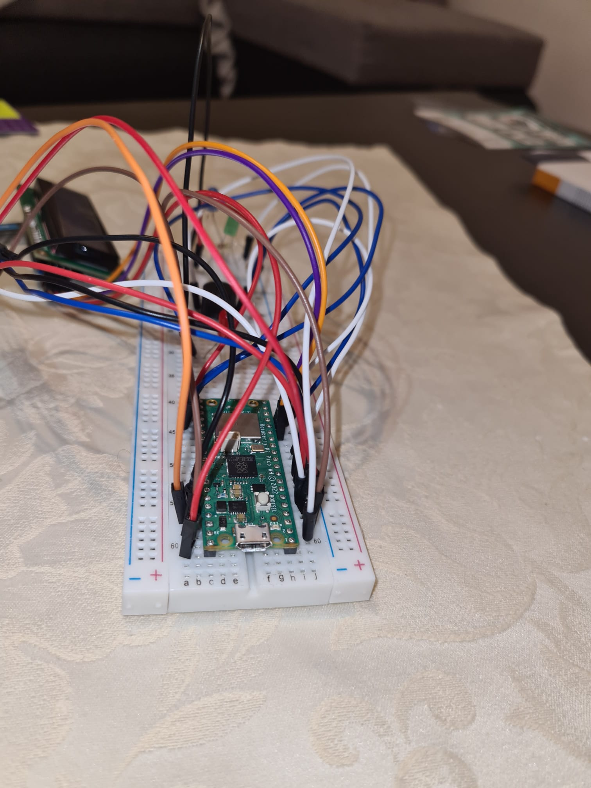

# SmartGuard: Raspberry Pi Pico W Burglar Alarm System

 Raspberry Pi Pico W-powered Smart Burglar Alarm System with Multi-Sensor Detection.
 
:::info 

**Author**: RATA MIRCEA-ANDREI \
**GitHub Project Link**: https://github.com/UPB-FILS-MA/project-MirceaAndrei/tree/main

:::

## Description

This project provides an opportunity to develop a smart alarm system tailored to modern security requirements. It offers a practical and efficient solution to detect intruders with advanced technology. Its compact, user-friendly design allows for seamless implementation in a wide range of environments, providing enhanced safety and peace of mind. Moreover,it has user-friendly interface where you can set custom security keys
 
# How it works:

For this project, we have developed a comprehensive alarm system utilizing a range of hardware components to enhance security and convenience. At the core of this system is the Raspberry Pi Pico W, which serves as the central controller and processor.

The system is equipped with a Passive Infrared (PIR) sensor, which is designed to detect motion in its vicinity. When the PIR sensor registers movement, it triggers an immediate response from the system: LEDs and a buzzer are activated, alerting those nearby of potential activity. 

Additionally, the system includes a keypad and an LCD screen. Once motion is detected and the alarm is activated, the person present must input the correct password into the keypad to deactivate the alarm. The password prompt is displayed on the LCD screen for easy reference, ensuring a seamless user experience and an added layer of security.Once the whole project starts, it displays on the LCD screen some information for configuration of the alarm. It takes like 8 seconds to initialize, then it will show you what to do to set this system. Basically once started, the user can self-input a custom password, and when motion is detected, it guides you to enter the password and disarm the alarm for a few seconds, enough time if you are the owner and not the intruder :), then it starts again. Additionally, a game of lights is starting when it checks if the password is correct. If the password is correct, after the game of lights, the green LED will remain on until it finish writing the messages on the LCD. After, the alarm is again initialized. It also has another function, if you enter the wrong password 3 times, you will need to wait an additional 5 seconds before entering it again. Also, if the password is wrong, after the game of lights, the red LED will remain on.

This combination of hardware and functionality results in a sophisticated yet user-friendly alarm system that offers reliable security for a variety of settings. It provides users with real-time alerts and control over the system, making it a valuable asset for safeguarding properties and ensuring peace of mind.


## Motivation

The motivation behind this project stems from a desire to enhance home and property security by leveraging modern technology. Traditional alarm systems can be costly and complex to install, often requiring professional services. In contrast, this project offers an opportunity to create an affordable and customizable smart alarm system using a Raspberry Pi Pico W and a range of hardware components.

## Architecture 



## Log

<!-- write every week your progress here -->

### 8-12.04
    I choose the concept and the main ideas for this project.
### 15-19.04
    I found all the hardware parts and everything that i need and i proceed a order.

### 26.04-3.05
    I already learned how it should work, and I am still at the hardware part, at all the connection and everything. I try to make them work
    
### 6.05-10.05
    I manage to do all the hardware part and finished soldering all the parts.
    
### 13.05-17.05
    I am  the software part,with small steps trying to learn how to do it.
    I'm still trying to improve as mush as I can, and find new ideas to implement for this project.

## Hardware

The hardware includes a Raspberry Pi Pico W for control, a PIR sensor for motion detection, LEDs for visual alerts, a buzzer for audio alerts, an LCD screen for display, and a keypad for user input and password authentication.
- **Raspberry Pi Pico W** is the microcontroller,the brain of this project.
- **Passive Infrared (PIR) sensor**  is used to detect movement.
- **LEDs** are used to provide visual alerts when motion is detected.
- **Passive Buzzer** is used for making sound when the alarm is triggered.
- **LCD with I2C MODULE** is used for displaying the information on lcd.
- **Matrix keypad** allows users to input a password for authentication and disarm the alarm system.
- **Breadboard** is used for connecting every pin of the hardware components.

### Schematics
**For the KiCad I connected the hardware as following :**
  <p>
<em><em class="u">LCD i2c</em></em>: 
</p>
<pre class="code">      
      VCC to pin VBUS
      GND to pin GND
      SDA to pin GP12
      SCL to pin GP13</pre>

<p>
<em><em class="u">PIR MOTION SENSOR</em></em>: 
</p>
<pre class="code">       
       VCC to pin  VSYS
       GND to pin GND
       OUT to pin GP3 
                </pre>

<p>
<em><em class="u">KEYPAD</em></em>: 
</p>
<pre class="code">      
      ROW to pin 3V3_OUT
      COL1 to pin GP4
      COL2 to pin GP5
      COL3 to pin GP6
      COL4 to pin GP7 </pre>

<p>
<em><em class="u">BUZZER</em></em>: 
</p>
<pre class="code">      
      POSITIVE to pin GP1
      NEGATIVE to GND   
      </pre>

<p>
<em><em class="u">LEDS</em></em>: 
</p>
<pre class="code">      
      RED to pin GP16
      GREEN to pin GP17
      BLUE to pin GP18</pre>




# Here are also a few pictures of the actual project :








### Bill of Materials

<!-- Fill out this table with all the hardware components that you might need.

The format is 
```
| [Device](link://to/device) | This is used ... | [price](link://to/store) |

```

-->

| Device | Usage | Price |
|--------|--------|-------|
| [Rapspberry Pi Pico W](https://www.raspberrypi.com/documentation/microcontrollers/raspberry-pi-pico.html) | The microcontroller | [35 RON](https://www.optimusdigital.ro/en/raspberry-pi-boards/12394-raspberry-pi-pico-w.html) |
| [Lcd](http://wiki.sunfounder.cc/index.php?title=LCD1602_Module) | Display | [15 RON](https://ardushop.ro/ro/electronica/36-lcd-1602.html?search_query=lcd+i2c&results=147) |
| [I2c module](https://wiki.eprolabs.com/index.php?title=I2C_LCD_Adapter_Module) | DIsplay module | [6 RON](https://cleste.ro/modul-serial-i2c-iic-pentru-lcd.html?gad_source=1&gclid=Cj0KCQjwltKxBhDMARIsAG8KnqU7LK61NSB7DHVkKL_SpEnCMU25b99QS0knvlcc8odSx-R28GBbz90aAonSEALw_wcB) |
| [Led](https://en.m.wikipedia.org/wiki/File:LED,_5mm,_green_%28en%29.svg) | Visual alert | [0.45 RON](https://ardushop.ro/ro/electronica/299-led-5mm.html?search_query=led&results=242) |
| [Buzzer](https://wiki.zb45.nl/index.php?title=File:Buzzer.jpg) | Sound | [4 RON](https://ardushop.ro/ro/electronica/194-buzzer.html?search_query=buzzer&results=16) |
| [PIR](http://wiki.sunfounder.cc/index.php?title=HC-SR501_Human_Body_Pyroelectricity_Infrared_Sensor_Module) | Sensor | [9 RON](https://ardushop.ro/ro/electronica/45-modul-pir-senzor-de-prezenta-miscare.html?search_query=PIR&results=54) |
| [Keypad](https://www.tinytronics.nl/en/switches/manual-switches/keypads/keypad-1x4-matrix) | User input| [4 RON](https://ardushop.ro/ro/home/1003-tastatura-cu-4-intrari.html?search_query=TASTATURA&results=29)|
 
## Software

| Library | Description | Usage |
|---------|-------------|-------|
|[embassy-rp](https://crates.io/crates/embassy-rp) | RP2040 Peripherals | Used for accessing the peripherals|
|[PWM](https://docs.embassy.dev/embassy-nrf/git/nrf52840/pwm/index.html)|Pulse-Width Modulation|Used to make buzzer sound louder|
| [embassy-executor](https://crates.io/crates/embassy-executor) | Executor for Rust Embedded Systems | An async/await executor designed for embedded usage|
| [GPIO](https://crates.io/crates/gpio) | GPIO  | Used for interacting with GPIO Pins of the Pi Pico |
| [lcd_lcm1602_i2c](https://crates.io/crates/lcd-lcm1602-i2c) | HITACHI HD44780 LCD | Used to initialize the lcd with i2c module |
| [ufmt_write](https://crates.io/crates/ufmt-write) | 	A collection of methods that are required / used to format a message into a stream | Used to write strings on LCD |
| [rp2040-hal](https://crates.io/crates/rp2040-hal) | A Rust Embedded-HAL impl for the rp2040 microcontroller | Used for implementation of the embedded-hal traits for the RP2040 microcontroller  |
| [embassy-usb](https://crates.io/crates/embassy-usb) | A rust library | Used for Async USB device stack for embedded devices in Rust |
| [log](https://crates.io/crates/log) | A lightweight logging facade for Rust | Used for excluding messages with a lower priority |
| TBD | TBD | TBD |
| TBD | TBD | TBD |


## Links

<!-- Add a few links that inspired you and that you think you will use for your project -->

1. [Lab 4 ](https://embedded-rust-101.wyliodrin.com/docs/lab/04)
2. [Lab 7](https://embedded-rust-101.wyliodrin.com/docs/lab/04)
3. [Lab 8](https://embedded-rust-101.wyliodrin.com/docs/lab/04)
4. [Rust tutorials ](https://www.alexdwilson.dev/learning-in-public/how-to-program-a-raspberry-pi-pico)
5. [The concept](https://electrocredible.com/raspberry-pi-pico-motion-sensor-email-micropython/)
6. TBD
...
