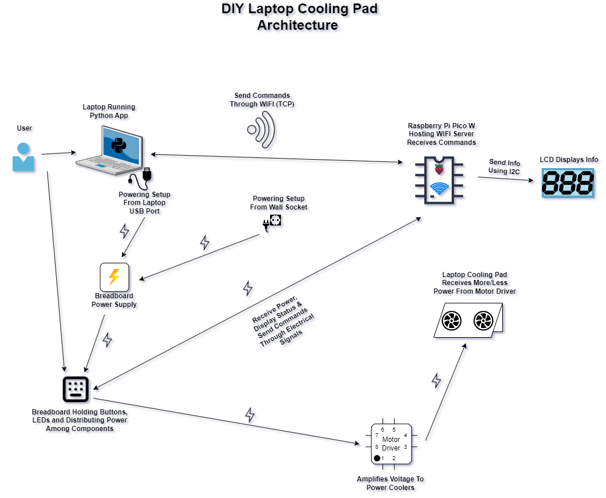

# DIY Laptop Cooling Pad
A cooling pad for laptops that can be controlled wirelessly or using buttons.

:::info

**Author**: Sakka Mohamad-Mario \
**GitHub Project Link**: https://github.com/UPB-FILS-MA/project-mmswflow-upb.git

:::

## Description

There are 2 possible ways of using it:
* Physically: The fans are controlled through a UI made up of a screen which displays info and buttons with which we increase or decrease the speed of the fans.

* Wirelessly: A user can interact with the microcontroller through a desktop app which sends commands to it through WIFI.

## Motivation

The average temperature around the globe has been on the rise for quite a while, and personally I'm very sensitive to heat, so the first thing that came to my mind was making a fan. After a while I realised that, because I use my laptop for long periods of time doing multiple things including gaming, I wanted also to cool down my laptop since its keyboard gets pretty hot sometimes when playing games, so I've moved on to this idea. I also wanted the cooling pad to be controlled using an app on my laptop through wireless connection, without necessarily having to open it, instead I could use key bindings that I set from the app and I could have the app running in the background.

## Architecture

* The application on the laptop will act as a client, which will connect to the WIFI network hosted on the RP Pico W, and it will send commands to it through TCP to ensure reliable communication between the two. This app will be written in *Python*
  using *Custom Tkinter & Socket* modules and it will be converted into an executable. The RP PICO W will come with a preset network name & password. 

* The physical UI (buttons & LCD) will be used to start the server, increase or decrease fan speed, power on or off the setup, with all necessary info being displayed on the LCD.

  

## Log

<!-- write every week your progress here -->

### Week 6 - 12 May

### Week 7 - 19 May

### Week 20 - 26 May

## Hardware

* **Raspberry Pi Pico W:** Detecting input and controlling the fans' speed

* **Breadboard:** Connecting components

* **Push Buttons with LEDs:** Controlling the speed of the fans and displaying status of the setup, such as WIFI connection status, powered on or off, increasing or decreasing speed.

* **Rigid Jumper WIres:** Connecting components to breadboard.

* **LCD 1602 I2C:** Displaying info when changing speed, powering on and establishing connection with PC.

* **Cooling Fans:** Used to cool down the laptop.

* **Motor Driver:** Providing enough current to the fans.

* **Breadboard Supply:** Powering the whole setup either through USB connection from laptop or wall socket.

### Schematics

Place your KiCAD schematics here.

### Bill of Materials

<!-- Fill out this table with all the hardware components that you might need.

The format is
```
| [Device](link://to/device) | This is used ... | [price](link://to/store) |

```

-->

| Device | Usage | Price                                                                                                                                                                                           |
|-|-|-|
| [Rapspberry Pi Pico WH](https://www.raspberrypi.com/documentation/microcontrollers/raspberry-pi-pico.html)| The Microcontroller | [1 x 56.23 RON](https://ardushop.ro/ro/home/2819-raspberry-pi-pico-wh.html?search_query=Raspberry+Pi+Pico+WH%2C+Wireless+Headers&results=1027) |
| [Data Micro USB Cable](https://static.optimusdigital.ro/31356-large_default/cablu-micro-usb-1-m-alb.jpg) | PC-Microcontroller Communication (Debugging or Flashing Program) | [1 x 3.48 RON](https://www.optimusdigital.ro/ro/cabluri-cabluri-usb/498-cablu-micro-usb-1-m-alb.html?search_query=0104210000002362&results=1) |
| [Motor Driver](https://ardushop.ro/4686-thickbox_default/l298n-punte-h-dubla-dual-h-bridge-motor-dcsteppe.jpg) | Powering Cooling Fans | [1 x 11.49 RON](https://ardushop.ro/ro/electronica/84-l298n-punte-h-dubla-dual-h-bridge-motor-dcsteppe.html?search_query=XNVELI_module-L298N&results=166) |
| [12V 80mm Cooling Fan](https://ardushop.ro/4102-thickbox_default/cooler-carcasa-80-mm.jpg) | Cooling | [2 x 10.84 RON](https://ardushop.ro/ro/home/986-cooler-carcasa-80-mm.html?search_query=ATPNWB_80mm_cooler&results=20)  |
| [1602 LCD with I2C Adaptor](https://static.optimusdigital.ro/55018-large_default/lcd-cu-interfata-i2c-si-backlight-albastru.jpg) | Physical User Interface | [1 x 16.34 RON](https://www.optimusdigital.ro/ro/optoelectronice-lcd-uri/2894-lcd-cu-interfata-i2c-si-backlight-albastru.html?search_query=LCD&results=210)  |                                                                   
| [Push Buttons with LEDs](https://ardushop.ro/836-thickbox_default/buton-mic-cu-led.jpg) | Physical User Interface | [4 x 3.19 RON](https://ardushop.ro/ro/electronica/386-buton-mic-cu-led.html?search_query=GSHRET_push-button-led-green&results=298) |
| [830 Points Breadboard](https://static.optimusdigital.ro/54847-large_default/breadboard-830-points.jpg) | Connectivity | [1 x 10.14 RON](https://ardushop.ro/ro/electronica/33-breadboard-830.html?search_query=Breadboard+830+puncte+MB-102%09&results=584) |
| [Set of Female-Male Wires](https://static.optimusdigital.ro/48492-large_default/set-fire-mama-tata-10p-30-cm.jpg) | Connectivity | [1 x 5.79 RON](https://www.optimusdigital.ro/ro/fire-fire-mufate/879-set-fire-mama-tata-10p-30-cm.html?search_query=Fire+Colorate+Mama-Tata+%2810p%2C+30+cm%29%09&results=6) |
| [Set of Male-Male Wires](https://static.optimusdigital.ro/48477-large_default/set-fire-tata-tata-10p-10-cm.jpg) | Connectivity | [1 x 2.69 RON](https://www.optimusdigital.ro/ro/fire-fire-mufate/885-set-fire-tata-tata-10p-10-cm.html?search_query=Tata-Tata&results=722) |
| [Sets of Rigid Jumper Wires](https://static.optimusdigital.ro/55063-large_default/set-de-fire-pentru-breadboard-rigide.jpg) | Connectivity | [1 x 12.49 RON](https://www.optimusdigital.ro/ro/fire-fire-nemufate/899-set-de-fire-pentru-breadboard-rigide.html?search_query=fire+rigide&results=2) |
| [Set of Resistors](https://ardushop.ro/7381-thickbox_default/set-rezistente-14w-600buc30-valori-10r-1m.jpg) | Current Modulation | [1 x 12.29 RON](https://ardushop.ro/ro/electronica/212-set-rezistente-14w-600buc30-valori-10r-1m.html?search_query=SET+rezistori+1%2F4W+600buc%2F30+valori+10R-1M%09&results=893) |
| [Breaboard Power Supply](https://static.optimusdigital.ro/50620-large_default/sursa-de-alimentare-pentru-breadboard.jpg) | Powering Circuit | [1 x 4.69 RON](https://www.optimusdigital.ro/ro/electronica-de-putere-stabilizatoare-liniare/61-sursa-de-alimentare-pentru-breadboard.html) |
| [AC-DC 9V Adaptor](https://static.optimusdigital.ro/5950-thickbox_default/alimentator-de-9-v-1-a.jpg) | Powering Circuit | [1 x 9.99 RON](https://www.optimusdigital.ro/ro/electronica-de-putere-alimentatoare-priza/264-alimentator-de-9-v-1-a.html) |
| [Cooling Pad Frame] |  Frame That Holds Fans & Laptop | [not sure] |
| **TOTAL** | - | [**186.64 RON**] |
## Software

| Library                                                                     | Description               | Usage                                           |
|-|-|-|
| [lcd1602-driver](https://github.com/eZioPan/lcd1602-driver) | Display driver for LCD1602 | Used as a display for my cooling pad |
| [heapless](https://github.com/rust-embedded/heapless) | Heapless data structures | Creating strings that will be displayed on the LCD |

## Links

<!-- Add a few links that inspired you and that you think you will use for your project -->
* [RP Pico Controlling DC Motor](https://www.tomshardware.com/how-to/dc-motors-raspberry-pi-pico)
* [WebApp Hosted on RP Pico W Used to Control Cooler Through PWM](https://www.youtube.com/watch?v=oDCNkxCHNNQ)
