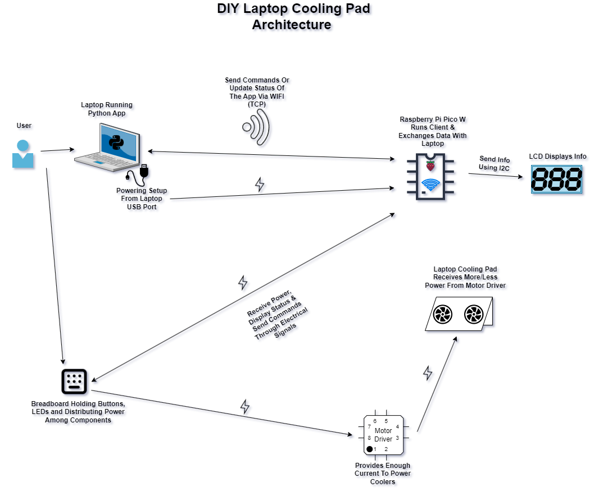
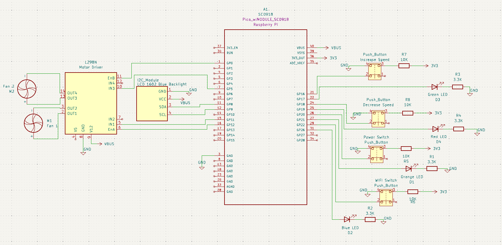
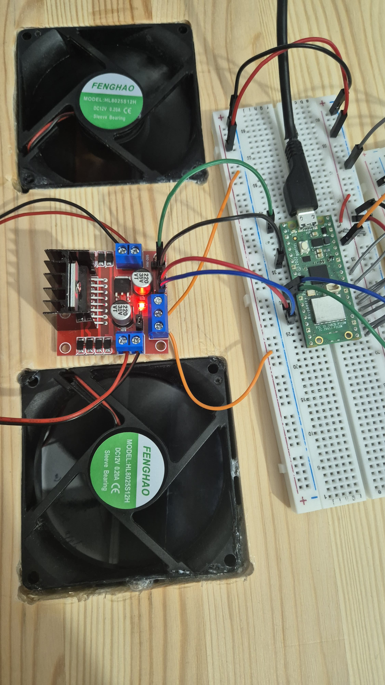
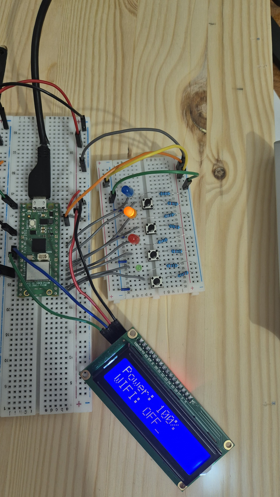

# DIY Laptop Cooling Pad
A cooling Pad for laptops that can be controlled wirelessly or using buttons.

:::info

**Author**: Sakka Mohamad-Mario \
**GitHub Project Link**: https://github.com/UPB-FILS-MA/project-mmswflow-upb.git

:::

## Description

There are 2 possible ways of using it:
* Physically: The fans are controlled through a tactile UI made up of a screen which displays info and buttons with which we increase or decrease the speed of the fans.

* Wirelessly: A user can interact with the microcontroller through a desktop app which sends commands to it through WIFI.

## Motivation

The average temperature around the globe has been on the rise for quite a while, and personally I'm very sensitive to heat, so the first thing that came to my mind was making a fan. After a while I realised that, because I use my laptop for long periods of time doing multiple things including gaming, I also wanted to cool down my laptop's since its keyboard gets pretty hot sometimes when playing games, so I've moved on to this idea. I also wanted the coolers to be controlled using an app on my laptop through wireless connection, without necessarily having to open it, instead I could use key bindings that I set from the app and I could have the app running in the background.

## Architecture

* The application on the laptop will act as a server, the RP Pico W will establish a connection and it will exchange data with it via TCP to ensure reliable communication between the two. This app will be written in *Python* using the *TTKBootstrap & Socket* modules and it will be converted into an executable. The RP PICO W will connect to a network with preset name & password which must be hosted by the laptop. The
program running on the RP Pico W will be written using the *embassy-rs* framework.

* The physical UI (buttons & LCD) will be used to establish the connection, increase or decrease fan speed, power on or off the setup, with all necessary info being displayed on the LCD.

  

## Log

<!-- write every week your progress here -->

### Week 6 - 12 May

I made a laptop pad out of a wood planck, cut 2 holes for the fans and glued the fans into it. I also tested some code that made communication between the RP Pico W & my laptop possible through TCP, and I tested the motor driver.

### Week 7 - 19 May

I assembled a mini remote with 4 buttons and LEDs that respond to the tactile input or show the status of the circuit, then
I connected the step-up voltage to the motor driver and the fans to the motor driver. I wrote the firmware that handles the tactile input and implemented a debouncer for the push buttons, I also wrote the part of the firmware which displays text on the LCD & controls the motors using PWM. The TCP connection part was partially done, I managed to set a hostname for the pico so it's easier to find it on whatever network it will connect to and I created the UI for the Python app on the laptop to control the fans through WIFI.

### Week 20 - 26 May

## Hardware

* **Raspberry Pi Pico W:** Detecting input and controlling the fans' speed.

* **Breadboard:** Connecting components.

* **Push Buttons** Controlling the speed of the fans.

* **LEDs:** Displaying the status of the cooling pad such as WIFI connection status, powered on or off, increasing or decreasing speed.

* **Rigid Jumper WIres:** Connecting components to breadboard.

* **LCD 1602 I2C:** Displaying info when changing speed, powering on and establishing connection with PC.

* **Cooling Fans:** Used to cool down the laptop.

* **Motor Driver:** Providing enough current to the fans.

### Schematics

* **The KiCAD schematic:**



* **In Reality:**




### Bill of Materials

<!-- Fill out this table with all the hardware components that you might need.

The format is
```
| [Device](link://to/device) | This is used ... | [price](link://to/store) |

```

-->

| Device | Usage | Price                                                                                                                                                                                           |
|-|-|-|
| [Rapspberry Pi Pico WH](https://www.raspberrypi.com/documentation/microcontrollers/raspberry-pi-pico.html)| The Microcontroller | [1 x 56.23 RON](https://ardushop.ro/ro/home/2819-raspberry-pi-pico-wh.html?search_query=Raspberry+Pi+Pico+WH%2C+Wireless+Headers&results=1027) |
| [Data Micro USB Cable](https://static.optimusdigital.ro/31356-large_default/cablu-micro-usb-1-m-alb.jpg) | PC-Microcontroller Communication (Debugging or Flashing Program) | [1 x 3.48 RON](https://www.optimusdigital.ro/ro/cabluri-cabluri-usb/498-cablu-micro-usb-1-m-alb.html?search_query=0104210000002362&results=1) |
| [Motor Driver](https://ardushop.ro/4686-thickbox_default/l298n-punte-h-dubla-dual-h-bridge-motor-dcsteppe.jpg) | Powering Cooling Fans | [1 x 11.49 RON](https://ardushop.ro/ro/electronica/84-l298n-punte-h-dubla-dual-h-bridge-motor-dcsteppe.html?search_query=XNVELI_module-L298N&results=166) |
| [12V 80mm Cooling Fan](https://ardushop.ro/4102-thickbox_default/cooler-carcasa-80-mm.jpg) | Cooling | [2 x 10.84 RON](https://ardushop.ro/ro/home/986-cooler-carcasa-80-mm.html?search_query=ATPNWB_80mm_cooler&results=20)  |
| [1602 LCD with I2C Adaptor](https://static.optimusdigital.ro/55018-large_default/lcd-cu-interfata-i2c-si-backlight-albastru.jpg) | Physical User Interface | [1 x 16.34 RON](https://www.optimusdigital.ro/ro/optoelectronice-lcd-uri/2894-lcd-cu-interfata-i2c-si-backlight-albastru.html?search_query=LCD&results=210)  |                                                                   
| [6x6x6 Push Buttons](https://static.optimusdigital.ro/7679-large_default/buton-6x6x6.jpg) | Physical User Interface | [4 x 0.36 RON](https://www.optimusdigital.ro/ro/butoane-i-comutatoare/1119-buton-6x6x6.html?search_query=buton&results=222) |
| [5mm LEDs](https://ardushop.ro/605-thickbox_default/led-5mm.jpg) | Physical User Interface | [4 x 0.45 RON](https://ardushop.ro/ro/electronica/299-led-5mm.html?search_query=GIISED_LED5_red&results=286#/10-culoare-rou) |
| [830 Points Breadboard](https://static.optimusdigital.ro/54847-large_default/breadboard-830-points.jpg) | Connectivity | [1 x 10.14 RON](https://ardushop.ro/ro/electronica/33-breadboard-830.html?search_query=Breadboard+830+puncte+MB-102%09&results=584) |
| [400 Points Breadboard](https://static.optimusdigital.ro/10048-large_default/breadboard-400-points.jpg) | Tactile Interface | [1 x 4.56 RON](https://www.optimusdigital.ro/ro/prototipare-breadboard-uri/44-breadboard-400-points.html?search_query=0104110000000156&results=1)|
| [Set of Female-Male Wires](https://static.optimusdigital.ro/48492-large_default/set-fire-mama-tata-10p-30-cm.jpg) | Connectivity | [1 x 5.79 RON](https://www.optimusdigital.ro/ro/fire-fire-mufate/879-set-fire-mama-tata-10p-30-cm.html?search_query=Fire+Colorate+Mama-Tata+%2810p%2C+30+cm%29%09&results=6) |
| [Set of Male-Male Wires](https://static.optimusdigital.ro/48477-large_default/set-fire-tata-tata-10p-10-cm.jpg) | Connectivity | [1 x 2.69 RON](https://www.optimusdigital.ro/ro/fire-fire-mufate/885-set-fire-tata-tata-10p-10-cm.html?search_query=Tata-Tata&results=722) |
| [Set of Rigid Jumper Wires](https://static.optimusdigital.ro/55063-large_default/set-de-fire-pentru-breadboard-rigide.jpg) | Connectivity | [1 x 12.49 RON](https://www.optimusdigital.ro/ro/fire-fire-nemufate/899-set-de-fire-pentru-breadboard-rigide.html?search_query=fire+rigide&results=2) |
| [Set of Resistors](https://ardushop.ro/7381-thickbox_default/set-rezistente-14w-600buc30-valori-10r-1m.jpg) | Current Modulation | [1 x 12.29 RON](https://ardushop.ro/ro/electronica/212-set-rezistente-14w-600buc30-valori-10r-1m.html?search_query=SET+rezistori+1%2F4W+600buc%2F30+valori+10R-1M%09&results=893) |
| [DIY Cooling Pad Frame](coolingpad.jpg) |  Frame That Holds Fans & Laptop | [50 RON] |
| **TOTAL** | - | [**210.42 RON**] |
## Software

| Library                                                                     | Description               | Usage                                           |
|-|-|-|
| [lcd1602-driver](https://github.com/eZioPan/lcd1602-driver) | Display driver for LCD1602 | Used to write strings to LCD display |
| [embassy-time](https://docs.embassy.dev/embassy-executor/git/std/index.html) | Time management library | Delays & debouncing between button pressings |
| [embassy-rp](https://docs.embassy.dev/embassy-rp/git/rp2040/index.html) | Accessing peripherals | Interacting with peripherals (pins) |
| [embassy-executor](https://docs.embassy.dev/embassy-executor/git/std/index.html)| An async/await executor designed for embedded usage | Running multiple tasks simultaneously |
| [log](https://docs.embassy.dev/embassy-usb-logger/git/default/index.html) | Logging interface | Logging info or warning messages |
| [embassy-usb-logger](https://docs.embassy.dev/embassy-usb-logger/git/default/index.html) | USB implementation of the log crate | Logging info or warning messages over USB |
| [embassy-pwm](https://docs.embassy.dev/embassy-nrf/git/nrf52840/pwm/index.html) | PWM driver for embassy | Controlling rotation speed of coolers |
| [embassy-net](https://github.com/embassy-rs/embassy/tree/main/embassy-net) | Networking functionalities for embassy | Creating TCP connections with laptop |
| [embedded-io-async](https://github.com/rust-embedded/embedded-hal/tree/master/embedded-io-async) | Async IO traits for embedded systems | Async writing to buffers |
| [embassy_futures](https://github.com/embassy-rs/embassy/tree/main/embassy-futures) | No-std compatible futures | Event handling such as button presses or data received through wifi | 
| [embassy_sync](https://github.com/embassy-rs/embassy/tree/main/embassy-sync) | Synchronization data structures with async support | Creating MPMC channels for event handling |
| [static_cell](https://github.com/embassy-rs/static-cell) | Statically allocated, initialized at runtime cell | Static variables intialized at runtime|
| [cyw43_pio](https://docs.embassy.dev/cyw43-pio/git/default/index.html) | no-std Rust driver for cyw43 WIFI chip on RP Pico W| Connecting to WIFI network hosted by Laptop |
| [heapless](https://github.com/rust-embedded/heapless) | Heapless data structures | Creating strings that will be displayed on the LCD |
| [TTKBootstrap](https://github.com/israel-dryer/ttkbootstrap) | Python UI-library based on Tkinter & Bootstrap CSS | Building the UI of the desktop app |
| [socket](https://docs.python.org/3/library/socket.html) | Low level networking interface for Python | Handling data exchanges and connections with RP Pico W |

## Links

<!-- Add a few links that inspired you and that you think you will use for your project -->
* [RP Pico Controlling DC Motor](https://www.tomshardware.com/how-to/dc-motors-raspberry-pi-pico)
* [WebApp Hosted on RP Pico W Used to Control Cooler Through PWM](https://www.youtube.com/watch?v=oDCNkxCHNNQ)
* [embassy-rs wifi server with TCP example](https://github.com/embassy-rs/embassy/blob/main/examples/rp/src/bin/wifi_tcp_server.rs)
