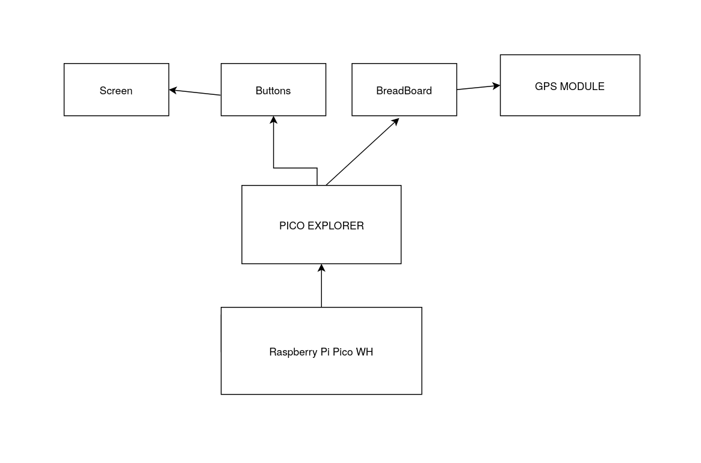
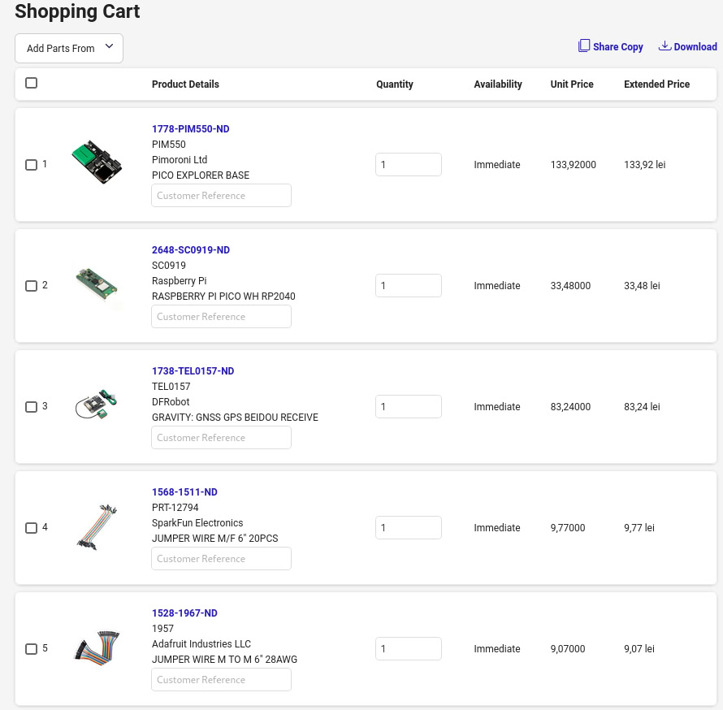
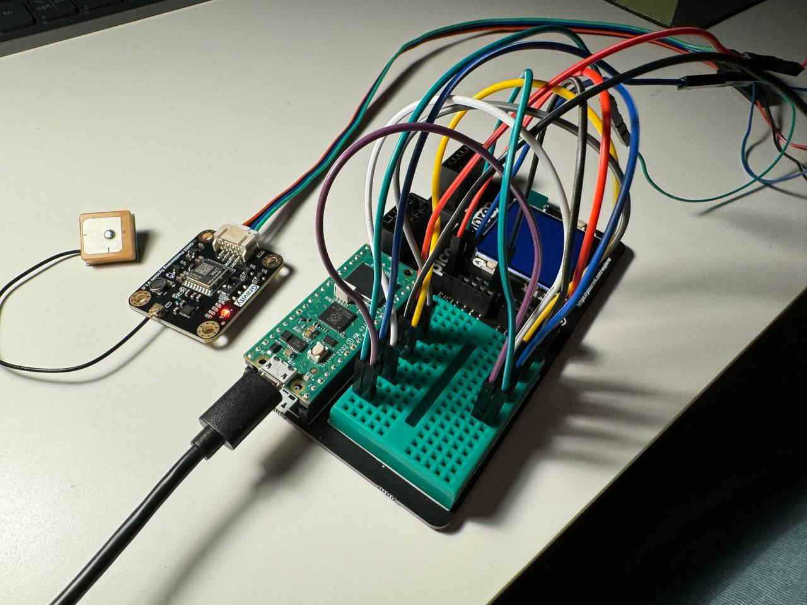
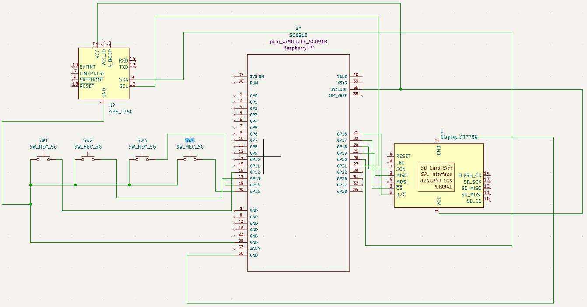

# Smart Clock
A smart clock that connects to your PC via Wi-Fi

:::info 

**Author**: PIDGORNYI Mykyta \
**GitHub Project Link**: https://github.com/InWamos/RustClock

:::

## Description

The main Idea is to create a smart clock that displays not just time and weather, but also your PC's vitals such as ram and CPU usage. It also has a GPS module to define their position and make a query to the weather channel.  

## Motivation

I have Raspberry Pi 5 server at home. I host a website and a postgresql database on it so the problem of being aware of what's going on there is of vital importance for me. Right now I have to SSH + btop into my server all the time to see the system usage but after I get this clock done, I'll be able to just look on it from time to time to see how my rpi 5 feels. 

## Architecture 

Add here the schematics with the architecture of your project. Make sure to include:
 - what are the main components (architecture components, not hardware components)
 - how they connect with each other

**Raspberry Pi Pico WH**
- Microprocessor, this to connect everything all together

**GPS MODULE**
- Tracks the geoposition
- Will be connected to Pico using the driver mention below

**Base**
- Buttons
- Screen
- Breadboard
- Connects all components together 




## Log

<!-- write every week your progress here -->

### Week 6 - 12 May
Accepted the hardware. Assembled the scheme to make sure all components work properly.

### Week 7 - 19 May
Found the proper way of connecting components by using proper drivers, 
had to connect GPS tracker by doing I2C hardcode because it had no drivers.

### Week 20 - 26 May

## Hardware

RPi Pico WH RP2040- Microcontroller
DFRobot GNSS - GPS Module 
PICO EXPLORER BASE - The base for the clock with a display, buttons and a breadboard 

This is my whole digikey order:


This is assembled real-life schematic:


### Schematics



### Bill of Materials

<!-- Fill out this table with all the hardware components that you might need.

The format is 
```
| [Device](link://to/device) | This is used ... | [price](link://to/store) |

```

-->

| Device                                                                                                                                         | Usage                                        | Price      |
|-|-|-|
| [Raspberry Pi Pico WH](https://www.digikey.ro/en/products/detail/raspberry-pi/SC0919/18713315?s=N4IgTCBcDaIMoGEAMBOAjCkBdAvkA)                 | The microcontroller                          | 33,48 RON  |
| [TEL0157](https://www.digikey.ro/en/products/detail/dfrobot/TEL0157/18069252?s=N4IgTCBcDaICoFEAyAGAjAVgOwgLoF8g)                               | GPS Module                                   | 83,24 RON  |
| [PICO EXPLORER BASE](https://www.digikey.ro/en/products/detail/pimoroni-ltd/PIM550/13981737?s=N4IgTCBcDaIAoEkCyBWFAGEBdAvkA)                   | Base for Microcontroller                     | 133,92 RON |
| [Wires MALE - FEMALE](https://www.digikey.ro/ro/products/detail/sparkfun-electronics/PRT-12794/5993859?s=N4IgTCBcDaIIwFYBsAOAtIuc0DkAiIAugL5A) | Connector from a component to the breadboard | 9,77 RON   |
| [Wires MALE - MALE](https://www.digikey.ro/ro/products/detail/adafruit-industries-llc/1957/6827090?s=N4IgTCBcDaIIwFYwA4C0cCcA2A7KgcgCIgC6AvkA) | Connector from a component to the breadboard | 9,07 RON   |


## Software

| Library                                                                     | Description               | Usage                                           |
|-|-|-|
| [st7789](https://github.com/almindor/st7789)                                | Display driver for ST7789 | Used for the display for the Pico Explorer Base |
| [GPS](https://wiki.dfrobot.com/SKU_TEL0157_Gravity_GNSS_Positioning_Module) | Drivers for GPS           | Used as a GPS driver                            |

## Links

<!-- Add a few links that inspired you and that you think you will use for your project -->

[Thermometer and Digital Clock](https://www.youtube.com/watch?v=gBofy7MMdIY)
...
