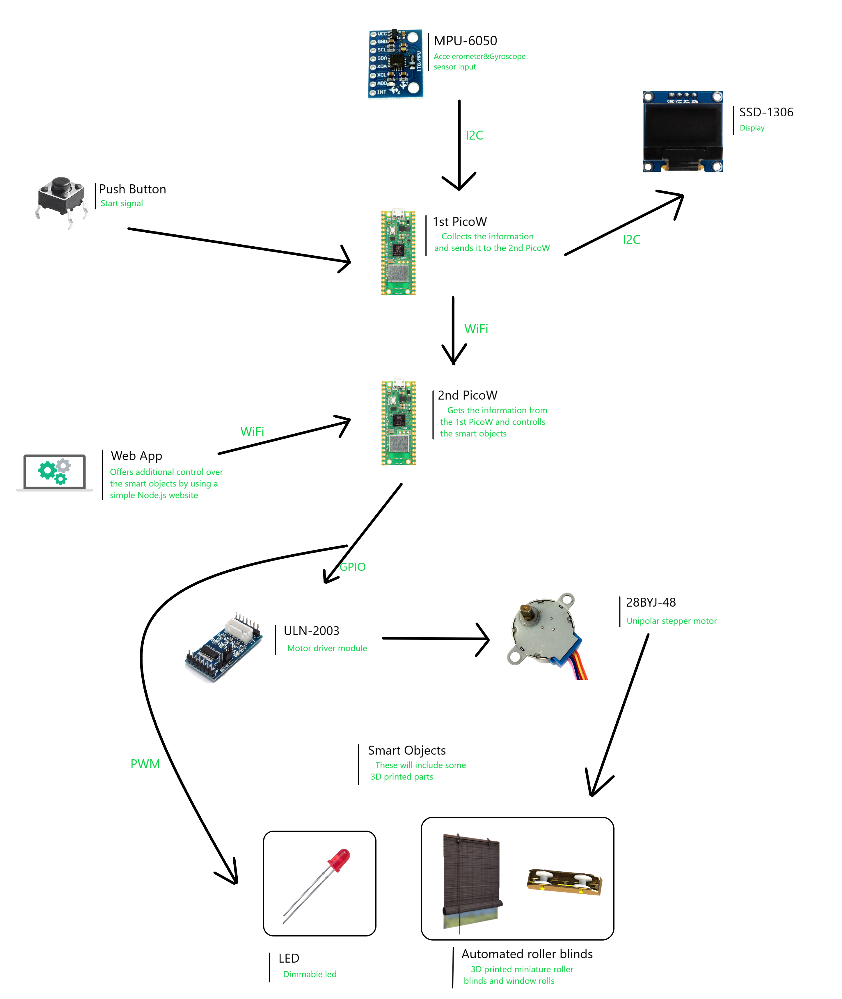
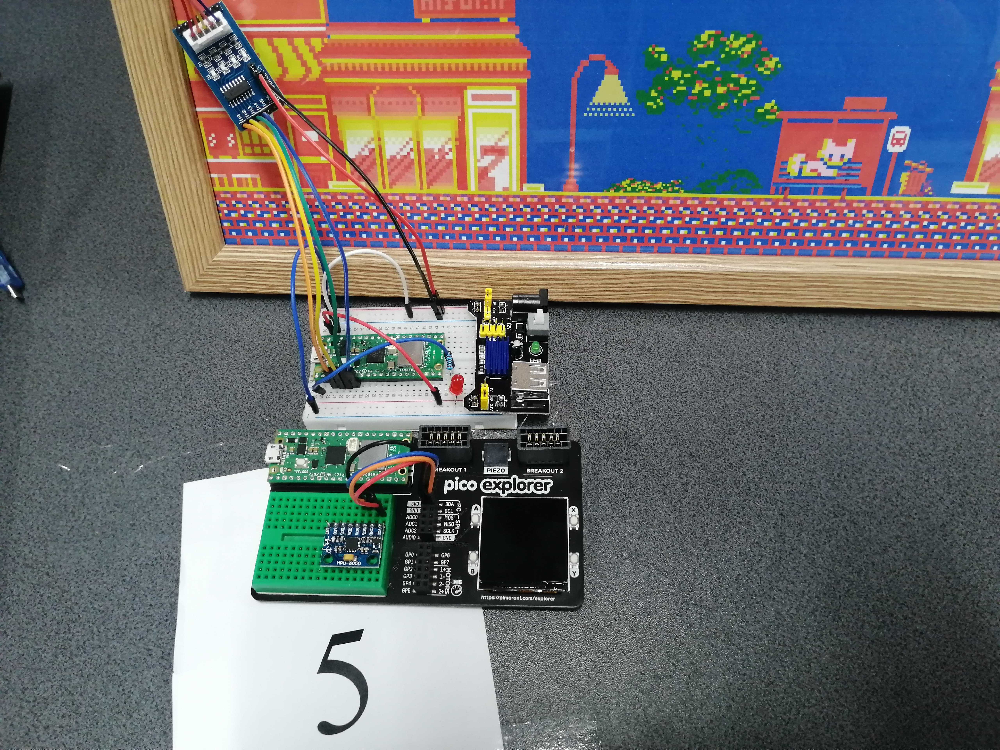
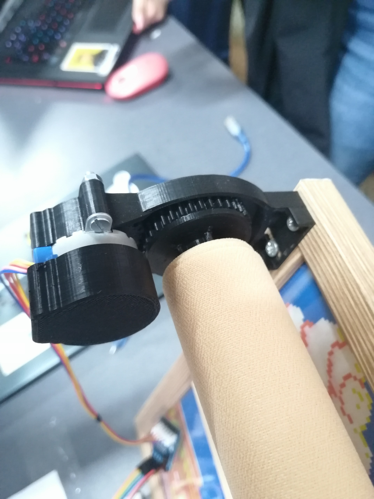
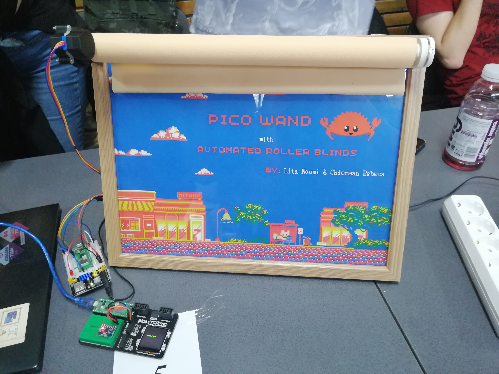

# Automated Window Blinds

Fully automated blinds that roll up and down through wifi.

:::info 

**Author**: Naomi Lita in collaboration with Rebeca Chiorean \
**GitHub Project Link**: https://github.com/UPB-FILS-MA/project-nimintz

:::

## Description

My project aims to automate a window blinds roller. A stepper motor raises and lowers the blinds. A motor driver that is attached to the pico is coupled with the stepper motor. Rebeca Chiorean's project uses another Pico to operate the roller via wifi. Together, our two projects show how a household item can be remotely operated while keeping individuals with disabilities in mind.

## Motivation

This project aims to show how a home appliance can be remotely operated using the raspberry pi picos and rust programming language. In the near future, I wish to automate all of my home's window blinds.


## Architecture 




## Log

<!-- write every week your progress here -->

### Week 6 - 12 May
I purchased the components for the project. I tried to see if the motor would rotate using thony and micropython, and happily, it worked.

### Week 7 - 19 May
I configured the project in rust. This week I fixed errors in the code.
On the other hand, I started designing the toothed disks for the 3D printer.

### Week 20 - 26 May
I 3D printed the necessary disks for the motor and assembled the scale model. Also, I fixed all the software bugs. Rebeca and I connected our picos through wifi. 


### Hardware

The pico gets a signal from another pico connected through wifi (Rebeca's project: Pico Wand). This signal is transmitted to the motor driver (ULN2003), which in turn activates the stepper motor (28BYJ-48) that rolls the blinds up or down. After the command to roll up or down is performed, an led will blink twice as a confirmation.

## Components
 - **28BYJ-48 stepper motor**: this motor is a unipolar stepper motor with 4 phases. It has the torque of about 0.34 kg per cm on its axis. This is enough to raise a lightweight model blind. 

I will use this table for the clockwise direction to create a matrix where high is 1 and low is 0: 


For counterclockwise rotation, it is the same matrix, only reversed.

 - **ULN2003 motor driver**: this module connects the motor to the pico. This allows the 4 phases of the motor to be controlled through GP02, GP03, GP04, GP05 on the pico which are set to high or low.

### Schematics


## Photos





### Bill of Materials

<!-- Fill out this table with all the hardware components that you might need.

The format is 
```
| [Device](link://to/device) | This is used ... | [price](link://to/store) |

```

-->

| Device | Usage | Price |
|--------|--------|-------|
| [Rapspberry Pi Pico WH](https://www.raspberrypi.com/documentation/microcontrollers/raspberry-pi-pico.html) | the microcontroller | [56,23 RON](https://ardushop.ro/ro/home/2819-raspberry-pi-pico-wh.html?search_query=Raspberry+Pi+Pico+WH%2C+Wireless+Headers&results=1031) |
| [Stepper Motor 28BYJ-48 5V and Driver ULN2003](https://www.hwlibre.com/en/28bj-48/)| the motor to rotate the blinds and the driver to connect it to the microcontroller | [16,97 RON](https://www.optimusdigital.ro/ro/motoare-motoare-pas-cu-pas/101-driver-uln2003-motor-pas-cu-pas-de-5-v-.html) |
| Breadboard | to place the components | [24,61 RON](https://ardushop.ro/ro/electronica/163-kit-breadboard830-65xfire-jumper-sursa-alimentare-335v.html?search_query=KIT+Breadboard830+++65xfire+jumper+++sursa+alimentare+3%2C3%2F5V&results=694) |
| Jumper wires | to conect the components | [24,61 RON](https://ardushop.ro/ro/electronica/163-kit-breadboard830-65xfire-jumper-sursa-alimentare-335v.html?search_query=KIT+Breadboard830+++65xfire+jumper+++sursa+alimentare+3%2C3%2F5V&results=694) |
| Power source | to give the motor 5V and pico 3V3 | [24,61 RON](https://ardushop.ro/ro/electronica/163-kit-breadboard830-65xfire-jumper-sursa-alimentare-335v.html?search_query=KIT+Breadboard830+++65xfire+jumper+++sursa+alimentare+3%2C3%2F5V&results=694) |
| Resistors | regulate the power supply | [12,29 RON](https://ardushop.ro/ro/electronica/212-set-rezistente-14w-600buc30-valori-10r-1m.html?search_query=SET+rezistori+&results=429) |
| Red LED | blink | [0,69 RON](https://www.optimusdigital.ro/ro/optoelectronice-led-uri/696-led-rou-de-3-mm-cu-lentile-difuze.html?search_query=led&results=819) |
| 3D printed toothed disks | connect the motor to the blinds |
| 9V adaptor | power supply |


## Software

I only included those specific for this project.

| Library | Description | Usage |
|---------|-------------|-------|
| [uln2003](https://github.com/MnlPhlp/uln2003) | 28BYJ-48 stepper motor with ULN2003 driver | Used for controlling the motor with rust |
| [cyw43](https://github.com/embassy-rs/embassy/tree/main/cyw43) | Rust driver for the CYW43439 wifi chip | Used for the WiFi implementation|
| [cyw43-pio](https://github.com/embassy-rs/embassy/tree/main/cyw43-pio) | Driver for the nonstandard half-duplex SPI used in the PicoW | Used for the WiFi implementation|


## Links

<!-- Add a few links that inspired you and that you think you will use for your project -->

1. [3D printed and fully automated Roller Blind Motor](https://imgur.com/a/xuQjH3z)
2. [Pico Project: Automated window blinds that open at sunrise and close at sunset](https://www.reddit.com/r/raspberrypipico/comments/wbdsz1/pico_project_automated_window_blinds_that_open_at/)
3. [28BYJ-48 Stepper Motor with Raspberry PI Pico](https://www.youtube.com/watch?v=VM3S9CiyPzY&t=2s)
4. [28BYJ-48 Stepper Motor Description](https://www.hwlibre.com/en/28bj-48/)
5. [3D printed toothed disks](https://www.instructables.com/DIY-Motorized-WiFi-Roller-Blind-ESP8266-Blynk/)