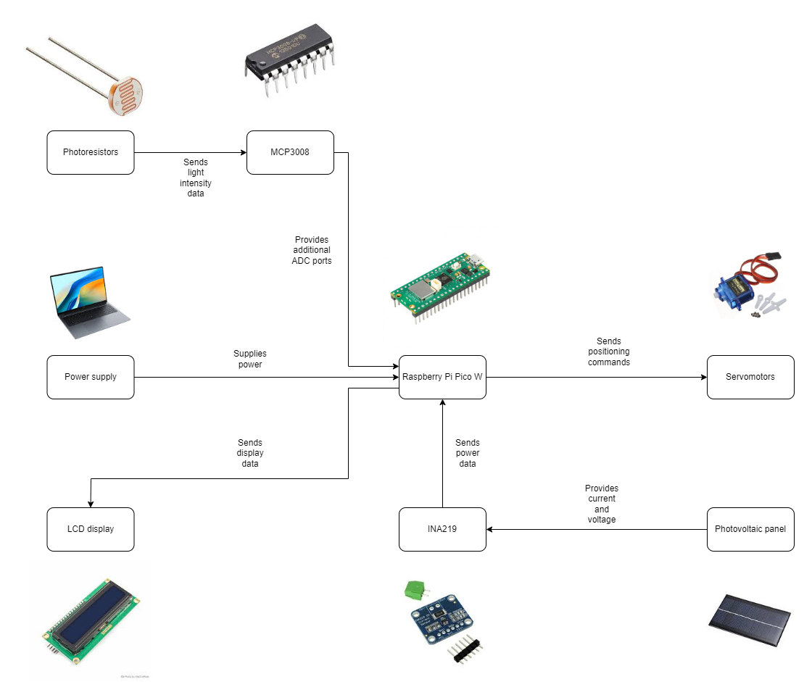

# RustFlower

A smart solar tracker that moves a photovoltaic panel towards light, mimicking a sunflower's natural inclination to follow the sun.

:::info 

**Author**: Baccela Radu-Costin \
**GitHub Project Link**: https://github.com/UPB-FILS-MA/project-RaduRadel

:::

## Description

The RustFlower project is designed to develop a solar tracker system that dynamically aligns a solar panel towards the brightest light source to maximize energy absorption. Using a set of photoresistors, the system detects light intensity from various angles and adjusts the panel's orientation accordingly. Additionally, the project incorporates an LCD display to provide real-time information on the amount of energy the solar panel produces. This functionality not only optimizes the energy efficiency of the solar panel but also serves as an educational tool to demonstrate the principles of photovoltaic energy generation and automated mechanical alignment.

## Motivation

I chose the solar tracker project after reviewing a variety of engaging projects from previous years. This project stood out to me not only because of its intrinsic interest but also because it presents a well-balanced challenge involving both hardware construction and software development.

## Architecture 

The architecture of the RustFlower consists of the following main components:

- **Control Unit**:
  - **Function**: Processes input from the sensing unit to determine the optimal positioning of the solar panel.
  - **Components**: Includes the Raspberry Pi Pico W which runs the control algorithms.

- **Sensing Unit**:
  - **Function**: Detects the intensity and direction of sunlight.
  - **Components**: Consists of multiple photoreceptors positioned to capture light data from different angles.

- **Actuation Unit**:
  - **Function**: Executes the positioning commands from the control unit.
  - **Components**: Comprised of servomotors that adjust the angle of the solar panel based on the processed data.

- **Photovoltaic Panel**:
  - **Function**: Captures solar energy and converts it into electrical power.
  - **Components**: The panel captures solar energy, which is then measured by the INA219 sensor and displayed.

- **Display Unit**:
  - **Function**: Provides real-time feedback on the system’s performance, including the current power output.
  - **Components**: An LCD display connected to the Raspberry Pi Pico W to show calculated data.

Connectivity of the main components:

- **From Sensing to Control**: The photoreceptors are connected to the Raspberry Pi Pico W via analog inputs, where the light intensity data is converted into digital signals for processing.
- **Control to Actuation**: The Raspberry Pi Pico W sends PWM (Pulse Width Modulation) signals to the servomotors, directing the necessary adjustments in panel positioning.
- **Display of Information**: The Raspberry Pi Pico W also sends data to the LCD display, updating it in real-time with information about the energy captured and system status.

## Log

### Week 6 - 12 May

Ordered all necessary components for the project.

### Week 7 - 19 May

Uploaded files for 3D printing and received the printed parts.
Created the KiCad schematic diagram for the project.
Assembled the hardware components of the project.

### Week 20 - 26 May

## Hardware

The primary hardware foundation of the RustFlower project centers around the Raspberry Pi Pico W, a central processing unit known for its low power consumption and ability to manage multiple inputs and outputs simultaneously. Servomotors are integrated to adjust the photovoltaic panel’s orientation for optimal solar alignment, enhancing energy efficiency. Photoresistors serve as the main sensory apparatus, detecting sunlight intensity from various angles to guide the servomotors' adjustments. The MCP3008 provides additional ADC ports necessary for the project. The photovoltaic panel captures solar energy, central to demonstrating the conversion process. The INA219 current sensor measures voltage and current from the photovoltaic panel, crucial for calculating real-time power production. Finally, a small LCD display provides immediate feedback on the system’s performance, including energy generation and system status.

### Schematics

KiCad schematic of the RustFlower project:

### Bill of Materials

| Device | Usage | Price |
|--------|--------|-------|
| [Rapspberry Pi Pico WH](https://www.raspberrypi.com/documentation/microcontrollers/raspberry-pi-pico.html) | The microcontroller | [39 RON](https://www.optimusdigital.ro/ro/placi-raspberry-pi/12395-raspberry-pi-pico-wh.html?search_query=Raspberry+Pi+Pico+WH&results=24) |
| [Photovoltaic Panel](https://www.emag.ro/mini-panou-solar-6v-160ma-0-96w-ai1116/pd/DX1LWFMBM/) | Converts light into energy | [20 RON](https://www.emag.ro/mini-panou-solar-6v-160ma-0-96w-ai1116/pd/DX1LWFMBM/) |
| [Breadboard](https://www.optimusdigital.ro/ro/prototipare-breadboard-uri/8-breadboard-830-points.html?search_query=Breadboard+HQ&results=145) | Prototyping and organizing electronic circuits without soldering | [10 RON](https://www.optimusdigital.ro/ro/prototipare-breadboard-uri/8-breadboard-830-points.html?search_query=Breadboard+HQ&results=145) |
| [Photoresistors](https://www.optimusdigital.ro/ro/componente-electronice-altele/28-fotorezistor10-pcs-set.html?search_query=fotorezistor&results=23) | Detects changes in light intensity | [1.9 RON](https://www.optimusdigital.ro/ro/componente-electronice-altele/28-fotorezistor10-pcs-set.html?search_query=fotorezistor&results=23) |
| [Servomotors](https://www.optimusdigital.ro/ro/motoare-servomotoare/2261-micro-servo-motor-sg90-180.html?search_query=servomotor&results=119) | Converts electrical signals into precise movement | [12 RON](https://www.optimusdigital.ro/ro/motoare-servomotoare/2261-micro-servo-motor-sg90-180.html?search_query=servomotor&results=119) |
| [INA219 Current Sensor](https://www.optimusdigital.ro/ro/senzori/1326-senzor-de-curent-ina219-cu-interfaa-i2c.html?search_query=senzor+curent&results=352) | monitor and calculate the power output of the photovoltaic panel | [20 RON](https://www.optimusdigital.ro/ro/senzori/1326-senzor-de-curent-ina219-cu-interfaa-i2c.html?search_query=senzor+curent&results=352) |
| [LCD Display](https://www.optimusdigital.ro/ro/optoelectronice-lcd-uri/2894-lcd-cu-interfata-i2c-si-backlight-albastru.html?search_query=LCD+1602+cu+Interfata+I2C+si+Backlight+Albastru&results=2) | Displays visual information | [16 RON](https://www.optimusdigital.ro/ro/optoelectronice-lcd-uri/2894-lcd-cu-interfata-i2c-si-backlight-albastru.html?search_query=LCD+1602+cu+Interfata+I2C+si+Backlight+Albastru&results=2) |
| [Male-Male Wires](https://www.optimusdigital.ro/ro/fire-fire-mufate/884-set-fire-tata-tata-40p-10-cm.html?search_query=Fire+Colorate+Tata-Tata+%2840p%2C+10+cm%29&results=10) | Establishes electrical connections | [7 RON](https://www.optimusdigital.ro/ro/fire-fire-mufate/884-set-fire-tata-tata-40p-10-cm.html?search_query=Fire+Colorate+Tata-Tata+%2840p%2C+10+cm%29&results=10) |
| [Male-Female Wires](https://www.optimusdigital.ro/ro/fire-fire-mufate/653-fire-colorate-mama-tata-40p-10-cm.html?search_query=Fire+Colorate+Mama-Tata+%2840p%29+10+cm&results=5) | Connects components to the breadboard | [5 RON](https://www.optimusdigital.ro/ro/fire-fire-mufate/653-fire-colorate-mama-tata-40p-10-cm.html?search_query=Fire+Colorate+Mama-Tata+%2840p%29+10+cm&results=5) |
| [Female-Female Wires](https://www.optimusdigital.ro/ro/fire-fire-mufate/880-fire-colorate-mama-mama-10p-10-cm.html?search_query=Fire+Colorate+Mama-Mama+%2810p%29+10+cm&results=11) | Used for extending connections between components | [3 RON](https://www.optimusdigital.ro/ro/fire-fire-mufate/880-fire-colorate-mama-mama-10p-10-cm.html?search_query=Fire+Colorate+Mama-Mama+%2810p%29+10+cm&results=11) |
| [Resistors](https://www.optimusdigital.ro/ro/componente-electronice-rezistoare/33-rezistoare-set.html?search_query=Set+de+Rezistoare+0.25W+20+de+valori+cate+20+buc.+fiecare&results=1) | Controls current flow and voltage levels | [15 RON](https://www.optimusdigital.ro/ro/componente-electronice-rezistoare/33-rezistoare-set.html?search_query=Set+de+Rezistoare+0.25W+20+de+valori+cate+20+buc.+fiecare&results=1) |
| [MCP3008](https://ro.farnell.com/microchip/mcp3008-i-p/10bit-adc-2-7v-8ch-spi-16dip/dp/1627174) | Creates aditional ADC ports | [15 RON](https://ro.farnell.com/microchip/mcp3008-i-p/10bit-adc-2-7v-8ch-spi-16dip/dp/1627174) |

## Software

| Library | Description | Usage |
|---------|-------------|-------|
| [rp-hal](https://github.com/rp-rs/rp-hal) | Hardware Abstraction Layer for RP2040 microcontrollers. | Manages GPIO, I2C, SPI, and other peripherals on the Raspberry Pi Pico W. |
| [embedded-hal](https://github.com/rust-embedded/embedded-hal) | Hardware Abstraction Layer traits for embedded systems. | Provides abstractions for digital I/O and analog readings, crucial for interfacing with sensors and actuators. |
| [uom](https://github.com/iliekturtles/uom) | Library for safely handling units of measurement. | Ensures that all calculations involving electrical measurements (voltage, current, power) are accurate and unit-safe. |
| [cortex-m-rt](https://github.com/rust-embedded/cortex-m-rt) | Runtime for ARM Cortex-M microcontrollers. | Facilitates low-level device initialization and setup for real-time operations. |
| [INA219](https://crates.io/crates/ina219) | Library for interfacing with the INA219 sensor over I2C. | Used to measure voltage, current, and calculate power production from the photovoltaic panel. |

## Links

1. [Solar Tracker Using Arduino and Raspberry Pi 3](https://www.instructables.com/Solar-Tracker-Using-Arduino-and-Raspberry-Pi-3/)
2. [Raspberry Pi Solar Tracker on GitHub](https://github.com/polyideas/Raspberry-Pi-Solar-Tracker)
3. [DIY Solar Tracker](https://www.youtube.com/watch?v=_6QIutZfsFs&t=169s)