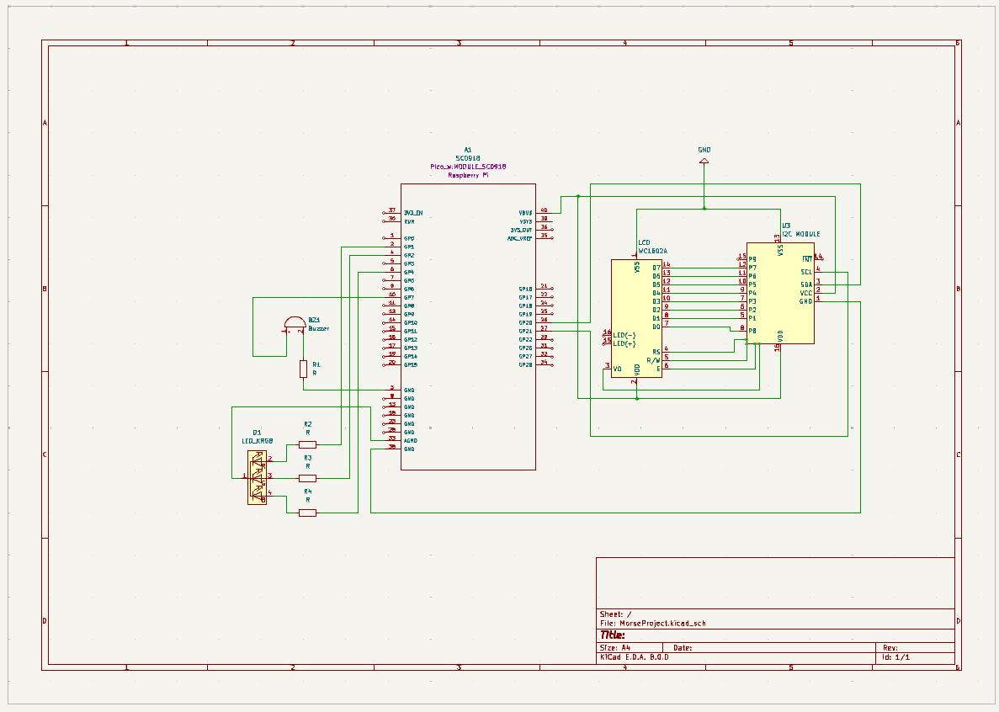

# Morse Code Translator
Interactive Text-to-Morse Translator with Multi-Sensory Feedback

:::info 

**Author**: Nițu-Săraru Ramona-Gabriela \
**GitHub Project Link**: https://github.com/UPB-FILS-MA/project-GabrielaNitu

:::

## Description

This project aims to seamlessly translate text input into Morse code, providing both visual and auditory feedback in real-time. Through the integration of an LCD screen, users can visually observe the Morse code representation of their text. Meanwhile, a buzzer emits distinct sounds for each Morse code symbol, allowing users to hear the translation simultaneously. Additionally, the RGB LED serves to provide visual feedback and indicate the status of the Morse code translation process, contributing to a more interactive and informative user experience.

## Motivation

I chose this project because of its relevance in various emergency aspects, such as search and rescue operations and communication in remote areas. Morse code remains a fundamental skill in these contexts, offering a reliable means of communication when other methods may be unavailable. Additionally, undertaking this project provides a valuable opportunity for personal learning and skill development. Mastering Morse code not only equips me with practical skills for emergency situations but also deepens my understanding of communication systems and encoding methods.

## Architecture 

1) Text Input Provided to the System: The user enters text input through a connected input device, such as a keyboard. The input text is then passed to the Morse code translator for conversion.
2) Morse Code Translator Converts Text into Morse Code Symbols: The Morse code translator receives the input text. It processes the text character by character, converting each character into its corresponding Morse code symbol. Special characters and spaces are also translated into their respective Morse code equivalents.
3) Raspberry Pi Pico Controls the LCD Display, Buzzer, and RGB LED: The Raspberry Pi Pico receives the translated Morse code symbols from the Morse code translator. It controls the operation of the connected hardware components:
 -The Raspberry Pi Pico sends commands to the LCD display to update its content with the translated Morse code symbols.
 -Depending on the Morse code symbol being transmitted, the Raspberry Pi Pico activates the buzzer to emit corresponding sound signals.
 -The Raspberry Pi Pico sends signals to the RGB LED to change colors based on the Morse code symbols being transmitted, providing visual feedback.
LCD Display Visually Represents the Morse Code Symbols:
4) The LCD display receives commands from the Raspberry Pi Pico to update its content. It visually represents the Morse code symbols in real-time, displaying them character by character as they are transmitted.
5) Buzzer Emits Sound Signals Corresponding to Each Morse Code Symbol: The buzzer receives signals from the Raspberry Pi Pico to emit sound signals. Depending on the Morse code symbol being transmitted, the buzzer generates corresponding audio tones, providing auditory feedback.
6) RGB LED Changes Colors to Provide Visual Feedback: The RGB LED receives signals from the Raspberry Pi Pico to change colors. It dynamically changes colors based on the Morse code symbols being transmitted, offering visual feedback for the translation process.

 

## Log

<!-- write every week your progress here -->

### Week 6 - 12 May

I temporarily assembled the hardware components on a breadboard for testing. I began by testing the code for each component individually to ensure they worked as expected. This step-by-step approach allowed me to troubleshoot and verify the functionality of each part before integrating them into the complete system.

### Week 7 - 19 May

I've successfully assembled all the components and created the KiCad schematics, ensuring to modify certain components to match the actual parts that I have.

### Week 20 - 26 May

## Hardware

Raspberry Pi Pico WH (Wireless+Headers) - This is the main microcontroller board for the project. It will handle the processing tasks, GPIO interfacing, and control of peripherals.

Buzzer - An audio output device. It can produce sound signals corresponding to Morse code symbols when activated by the microcontroller.

LCD 1602 with I2C interface - This is an LCD display module with a 16x2 character display. It will be used to visually display the translated Morse code text.

Breadboard Kit (830 points) + Jumper Wires + Power Supply - The breadboard provides a platform for prototyping and connecting various components without soldering. Jumper wires will be used to make connections between components. The power supply ensures stable power for the circuit.

RGB LED (Common Cathode) + 220Ω Resistors - The RGB LED can emit different colors by combining the light emitted from its red, green, and blue components. It will be used for visual feedback and status indication. The resistors are used to limit the current flowing through the LED to prevent damage.

USB Cable - Used to power the Raspberry Pi Pico and for communication with the laptop.


### Schematics



-RGB LED:
The common cathode of the RGB LED is connected to GND (pin 33).
The red cathode is connected to GP1 (pin 2) through a resistor.
The green cathode is connected to GP2 (pin 4) through a resistor.
The blue cathode is connected to GP4 (pin 6) through a resistor.

-Buzzer:
The positive terminal of the buzzer is connected to GP7 (pin 10) of the Raspberry Pi Pico.
The negative terminal of the buzzer is connected to GND (pin 3).

-LCD 1602 + I2C Module:
The SCL (Serial Clock) of the I2C module is connected to GP21 (pin 27) of the Raspberry Pi Pico.
The SDA (Serial Data) of the I2C module is connected to GP20 (pin 26) of the Raspberry Pi Pico.
The VCC of the I2C module is connected to VBUS (pin 40) for power.
The GND of the I2C module is connected to GND (pin 38).

### Bill of Materials

<!-- Fill out this table with all the hardware components that you might need.

The format is 
```
| [Device](link://to/device) | This is used ... | [price](link://to/store) |

```

-->

| Device | Usage | Price |
|--------|--------|-------|
| [Rapspberry Pi Pico WH](https://www.raspberrypi.com/documentation/microcontrollers/raspberry-pi-pico.html) | The microcontroller | [56 RON](https://ardushop.ro/ro/home/2819-raspberry-pi-pico-wh.html) |
| [KIT Breadboard830 + jumper wires](https://datasheet.octopart.com/BB830T-BusBoard-datasheet-10603672.pdf) | Main board + connectors | [25 RON](https://ardushop.ro/ro/electronica/163-kit-breadboard830-65xfire-jumper-sursa-alimentare-335v.html?search_query=kit+breadboard&results=171) |
| [LCD 1602 with I2C interface and blue backlight](https://circuitdigest.com/article/16x2-lcd-display-module-pinout-datasheet) | Display | [16 RON](https://www.optimusdigital.ro/ro/optoelectronice-lcd-uri/2894-lcd-cu-interfata-i2c-si-backlight-albastru.html?search_query=lcd+1602+cu+i2c&results=4) |
| [Active Buzzer](https://components101.com/misc/buzzer-pinout-working-datasheet) | Audio output device | [2 RON](https://www.optimusdigital.ro/ro/audio-buzzere/635-buzzer-activ-de-3-v.html?search_query=buzzer+activ&results=18) |
| [RGB LED with Common Cathode](https://www.arabsmakers.com/wp-content/uploads/2017/05/upload-5mm_RGB_led_common_cathode.pdf) | RGB LED | [3 RON](https://ardushop.ro/ro/electronica/271-led-tricolor-cu-catod-comun.html?search_query=led+rgb+cu+catod&results=1488) |
| [220Ω Resistors](https://digchip.com/datasheets/parts/datasheet/1838/CFR-25JB-220R.php) | Resistors to limit the current flowing through the LED | [4 RON](https://ardushop.ro/ro/electronica/211-rezistenta-14w-1-buc.html?search_query=rezistor&results=43) |
| [Micro USB](https://www.mouser.com/pdfdocs/HiroseZX62Datasheet24200011.pdf) | USB used to power the Raspberry Pi Pico | [3 RON](https://www.optimusdigital.ro/ro/cabluri-cabluri-usb/4576-cablu-albastru-micro-usb-50-cm.html?search_query=cablu+micro+usb&results=146) |
| ["Mother-father" jumpers](https://greenchip.com.ua/23-0-204-2.html) | Used to connect the LCD to Raspberry Pi Pico | [4 RON](https://www.optimusdigital.ro/ro/fire-fire-mufate/214-fire-colorate-mama-mama-10p.html?search_query=fire+mama+tata&results=37) |

## Software

| Library | Description | Usage |
|---------|-------------|-------|
| [embassy-rp](https://docs.embassy.dev/embassy-rp/git/rp2040/index.html)| Peripheral access library |Used for initializing the peripherals 
| [embassy-gpio](https://github.com/embassy-rs/embassy) | GPIO management | Controls GPIO pins for devices and inputs |
| [embassy-hal](https://docs.rs/embassy-hal/latest/embassy_hal/) | Hardware Abstraction Layer | Interfaces with Raspberry Pi Pico W hardware |
| [embedded-graphics](https://github.com/embedded-graphics/embedded-graphics) | 2D Graphics Library | Used for drawing to the display |
| [embassy-executor](https://docs.embassy.dev/embassy-executor/git/std/index.html)|Asynchronous executor for Rust embedded systems| Used for task scheduling and asynchronous programming|
| [embassy_time](https://github.com/embassy-rs/embassy) | For time-related functionality | Schedule tasks to run at specific times |
| [pwm](https://datasheets.raspberrypi.org/pico/raspberry-pi-pico-python-sdk.pdf)|Pulse-width modulation |Used for controlling the buzzer's sound intensity |

## Links

<!-- Add a few links that inspired you and that you think you will use for your project -->

1. [Project Idea](https://www.youtube.com/watch?v=Ra924vY9Wa4)
2. [Morse Implementation](https://www.arduino.cc/education/morse-code-project/)
...
