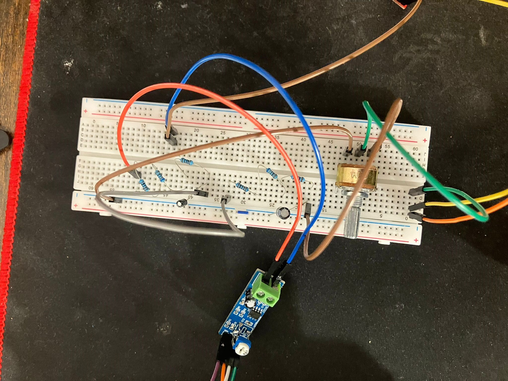

# Laser Piano
A piano made using laser diodes and laser receivers.

:::info 

**Author**: Negrila Rares \
**GitHub Project Link**: https://github.com/UPB-FILS-MA/project-NegrilaRares

:::

## Description

A piano made using laser diodes and laser receivers.

It uses a potentiometer with leds to adjust and show volume, 
3 separete switches with leds to displat change in octave 
and 7 laser diodes and laser receivers that act as the piano keys.


The plan is to take the sound data from an sd card and give it to a dac that will give the analog output to a audio jack module the is connected to a portable speaker.
It uses an LM386 audio amplifier module and 2 RC low pass filters to keep the signal clear and to a reasonable level.


## Motivation

The reason I chose this project is because I took an interest in laser diodes 
and wanted to learn file reading/writing from an external memory device 
as well as understand the conversion of digital code into analog sound.

## Architecture 

<!-- Add here the schematics with the architecture of your project. Make sure to include:
 - what are the main components (architecture components, not hardware components)
 - how they connect with each other
 -->

 

## Log

<!-- write every week your progress here -->

### Week 6 - 12 May

I encountered many problems with SD / microSD cards in embassy-rs.

While the setup initially used matched the Raspberry Pi Pico embedded-hal example from rp-rs using the embedded-sdmmc-rs crate, it did not behave as expected. The SD card itself failed to be read in any way, shape, or form. Even when manually sending CMD0, CMD1, and CMD8 commands, the response was not within the expected parameters.

In the end, I found a solution. I created a blocking::spi::SpiDevice using embassy_embedded_hal. 

For initialization, I had to give the program ownership over a phantom CS pin—a CS pin that could not be used and would no longer need to be used in the case of microSDs.


I opted for a normal SD card in the end, where I could still connect the second CS pin, given that the SD card module comes with 2 rows of pins.


### Week 7 - 19 May

After getting the SD card reader to work, I encountered my next challenge: data processing and the RAM limitations of the Raspberry Pi Pico.

Since the files themselves did not have too large of a PCM, storing them temporarily was not an issue. However, giving the data to the DAC proved to be a challenge.

For some reason, the while loop I was creating for processing did not accept any awaits or it would panic almost instantly. Additionally, giving the microcontroller too much to work on in too many iterations proved to be impossible.

To address this, I had to cut the files from 16-bit WAV files to 8-bit. This made processing much easier because now I only had to give an empty byte (with the first 4 bits setting the fast write mode of the DAC and the last 4 bits being empty data for the 12-bit interface) and the data bytes taken from the SD card. With this approach, I managed to cut the iterations from approximately 57,600 to about 28,650, and data processing to about 25%.

Despite these optimizations, the processing speed still proves to be insufficient. I see little solution to apply within my current limitations.

The biggest downside of using 8-bit files is that the sound quality took a significant plunge.

Now that I had my sound working, I needed to start working on clearing it up, as it was, at that time, an unintelligible mess.

To improve the sound quality, I switched to a portable speaker rather than the one I used before, and I attached an audio jack module to connect it. This proved to be insufficient, so I employed some RC low-pass filters to make some final touches.

While now there is still some static, it is nowhere near as bad as before. 
Despite the 8-bit sound quality, the sound can now be differentiated between keys.


### Week 20 - 26 May

To Be Continued - PCB work and final touches + packageing

## Hardware

Using LEDs as settings indicators, buttons and a stereo potentiometer for octave and volume respectively.

Seven laser diodes are placed at an angle to continuously shine on the laser receivers.

An SD card reader is used with a 16GB SD card (the card has to use the W95 FAT32 (LBA) format). 

A DAC is used for processing the data and an amplifier is used to keep the signal at a desirable level.

Two RC low-pass filters are employed, each with 1780 kΩ resistors.

One filter uses a 0.1 µF capacitor, while the other uses a 0.22 µF capacitor.

The amplifier is connected to the opposite port of the stereo potentiometer, and the speaker is connected to the output of the amplifier through an audio jack module.

Full breadboard prototype:


Laser processing:


Analog signal processing:




### Schematics

Some of the parts were either created by me as they did not have a publicly available schematic but most of the more detailed schemas for the modules used can be found in their datasheet.

In this case I couldn't find the Laser Receiver Symbol, the SD card reader module, the LM386 module and the audio jack module with the portable speaker. 


### Bill of Materials

<!-- Fill out this table with all the hardware components that you might need.

The format is 
```
| [Device](link://to/device) | This is used ... | [price](link://to/store) |

```

-->

| Device | Usage | Price |
|--------|--------|-------|
| [Rapspberry Pi Pico W](https://www.raspberrypi.com/documentation/microcontrollers/raspberry-pi-pico.html) | The microcontroller | [35 RON](https://www.optimusdigital.ro/en/raspberry-pi-boards/12394-raspberry-pi-pico-w.html) |
| 13 * Led | This is used for displaying current settings | [-] |
| 13 * 220 Ohm R | This is used to make sure the leds don't get fried | [-] |
| 10 * 10 kOhm R | This is used to crate pull up and pull down resistors | [-] |
| 3 * 1780 Ohm R | This is used for the RC low pass filters | [-] |
| 7 * 0.1 uF Capacitor | This is used to debounce the signal from the laser receivers and for one of the low pass filters | [-] |
| 1 * 0.22 uF Capacitor | This is used for one of the low pass filters | [-] |
| lots * cables | This is used to connect diffrent things on the breadboard/prototype pcb | [-] |
| 10k Stereo Potentiometer | This is used for volume input | [2 RON](https://www.optimusdigital.ro/en/potentiometers/1886-10k-stereo-potentiometer.html) |
| 2 * [Shift Register](https://www.diodes.com/assets/Datasheets/74HC595.pdf) | This is used for the output of the volume setting | [2 RON](https://www.optimusdigital.ro/en/others/2448-registru-de-deplasare-74hc595-dip-16.html) |
| Laser Diode | This is used to generate a laser | [2.5 RON](https://ardushop.ro/ro/electronica/262-modul-dioda-laser-rou-5mw.html) |
| 7 * [ISO203](https://forum.arduino.cc/t/documents-about-laser-sensor-ds18b20/1090450/5) | This is used to monitor for interference in the path of the laser | [6.5 RON](https://www.optimusdigital.ro/en/others/3289-laser-diode-receiver.html) |
| SD card reader module | This is used to read the data from an SD card | [6 RON](https://www.optimusdigital.ro/en/others/98-sd-card-reader.html?search_query=sd+card&results=530) |
| [DAC MCP4725](https://ww1.microchip.com/downloads/en/devicedoc/22039d.pdf) | This is used to transfrom the binary from the audio file data into an analog singal for the speaker | [25 RON](https://www.optimusdigital.ro/en/others/1327-dac-mcp4725-module-with-i2c-interface.html?search_query=dac&results=62) |
| Portable Speaker | This is used to receive the analog signal through an audio jack module and create an appropriate sound | [-] |
| [AMP LM386](https://www.ti.com/lit/ds/symlink/lm386.pdf) | This is used amplify the analog singal | [6.5 RON](https://ardushop.ro/ro/electronica/241-modul-amplificator-audio-lm386.html) |
| Audio Jack Module | This is used amplify the analog singal | [5 RON](https://www.optimusdigital.ro/en/connectors/752-modul-jack-audio-stereo-de-35-mm.html?search_query=audio+jack+module&results=19) |


## Software

| Library | Description | Usage |
|---------|-------------|-------|
| [SD card Crate](https://github.com/rust-embedded-community/embedded-sdmmc-rs) | Crate for the SD card reader | Used for reading pcm from wav files |
| [MCP4725 Crate](https://github.com/mendelt/mcp4725) | Crate for the MCP4725 DAC | Used to send the data received from the microsd card to the digital to analog converter |
| [Framework used in project](https://github.com/embassy-rs/embassy)| Rust framework for embedded programming | Used to program the behaviour of the raspberry pi pico and used to simplify certain concepts of embedded programming |
| [Log](https://docs.rs/log/latest/log/)| Rust Crate for data displaying | Used to display data throught the usb in the terminal of the computer when interacting with the device as a manufacturer |


## Links

<!-- Add a few links that inspired you and that you think you will use for your project -->
1. [Laser Inspiration Video](https://youtu.be/h_y1y6eUvIY?si=NTLO8pDmCqerRG1a)
2. [Piano General Design Inspiration](https://www.amazon.com/M-WAVE-Controller-Bluetooth-Professional-Production/dp/B0B66T4DHK?th=1)
