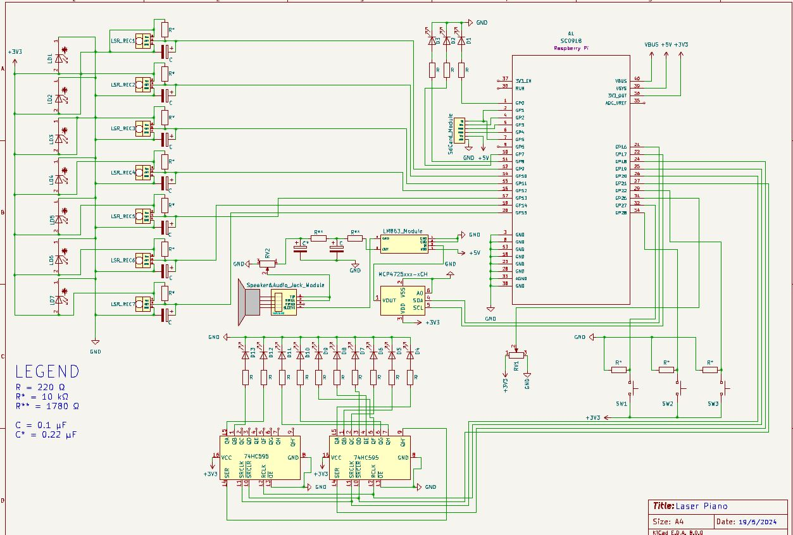

# Laser Piano
A piano made using laser diodes and laser receivers.

:::info 

**Author**: Negrila Rares \
**GitHub Project Link**: https://github.com/UPB-FILS-MA/project-NegrilaRares

:::

## Description

A piano made using laser diodes and laser receivers.

It uses a potentiometer with leds to adjust and show volume, 
3 separete switches with leds to displat change in octave 
and 7 laser diodes and laser receivers that act as the piano keys.


The plan is to take the sound data from a microsd card and give it to a dac that will give the analog output to a speaker.
It uses an LM386 audio amplifier module to keep the signal clear.


## Motivation

The reason I chose this project is because I took an interest in laser diodes 
and wanted to learn file reading/writing from an external memory device 
as well as understand the conversion of digital code into analog sound.

## Architecture 

<!-- Add here the schematics with the architecture of your project. Make sure to include:
 - what are the main components (architecture components, not hardware components)
 - how they connect with each other
 -->

 

## Log

<!-- write every week your progress here -->

### Week 6 - 12 May

### Week 7 - 19 May

### Week 20 - 26 May

## Hardware

Detail in a few words the hardware used.

Using leds as settings indicators.
Buttons and a stereo potentiometer for octave and volume respectively.
7 Laser diodes placed at an angle in order to continuously shine on the laser receivers.
A MicroSd card reader with a standard 2GB MicroSd card.
A Dac for processing the data and a amplifier for keeping the signal at a desireable level.
The amplifer will connect to the opposite port of the stereo potentiometer.
And the speaker will be connected to the output of the amplifier.

### Schematics

Some of the parts were either created by me as they did not have a publicly available schematic but most of the more detailed schemas for the modules used can be found in their datasheet.

In this case I couldn't find the Laser Receiver Symbol and the MicroSd card reader module. 




### Bill of Materials

<!-- Fill out this table with all the hardware components that you might need.

The format is 
```
| [Device](link://to/device) | This is used ... | [price](link://to/store) |

```

-->

| Device | Usage | Price |
|--------|--------|-------|
| [Rapspberry Pi Pico W](https://www.raspberrypi.com/documentation/microcontrollers/raspberry-pi-pico.html) | The microcontroller | [35 RON](https://www.optimusdigital.ro/en/raspberry-pi-boards/12394-raspberry-pi-pico-w.html) |
| 13 * Led | This is used for displaying current settings | [-] |
| 13 * 220 Ohm R | This is used to make sure the leds don't get fried | [-] |
| 10 * 10 kOhm R | This is used to crate pull up and pull down resistors | [-] |
| 7 * 0.1 uF Capacitor | This is used to debounce the signal from the laser receivers | [-] |
| lots * cables | This is used to connect diffrent things on the breadboard/prototype pcb | [-] |
| 10k Potentiometer | This is used for volume input | [2 RON](https://www.optimusdigital.ro/en/potentiometers/12360-10k-wh148-variable-resistor-without-washer-and-nut.html?search_query=10k+Mono+Potentiometer&results=3) |
| 2 * [Shift Register](https://www.diodes.com/assets/Datasheets/74HC595.pdf) | This is used for the output of the volume setting | [2 RON](https://www.optimusdigital.ro/en/others/2448-registru-de-deplasare-74hc595-dip-16.html) |
| Laser Diode | This is used to generate a laser | [2.5 RON](https://ardushop.ro/ro/electronica/262-modul-dioda-laser-rou-5mw.html) |
| 7 * [ISO203](https://forum.arduino.cc/t/documents-about-laser-sensor-ds18b20/1090450/5) | This is used to monitor for interference in the path of the laser | [6.5 RON](https://www.optimusdigital.ro/en/others/3289-laser-diode-receiver.html) |
| Catalex MicroSd card slot | This is used to read the data from a microsd | [4.4 RON](https://www.optimusdigital.ro/en/memories/1516-microsd-card-slot-module.html) |
| [DAC MCP4725](https://ww1.microchip.com/downloads/en/devicedoc/22039d.pdf) | This is used to transfrom the binary from the audio file data into an analog singal for the speaker | [25 RON](https://www.optimusdigital.ro/en/others/1327-dac-mcp4725-module-with-i2c-interface.html?search_query=dac&results=62) |
| Speaker | This is used to create a sound based on the analog input given by the system | [4.5 RON](https://ardushop.ro/en/modules/1550-difuzor-1w-8ohm.html) |
| [AMP LM386](https://www.ti.com/lit/ds/symlink/lm386.pdf) | This is used amplify the analog singal | [6.5 RON](https://ardushop.ro/ro/electronica/241-modul-amplificator-audio-lm386.html) |


## Software

| Library | Description | Usage |
|---------|-------------|-------|
| [MicroSd Crate](https://github.com/rust-embedded-community/embedded-sdmmc-rs) | Crate for the Catalex MicroSd card slot | Used for reading pcm from wav files |
| [MCP4725 Crate](https://github.com/mendelt/mcp4725) | Crate for the MCP4725 DAC | Used to send the data received from the microsd card to the digital to analog converter |
| [Framework used in project](https://github.com/embassy-rs/embassy)| Rust framework for embedded programming | Used to program the behaviour of the raspberry pi pico and used to simplify certain concepts of embedded programming |
| [Log](https://docs.rs/log/latest/log/)| Rust Crate for data displaying | Used to display data throught the usb in the terminal of the computer when interacting with the device as a manufacturer |


## Links

<!-- Add a few links that inspired you and that you think you will use for your project -->
1. [Laser Inspiration Video](https://youtu.be/h_y1y6eUvIY?si=NTLO8pDmCqerRG1a)
2. [Piano General Design Inspiration](https://www.amazon.com/M-WAVE-Controller-Bluetooth-Professional-Production/dp/B0B66T4DHK?th=1)
