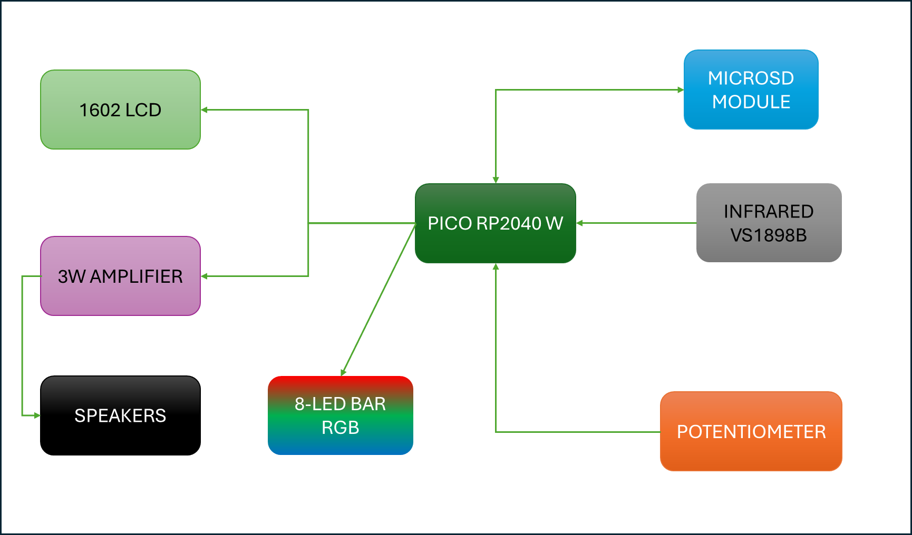
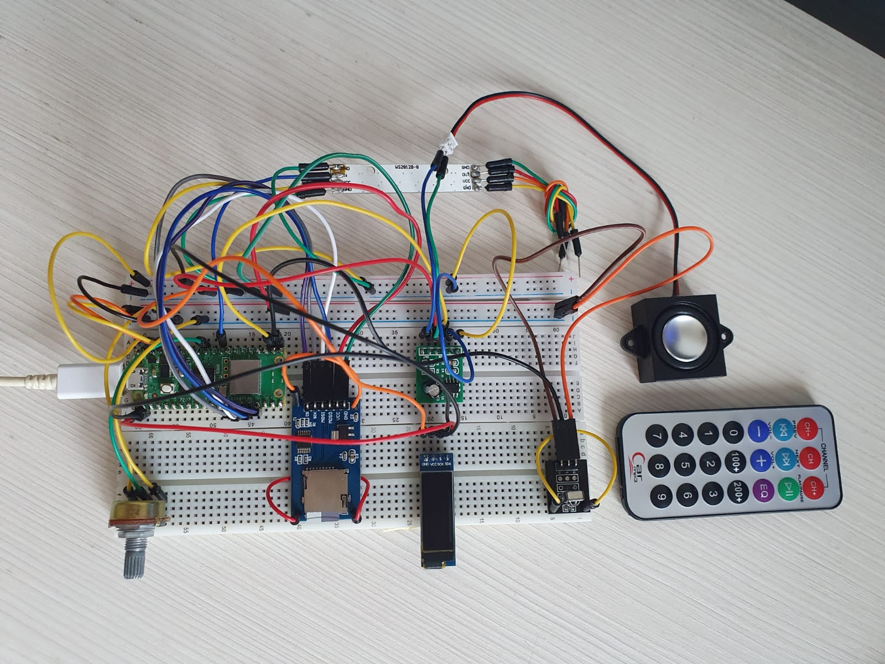
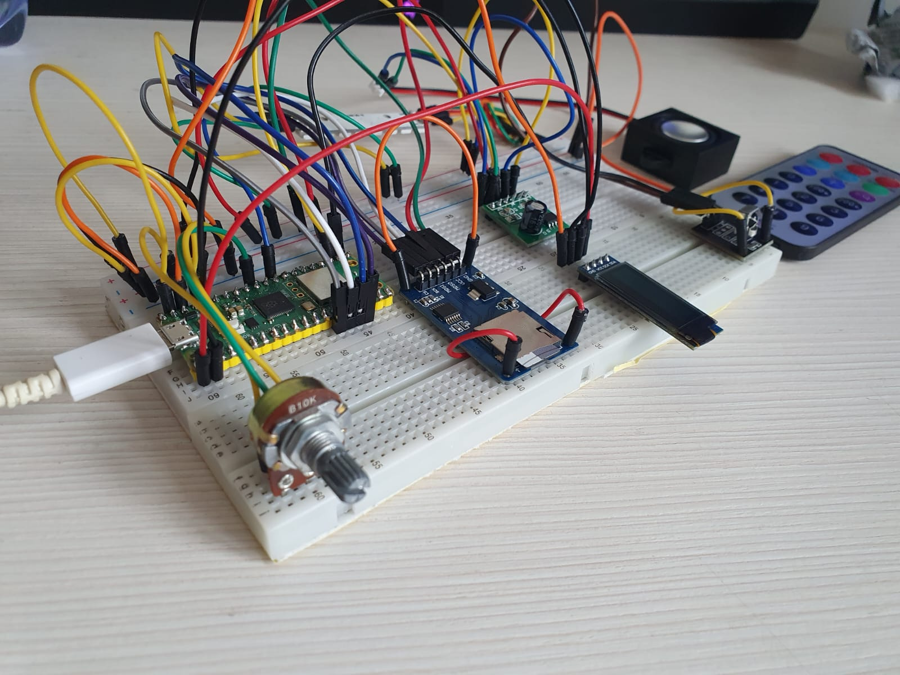
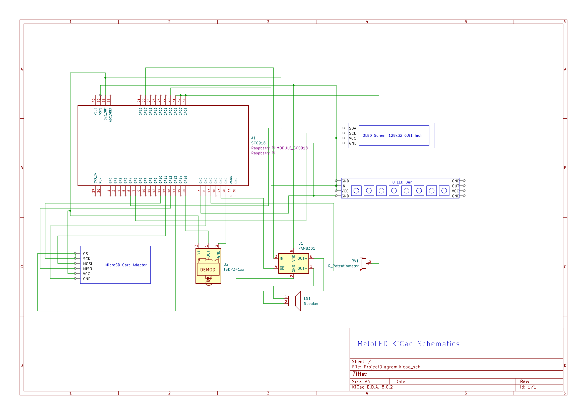

# MeloLED
MP3 Player with LED strip using Pico RP2040

:::info 

**Author**: Raul-Anton Jac \
**GitHub Project Link**: https://github.com/UPB-FILS-MA/project-jacraul

:::

## Description

The project aims to create a multifunctional MP3 player using the Raspberry Pi Pico microcontroller, enhanced with vibrant LED lighting effects for added ambiance. The MP3 player will allow users to enjoy their favorite music tracks with ease, featuring controls for play, pause, previous song, next song, and volume adjustment. Additionally, the project will incorporate an infrared (IR) remote control for convenient playback management and to control the LED Bar. The LED lighting effects will be synchronized with the music, providing an immersive audiovisual experience tailored to the user's preferences.Depending on time, I hope I will add an application for controlling it at distance.

## Motivation

I chose this project because I am a fan and I have a blog about Eurovision Song Contest. I want to create something which is useful for me and in the same time something very nice and colorful.

## Architecture 

 **Raspberry Pico RP2040**
    - "the brain", controlls everything
    - it is connected with every single module, led strip

 **1602 LCD**
    - interface: I2C
    - connections: GP0 (SDA), GP1 (SCL)
    - it will display the artist and the song playing

 **IR Receiver**
    - connection: GP15
    - it will transmit to pico the request from remote control

 **Micro SD Module**
    - interface: SPI
    - connections: GP13 (CS), GP12 (MISO), GP11 (MOSI), GP10 (SCK)
    - it will read and write on Micro SD Card

 **Potentiometer**
    - connection: GP26 (Analog Out)
    - it will control the volume of the player

## Log

<!-- write every week your progress here -->

### Week 6 - 12 May
I uploaded the project documentation where i described why I chose this project, what materials I used, how the components are connected.
### Week 7 - 19 May
I uploaded the KiCad schematics and the photos with components connected on breadboards.
### Week 20 - 26 May

## Hardware

I used the Pico RP2040 W as the "brain" of the entire project, a MicroSD Card Reader for playing the songs connected through SPI. I also have a potentiometer for controlling the volume of the mp3 player, an IR receiver for the remote control (used to control the player and the LED strip). For the outputs I have an OLED Screen (0.91 inch) where I will display the song title and the artist. Also for the output i have an audio amplifier connected to a speaker.

### Schematics

The KiCad Schematics with all components connected.

### Bill of Materials

| Device | Usage | Price |
|--------|--------|-------|
| [Rapspberry Pi Pico W](https://www.raspberrypi.com/documentation/microcontrollers/raspberry-pi-pico.html) | The microcontroller | [35 RON](https://www.optimusdigital.ro/en/raspberry-pi-boards/12394-raspberry-pi-pico-w.html) |
| Display OLED 0.91 Inch | LCD Screen for artist & song| [20 RON](https://robopiesa.ro/products/display-oled-lcd-0-91-inch-128x32?variant=46461636280662&currency=RON&utm_medium=product_sync&utm_source=google&utm_content=sag_organic&utm_campaign=sag_organic&srsltid=AfmBOopEj7zm9Ic7SDohv6ZHu2yxmUXJXWGerMoRqk_GPwhuHlWpKSD75TA) |
| WS2812 RGB LED Bar (8 LEDs) | LED bar for ambient | [6 RON](https://www.optimusdigital.ro/en/led-bars/753-bara-de-led-uri-rgb-ws2812-cu-8-led-uri.html) |
| 2 x 20p 2.54 mm Male Pin Header | Pins for PICO | [1 RON](https://www.optimusdigital.ro/en/pin-headers/8445-20-x-2p-254-mm-male-pin-header.html) |
|MicroSD Card Slot Module | MicroSD reader for songs | [5 RON](https://www.optimusdigital.ro/en/memories/1516-microsd-card-slot-module.html)|
| 100k Mono Potentiometer | Controlling the volume of player | [2 RON](https://www.optimusdigital.ro/en/potentiometers/1887-100k-mono-potentiometer.html?search_query=potentio&results=223)|
| Infrared Remote Receiver Module| Infrared sensor for remote control | [9 RON](https://www.optimusdigital.ro/en/others/755-modul-receptor-telecomanda-infrarou.html)|
| Mini Infrared Remote | Remote Control for player and led bar color and modes| [4 RON](https://www.optimusdigital.ro/en/others/11-mini-infrared-remote.html)|
| Plusivo Resistor Kit 250 pcs | Used for Voltage Divider | [15 RON](https://www.optimusdigital.ro/en/resistors/10928-250-pcs-plusivo-resistor-kit.html?search_query=resistors&results=184)|
| Breadboard Jumper Wires Set | Connecting components | [8 RON](https://www.optimusdigital.ro/en/wires-with-connectors/12-breadboard-jumper-wire-set.html?search_query=wires&results=561)|
| 2 x Breadboard HQ (830 points) | Base for the project | [20 RON](https://www.optimusdigital.ro/en/breadboards/8-breadboard-hq-830-points.html)|
| Amplifier Audio Mono XPT8871| Amplifies the audio signal | [5 RON](https://www.optimusdigital.ro/ro/audio-amplificatoare-audio/8348-amplificator-audio-mono-xpt8871-5-w.html)|
| Speaker | The output of the mp3 player | [16 RON](https://www.emag.ro/difuzor-mini-3-wati-8-ohmi-pentru-arduino-diy-ai1702/pd/DF0ZDDYBM/?ref=fp_growth_atc_1_1&provider=rec&recid=rec_74_c9f04ca83f0bc58c1133face9f24fff43981cc74b43976796129ba02ad6997dd_1714765523&scenario_ID=74)|

## Software

| Library | Description | Usage |
|---------|-------------|-------|
| [embedded-hal](https://github.com/rust-embedded/embedded-hal)| Foundation for drivers | Used for components to communicate with software |
| [FatFS](https://github.com/rust-embedded-community/embedded-sdmmc-rs) | MicroSD card management | Used for reading the files from microSD |
| [ssd1306](https://github.com/jamwaffles/ssd1306) | Driver for 0.91 OLED Display | Used to transfer the text from pico to lcd |

## Links

1. [Arduino iPod](https://ocw.cs.pub.ro/courses/pm/prj2023/avaduva/arduino-ipod)
