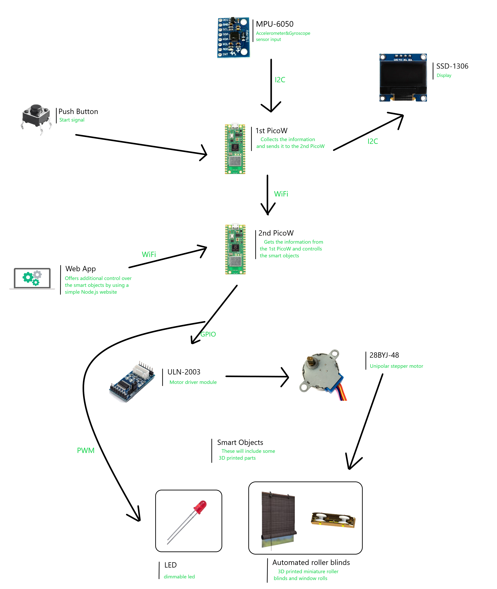
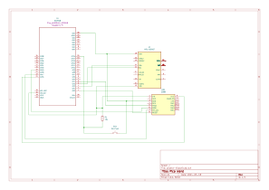

# Pico Wand
A useful device for physically impaired people

:::info 

**Author**: Chiorean Rebeca \
**My GitHub Project Link**: [Chiorean Rebeca](https://github.com/UPB-FILS-MA/project-ChioreanRebeca) 
**Coleague GitHub Link**: [Naomi Lita](https://github.com/UPB-FILS-MA/project-nimintz)

:::

## Description

Pico wand is useful device for physically impaired people. It uses a gyroscope that detects hand movements and interacts with objects around the house.  
When pressing a push button it starts collecting the movement of your wand. 
It collects movements such as: 
  •	Up and down 
  •	Back and fourth 
  •	Left to right 
  •	Circular motion 
All this information is then shown on a OLED display. 
This device could be used in relation to smart objects. This idea is further expanded upon by my coleague [Naomi Lita](https://github.com/UPB-FILS-MA/project-nimintz). 

## Example of usage

Let’s imagine someone that is bed bound and needs to adjust their smart curtains. They will pick up the Pico Wand, press the button and do a left to right motion. Our curtain will pick up the signal and adjust accordingly. 
For adjusting the intensity of a lightbulb we could implement our Pico Wand to collect circular movement.
If they make a circular movement to the left the light will dim and if it is to the right we could raise the intensity. 
This sort of implementation could be done on other objects as well: a door, the room temperature and so on.

## Motivation
This project aims to help people with disabilities gain some of their autonomy by being able to interact with objects around them. It ensures that they have the same opportunities to perform everyday tasks as those that aren't faced with the same challenges. Engaging in efforts that make a tangible difference in people’s lives can be incredibly rewarding. My motivation comes from knowing that my work has directly improved someone’s ability to live independently.

## Architecture 

## Log

<!-- write every week your progress here -->

### Week 6 - 12 May
I created the documentation of the project. I prototyped the hardware and the software and I experimented with the MPU6050 sensor module. I also looked for any additional components that were needed.
### Week 7 - 19 May
I completed the hardware connections and the KiCad schematic. In addition, I revised the project documentation (the architecture schematic and its content). I trained an Edge Impulse model for the MPU6050 and exported it as a C++ library and tested it in C++ code.
### Week 20 - 26 May

## Hardware
The MPU6050 Accelerometer and Gyroscope sensor takes the wand movement input. When the pushbutton is pressed, our PicoW takes the provided input and understands the nature of the movement. The direction of the movement is then sent to the SSD1360 display that prints it. The PicoW also sends the movement information to another PicoW connected to it by wifi. The second PicoW is the one connected to smart devices and will interact with them.   

The **pushbutton** signals the start of the data reading process from the MPU6050 sensor. It uses a simple GPIO connection, as follows: 
  - **not pressed** -> GP20 is HIGH
  - **pressed** -> GP20 is LOW  
It is connected using a pull-up resistor(of 10kΩ) between the input pin and Vcc to keep the voltage HIGH when the button is not pressed.   

The **MPU6050** sends data to the first PicoW. It uses a I2C connection as follows: 
  - **SDA** -> GP0
  - **SCL** -> GP1  
The data sent is then interpretetd by our PicoW with the help of our ML Edge Impulse model. [Edge Impulse Model](https://studio.edgeimpulse.com/studio/395280).   

The **SSD1306** shows the direction of our movement after it has been interpreted by our PicoW. It uses I2C connection as follows: 
  - **SDA** -> GP2
  - **SCL** -> GP3 
The information is then sent through WiFi connection to a second PicoW (Naomi's project).

### Schematics

### Pictures of hardware
This shows the hardware until now. The display shows "IDLE" when the Pico Wand is not moving. It can also sense "left-right" movement and "up-down".   

Note that in the picture, the positions for "up-down" and "left-right" look inverted, that is because PicoWand is supposed to be held as a remote.

### Bill of Materials

<!-- Fill out this table with all the hardware components that you might need. -->

| Device | Usage | Price |
|--------|--------|-------|
| [Rapspberry Pi Pico W](https://www.raspberrypi.com/documentation/microcontrollers/raspberry-pi-pico.html) | The microcontroller | [35 RON](https://www.optimusdigital.ro/en/raspberry-pi-boards/12394-raspberry-pi-pico-w.html) |
|[MPU6050 Accelerometer and Gyroscope Module](https://invensense.tdk.com/wp-content/uploads/2015/02/MPU-6000-Datasheet1.pdf)|Accelerometer sensor|[15,49 lei](https://www.optimusdigital.ro/en/inertial-sensors/96-mpu6050-accelerometer-and-gyroscope-module.html)|
|[0.96'' OLED Module](https://components101.com/sites/default/files/component_datasheet/SSD1306-OLED-Display-Datasheet.pdf)|Display|[23,79 lei](https://www.optimusdigital.ro/en/lcds/194-yellow-and-blue-096-oled-module-128x64-px.html?search_query=OLED+Display+&results=73)|
|Breadboard|Prototyping|[9,98 lei](https://www.optimusdigital.ro/en/breadboards/8-breadboard-hq-830-points.html?search_query=bread+board&results=420)|
|Jumper Wires|Connecting components|[4,99 lei](https://www.optimusdigital.ro/en/wires-with-connectors/889-set-fire-tata-tata-10p-20-cm.html?search_query=jumper+wires&results=101)|
|Pushbutton switch 12mm|Signals the begining of the data collecting process|[1,99 lei](https://www.optimusdigital.ro/en/others/1118-blue-round-button-with-cover.html?search_query=button&results=510)|

## Software

| Library | Description | Usage |
|---------|-------------|-------|
| [ssd1306](https://github.com/jamwaffles/ssd1306) | Display driver for SSSD1306 | Used for the display|
| [embedded-graphics](https://github.com/embedded-graphics/embedded-graphics) | 2D graphics library | Used for drawing to the display |

| Other Software Tools | Description | Usage |
|---------|-------------|-------|
| [Edge Impulse](https://edgeimpulse.com) | Edge Impulse website | Used to build datasets the will be imported as C library and interfaced by the use of FFI|

## Links
<!-- Add a few links that got you the idea and that you think you will use for your project -->

1. [Hand Gesture Recognition for Numbers using TinyML](https://medium.com/@subirmaity/hand-gesture-recognition-for-numbers-using-tinyml-323d2a524c3e)
2. [Motion Recognition Using Raspberry Pi Pico](https://mjrobot.org/2021/03/12/tinyml-motion-recognition-using-raspberry-pi-pico/)
3. [Raspberry Pi Pico and Edge Impulse](https://www.hackster.io/shahizat/gesture-recognition-using-raspberry-pi-pico-and-edge-impulse-7a63b6)
4. [Using a screen display to output the movement](https://www.hackster.io/shubhamsantosh99/gesture-recognition-on-pico-using-edge-impulse-fd962e#overview)
