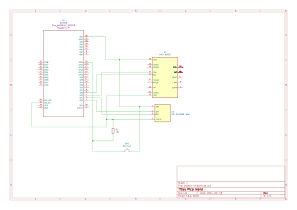

# Pico Wand
A useful device for physically impaired people

:::info 

**Author**: Chiorean Rebeca \
**My GitHub Project Link**: [Chiorean Rebeca](https://github.com/UPB-FILS-MA/project-ChioreanRebeca) 
**Coleague GitHub Link**: [Naomi Lita](https://github.com/UPB-FILS-MA/project-nimintz)

:::

## Description

Pico wand is useful device for physically impaired people. It uses a MPU6050 gyroscope that detects hand movements and interacts with the objects in the house.  
When pressing a push button it starts collecting the movement of your wand. 
It collects movements such as: 
  - **moving the wand** and pressing the button raises the curtain 
  - **holding the wand still** and pressing the button lowers the curtains 
All this information is then shown on a ST7789 display. 
This device could be used in relation to common use objects for people with disabilities. 
Example of usage: 
Let’s imagine someone that is bed bound and needs to adjust their smart curtains. They will pick up the Pico Wand, press the button and move the wand, then PicoW connected to an adjusted curtain will pick up the signal and move up the curtain. This sort of implementation could be done on other objects as well: a door, a light bulb and so on. 
My project is made in colaboration with my coleague Naomi Lita. [Link to her GitHub](https://github.com/UPB-FILS-MA/project-nimintz)

## Example of usage

Let’s imagine someone that is bed bound and needs to adjust their smart curtains. They will pick up the Pico Wand, press the button and motion the wand. Our curtain will pick up the signal and adjust accordingly. 
For adjusting the intensity of a lightbulb we could implement our Pico Wand to collect circular movement.
If they make a circular movement to the left the light will dim and if it is to the right we could raise the intensity. 
This sort of implementation could be done on other objects as well: a door, the room temperature and so on.

## Motivation
This project aims to help people with disabilities gain some of their autonomy by being able to interact with objects around them. It optimizes a normal remote by using fewer buttons with multiple functionalities, thus making a fully automated home's remote control more practical and comfortable to hold. My motivation comes from knowing that my work has directly improved someone’s ability to live independently.

## Architecture 

## Log

<!-- write every week your progress here -->

### Week 6 - 12 May
I created the documentation of the project. I prototyped the hardware and the software and I experimented with the MPU6050 sensor module. I also looked for any additional components that were needed.
### Week 7 - 19 May
I completed the hardware connections and the KiCad schematic. In addition, I revised the project documentation (the architecture schematic and its content). I trained an Edge Impulse model for the MPU6050 and exported it as a C++ library and tested it in C++ code.
### Week 20 - 26 May
I made changes to the final project. I substituted the SSD1306 for a ST7789 display, and I excluded the Edge Impulse model and instead used the get_motion_detected(&mut self) function of the MPU6050 crate. This week we also finished setting up the WiFi connection and the 3D printed scale model of the roller blinds. 

## Hardware
The MPU6050 Accelerometer and Gyroscope sensor takes the wand movement input. When the pushbutton is pressed, our PicoW takes the provided input and it detects movement. The PicoW also sends the movement information to another PicoW connected to it by wifi. If movement is detected then it sends the message for the roller blinds to roll upwards. If there is no movement detected when the button is pressed then my PicoW sends the message for the roller blinds to roll down. The second PicoW is the one connected to smart devices and will interact with them.   

The **pushbutton** signals the start of the data reading process from the MPU6050 sensor. It uses a simple GPIO connection, as follows: 
  - **not pressed** -> GP20 is HIGH
  - **pressed** -> GP20 is LOW  
It is connected using a pull-up resistor(of 10kΩ) between the input pin and Vcc to keep the voltage HIGH when the button is not pressed.   

The **MPU6050** sends data to the first PicoW. It uses a I2C connection as follows: 
  - **SDA** -> GP0
  - **SCL** -> GP1  
The data sent is then interpretetd by our PicoW with the help of the get_motion_detected(&mut self) function of the MPU6050 crate.   

The **ST7789** shows the direction of the roller blinds after it has been interpreted by our PicoW. It uses SPI connection as follows: 
  - **MISO** -> GP4 
  - **MOSI** -> GP19 
  - **CLK**  -> GP18 
  - **CS**   -> GP17 
  - **rst**  -> GP0
  - **dc**   -> GP16 
The information is then sent through WiFi connection to a second PicoW (Naomi's project).

### Schematics

### Pictures of hardware
This shows the finished hardware as presented at PM Fair. The display shows an "Welcome" message when it starts up and finishes connecting to WiFi. It also displays messages such as "Rolling Up" and "Rolled Up!" and the pair of "Rolling Down" and "Rolled Down!".   

 
The following image shows the 3D printed model that we used.
 

 
This is the final product presented at PM Fair.
 

### Bill of Materials

<!-- Fill out this table with all the hardware components that you might need. -->

| Device | Usage | Price |
|--------|--------|-------|
| [Rapspberry Pi Pico W](https://www.raspberrypi.com/documentation/microcontrollers/raspberry-pi-pico.html) | The microcontroller | [35 RON](https://www.optimusdigital.ro/en/raspberry-pi-boards/12394-raspberry-pi-pico-w.html) |
|[MPU6050 Accelerometer and Gyroscope Module](https://invensense.tdk.com/wp-content/uploads/2015/02/MPU-6000-Datasheet1.pdf)|Accelerometer sensor|[15,49 lei](https://www.optimusdigital.ro/en/inertial-sensors/96-mpu6050-accelerometer-and-gyroscope-module.html)|
|[LCD ST7789](https://www.rhydolabz.com/documents/33/ST7789.pdf)|Display|[149,00 lei](https://www.optimusdigital.ro/en/lcds/5345-adafruit-154-240x240-wide-angle-tft-lcd-display-with-microsd-st7789.html)|
|Breadboard|Prototyping|[9,98 lei](https://www.optimusdigital.ro/en/breadboards/8-breadboard-hq-830-points.html?search_query=bread+board&results=420)|
|Jumper Wires|Connecting components|[4,99 lei](https://www.optimusdigital.ro/en/wires-with-connectors/889-set-fire-tata-tata-10p-20-cm.html?search_query=jumper+wires&results=101)|
|Pushbutton switch 12mm|Signals the begining of the data collecting process|[1,99 lei](https://www.optimusdigital.ro/en/others/1118-blue-round-button-with-cover.html?search_query=button&results=510)|

## Software

| Library | Description | Usage |
|---------|-------------|-------|
| [ST7789](https://github.com/almindor/st7789) | Display driver for ST7789 | Used for the display|
| [embedded-graphics](https://github.com/embedded-graphics/embedded-graphics) | 2D graphics library | Used for drawing to the display |
| [MPU6050](https://github.com/juliangaal/mpu6050) | Platform agnostic driver for MPU6050 6-axis IMU | Used for reading the accelerometer and gyroscope|
| [cyw43](https://github.com/embassy-rs/embassy/tree/main/cyw43) | Rust driver for the CYW43439 wifi chip | Used for the WiFi implementation|
| [cyw43-pio](https://github.com/embassy-rs/embassy/tree/main/cyw43-pio) | Driver for the nonstandard half-duplex SPI used in the PicoW | Used for the WiFi implementation|

## Links
<!-- Add a few links that got you the idea and that you think you will use for your project -->

1. [Hand Gesture Recognition for Numbers using TinyML](https://medium.com/@subirmaity/hand-gesture-recognition-for-numbers-using-tinyml-323d2a524c3e)
2. [Motion Recognition Using Raspberry Pi Pico](https://mjrobot.org/2021/03/12/tinyml-motion-recognition-using-raspberry-pi-pico/)
3. [Raspberry Pi Pico and Edge Impulse](https://www.hackster.io/shahizat/gesture-recognition-using-raspberry-pi-pico-and-edge-impulse-7a63b6)
4. [Using a screen display to output the movement](https://www.hackster.io/shubhamsantosh99/gesture-recognition-on-pico-using-edge-impulse-fd962e#overview)
