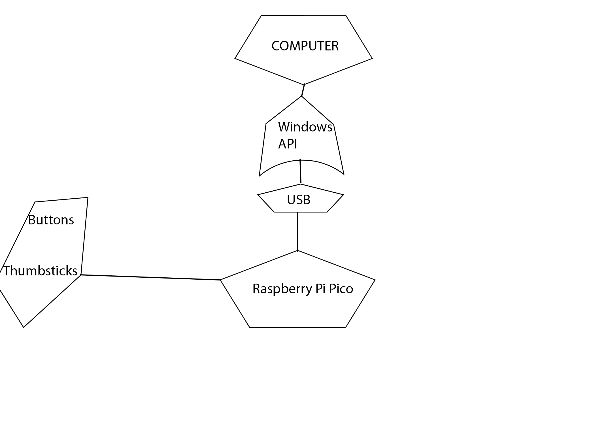
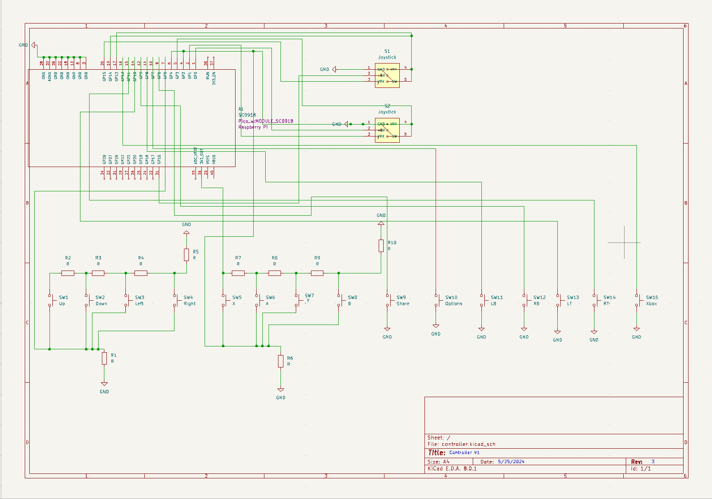

# Controller
This project aims to deliver a working Xbox One Controller through the official Windows API.

:::info 

**Author**: Leonte Robert \
**GitHub Project Link**: (https://github.com/UPB-FILS-MA/project-CearceafAlb)

:::

## Description

The controller is a breadboard with 16 buttons and two thumbsticks that will connect to the PC and be recognized by Windows 10 and 11 as an Xbox One Controller by making use of official Windows API. This prototype will be tested in various games that range from FPSs to racing and 3rd person action-adventure.

## Motivation

I have an Xbox One X console with two controllers. A friend of mine borrowed one and sometimes he forgets to bring it with him when I host FIFA tournaments. This prototype will serve as a backup for when he forgets to bring the controller.

## Architecture 



## Log

<!-- write every week your progress here -->

### Week 6 - 12 May

### Week 7 - 19 May

### Week 20 - 26 May

## Hardware

This controller uses a Raspberry Pi Pico, 16 buttons and two thumbsticks.

### Schematics



### Bill of Materials

<!-- Fill out this table with all the hardware components that you might need.

The format is 
```
| [Device](link://to/device) | This is used ... | [price](link://to/store) |

```

-->

| Device | Usage | Price |
|--------|--------|-------|
| [Rapspberry Pi Pico W](https://www.raspberrypi.com/documentation/microcontrollers/raspberry-pi-pico.html) | The microcontroller | [35 RON](https://www.optimusdigital.ro/en/raspberry-pi-boards/12394-raspberry-pi-pico-w.html) |
| [Breadboard(taken from a kit)(https://en.wikipedia.org/wiki/Breadboard)] | The base | [54 EUR(the entire kit)](https://www.amazon.de/gp/product/B01II76PDM/ref=ox_sc_act_title_1?smid=AZF7WYXU5ZANW&psc=1) |
| Button(x16) | Buttons(including DPAD) | [0,36 RON x16](https://www.optimusdigital.ro/ro/butoane-i-comutatoare/1119-buton-6x6x6.html) |
| [Thumbstick(https://components101.com/modules/joystick-module)] | Bi-axial module for movement and aiming | [5,35 RON](https://www.optimusdigital.ro/ro/senzori-senzori-de-atingere/742-modul-joystick-ps2-biaxial-negru-cu-5-pini.html) |
| [Thumbstick(taken from a kit)(https://components101.com/modules/joystick-module)] | Bi-axial module for movement and aiming | [54 EUR(the entire kit)](https://www.amazon.de/gp/product/B01II76PDM/ref=ox_sc_act_title_1?smid=AZF7WYXU5ZANW&psc=1) |


## Software

| Library | Description | Usage |
|---------|-------------|-------|
| [GameInput](https://learn.microsoft.com/en-us/gaming/gdk/_content/gc/input/overviews/input-overview) | A new input API from Microsoft that aims to bring XInput, DirectInput, etc under a single roof | Used for handling the buttons and the joysticks |

## Links

<!-- Add a few links that inspired you and that you think you will use for your project -->

1. [GameInput Official Documentation](https://learn.microsoft.com/en-us/gaming/gdk/_content/gc/input/overviews/input-overview)
...
