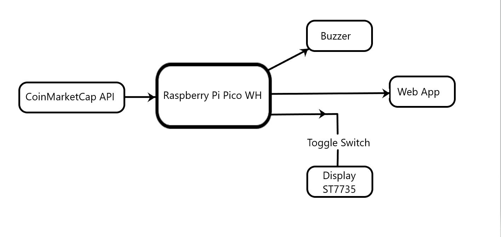
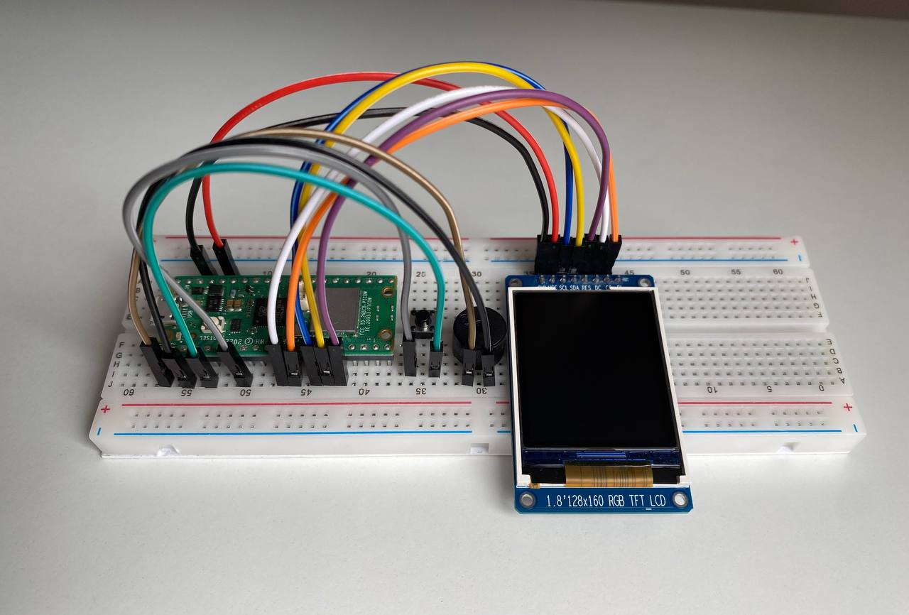
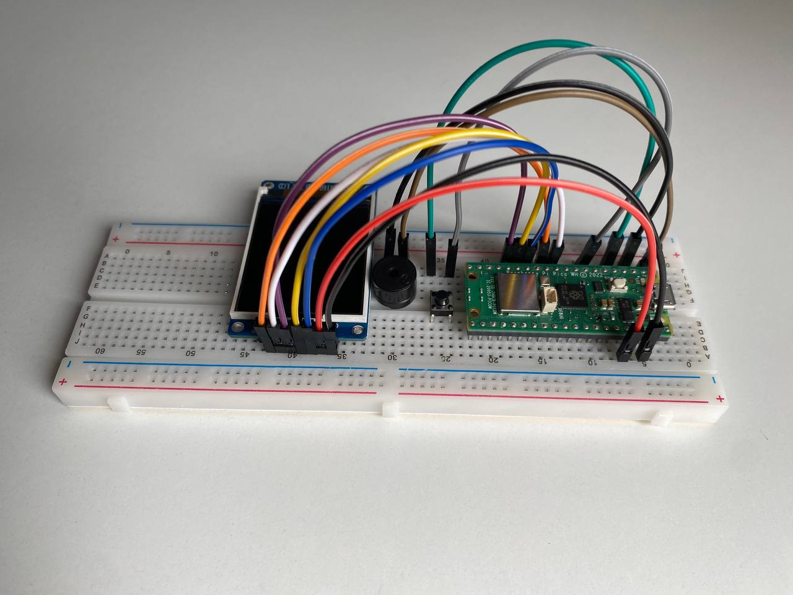
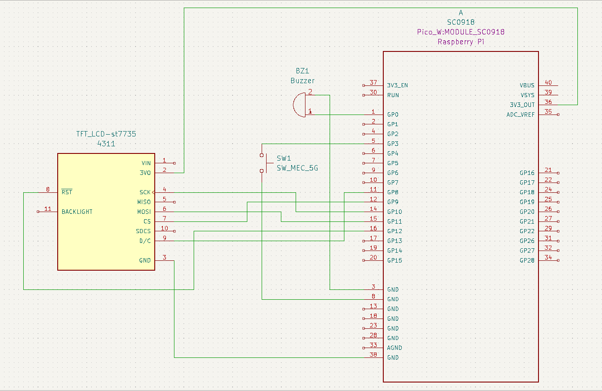

# Cryptocurrency price tracker
Rust-based cryptocurrency price tracker with alerts and web interface

:::info 

**Author**: Gulida Roman \
**GitHub Project Link**: https://github.com/UPB-FILS-MA/project-roman-gulida

:::

## Description

A cryptocurrency price tracker built with Rust on a Raspberry Pi Pico WH, featuring a screen for monitoring real-time prices and daily percentage changes. It has a switch button for toggling between different currencies and provides price alerts with a buzzer. The project also includes a web application for remote monitoring.

## Motivation

I've been interested in cryptocurrencies for a long time and use price tracking apps regularly. I thought it would be awesome to build my own monitoring system with a microcontroller. This project lets me create a simple tracker with alerts for buying on desired price. Plus, it's a fun way to combine my passion for crypto with hardware and coding.

## Architecture 



* Components 
  + Data Source: 
    The primary source of cryptocurrency data is the CoinMarketCap API. This is where the application fetches real-time prices and daily percentage changes for various cryptocurrencies. 
  + Microcontroller: 
    The Raspberry Pi Pico WH serves as the central processing unit, managing data retrieval, handling logic, and interfacing with other components. 
  + Display Screen: 
    A ST7735 LCD screen connected to the Pico WH shows the cryptocurrency price and daily percentage change. This is the main visual output for the tracker. 
  + Price Alert Buzzer: 
    A buzzer that emits an audible alert when a price threshold is reached. This is connected to the Pico WH and is activated based on predefined conditions. 
  + Switch for Currency Selection: 
    A toggle switch that allows the user to toggle between different cryptocurrencies. This connects to the Pico WH and interacts with the display and data-fetching logic. 
  + Web Server and Web Page: 
    A web server running on the Pico WH serves a simple web page. This web page allows remote monitoring of prices and setting of price alerts.

* Connections and Flow 
  + The Pico W fetches data from the CoinMarketCap API at regular intervals, typically using HTTP requests. This data is processed to extract the relevant price and daily percentage change. 
  + The screen is updated with the latest data, displaying the current cryptocurrency price and daily change. 
  + The toggle switch allows users to select which cryptocurrency to track, changing the request to the CoinMarketCap API accordingly. 
  + The buzzer is triggered when price alerts are activated. The alert thresholds are set via the web page, which communicates with the Pico WH through the web server. 
  + The web server running on the Pico WH allows users to access the tracker remotely through a web page, providing a convenient interface for monitoring prices and configuring alerts.

## Log

<!-- write every week your progress here -->

### Week 6 - 12 May
I received the hardware package, verified its contents, and started assembling the components. 
### Week 7 - 19 May
I completed the hardware assembly. I finished the KiCad schematic and began developing the software. This involved work with LCD and creating structs CoinData and MarketData.
### Week 20 - 26 May

## Hardware

In my project I used a 1.8-inch SPI LCD with the ST7735 controller (128 x 160 px) to display cryptocurrency prices and daily percentage changes. The central microcontroller is the Raspberry Pi Pico WH. I used a breadboard for prototyping, a 3V active buzzer for auditory price alerts, toggle switch for switching between currencies and jumper wires to connect everything.

+ Display(data would be displayed in format "st7735 Pin -> Raspberry Pi Pin"):
  * VCC -> 3V3(OUT), pin 36
  * SCL -> GPIO 10, pin 14
  * SDA -> GPIO 11, pin 15
  * RES -> GPIO 12, pin 16
  * DC -> GPIO 8, pin 11
  * CS -> GPIO 9, pin 12
  * GND -> pin 38
  * BL -> None
+ Buzzer. The buzzer is connected to the GPIO 0(pin 1) and ground(pin3).
+ Push button. Pushbutton switch is connected to the GPIO 3(pin 5) and ground(pin 8).
 
Images of the physical hardware and connections:



### Schematics



### Bill of Materials

<!-- Fill out this table with all the hardware components that you might need.

The format is 
```
| [Device](link://to/device) | This is used ... | [price](link://to/store) |

```

-->

| Device | Usage | Price |
|--------|--------|-------|
| [Rapspberry Pi Pico WH](https://www.raspberrypi.com/documentation/microcontrollers/raspberry-pi-pico.html) | The microcontroller | [39 RON](https://www.optimusdigital.ro/en/raspberry-pi-boards/12395-raspberry-pi-pico-wh.html?search_query=raspberry+pi+pico+WH&results=34) |
| [LCD Display](https://www.displayfuture.com/Display/datasheet/controller/ST7735.pdf) | Display price and daily change | [30 RON](https://www.optimusdigital.ro/en/lcds/3554-modul-lcd-de-18-cu-spi-i-controller-st7735-128x160-px.html?search_query=ST7735&results=13) |
| [Active Buzzer](https://www.mouser.com/datasheet/2/400/ef532_ps-13444.pdf) | Price alert | [1.5 RON](https://www.optimusdigital.ro/en/buzzers/635-3v-active-buzzer.html?search_query=active+buzzer&results=16) |
| [Breadboard](https://busboard.com/documents/datasheets/BPS-DAT-(KIT-BB830+SB830)) | The physical base of the project | [10 RON](https://www.optimusdigital.ro/en/breadboards/8-breadboard-hq-830-points.html) |
| [Jumper Wires](https://ro.mouser.com/datasheet/2/58/BPS_DAT__ZW_10__Datasheet-1282929.pdf) | Connect components | [4 RON](https://www.optimusdigital.ro/en/wires-with-connectors/887-set-fire-tata-tata-10p-15-cm.html?search_query=jumper+wires&results=100) |
| [Toggle Switch](https://www.optimusdigital.ro/en/buttons-and-switches/8930-miniature-side-toggle-switch-with-5-mm-handle.html?search_query=toggle+switch&results=31) | Switch between cryptocurrencies | [0.5 RON](https://www.optimusdigital.ro/en/buttons-and-switches/8930-miniature-side-toggle-switch-with-5-mm-handle.html?search_query=toggle+switch&results=31) |

## Software

| Library | Description | Usage |
|---------|-------------|-------|
| [st7735](https://github.com/scholtzan/st7735-rs) | Display driver for ST7735 | Used for the display for the Pico WH |
| [reqwless](https://github.com/drogue-iot/reqwless) | HTTP Client | Retrieve cryptocurrency prices and other relevant data from a remote server |

## Links

<!-- Add a few links that inspired you and that you think you will use for your project -->

1. [CoinMarketCap API](https://coinmarketcap.com/api/)
2. [Idea](https://youtu.be/A0a5Z3-OPsM?si=p2yMHpqUisFPEZ5q)
