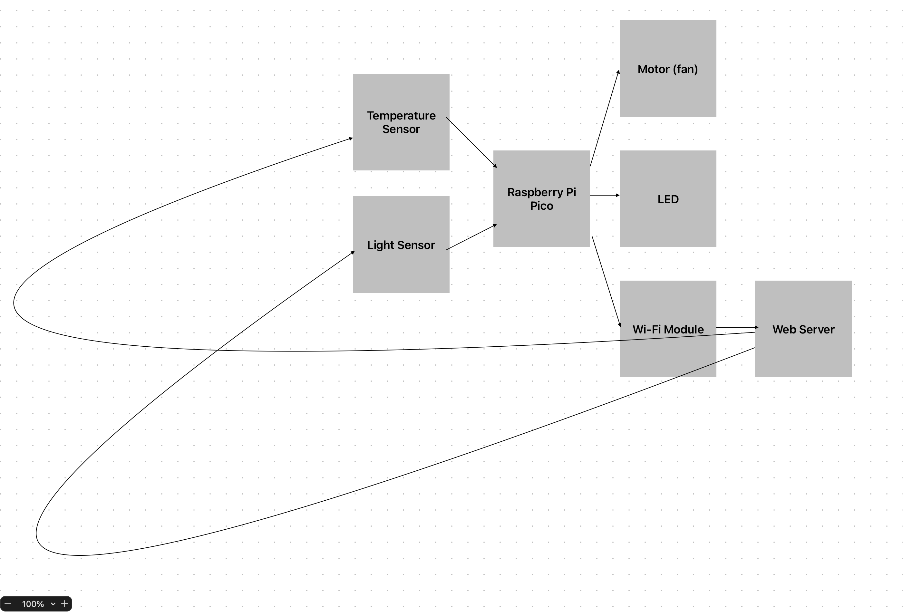
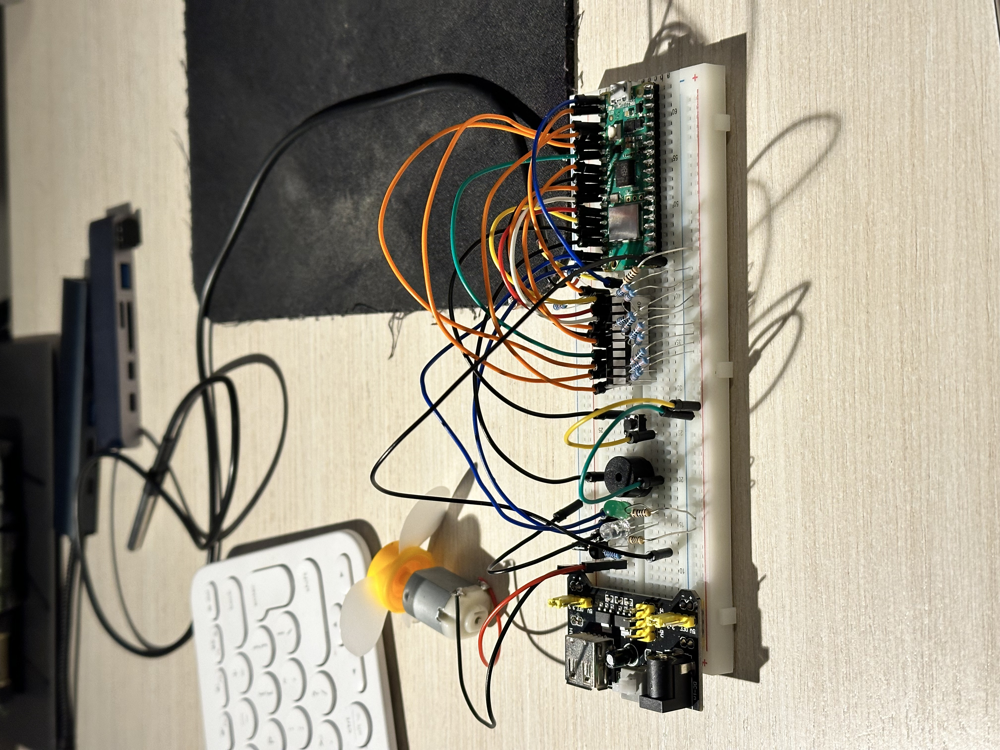
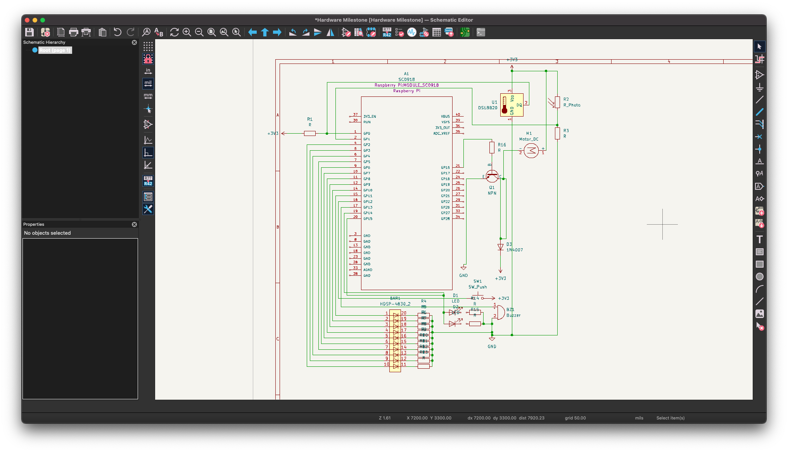

# Project Name
Sensor Control System

:::info

**Author**: Stoica Stefan Nicolae
**GitHub Project Link**: https://github.com/UPB-FILS-MA/project-bep1s69

:::

## Description

Using a Raspberry Pi Pico microcontroller board along with temperature and light sensors, this project aims to create a system capable of autonomously regulating environmental conditions for sensitive plants or similar applications. The system is designed to trigger a small motor with blades (acting as a fan) and adjust the intensity of an LED based on real-time sensor data. A small 10 segment LED display makes it possible to view the temperature and ambient light data (switching between them with a push button) locally. A buzzer and will also notify the user whenever the actions have started (the LED or the motor were turned on). Using the Rust programming language, the project combines hardware and software components to create an efficient and reliable solution. Additionally, the system incorporates Wi-Fi connectivity to enable remote monitoring and control, allowing users to access sensor data and manually trigger the fan and LED through a web interface.

## Motivation

The motivation behind this project stems from the need for practical solutions to address the challenges of caring for temperature and light-sensitive plants in indoor or controlled environments. By automating tasks such as temperature regulation and lighting control, this project aims to simplify plant care processes while ensuring optimal growing conditions. Moreover, the project aligns with broader goals of sustainability and self-sufficiency, empowering individuals to cultivate their own plants with greater efficiency and resource conservation. Overall, the Sensor Control System serves as a testament to the potential of technology to enhance our interaction with the natural world and promote a healthier, more sustainable lifestyle.

## Architecture 

In this architecture:

The Raspberry Pi Pico communicates with the WiFi module to enable WiFi connectivity.
Sensor data collected by the Raspberry Pi Pico is sent over WiFi to a web server.
The web server hosts a control interface accessible via a web page.
Users can access the control interface from a web browser to view sensor data and manually trigger the fan and LED.

## Log

### Week 6 - 1 April - Started researching the required parts

### Week 7 - 8 April - Ordered said required parts

### Week 8 - 15 April - Soldered header pins to the Raspberry Pi Pico and did initial testing 

### Week 10 - 29 April - Started the Project documentation and setting things up

### Week 12 - 13 May - Worked on assembling the project and the KiCad Schematics

## Hardware

Raspberry Pi Pico - the microcontroller which acts as the "brain" of the whole project

Breadboards - used to connect all the parts

Photodiode - used as sensor for determining the amount of light

DS18B20 Temperature sensor - used to measure the ambient temperature

Jumper wires - used to connect all the parts together

### Schematics

### Bill of Materials

| Device | Usage | Price |
|--------|--------|-------|
| [Rapspberry Pi Pico W](https://www.raspberrypi.com/documentation/microcontrollers/raspberry-pi-pico.html) | The microcontroller | [55 RON](https://robotescu.net/product/raspberry-pi-pico-w/) |
| [Raspberry Pi Starter Kit] | Comes with useful parts (breadboard, jumper wires, photodiode etc) | [59 RON](https://robotescu.net/product/raspberry-pi-pico-starter-kit/) |
| [Plusivo Electronics Starter Kit] | Comes with useful parts too (larger breadboard, motor) | [42 RON](https://www.emag.ro/kit-plusivo-pentru-introducere-in-electronica-x0019ajd65/pd/D1MZPDMBM/?ref=history-shopping_358424322_77141_1) |
| [DS18B20 Temperature sensor] | Uded to measure ambient temperature | [10 RON](https://www.emag.ro/senzor-temperatura-rezistent-la-apa-ds18b20-cl627/pd/D55RPRBBM/?ref=history-shopping_358801318_38837_1) |

## Software

| Library | Description | Usage |
|---------|-------------|-------|
| [rp-hal](https://github.com/rp-rs/rp-hal) | Hardware abstraction layer | Used for interacting with hardware peripherals, including the ADC (Analog-to-Digital Converter) and the SPI|
| [onewire](https://github.com/rust-embedded-community/onewire) | OneWire protocol driver | Used for interfacing with OneWire devices, namely the DS18B20 Temperature Sensor, connected to the Raspberry Pi Pico |
## Links

1. [Programming the Raspberry Pi Pico with Rust](https://www.alexdwilson.dev/how-to-program-raspberry-pi-pico-with-rust
2. [Lecture and lab materials](https://embedded-rust-101.wyliodrin.com/)
3. [Lab solutions Github repository](https://github.com/UPB-FILS-MA/lab-solutions)

