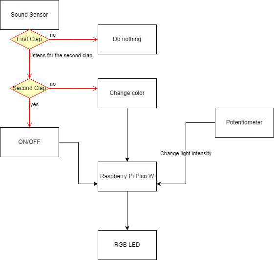
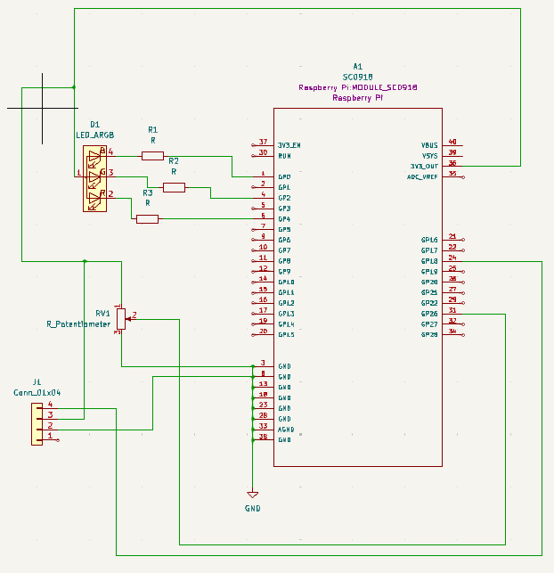
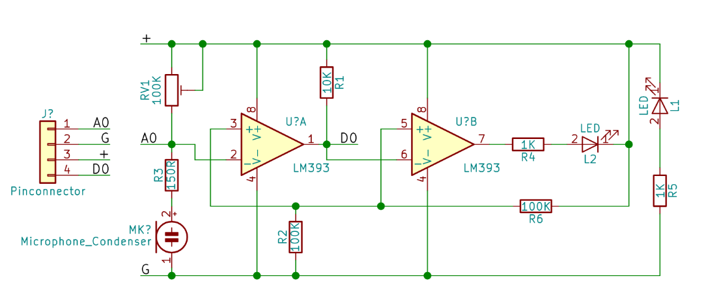
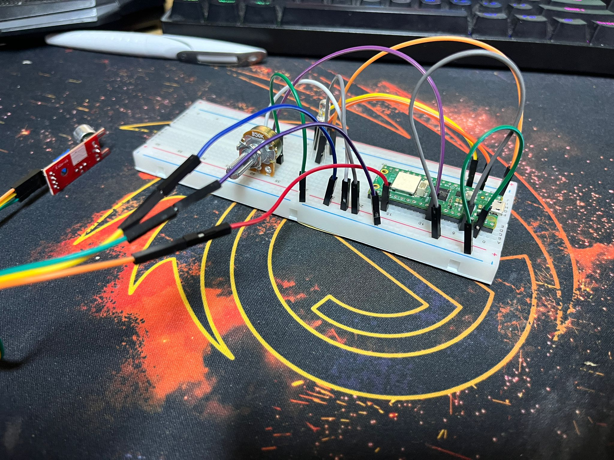
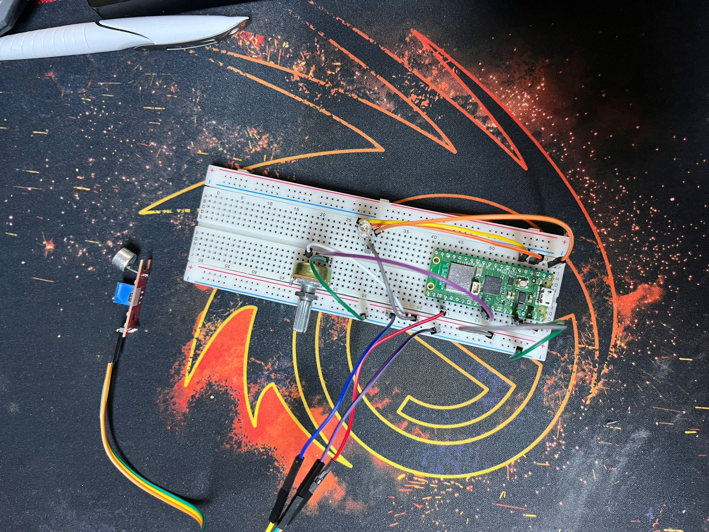

# IntelliGlow
Smart light that can be controlled just by the clapping of your hands.  

:::info 

**Author**: Marinescu Teodor\
**GitHub Project Link**: https://github.com/UPB-FILS-MA/project-teofils1

:::

## Description

IntelliGlow is a device that wants to implement physical and sound commands into everyday usage of normal lighting equipment. As the most important features the user can clap one time to change the color of the lightbulb, two times to light it or shut it, and additionally, we have a potentiometer that can change the light intensity to whatever intensity you want.

## Motivation

In this day and age, it is a common commodity to have a more feature-rich light source, such as a desk lamp or a simple light bulb, so I want to have my go at trying to build an intelligent glow lamp that can do more than just emit light. I'm excited to explore this idea and see what kind of innovative features I can incorporate into my design.

## Architecture

The IntelliGlow is powered by wire and it uses a sound sensor that listens for the first clap and then waits some time to find the second clap so that it can decide if there were 1 or 2 claps. The potentiometer is an element that sets the intensity of the RGB LED.



For the diagram above here is a brief breakdown:

The Raspberry Pi Pico W is the computing component of the IntelliGlow. It processes the signal from the sound sensor and the potentiometer and decides what to do next.

The sound sensor checks if there are any high frequency noises(mostly claps) around him, it sends a signal to the microcontroller, the computer starts to listen for the next clap, if there was no clapping sound in the next 2 seconds the RBB LED changes color, but in the instance that there was another clapping noise the computer turns ON/OFF the RGB.

The potentiometer sends the desired intensity to the Pico board.


## Log

<!-- write every week your progress here -->

### Week 6 - 12 May
Planed the architecture of the project and bought all the required components.
### Week 7 - 19 May
The schematic for the project has been successfully created using KiCad. This schematic includes all necessary components and connections for the electronic circuit which was further used as a guide for when I assembled the project on a physical breadboard.
### Week 20 - 26 May

## Hardware

A sound sensor detects sound waves and converts them into electrical signals. It's used in noise monitoring, voice recognition, security systems, and more. For this device we need to tune the sound sensor so that it only detects high frequency sounds.

A potentiometer is an adjustable electronic component used for controlling electrical signals by varying resistance. It consists of a resistive element and a movable wiper, allowing for precise adjustment of voltage or current.

### Schematics

Here is the KiCAD schematic for my project. 


I used a sound sensor that it was not supported by KiCAD so I made my own representation of it.

This is the hardware all put together.



### Bill of Materials

<!-- Fill out this table with all the hardware components that you might need.

The format is 
```
| [Device](link://to/device) | This is used ... | [price](link://to/store) |

```

-->

| Device | Usage | Price |
|--------|--------|-------|
| [Rapspberry Pi Pico W](https://www.raspberrypi.com/documentation/microcontrollers/raspberry-pi-pico.html) | The microcontroller | [35 RON](https://www.optimusdigital.ro/en/raspberry-pi-boards/12394-raspberry-pi-pico-w.html) |
| [Breadboard](https://www.yamanelectronics.com/wp-content/uploads/2020/06/basics-of-breadboard.jpg) | The physical base of the project | [10 RON](https://www.optimusdigital.ro/ro/prototipare-breadboard-uri/8-breadboard-830-points.html) |
| [RGB LED](https://components101.com/diodes/rgb-led-pinout-configuration-circuit-datasheet)| The light bulb |[1,15 Lei](https://www.emag.ro/led-rgb-ws2811-5mm-ai1387/pd/D0WH0GMBM/)|
| [Sound Sensor](https://components101.com/modules/lm393-sound-detection-sensor-module)| Sensor | [5,67 Lei](https://www.emag.ro/modul-detectare-sunet-cu-microfon-ky-037-compatibil-arduino-ai084-s36/pd/DWY988BBM/?cmpid=93116&gad_source=4)|
| [Potentiometer](https://components101.com/resistors/potentiometer)| Controller | [2,57 lei](https://ardushop.ro/ro/electronica/193-potentiometru-10k.html?gad_source=4)|
|[Led 5mm](https://www.farnell.com/datasheets/1498852.pdf)| Red Led light| [0.26 RON](https://www.optimusdigital.ro/ro/optoelectronice-led-uri/700-led-rou-de-3-mm-cu-lentile-transparente.html)|
| [Male to male jumper wires](https://media.digikey.com/pdf/Data%20Sheets/Digi-Key%20PDFs/Jumper_Wire_Kits.pdf) | Wires | [6.98 RON](https://www.optimusdigital.ro/ro/fire-fire-mufate/888-set-fire-tata-tata-40p-20-cm.html?search_query=fire+tata+tata&results=80) |
| [Male to male jumper wires](https://media.digikey.com/pdf/Data%20Sheets/Digi-Key%20PDFs/Jumper_Wire_Kits.pdf) | Wires | [6.98 RON](https://www.optimusdigital.ro/ro/fire-fire-mufate/880-fire-colorate-mama-mama-10p-10-cm.html?search_query=fire+mama+mama&results=63) |

## Software

| Library | Description | Usage |
|---------|-------------|-------|
|[embassy-time](https://embassy.dev/book/dev/time_keeping.html)|Time management library  |Used for time-based operations such as delays |
|[embassy-rp](https://docs.embassy.dev/embassy-rp/git/rp2040/index.html)| Peripheral access library |Used for initializing and interacting with peripherals |
|[embassy-executor](https://docs.embassy.dev/embassy-executor/git/std/index.html)|Asynchronous executor for Rust embedded systems| Used for task scheduling and asynchronous programming|
|[gpio](https://www.alexdwilson.dev/learning-in-public/gpio-on-the-raspberry-pi-pico)|GPIO manipulation |Used for interacting with GPIO pins |
|[pwm](https://docs.embassy.dev/embassy-nrf/git/nrf52840/pwm/index.html)|Pulse-width modulation |Used for controlling the RGB LED light intensity |

## Links

<!-- Add a few links that inspired you and that you think you will use for your project -->

1. [Youtube](https://www.youtube.com/watch?v=G8uTmRrY1M8)
2. [Youtube](https://www.youtube.com/watch?v=7qFM8cTif8U)
...
