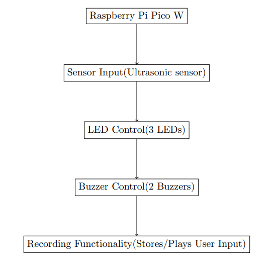
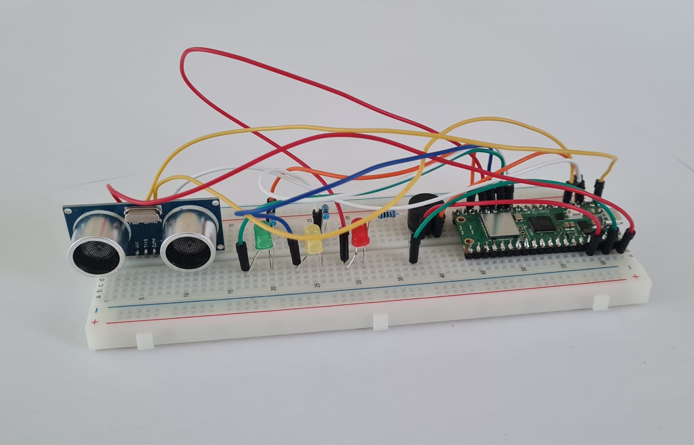

# Air piano

You can play music just by moving your fingers through air.

:::info

**Author**: Chirila Teodora \
**GitHub Project Link**: https://github.com/UPB-FILS-MA/project-ChirilaTeodora

:::

## Description

This project constructs a musical instrument resembling a piano, but utilizing proximity sensors instead
of physical keys. The Raspberry Pi Pico W detects the distance of a user’s fingers from the ultrasonic
sensor using ultrasonic waves. This detected distance is then translated into visual feedback via LEDs
and sound generation on the buzzers. The project offers the possibility of recording the user’s ”playing” for later playback.

## Motivation

I wanted to do something interesting and fun that would combine one of my passions, music.

## Architecture

The project can be visualized as follows:

Main Component (Software): The Rust program running on the Raspberry Pi Pico W.

Subcomponents:

- Sensor Input: Handles communication with the ultrasonic sensor and retrieves distance data.

- LED Control: Controls the three LEDs based on the detected distance.

- Buzzer Control: Generates tones on the buzzers corresponding to ”played” notes. (Potential addition: Recording functionality to store and playback user input.)

## Log

<!-- write every week your progress here -->

### Week 6 - 12 May

### Week 7 - 19 May

### Week 20 - 26 May

## Hardware

This project utilizes the following hardware components:

- Raspberry Pi Pico W: The microcontroller board that controls the entire system.

- Ultrasonic Sensor: Detects the distance of objects in front of it using ultrasonic waves.

- Three LEDs: Provide visual feedback based on the detected distance.

- Two Buzzers (Active or Passive): Generate sound for the piano functionality.

- Breadboard: Facilitates easy connection between components.

- Jumper Wires: Connect components to the breadboard and Raspberry Pi Pico.

### Schematics

.png)

### Bill of Materials

<!-- Fill out this table with all the hardware components that you might need.

The format is

| [Device](link://to/device) | This is used ... | [price](link://to/store) |

-->

| Device                                                                                                  | Usage               | Price                                                                                                                                                                                                                                                                                |
|-|-|-|
| [Raspberry Pi Pico](https://www.optimusdigital.ro/en/raspberry-pi-boards/12394-raspberry-pi-pico-w.html) | The microcontroller | [39 lei](https://www.optimusdigital.ro/en/raspberry-pi-boards/12394-raspberry-pi-pico-w.html)                                                                                                                                                                                        |
| [Breadboard](https://www.optimusdigital.ro/en/breadboards/8-breadboard-hq-830-points.html?search_query=bread+board&results=422)                                                                                          | Main board          | [10 lei](https://www.optimusdigital.ro/en/breadboards/8-breadboard-hq-830-points.html?search_query=bread+board&results=422)                                                                                                                                                                                                                                                          |
| [Jumper Wires](https://www.optimusdigital.ro/en/wires-with-connectors/12-breadboard-jumper-wire-set.html?search_query=wires&results=567&HTTP_REFERER=https%3A%2F%2Fwww.optimusdigital.ro%2Fen%2Fsearch%3Fcontroller%3Dsearch%26orderby%3Dposition%26orderway%3Ddesc%26search_query%3Dwires%26submit_search%3D)|   Connecting      | [8 lei ](https://www.optimusdigital.ro/en/wires-with-connectors/12-breadboard-jumper-wire-set.html?search_query=wires&results=567&HTTP_REFERER=https%3A%2F%2Fwww.optimusdigital.ro%2Fen%2Fsearch%3Fcontroller%3Dsearch%26orderby%3Dposition%26orderway%3Ddesc%26search_query%3Dwires%26submit_search%3D)                                                                                                                                                                    |
| [Passive Buzzer](https://www.optimusdigital.ro/en/buzzers/634-5v-passive-buzzer.html?search_query=buzzer&results=88)                                                                | Alert    | [1,40 lei](https://www.optimusdigital.ro/en/buzzers/634-5v-passive-buzzer.html?search_query=buzzer&results=88)                                                                                                                         |
| [Active Buzzer](https://www.optimusdigital.ro/en/buzzers/635-3v-active-buzzer.html?search_query=buzzer&results=88)                                                                                              | Alert              | [1,49 lei](https://www.optimusdigital.ro/en/buzzers/635-3v-active-buzzer.html?search_query=buzzer&results=88)                                                                                                                                                                                                                                                       |
| [Red LED](https://www.optimusdigital.ro/en/leds/29-5-mm-red-led-with-difused-lens.html?search_query=led&results=2179)                                                                         | It lights up         | [0,39 lei](https://www.optimusdigital.ro/en/leds/29-5-mm-red-led-with-difused-lens.html?search_query=led&results=2179)                                                                                                                                                                                                                                                          |
| [Yellow LED](https://www.optimusdigital.ro/en/leds/698-led-galben-de-3-mm-cu-lentile-difuze.html?search_query=led&results=2179)                                                                         | It lights up         | [0,39 lei](https://www.optimusdigital.ro/en/leds/698-led-galben-de-3-mm-cu-lentile-difuze.html?search_query=led&results=2179)                                                                                                                                                                                                                                                       |
| [Green LED](https://www.optimusdigital.ro/en/leds/38-5-mm-green-led-with-difused-lens.html?search_query=led&results=2179)                                                                         | It lights up         | [0,39 lei](https://www.optimusdigital.ro/en/leds/38-5-mm-green-led-with-difused-lens.html?search_query=led&results=2179)                                                                                                                                                                                                                                                       |
| [Ultrasonic Distance Sensor](https://www.optimusdigital.ro/en/distance-sensors/8150-hc-sr04p-ultrasonic-distance-sensor-3-55-v.html)                                                                         | Measure distances        | [7 lei](https://www.optimusdigital.ro/en/distance-sensors/8150-hc-sr04p-ultrasonic-distance-sensor-3-55-v.html)                                                                                                                                                                                                                                                      |
| [Resistors](https://www.optimusdigital.ro/en/resistors/33-025w-resistor-set-20-values-20-pcs-each.html)                                                                         | For LED's        | [7 lei](https://www.optimusdigital.ro/en/resistors/33-025w-resistor-set-20-values-20-pcs-each.html)                                                                                                                                                                                                                                                     |
| [Micro USB Cable](https://www.optimusdigital.ro/en/usb-cables/4576-cablu-albastru-micro-usb.html?search_query=usb+to+micro+usb&results=516)                                                                         | For LED's        | [3 lei](https://www.optimusdigital.ro/en/usb-cables/4576-cablu-albastru-micro-usb.html?search_query=usb+to+micro+usb&results=516) |

## Software
| Library | Description | Usage |
|---------|-------------|-------|
| [Embassy](https://github.com/embassy-rs/embassy) | A Rust-based framework designed specifically for embedded programming. | It's for programming the Raspberry Pi Pico and simplifying embedded concepts. |                         
| [embassy-hal](https://github.com/embassy-rs/embassy) | Hardware | Provides access to Raspberry Pi Pico W specific hardware functionalities. |

## Links

<!-- Add a few links that inspired you and that you think you will use for your project -->

1. [Air piano(not rust)](https://www.youtube.com/watch?v=vuxi6i8_HHA)
