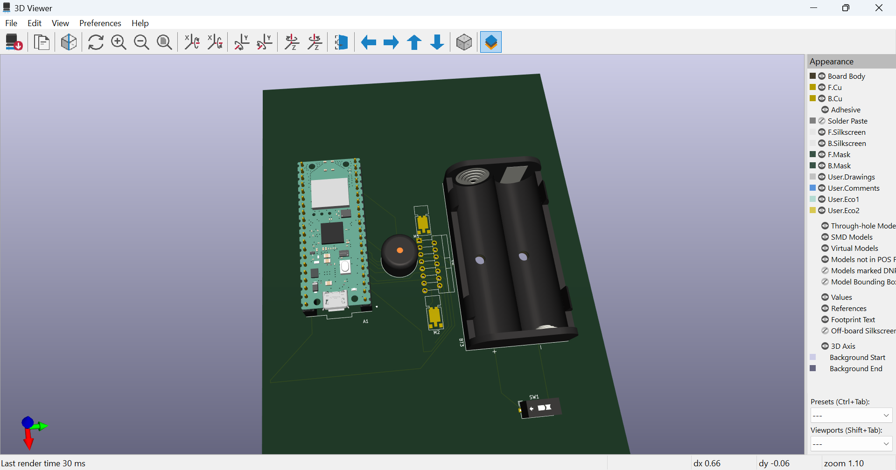

# Wifi Robot Car

A robot car that can be controlled through a website accessed from the mobile phone or a computer

:::info

**Author**: Dumitru Teodora-Iulia \
**GitHub Project Link**: https://github.com/UPB-FILS-MA/project-Teodora1807.git

:::


## Description


Welcome to the documentation for a Wi-Fi robot car, powered by the Pico W microcontroller and programmed using the Rust programming language. This comprehensive guide will present, at the final deadline, the assembly, setup, and programming of a Wi-Fi-enabled robot car. In this project, I aim to build a Wi-Fi robot car. The robot car will be capable of wireless communication over a Wi-Fi network, enabling remote control and autonomous operation. This project, if everything works at the end, can be stilized with specific components(like a proper car kit) for a more stylished look.

I am going to create a website using html, css and phython. The web page will have a controller for direction which is going to action the car by using the microcontroller and respecting the pins used to connect the pico_w to the driver. The pico is going to be connected to my wifi using the knowledge from the last lab. Also i hope that i succeed to control the speed by using a slider . 

## Motivation

When I was little, besides dolls and legos , i liked remote controlled cars or even helicopters so this is more like an ambition for me.

## Architecture 

This is my block diagram:

UPDATE:


I will attach here photos of my project, i intend to style it more before the final presentation.


I am going to connect the 2 motors to the 2 big wheels.
The motor driver module is going to be connected to the pico_w microcontroller and the module is going to be powered by the 2 batteries.
In addition, i intend to add a buzzer to the whole robot to copy the sound of a honk.
All of the components will be attached to the skeleton which is a piece of wood with round corners with space for the wheels the hard components and equipped with an on/off button if desired.

Update: I have connected the motors in this way : 

M1 OUT1 and OUT2; 
M2 OUT3 and OUT4;


## Log

<!-- write every week your progress here -->

### Week 6 - 12 May

I have started to work on the car. I made a kicad schematic to visualize everything. I have done some research to find out one of the most important things from the hardware part : the type of voltage pin i should connect the Vcc. I found out that Vsys is the right one for the battery power supply type of circuits. 
 
### Week 7 - 19 May

I have connected the motors as said above, glued the battery holder and the buzzer to the car and screw the driver module. I have soldered the OUTs for the motors to the driver, the wires to the buzzer and also the minus and plus pins of the on/off SPST switch to the driver and the battery holder as shown in the kicad scheme.

I finished the kicad scheme, PCB without errors and screenshot the 3D viewer.

I have done all the connections from driver to pico. 

I studied the ways of conntrolling the motors and their logical inputs.

In conclusion: I have added a on/off switch to preserve the life of the batteries.

### Week 20 - 26 May


## Hardware

The robot will have a microcontroller board like Pico w which support Wi-Fi and is connected to a Wi-Fi module or module with the Wi-Fi function integrated, that allows the car to connect to a Wi-Fi network and receive data from a smartphone. I am going to use the pico w microcontroller, a motor driver module, 2 motors, 4 rechargeable batteries but only 2 used simutaneous,a battery charger and a battery holder, the skelet of the car(2 big wheels + a small one for the front,the platform) , jumper wires and also a switch so that the battery can last longer. I will also design a web interface to make possible the automatic movement of the car. For the assembly part i will use screws for the skeleton of the care and fludor for the components that need to be glued.

1. Pico W Microcontroller
The Pico W microcontroller is the central processing unit of the robot car, responsible for executing the program logic, controlling the motors and sensors, and managing the Wi-Fi connectivity.

2.The kit
The kit consists in 2 wheels,1 small wheel, 2 motors and platform. The platform is the base for the other components, keeping them togheter. The 2 big wheels works with the 2 motors, only front + back directions and also with the Driver Motor which i will describe on the next point. The small wheel has the role to move the car on the horizontal axis. Motor speed and direction control are essential for maneuvering the robot car.

3.Motors
The motors consists of many winding of copper wire inside a magnetic field. These motors require more power than a microcontroller can supply so you cannot drive or control motors using a microcontroller directly. This is because the microcontroller boards work on low voltage and consumes less power and their Input/Output pins cannot supply enough current to drive your motors. If you try to connect a motor directly to a microcontroller board input/output pin, your microcontroller board may stop working. To get rid of this problem you must use a proper motor driver to control the direction as well as the speed of rotation.

4.L298N Motor Driver Module
This dual bidirectional motor driver, is based on the very popular L298 Dual H-Bridge Motor Driver Integrated Circuit. The circuit will allow you to easily and independently control two motors of up to 2A each in both directions. It is ideal for robotic applications and well suited for connection to a microcontroller requiring just a couple of control lines per motor.


There are two types of control pins found at the bottom right side of the module. One type controls the speed and the other type controls the direction of the motor.
The speed control pins labelled ENA and ENB on the module, control the speed of the dc motor and turn it ON and OFF. If ENA is in a HIGH state, the motor is enabled and if it is in a LOW state then the motor is off.
The direction control pins are the four input pins (IN1, IN2, IN3, IN4) on the module. Whenever one of the inputs is in a HIGH state (5V) then the motor will spin. Otherwise, when both the inputs are LOW (ground) state or both are in HIGH state then the motor stops. In order for motor A to spin forward, IN1 should be LOW and IN2 should be HIGH. For backwards motion, IN1 should be HIGH and IN2 should be LOW. Motor B is also controlled in a similar way.

5.Battery holder for 2
Using a battery holder in a robot car helps with: Securing a Power Source: A battery holder ensures that the power source, typically a battery, is securely mounted within the robot car. This prevents the battery from moving around or disconnecting during movement, which could lead to power interruptions and unexpected behavior; Protection: It provides a protective enclosure for the battery, shielding it from damage due to impact or environmental factors such as moisture or dust; this helps to prolong the life of the battery and ensures reliable power delivery to the robot car's components; Convenience: A battery holder simplifies the process of installing and replacing the battery in the robot car; it typically features slots or clips designed to securely hold the battery in place, making it easy to insert and remove as needed; Organization: It helps to organize the wiring and components within the robot car, keeping everything neat and tidy; This can make it easier to troubleshoot and perform maintenance on the robot car's electrical system. Overall, using a battery holder in a robot car helps to ensure reliable power supply, protect the battery from damage, and simplify maintenance and installation tasks.

6.Battery Charger for 2
Putting a battery charger on a robot car is essential for several reasons: Battery Maintenance: A battery charger ensures that the battery in the robot car remains charged and ready for use. Regular charging helps maintain the battery's capacity and prolong its overall lifespan; Convenience: Having a battery charger allows you to easily recharge the battery whenever necessary, without the need to replace it with a fresh one. This convenience saves time and effort, especially during testing and development phases where the robot car may be used frequently; Optimal Performance: A fully charged battery ensures optimal performance of the robot car's motors and other electronic components. Low battery levels can lead to reduced motor power, slower response times, and inaccurate sensor readings, affecting the overall performance and reliability of the robot car; Safety: Properly charging the battery using a dedicated charger helps prevent overcharging, which can damage the battery and pose safety risks such as overheating or even fire hazards. Choosing to power the circuit with rechargable batteries is safer than powering with a charging circuit to prevent overheating the components. In summary, using a battery charger ensures the reliable operation, optimal performance, and safety of the battery-powered robot car, making it an essential component of the overall system.

7.Battery


### Schematics





### Block diagram

UPDATE:


### Bill of Materials

<!-- Fill out this table with all the hardware components that you might need.

The format is 
```
| [Device](link://to/device) | This is used ... | [price](link://to/store) |

```

-->

| Device | Usage | Price |
|--------|--------|-------|
| [Rapspberry Pi Pico W](https://www.raspberrypi.com/documentation/microcontrollers/raspberry-pi-pico.html) | The microcontroller | [35 RON](https://www.optimusdigital.ro/en/raspberry-pi-boards/12394-raspberry-pi-pico-w.html) |
| 2 wheels,1 small wheel, 2 motors, platform  | The kit ; is second hand i dont have a link | 15 RON |
| Battery Charger for 2 | To recharge the used batteries | [24,99 RON](https://www.optimusdigital.ro/ro/incarcatoare-de-baterii/11021-incarcator-1865026650-dublu-cu-cablu-usb-pentru-baterii-cu-litiu-ion.html) |
| 4 x Batteries | The power source of the whole project | [68 RON](https://www.dedeman.ro/ro/acumulator-li-ion-well-18650-3-7v-2200-mah/p/1050265) |
| Battery holder for 2 | ensure reliable power supply | [4.99 RON](https://www.optimusdigital.ro/ro/suporturi-de-baterii/941-suport-de-baterii-2-x-18650.html) 
| L298N Motor Driver Module |  directions controlling  | [20 RON](https://www.optimusdigital.ro/ro/drivere-de-motoare-cu-perii/145-driver-de-motoare-dual-l298n.html)|
| Jumper wires| To ensure the connections between components | already have |


## Software

| Library | Description | Usage |
|---------|-------------|-------|
| [Embassy-rs](https://github.com/embassy-rs/embassy) | Motor driver implementation | Modern embedded framework, using Rust and async. |
| [L298N](https://docs.rs/l298n/latest/l298n/struct.L298N.html) | Motor driver implementation | Used for speed and direction control |
| [PWM](https://docs.embassy.dev/embassy-nrf/git/nrf52840/pwm/index.html) | PWM | Used to control the intensity of the sound of the buzzer |
| [cyw43](https://docs.embassy.dev/cyw43/git/default/index.html)| Rust driver for the CYW43439 wifi chip | Used for the connection to an existing network and create a server |


## Links

<!-- Add a few links that inspired you and that you think you will use for your project -->

1. [Robot car1](https://www.instructables.com/Wifi-Controlled-Robot-Using-Raspberry-Pi/)
2. [Robot car2](https://diyprojectslab.com/raspberry-pi-pico-w-remote-controlled-car/)
