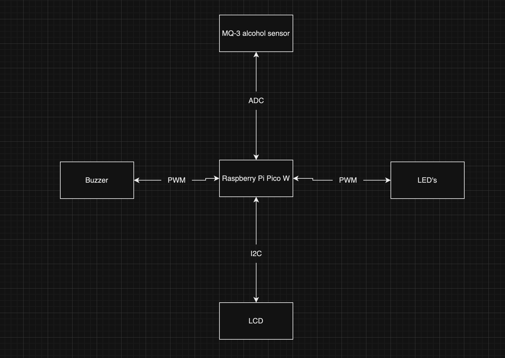
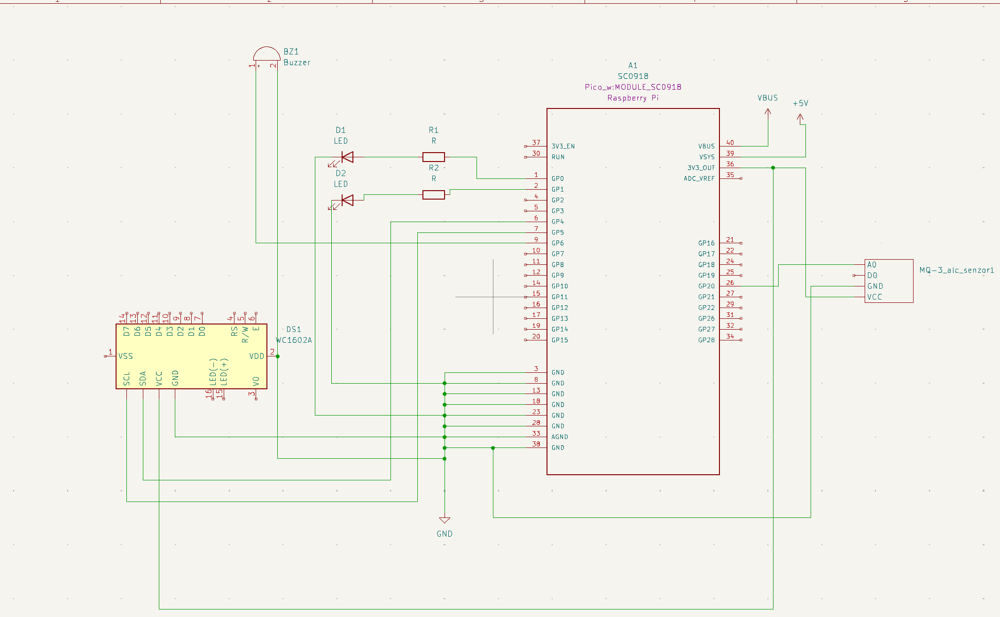

# Breathalyzer
A breathalyzer which detects the alcohol in the blown air.

:::info 

**Author**: Tudor-Cristian Arhir \
**GitHub Project Link**: https://github.com/UPB-FILS-MA/project-TudorArhir

:::

## Description

 My project is a breathalyzer with a LCD (which shows the precentage of alchohol in the air(and some other stuff)), a buzzer, an alcohol sensor, 2 LED's  and a button which resets the number so we can have another reading.( the "no idea" price tag on the components is there because they come from an arduino kit which i bought 1 year ago and i cannot remember the price). It has a 3D-printed case which makes it look more practical than just wires and components on a breadboard . I want this project to be something useful and at the same time something fun which anybody can use.

## Motivation

I chose this project based on two important factors:
- on my 20th birthday my friends got me a real breathalyzer which is very usefull for me because i love to drive
- I wanted to make it more practical and easy to use for anybody at any time(we use it at gatherings and parties)

I want to put in use everything that i learned until now and to learn new things that will make this passion of mine to grown on a larger scale.

## Architecture 

Add here the schematics with the architecture of your project. Make sure to include:
 - what are the main components (architecture components, not hardware components)
 - how they connect with each other

## Log

<!-- write every week your progress here -->

### Week 6 - 12 May
In this week i've constructed the project itself on the breadboard. At first , it was kinda difficult to figure out how all those componets should be put on the breadboard but eventually with some research i found out how to do it. I also had to buy another LCD because mine did not have the I2C interface and i couldn't use it without that interface.
### Week 7 - 19 May

### Week 20 - 26 May

## Hardware

The idea is simple : someone who drinks alcohol(a beer for example) blows into the MQ-3 sensor and then 3 thing will happen :
 1. The LCD will show some data which shows the precentage of alcohol in the air that was blown into the sensor
 2. The buzzer will make a sound to signal that the upper limit of detected alcohol in the air has been passed
 3. The LED's will be one red and one blue, which resembles the lights on a police car ( this is just for looks )
### Schematics

Place your KiCAD schematics here.

### Bill of Materials

| Device | Usage | Price |
|--------|--------|-------|
| [Rapspberry Pi Pico W](https://www.raspberrypi.com/documentation/microcontrollers/raspberry-pi-pico.html) | The microcontroller | [35 RON](https://www.optimusdigital.ro/en/raspberry-pi-boards/12394-raspberry-pi-pico-w.html) |
| LCD1602 Module | The display | from an arduino kit |
| MQ-3 | The alcohol sensor| [15 lei](https://www.optimusdigital.ro/en/gas-sensors/1125-modul-senzor-de-gaz-mq-3.html) |
| Buzzer | Emits sound if you pass the alcohol limit | from an arduino kid |
| Jumper cables | To cable things | from an arduino kit |
| Button | To reset the breathalyzer | from an arduino kit |
| 2 LED's | Used for signaling when the limit was passed | from an arduino kit |
| 3D Printed case | To make it more practical | tbd |

## Software

| Library | Description | Usage |
|---------|-------------|-------|
| [embassy-rp](https://github.com/embassy-rs/embassy/tree/main/embassy-rp) | RP2040 peripherals | Used for accessing the peripherals of the Pico W |
| Work in progress | To be updated | TBA |

## Links

<!-- Add a few links that inspired you and that you think you will use for your project -->

1. [How does a breathalyzer work](https://www.medicalnewstoday.com/articles/breathalyzer-test)
2. [Breathalyzer with pico w](https://forums.raspberrypi.com/viewtopic.php?t=226459)
3. [How does an MQ-3 work](https://help.sinric.pro/pages/tutorials/custom-device-types/alcohol-sensor/MQ-3)
