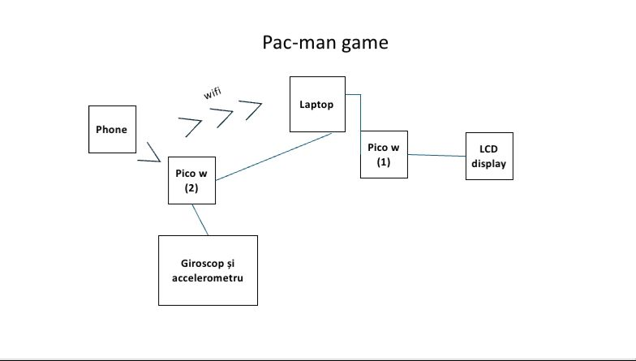
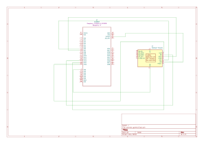
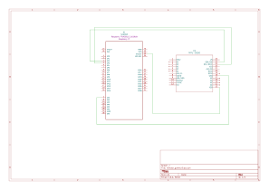

# Pacman Game
The project aims to create a Pacman Game that is going to be played on a LCD screen
:::info


**Author**: Balba Tudor-Neculai in collaboration with Solomon Miruna-Maria\
**GitHub Project Link**: [Pacman Game](https://github.com/UPB-FILS-MA/project-tudorb1011)

:::

## Description

In this project, we're creating a modern twist on the classic Pac-Man game using a Pico W microcontroller and an LCD screen. The game logic, including Pac-Man's movements and level progression, is governed by the Pico W. Players can control Pac-Man remotely from a laptop via network communication, guiding him through the maze to avoid ghosts and collect pellets. This setup offers a hands-on gaming experience with responsive gameplay, blending nostalgia with cutting-edge technology.

## Motivation

This project combines elements of retro gaming, embedded systems development, and network communication, offering a unique and engaging experience for players. By developing a Pac-Man game on a Pico W microcontroller with network connectivity, we aim to demonstrate the versatility and capabilities of embedded systems in gaming applications. This project also provides an opportunity to explore the integration of hardware and software components, including display drivers, networking protocols, and game logic, fostering interdisciplinary learning and innovation. 
## Architecture 


## Log

<!-- write every week your progress here -->

### Week 6 - 12 May
- **Documentation**
- **Architecture for the project**
### Week 7 - 19 May

### Week 20 - 26 May

## Hardware

- **MPU-9250 sensor** is used for recognizing hand gestures and also to register them
- **Raspberry Pi Pico W** there are 2 in our project, the main components (microcontrollers), are responsible for processing and transmitting input data, one is used for the remote and one for the game screen
- **LCD_ILI9341** is used to play the game and show how the pictogram is going to move
- **Breadboard** is used for connecting every pin of the hardware components
- **Wires** used for connecting the components

### Schematics




### Bill of Materials

<!-- Fill out this table with all the hardware components that you might need.

The format is 
```
| [Device](link://to/device) | This is used ... | [price](link://to/store) |

```

-->

| Device | Usage | Price |
|--------|--------|-------|
| [Rapspberry Pi Pico W *2](https://www.raspberrypi.com/documentation/microcontrollers/raspberry-pi-pico.html) | The microcontroller | [70 RON](https://www.optimusdigital.ro/en/raspberry-pi-boards/12394-raspberry-pi-pico-w.html) |
| [Modul Accelerometru și Giroscop MPU6500 GY](https://docs.nanoframework.net/devicesdetails/Mpu9250/README.html)| The gyroscope | [20 RON](https://www.optimusdigital.ro/ro/senzori-senzori-inertiali/1672-modul-accelerometru-i-giroscop-mpu6500-gy.html?search_query=giroscop&results=49) |
| [Modul LCD de 2.8'' cu SPI și Controller ILI9341](https://docs.rs/lcd-ili9341/0.1.0/lcd_ili9341/) | LCD screen | [70 RON](https://www.optimusdigital.ro/ro/optoelectronice-lcd-uri/3550-modul-lcd-de-28-cu-spi-i-controller-ili9341-240x320-px.html?search_query=Lcd&results=209) |
| [Breadboard HQ](https://os.mbed.com/handbook/Breadboard)| A breadboard for the remote | [5 RON](https://www.optimusdigital.ro/ro/prototipare-breadboard-uri/44-breadboard-400-points.html?search_query=Breadboard+hq+400&results=23) |
| Kit Plusivo| Wires and resistors | [50 RON](https://www.optimusdigital.ro/ro/kituri/12026-kit-plusivo-pentru-introducere-in-electronica-0721248990075.html?search_query=%09Kit+Plusivo+pentru+Introducere+in+Electronica&results=3) |
| Micro USB wire *2| USB wires for the pico w| [14 RON](https://www.optimusdigital.ro/ro/cabluri-cabluri-usb/497-cablu-micro-usb-1-m-negru.html?search_query=cablu+usb+mic+usb+mare&results=42) |


## Software

| Library | Description | Usage |
|---------|-------------|-------|
| [embassy-net](https://github.com/embassy-rs/embassy)| Ethernet module  | In case that the network won t be stable |\
| [embedded-sensors v0.1.1](https://github.com/justdimaa/embedded-sensors)| embedded-sensors library | For using the gyroscope |\
| [lcd-ili9341](https://github.com/sharebrained/rust-lcd-ili9341)| LCD driver for rust | Used for the display of future game |


## Links

[Pacman game](https://www.youtube.com/watch?v=rUgfixMTfW8)\
[Wii remote](https://www.youtube.com/watch?v=ETAKfSkec6A)
