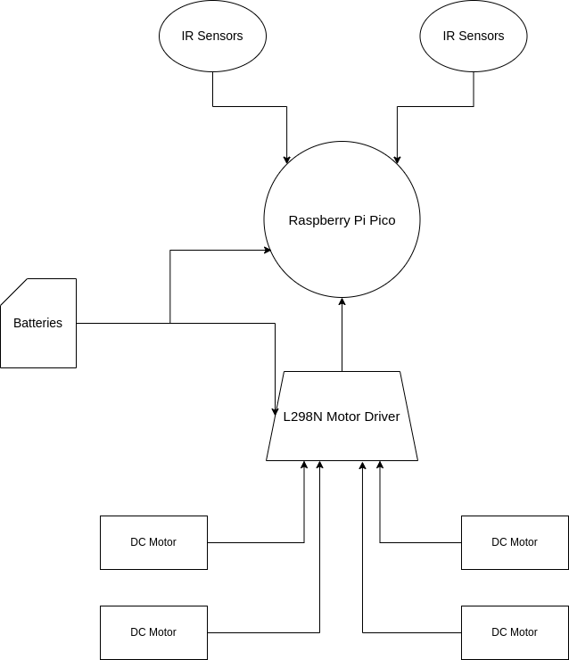
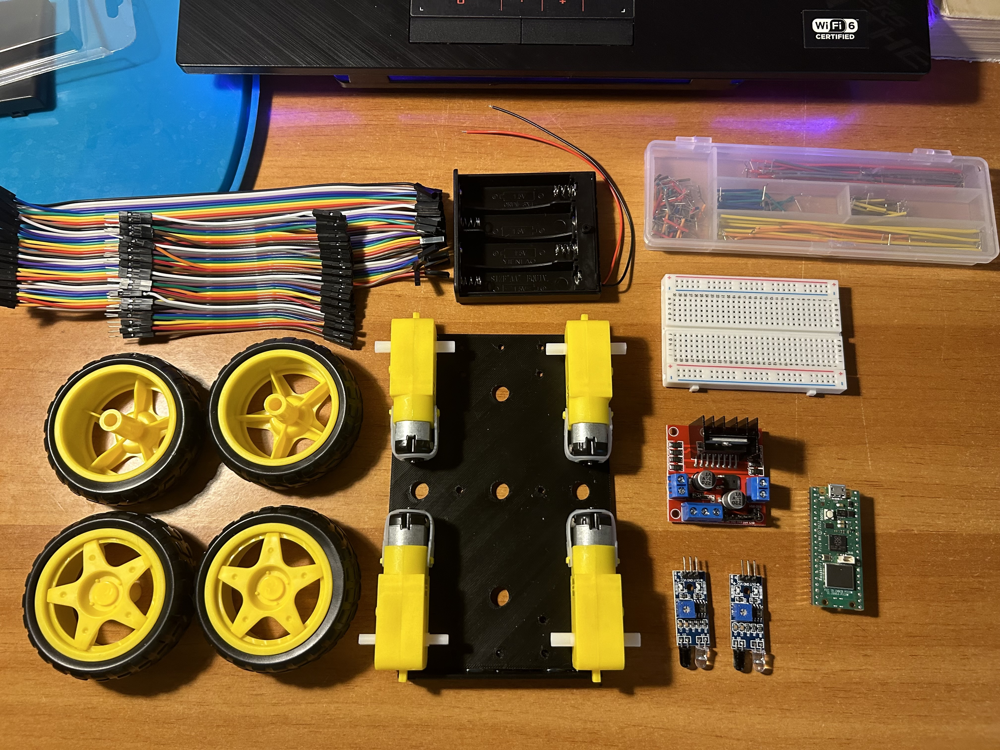
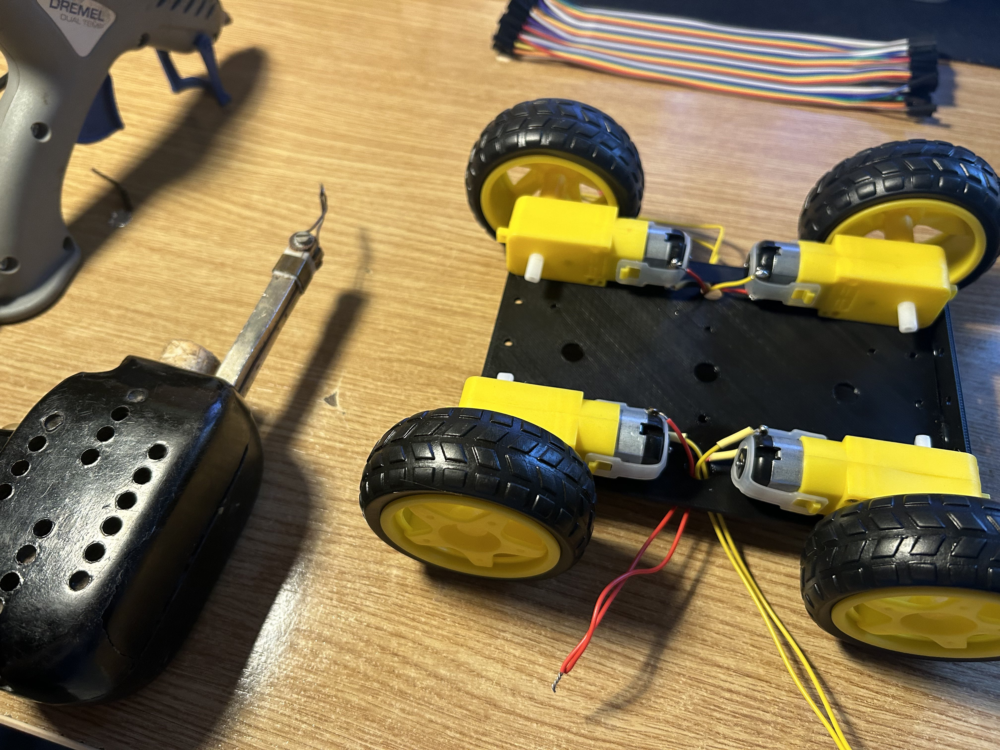
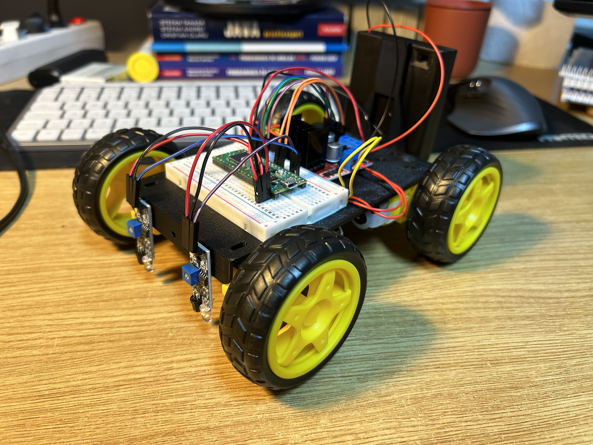
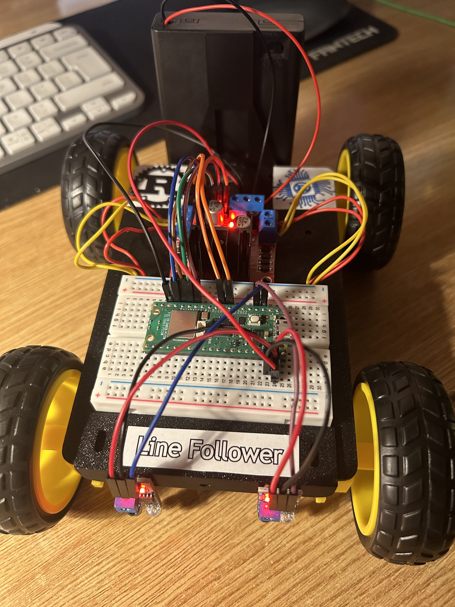
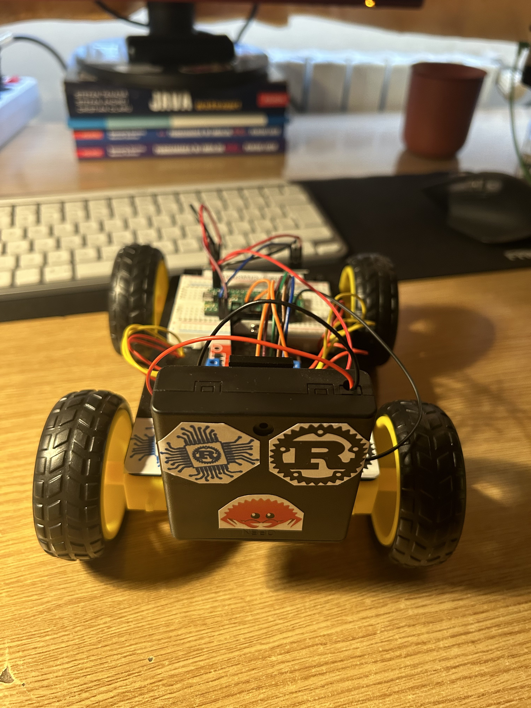
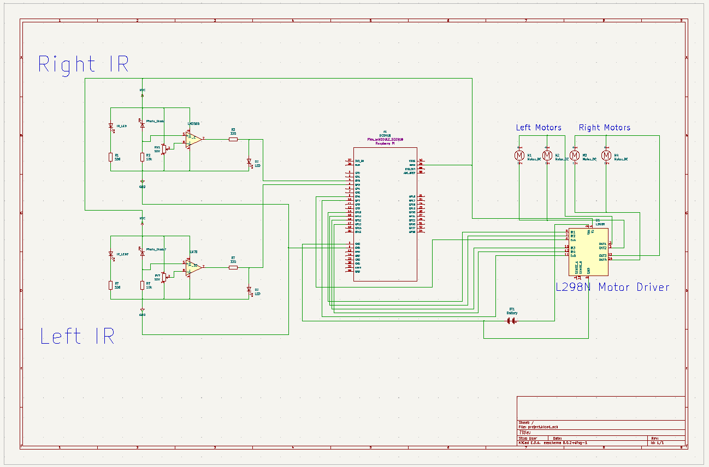

# Line Follower
A robot that follows a black line on a white background.

:::info

**Author**: Istudor Victor Mihai \
**GitHub Project Link**: https://github.com/UPB-FILS-MA/project-istudormihai

:::

## Description

This robot will be capable of following a trajectory given by a black line on a white background, with the help of two infrared sensors placed in the front. The robot will be powered by 4 AA batteries that will give current to 4 DC motors connected to a L298N motor driver. 

## Motivation

I chose this project because i started to have a passion for robotics. Being a member of the robotics club within the FILS faculty, i had to build a similar robot for the PoliFest event, but it used an Arduino UNO and the coding part was fairly simple, as it was written in C. As soon as i saw the project rules, i thought that i can give myself a bit of a challenge by building the same robot, but in this case using a Raspberry Pi Pico, having its software written in Rust. 

## Architecture 

<!-- Add here the schematics with the architecture of your project. Make sure to include:
 - what are the main components (architecture components, not hardware components)
 - how they connect with each other -->

 

## Log

<!-- write every week your progress here -->

### Week 6 - 12 May
My parts order arrived and i started to think about the way i can build this robot.
Looked up on the internet for some Rust libraries that could help me write the software.
### Week 7 - 19 May
Finished the KiCad schematic and built the robot.
Started working on the software.
### Week 20 - 26 May

## Hardware

The "brain" of this robot will be the Raspberry Pi Pico microcontroller. The IR sensors and motor driver will be connected to it. The batteries will be able to power the motor driver and the Pico. All 4 of the 3V-6V DC motors will be hooked-up to the H-bridge.

These are the components that i will use:




Soldering:



The final product!



I added some stickers.





### Schematics



### Bill of Materials

<!-- Fill out this table with all the hardware components that you might need.

The format is 
```
| [Device](link://to/device) | This is used ... | [price](link://to/store) |

```

-->

| Device | Usage | Price |
|--------|--------|-------|
| [Rapspberry Pi Pico W](https://www.raspberrypi.com/documentation/microcontrollers/raspberry-pi-pico.html) | The microcontroller | [35 RON](https://www.optimusdigital.ro/en/raspberry-pi-boards/12394-raspberry-pi-pico-w.html) |
| [2x IR Sensor Module](https://www.circuits-diy.com/hw201-infrared-ir-sensor-module/) | Used for line detection | [8,78 RON](https://ardushop.ro/ro/electronica/41-modul-senzor-ir-infrarosu-evita-obstacole.html?search_query=infrarosu&results=29) |
| [4x DC Motors](https://media.digikey.com/pdf/Data%20Sheets/Adafruit%20PDFs/3777_Web.pdf)| Motors | [19,28 RON](https://ardushop.ro/ro/electronica/64-motor-dc-3v-6v-cu-reductor-148.html) |
| [L298N Dual H Bridge](https://www.sparkfun.com/datasheets/Robotics/L298_H_Bridge.pdf) | The motor driver | [11,49 RON](https://ardushop.ro/ro/electronica/84-l298n-punte-h-dubla-dual-h-bridge-motor-dcsteppe.html) |
| Female to female jumper wires | Wires | [11,07 RON](https://ardushop.ro/ro/electronica/25-40-x-fire-dupont-mama-mama-10cm.html?search_query=DQYNCA_FDP-FF-40x20&results=111) |
| Male to female jumper wires | Wires | [5,18 RON](https://ardushop.ro/ro/electronica/23-40-x-dupont-cables-female-male-10cm.html?search_query=OTGKMP_FDP-FM-40x10&results=52) |
| Jumper set | Wires | [8,68 RON](https://ardushop.ro/ro/home/1374-set-jumper-breadboard-140.html?search_query=HWCYUB_BB-140&results=61) |
| Breadboard | - | [3,35 RON](https://ardushop.ro/ro/electronica/34-breadboard-400.html?search_query=PGIGAD_BB-400&results=170) |
| 4x Rubber Wheels | Wheels | [42.84 RON](https://ardushop.ro/ro/home/63-riata-roboti-cauciuc-65mm-diametru.html) |

## Software

| Library | Description | Usage |
|---------|-------------|-------|
| [embassy](https://github.com/embassy-rs/embassy) | Framework | Used for building embedded applications in Rust |
| [gpio](https://docs.embassy.dev/embassy-stm32/git/stm32c011d6/gpio/index.html) | General-purpose Input/Output (GPIO) module | Used to control GPIO pins |
| [infrared](https://docs.rs/infrared/latest/infrared/) | Infrared sensor library | Used for the sensors that will track the line |
| [syact](https://docs.rs/syact/latest/syact/) | Motor control library | Used for controlling the DC motors |

## Links

<!-- Add a few links that inspired you and that you think you will use for your project -->

1. [Principle Operation of a Line Follower Robot.](https://www.opastpublishers.com/open-access-articles/principle-operation-of-a-line-follower-robot.pdf)
2. [How IR sensors work.](https://robu.in/ir-sensor-working/)
3. [How the L298N motor driver works.](https://howtomechatronics.com/tutorials/arduino/arduino-dc-motor-control-tutorial-l298n-pwm-h-bridge/)
4. [IR Sensor Module Circuit.](https://www.instructables.com/DIY-IR-Module/)
