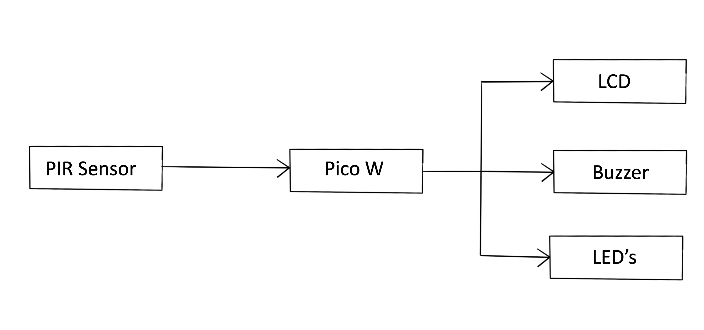
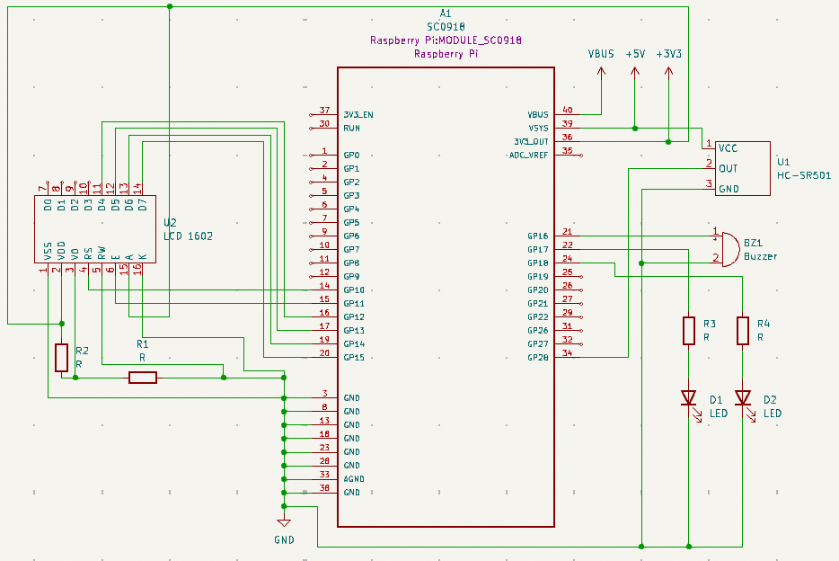

# Motion-based Alarm System

A Rust-powered alarm system based on motion detection, with audio-visual feedback and a time log feature.

:::info 

**Author**: Vlad Alexandru Vulturescu \
**GitHub Project Link**: https://github.com/UPB-FILS-MA/project-VladVulturescu

:::

## Description

An alarm system based on motion detection, featuring audio and visual feedback and a time log displayed on an LCD screen. This system uses a Raspberry Pi Pico W to process input from a PIR motion 
sensor to detect presence and activate alerts.

## Motivation

This project was chosen to explore practical applications of embedded systems in security, utilizing motion detection to develop a reliable, low-cost alarm system suitable for residential 
properties. It aims to provide an intuitive system for enhancing home security.

## Architecture 

The system architecture comprises a Raspberry Pi Pico W, which serves as the central processing unit. It is connected to an HC-SR501 PIR motion sensor for detecting movement. Upon detection, the 
microcontroller triggers an audio alarm (buzzer), a light alarm (LED's) and displays the activation time on the LCD. The button inputs allow for system reset.

## Log

<!-- write every week your progress here -->

### Week 6 - 12 May

### Week 7 - 19 May

### Week 20 - 26 May

## Hardware

The Motion-based Alarm System leverages essential electronic components designed to interact seamlessly for effective monitoring and alerting functions:

- Raspberry Pi Pico W: Acts as the central processing unit of the system, handling the computation and control logic. It processes signals from sensors and manages outputs to other devices.
- HC-SR501 PIR motion sensor: This sensor detects infrared signals from moving objectsor people, triggering the alarm system when motion is detected within its field of view.
- LCD: Displays the time of the "break-in".
- Buzzer: This will produce the actual alram sound, prividign the audio feedback
- LED's: The LED's will light up at the same time when the buzzer activates, prividing visual feed-back.
- Buttons: Used for user input and allow for manual resetting of the alarm.
- Breadboard and Jumper Wires: Provide platform for prototyping the circuit, facilitating easy setup and adjustments.
- Resistors: Ensure proper functioning of the circuit, as well as protect sensitive components from excessive current and manage voltage levels.

### Schematics

### Bill of Materials

| Device | Usage | Price |
|--------|--------|-------|
| [Rapspberry Pi Pico W](https://www.raspberrypi.com/documentation/microcontrollers/raspberry-pi-pico.html) | The microcontroller | [35 RON](https://www.optimusdigital.ro/en/raspberry-pi-boards/12394-ras$
| [Breadboard](https://cdn.sparkfun.com/assets/learn_tutorials/4/7/12615-02_Full_Size_Breadboard_Split_Power_Rails.jpg) | The basis for the project | [10 RON](https://www.optimusdigital.ro/ro/prototipare$
| [HC-SR501 PIR motion sensor](https://www.mpja.com/download/31227sc.pdf) | For detecting movement | [7 RON](https://www.robofun.ro/hc-sr501-pir-motion-sensor-module-green.html?gad_source=1&gclid=Cj0KCQj$
| [Buzzer](https://static.optimusdigital.ro/51533/5v-passive-buzzer.jpg) | Emmits the actual alarm sound | [4 RON](https://ardushop.ro/ro/electronica/194-buzzer.html?search_query=buzzer&results=16) |
| [LCD](https://ardushop.ro/5473/lcd-1602.jpg) | The screen | [9 RON](https://ardushop.ro/ro/electronica/36-lcd-1602.html?gad_source=1&gclid=Cj0KCQjwltKxBhDMARIsAG8KnqW9xcNF8xYGWvhIZg0jziN0vcJ_Rx6d8ObsTI$
| [LED's](https://www.arborsci.com/cdn/shop/products/redLED1500x1000.jpg?v=1684434191) | Light up when the alarm is triggered | [0,45 RON](https://ardushop.ro/ro/electronica/299-led-5mm.html?search_query$
| [Buttons](https://stemextreme.com/wp-content/uploads/2021/01/09190-03-L-1.jpg) | For resetting the alarm | [0,4 RON](https://www.optimusdigital.ro/en/buttons-and-switches/1119-6x6x6-push-button.html?se$
| [Resistors](https://res.cloudinary.com/rsc/image/upload/b_rgb:FFFFFF,c_pad,dpr_2.625,f_auto,h_214,q_auto,w_380/c_pad,h_214,w_380/F2141951-01?pgw=1) | So components don't get destroyed and for voltage d$
| [Jumper Wires](https://res.cloudinary.com/rsc/image/upload/b_rgb:FFFFFF,c_pad,dpr_1.0,f_auto,q_auto,w_700/c_pad,w_700/R2048239-01) | For making connections | [4 RON](https://www.optimusdigital.ro/ro/fi$

## Software

| Library | Description | Usage |
|---------|-------------|-------|
| [pir-motion-sensor](https://crates.io/crates/pir-motion-sensor/2.0.2) | Rust library for PIR motion sensors |For working with PIR sensors, the HC-SR501 speciffically |

## Links

1. [HC-SR501 data sheet](https://datasheetspdf.com/pdf-down/H/C/-/HC-SR501-ETC.pdf)
2. [crates.io](https://crates.io)
3. [Raspberry Pi Documentation](https://www.raspberrypi.com/documentation/microcontrollers/raspberry-pi-pico.html)
4. [Sparkfun]](https://learn.sparkfun.com)
