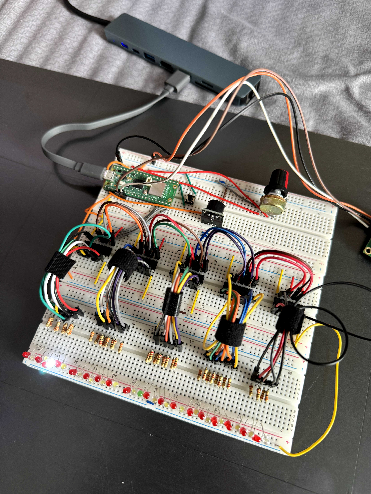
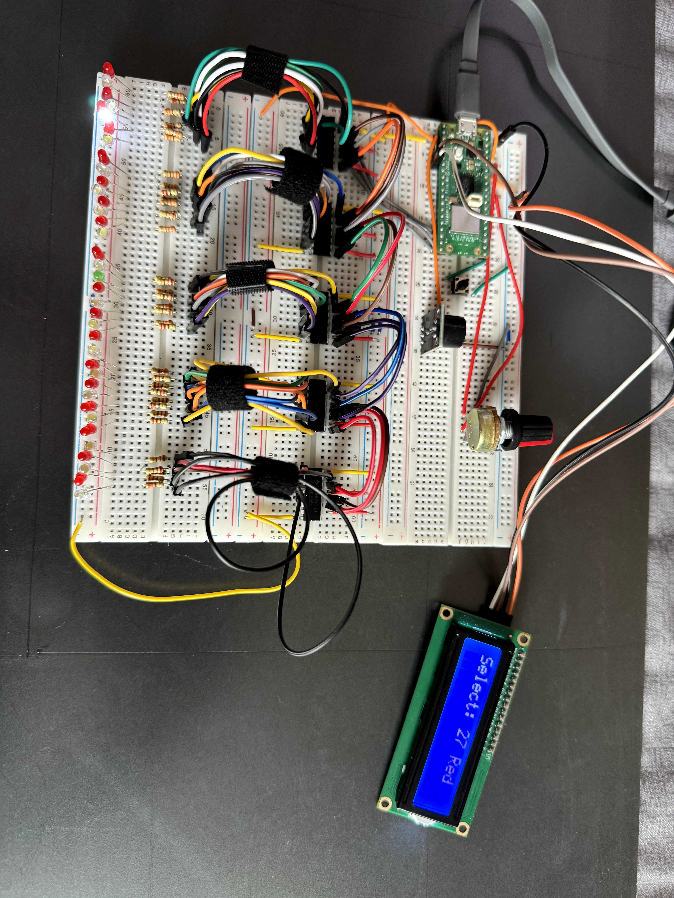
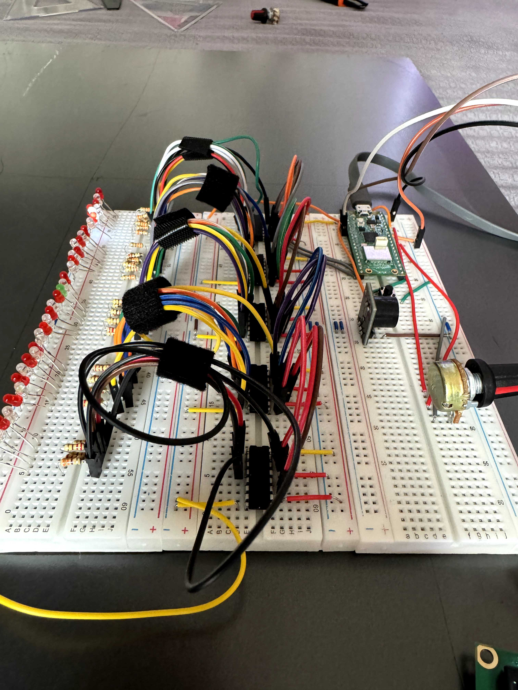
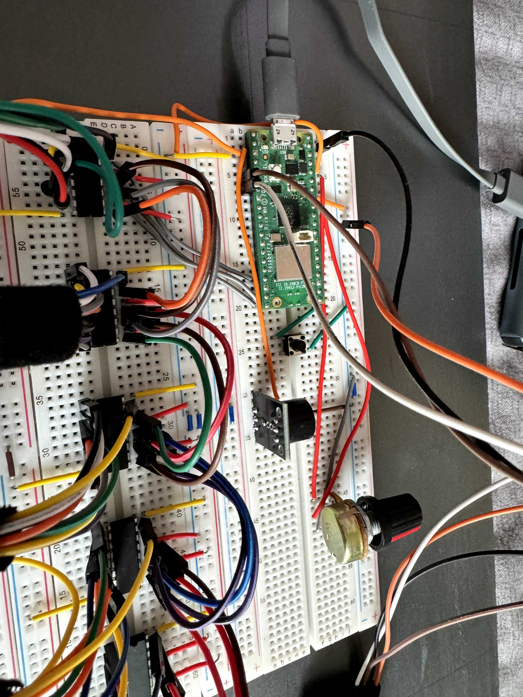
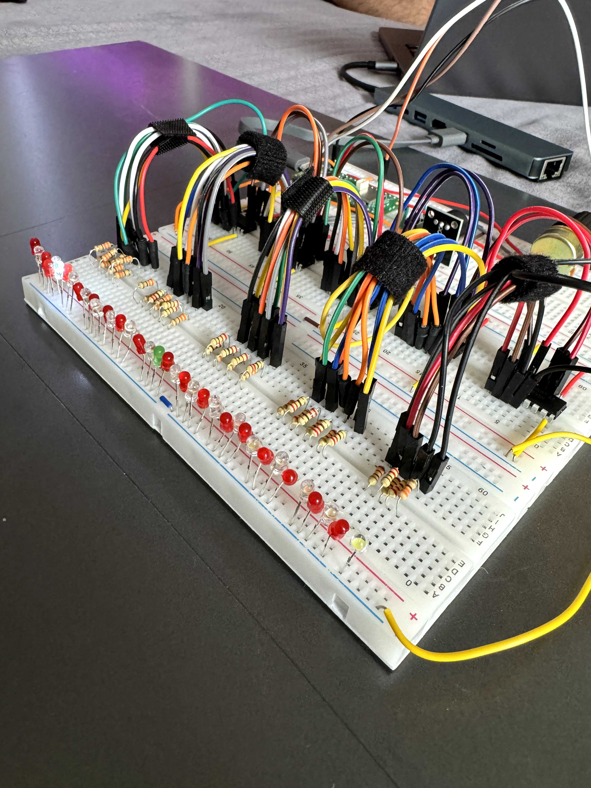
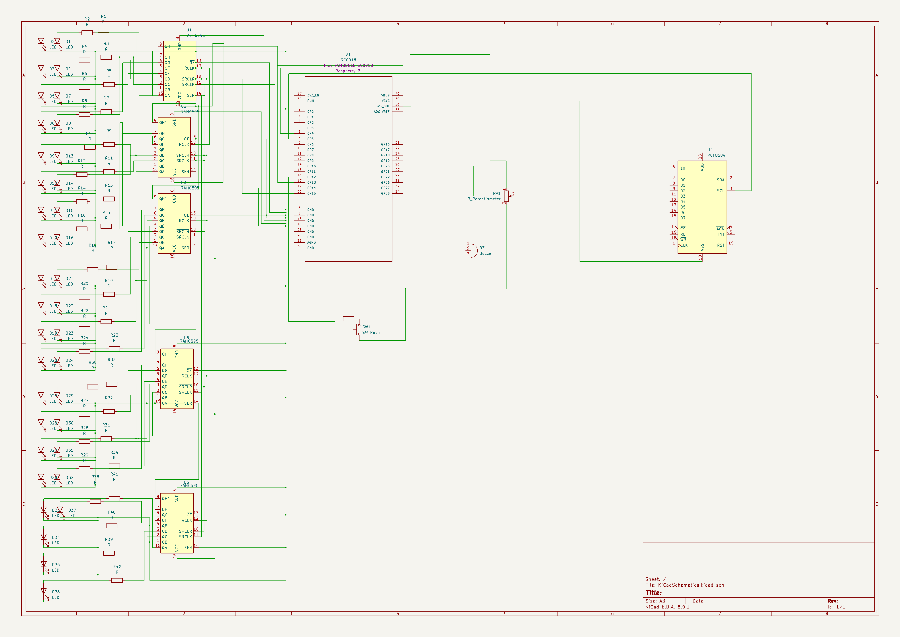

# Casino Roulette Mini Game
A mini game that brings the casino right to your tabletop. Spin, bet, and win big!

:::info 

**Author**: DUMITRU Vlad Andrei 

**GitHub Project Link**: https://github.com/UPB-FILS-MA/project-kevinvlad03

:::

## Description

This project aims to recreate the captivating experience of Casino Roulette, encapsulating the thrill and randomness of betting games, through the integration of modern computing with traditional casino elements. By leveraging the compact yet powerful Raspberry Pi Pico W and the efficiency and safety of the Rust programming language, we embark on creating a digital version of the classic Roulette game. 

## Motivation

The motivation behind this project is to blend the excitement and allure of casino gaming with the educational and technical challenges of building a digital game. It serves as a practical application to explore electronics and programming, while also offering an engaging and interactive way to understand the probabilities and mechanics of roulette. This project aims to inspire creativity, foster problem-solving skills, and provide a fun platform for learning and experimentation.

## Architecture 

In it's final stage, my project will look more or less like the following diagram:


* The round roulette shape will be made of LEDs of the indicated colors.
* The central LCD screen will display information about game status.
* By pressing the button, you will initiate a new game by selecting to bet either on a number, or a color.
* With the potentiometer, you will select your lucky number or color.
## Log

<!-- write every week your progress here -->

### Week 6 - 12 May
Worked mostly on hardware components and connections, testing the best way of connection and the best way to make the roulette spin. I also started working on the software part, trying to make the LEDs spin and stop on a random number.
### Week 7 - 19 May
Managed to fully integrate the spinning roulette with the LEDs, and also managed to make the LEDs stop on a random number. I also completed the LCD display software and hardware, which will display the current odds and game information. Moreover, the push-button switch was integrated to trigger the game, and the potentiometer was connected to select the desired number. The buzzer was also added to emit a sound when the LEDs are spinning.
### Week 20 - 26 May
What remains is to try and solder the LEDs on a PCB, make the final adjustments to the software and additionaly, build a box for the project. I also plan to add a few more features to the game, such as betting on colors, and adding a few more sounds to the buzzer.

## Hardware

1. **Raspberry Pi Pico W**: Microcontroller board for running the game logic.
2. **LEDs**: Visual indicators representing current number selected on the spinning roulette.
3. **LCD 1602 module**: Display for showing current odds and game information.
4. **Buzzer**: Emmits a sound when the leds are spinning.
5. **Push-button switch**: Trigger for starting the game.
6. **Potentiometer**: Control for selecting the winning number.
7. **Breadboard**: Platform for prototyping and connecting components.
8. **Jumper wires**: Connectors for establishing electrical connections on the breadboard.
9. **Shift Registers**: Reduce the number of wires needed to connect the LEDs.
10. **PCB Board**: For soldering the LEDs and making the roulette shape.

In the project, the Raspberry Pi Pico W runs the game logic, while LEDs visualize the spinning motion of the roulette values, the LCD 1602 module displays game information, the push-button switch triggers the game, and the potentiometer selects the winning number. These components are connected using a breadboard and jumper wires for prototyping and experimentation.

Here are some pictures of the current state of the project`s hardware:







### Schematics



### Bill of Materials

<!-- Fill out this table with all the hardware components that you might need.

The format is 
```
| [Device](link://to/device) | This is used ... | [price](link://to/store) |

```

-->


| Device                           | Usage               | Price |
|----------------------------------|---------------------|-------|
| Raspberry Pi Pico W              | Microcontroller Core | [35 Lei](https://www.optimusdigital.ro/ro/placi-raspberry-pi/12394-raspberry-pi-pico-w.html) |
| LCD 1602 Display (I2C Interface) | Display Output       | [25 Lei](https://www.bitmi.ro/ecran-lcd1602-cu-modul-i2c-iic-10487.html?gad_source=1) |
| Breadboard 830 Tie Points MB-102 | Prototype Platform   | [10 Lei](https://www.bitmi.ro/breadboard-830-puncte-mb-102-10500.html?gad_source=1) |
| Set of 200 LEDs (3mm & 5mm)      | Visual Indicators    | [16 Lei](https://www.bitmi.ro/componente-electronice/set-200-led-uri-de-diferite-culori-3-mm-5-mm-10508.html) |
| Tactile Push Button              | User Input           | [6.5 Lei](https://ardushop.ro/ro/home/97-buton-mic-push-button-trough-hole.html?gad_source=1) (for 10) |
| Red Button Cases                 | Visual Enhancement   | [2.70 Lei](https://ardushop.ro/ro/home/2735-capac-pentru-buton-12x12mm-rosu.html?search_query=capac+pentru+buton&results=1331)(for 5) |
| Shift Registers                  | Reduce Wire No.      | [32 Lei](https://ardushop.ro/ro/electronica/141-ic-shift-register-sn74hc595n-74hc595.html?search_query=shift+registers&results=16)(for 7) |
| 10K ohm Potentiometer            | Adjustable Input     | [12.85 Lei](https://ardushop.ro/ro/electronica/193-potentiometru-10k.html?gad_source=1) (for 5) |
| Knobs for Potentiometers         | Knob for Adjustment  | [10.65 Lei](https://ardushop.ro/ro/electronica/321-buton-pentru-poteniometru.html?gad_source=1) (for 5) |
| Buzzer                           | Sound Feedback       | [10 Lei](https://www.bitmi.ro/electronica/modul-buzzer-activ-compatibil-arduino-10397.html)(for 2) |
| Dupont Wires M-F, 20cm           | Wire Connection      | [6 Lei](https://www.bitmi.ro/electronica/40-x-fire-dupont-tata-mama-20cm-10512.html) |
| Dupont Wires M-F, 30cm           | Wire Connection      | [7 Lei](https://www.bitmi.ro/electronica/40-fire-dupont-tata-mama-30cm-10504.html) |
| Dupont Wires F-F, 30cm           | Wire Connection      | [6 Lei](https://www.bitmi.ro/electronica/40-fire-dupont-mama-mama-30cm-10503.html) |
| Dupont Wires F-F, 20cm           | Wire Connection      | [6 Lei](https://www.bitmi.ro/electronica/40-x-fire-dupont-mama-mama-20cm-10509.html) |
| Dupont Wires M-M, 30cm           | Wire Connection      | [7 Lei](https://www.bitmi.ro/electronica/40-fire-dupont-tata-tata-30cm-10505.html) |
| Dupont Wires M-M, 20cm           | Wire Connection      | [7 Lei](https://www.bitmi.ro/electronica/40-x-fire-dupont-tata-tata-20cm-10511.html) |
| 220Ω Resistors                   | Current Limiting     | [9 Lei](https://ardushop.ro/ro/electronica/211-rezistenta-14w-1-buc.html#/83-valoare_rezistenta-220r) (for 30) |
| 330Ω Resistors                   | Current Limiting     | [9 Lei](https://ardushop.ro/ro/electronica/211-rezistenta-14w-1-buc.html#/85-valoare_rezistenta-330r) (for 30) |


## Software

| Library | Description | Usage |
|---------|-------------|-------|
| [micro-rand](https://crates.io/crates/micro_rand) | A tiny, no STD library for generating (pseudo) random numbers. | Used to generate the winning number |

## Links
[Inspiration](https://github.com/WoXy-Sensei/casino-arduino)
<!-- Add a few links that inspired you and that you think you will use for your project -->
