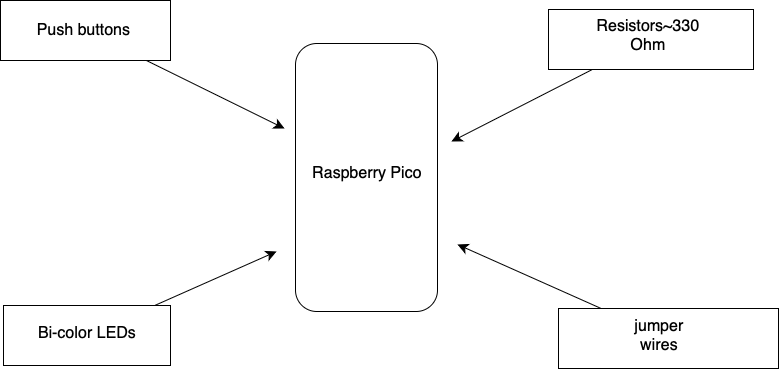

# Tic-Tac-Toe

 a simple game made in rust

:::info 

**Author**: Rosioru Yaris \
**GitHub Project Link**: https://github.com/UPB-FILS-MA/project-yarisrosioru

:::

## Description

Tic-Tac-Toe is a fun game for two players who take turns marking the spaces in a three-by-three grid with X or O. The player who succeeds in placing three of their marks in a horizontal, vertical, or diagonal row is the winner. It is a solved game, with a forced draw assuming best play from both players.

## Motivation

I was searching for inspiration in other students projects from the last years and I saw mini-games such as Snake or Pong Game.
That's when I thought to create a game of Tic-Tac-Toe

## Architecture 



## Log

<!-- write every week your progress here -->

### Week 6 - 12 May

### Week 7 - 19 May

### Week 20 - 26 May

## Hardware

Detail in a few words the hardware used.

### Schematics

Place your KiCAD schematics here.

### Bill of Materials

<!-- Fill out this table with all the hardware components that you might need.

The format is 
```
| [Device](link://to/device) | This is used ... | [price](link://to/store) |

```

-->

| Device | Usage | Price |
|--------|--------|-------|
| [Rapspberry Pi Pico W](https://www.raspberrypi.com/documentation/microcontrollers/raspberry-pi-pico.html) | The microcontroller | [35 RON](https://www.optimusdigital.ro/en/raspberry-pi-boards/12394-raspberry-pi-pico-w.html) |
|[Wires(F-F,M-M,F-M)](https://www.sudatel.sd/storage/2019/12/JUMPER-WIRE-SPECIFICATION.pdf) | Wire Connection | [19 RON]|
|[bi-color LEDs](https://www.optimusdigital.ro/ro/optoelectronice-led-uri/703-led-bicolor-de-3-mm-rosu-si-verde-cu-anod-comun.html?gad_source=1&gclid=CjwKCAjw3NyxBhBmEiwAyofDYc81R7P_yHfbliytvEZRX8mVyFCPob2bFMxJdQO0Cd3gmfWZPT0ftxoC6F0QAvD_BwE https://www.optimusdigital.ro/ro/optoelectronice-led-uri/703-led-bicolor-de-3-mm-rosu-si-verde-cu-anod-comun.html?gad_source=1&gclid=CjwKCAjw3NyxBhBmEiwAyofDYc81R7P_yHfbliytvEZRX8mVyFCPob2bFMxJdQO0Cd3gmfWZPT0ftxoC6F0QAvD_BwE) | input ||[3.11 RON](https://www.optimusdigital.ro/ro/optoelectronice-led-uri/703-led-bicolor-de-3-mm-rosu-si-verde-cu-anod-comun.html?gad_source=1&gclid=CjwKCAjw3NyxBhBmEiwAyofDYc81R7P_yHfbliytvEZRX8mVyFCPob2bFMxJdQO0Cd3gmfWZPT0ftxoC6F0QAvD_BwE%20https://www.optimusdigital.ro/ro/optoelectronice-led-uri/703-led-bicolor-de-3-mm-rosu-si-verde-cu-anod-comun.html?gad_source=1&gclid=CjwKCAjw3NyxBhBmEiwAyofDYc81R7P_yHfbliytvEZRX8mVyFCPob2bFMxJdQO0Cd3gmfWZPT0ftxoC6F0QAvD_BwE)|
|[push buttons](https://ardushop.ro/ro/electronica/386-buton-mic-cu-led.html?gad_source=1&gclid=CjwKCAjw3NyxBhBmEiwAyofDYYK9qo7IjnfMtsT8BGwhPxeqLLjScYG8FjmfC1KhMvf__CtSuMIWHxoCyFEQAvD_BwE https://ardushop.ro/ro/electronica/386-buton-mic-cu-led.html?gad_source=1&gclid=CjwKCAjw3NyxBhBmEiwAyofDYYK9qo7IjnfMtsT8BGwhPxeqLLjScYG8FjmfC1KhMvf__CtSuMIWHxoCyFEQAvD_BwE)| Input | [3,19 RON](https://ardushop.ro/ro/electronica/386-buton-mic-cu-led.html?gad_source=1&gclid=CjwKCAjw3NyxBhBmEiwAyofDYYK9qo7IjnfMtsT8BGwhPxeqLLjScYG8FjmfC1KhMvf__CtSuMIWHxoCyFEQAvD_BwE%20https://ardushop.ro/ro/electronica/386-buton-mic-cu-led.html?gad_source=1&gclid=CjwKCAjw3NyxBhBmEiwAyofDYYK9qo7IjnfMtsT8BGwhPxeqLLjScYG8FjmfC1KhMvf__CtSuMIWHxoCyFEQAvD_BwE)|
|[Resistors](https://ro.farnell.com/multicomp-pro/mcmf0w4ff3300a50/metal-film-resistor-330-ohm-250mw/dp/1126972)| Wiring | [2 RON](https://ro.farnell.com/multicomp-pro/mcmf0w4ff3300a50/metal-film-resistor-330-ohm-250mw/dp/1126972)|


## Software

| Library | Description | Usage |
|---------|-------------|-------|
 [SSD1306](https://github.com/adafruit/Adafruit_SSD1306) | Display driver |
 
| TODO |

## Links

<!-- Add a few links that inspired you and that you think you will use for your project -->

1. [Snake Game on Pico](https://www.youtube.com/watch?v=5r_6mbYlLVo)
2. [Pong Game](https://www.youtube.com/watch?v=7DlhFy_pxAk)
...
