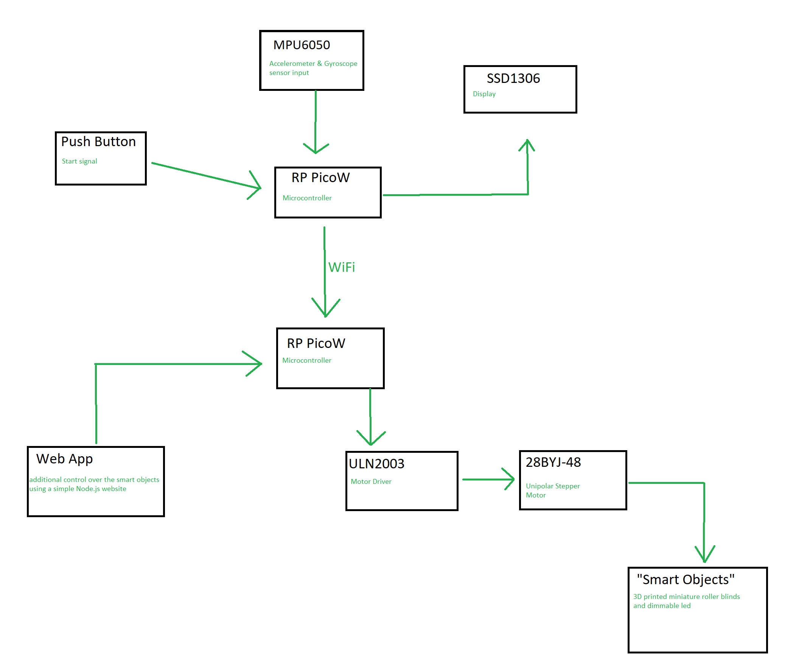

# Automated Window Blinds

:::info 

**Author**: Naomi Lita in collaboration with Rebeca Chiorean \
**GitHub Project Link**: [my github](https://github.com/UPB-FILS-MA/project-nimintz)
[Rebeca's github](https://github.com/UPB-FILS-MA/project-ChioreanRebeca)

:::

## Description

My project aims to automate a window blinds roller. The roller will be controlled through a web page on which I can set a time (like an alarm) to roll up/down the blinds or with a button to roll up/down directly. Also, my project will be connected to Rebeca's project. Her pico wand will be able to control the up/down movement of my window blinds. 

## Motivation

I chose this project because it was a dream of mine to wake up with natural sunlight at sunrise, but also to sleep well in a dark room with the rollers closed.

## Architecture 



## Log

<!-- write every week your progress here -->

### Week 6 - 12 May

### Week 7 - 19 May

### Week 20 - 26 May

## Hardware

The pico gets input either from a web app or another pico connected through wifi(Rebeca's project: pico wand) and sends a signal to the motor driver (ULN2003) which in turn starts the stepper motor (28BYJ-48) that rolls the blinds up or down.

### Schematics

Place your KiCAD schematics here.

### Bill of Materials

<!-- Fill out this table with all the hardware components that you might need.

The format is 
```
| [Device](link://to/device) | This is used ... | [price](link://to/store) |

```

-->

| Device | Usage | Price |
|--------|--------|-------|
| [Rapspberry Pi Pico WH](https://www.raspberrypi.com/documentation/microcontrollers/raspberry-pi-pico.html) | The microcontroller | [56,23 RON](https://ardushop.ro/ro/home/2819-raspberry-pi-pico-wh.html?search_query=Raspberry+Pi+Pico+WH%2C+Wireless+Headers&results=1031) |
| Kit Breadboard | to place the components | [24,61 RON](https://ardushop.ro/ro/electronica/163-kit-breadboard830-65xfire-jumper-sursa-alimentare-335v.html?search_query=KIT+Breadboard830+++65xfire+jumper+++sursa+alimentare+3%2C3%2F5V&results=694) |
| Resistors | regulate the power supply | [12,29 RON](https://ardushop.ro/ro/electronica/212-set-rezistente-14w-600buc30-valori-10r-1m.html?search_query=SET+rezistori+&results=429) |
| Stepper Motor 28BYJ-48 5V and Driver ULN2003| the motor to rotate the blinds and the driver that connects it pico | [16,97 RON](https://www.optimusdigital.ro/ro/motoare-motoare-pas-cu-pas/101-driver-uln2003-motor-pas-cu-pas-de-5-v-.html) |
| 3D printed case for device | holding all components together |


## Software

| Library | Description | Usage |
|---------|-------------|-------|
| [uln2003](https://github.com/MnlPhlp/uln2003) | 28BYJ-48 stepper motor with ULN2003 driver | Used for controlling the motor with rust |
| [neon](https://github.com/neon-bindings/neon) | Rust binding for Node.js | Used to connect the Rust code with the Node.js for the webpage |

## Links

<!-- Add a few links that inspired you and that you think you will use for your project -->

1. [3D printed and fully automated Roller Blind Motor](https://imgur.com/a/xuQjH3z)
2. [Pico Project: Automated window blinds that open at sunrise and close at sunset](https://www.reddit.com/r/raspberrypipico/comments/wbdsz1/pico_project_automated_window_blinds_that_open_at/)
