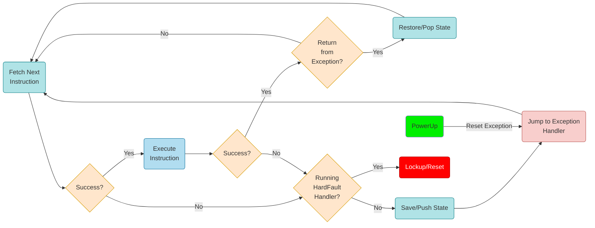
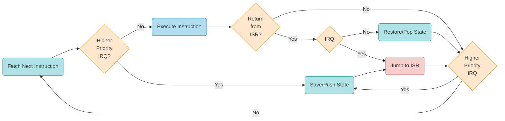
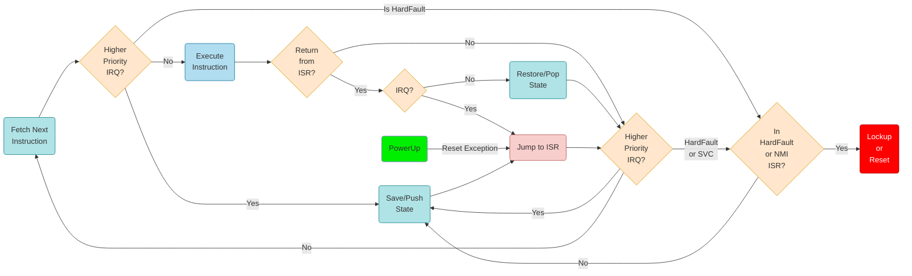
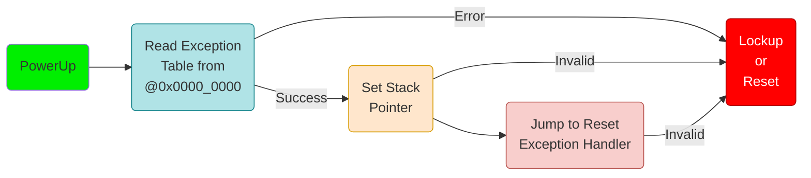
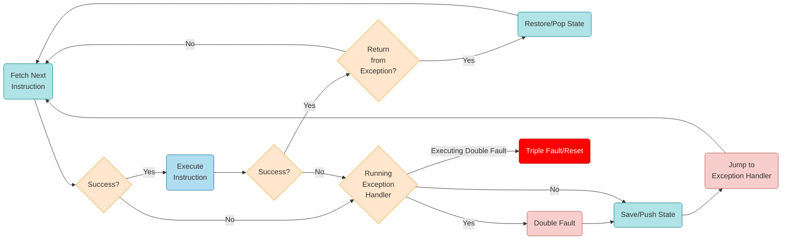

---
---
# Processor Exceptions
what happens if something does not work as required

---
---
# ARM Cortex-M0+ Exceptions
what happens if something does not work as required

---
---
# Exception (HardFault) Handling
ARM Cortex-M0+ has one **actual expection**, *HardFault*

- the exception table is *usually* at address 0x0000_0004 (start of the boot area + 4 bytes)
- the processor generates a *Reset* exception when it starts

---
---
# Interrupt Handling
ARM Cortex-M0+

| | |
|-|-|
| *IRQ* | Interrupt Request |
| *ISR* | Interrupt Service Routine |

- the interrupt vector (table) is *usually* at address 0x0000_0040 (after the exceptions table with 15 interrupts)
- ARM Cortex-M0+ has a maximum of 32 interrupt requests (IRQs)

---
---
# Exceptions are Software Interrupt Requests
with a negative IRQ number and a higher priority

- Reset (-14)
- HardFault (-13)
- SVC (-5)
- PendSV (-2)
- SysTick (-1)

  

---
---
# Boot
how the ARM Cortex-M0+ starts

---
---

# Exception Handling
x86

