# USB 2.0
Universal Serial Bus

---
layout: two-cols
---
# Universal Serial Bus
2.0

- Used for communication between a host and several devices that each provide functions
- Two modes:
  - *host* - initiates the communication (usually a computer)
  - *device* - receives and transmits data when the *host* requests it
- each device has a 7 bit address assigned upon connect
  - maximum 127 devices connected to a USB host
- devices are interconnected using *hubs*
- USB devices tree

:: right ::

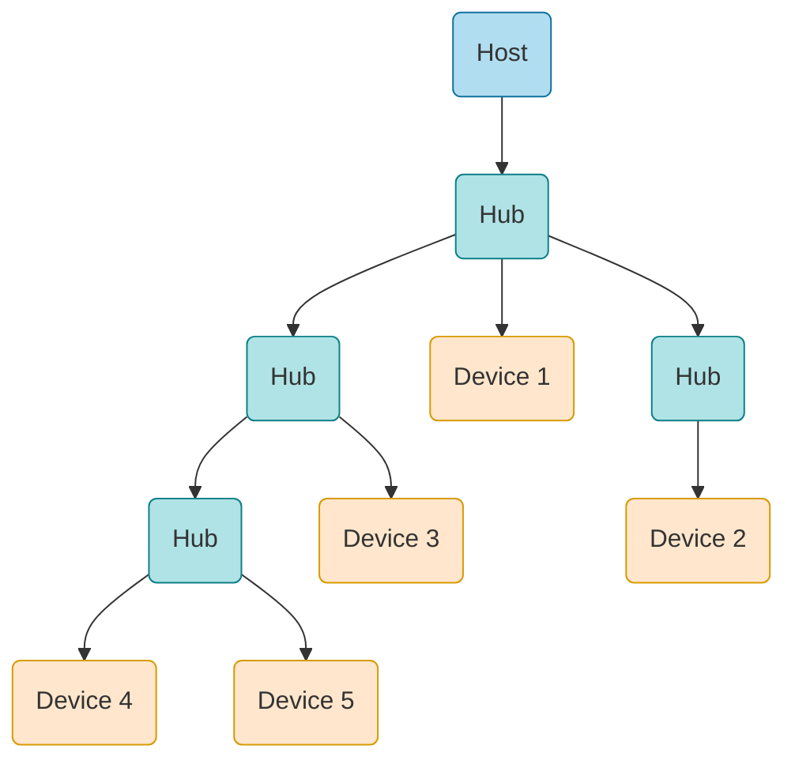

---
---
# Bibliography
for this section

1. **Raspberry Pi Ltd**, *[RP2040 Datasheet](https://datasheets.raspberrypi.com/rp2040/rp2040-datasheet.pdf)*
   - Chapter 4 - *Peripherals*
     - Chapter 4.1 - *USB*

2. *[USB Made Simple](https://www.usbmadesimple.co.uk/)*

---
layout: two-cols
---
# USB Device

<style>
.two-columns {
    grid-template-columns: 3fr 6fr;
}
</style>

- can work as **host** or **device**, but not at the same time
- uses a differential line for transmission
- uses a 48 MHz clock
- maximum 16 endpoints (buffers)
  - *IN* - from **device** to **host**
  - *OUT* - from **host** to **device**
- endpoints 0 IN and OUT are used for control

:: right ::

<div align="center">

</div>

---

# USB Packet
the smallest element of data transmission

<style>
img {
  background: #ffffff;
}
</style>

Token
<div align="center">

</div>

Data
<div align="center">

</div>

Handshake
<div align="center">

</div>


---

# Token Packet
usually asks for a data transmission

<style>
img {
  background: #ffffff;
}
</style>

| Type | PID | Description |
|-|-|-|
| *OUT* | `0001` | **host** wants to transmit data to the **device** |
| *IN* | `1001` | **host** wants to receive data from the **device** |
| *SETUP* | `1101` | **host** wants to setup the **device** |

Address: `ADDR`:`ENDP`

<div align="center">

</div>


---

# Data Packet
transmits data

<style>
img {
  background: #ffffff;
}
</style>

| Type | PID | Description |
|-|-|-|
| *DATA0* | `0011` | the data packet is the first one or follows after a `DATA1` packet |
| *DATA1* | `1011` | the data packet follows after a `DATA0` packet |

Data can be between 0 and 1024 bytes

<div align="center">

</div>


---

# Handshake Packet
acknowledges data

<style>
img {
  background: #ffffff;
}
</style>

| Type | PID | Description |
|-|-|-|
| *ACK* | `0010` | data has been **successfully received**  |
| *NACK* | `1010` | data has **not** been **successfully received** |
| *STALL* | `1110` | the device has an **error** |

<div align="center">

</div>


---
---
# Transmission Modes

- *Control* - used for configuration
- *Isochronous* - used for high bandwidth, best effort
- *Bulk* - used for low bandwidth, stream
- *Interrupt* - used for low bandwidth, guaranteed latency

---
---

# Control
used to control a device - ask for data

<div grid="~ cols-2 gap-5">

<div>

<v-click>

**Setup** - send a command (*GET_DESCRIPTOR*, ...)
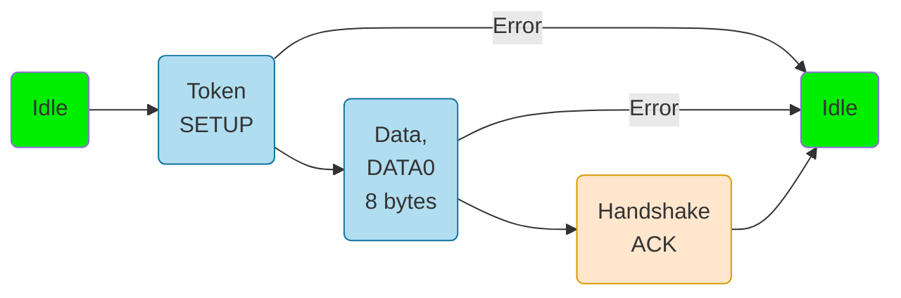

</v-click>

<v-click>

**Data** - *optional* several transfers, host transfers data
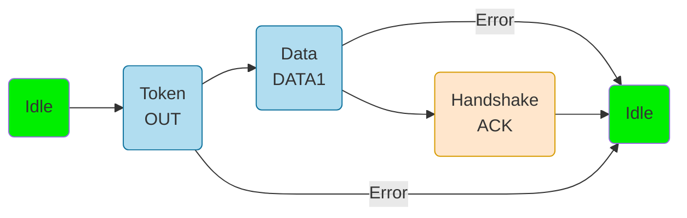

</v-click>

</div>

<div>

<v-after>


...

</v-after>

<v-click>

**Status** - report the status to the host

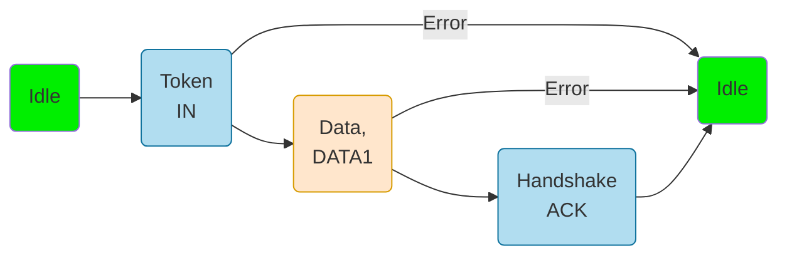

</v-click>

</div>
</div>

---

# Control
used to control a device - send data

<div grid="~ cols-2 gap-5">

<div>

<v-click>

**Setup** - send a command (*SET_ADDRESS*, ...)


</v-click>

<v-click>

**Data** - *optional* several transfers, device transfers the requested data


</v-click>

</div>

<div>

<v-after>

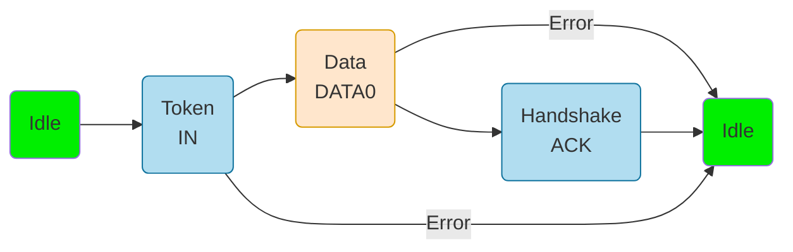

...

</v-after>

<v-click>

**Status** - report the status to the device

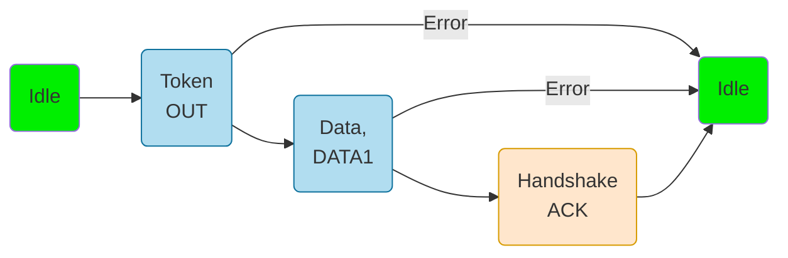

</v-click>

</div>
</div>


---
---
# Isochronous
fast but not reliable transfer

- has a guaranteed bandwidth
- allows data loss
- used for functions like streaming where loosing a packet has a minimal impact

<div grid="~ cols-2 gap-5">

<div>

<v-click>

**OUT** - transfer data from the host to the device
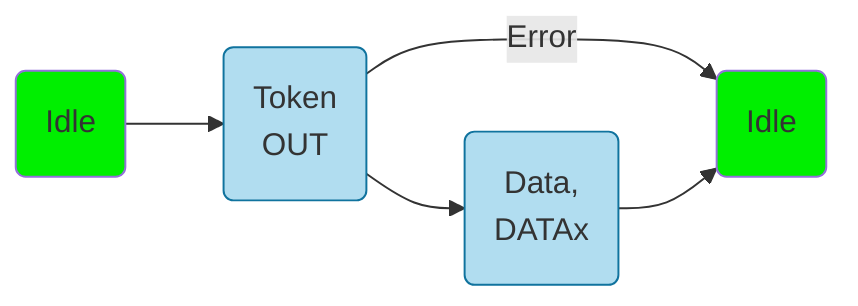

</v-click>

</div>

<div>

<v-click>

**IN** - transfer data from the device to the host
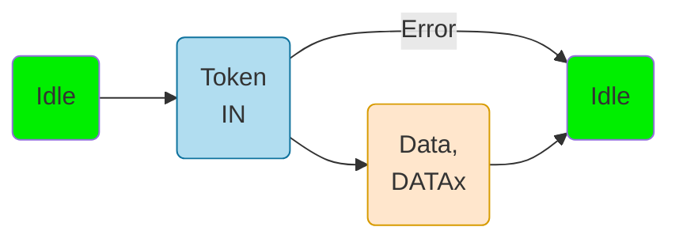

</v-click>

</div>

</div>

---
---
# Bulk
slow, but reliable transfer

- does not have a guaranteed bandwidth
- secure transfer
- used for large data transfers where loosing packets is not permitted

<div grid="~ cols-2 gap-5">

<div>

<v-click>

**OUT** - transfer data from the host to the device
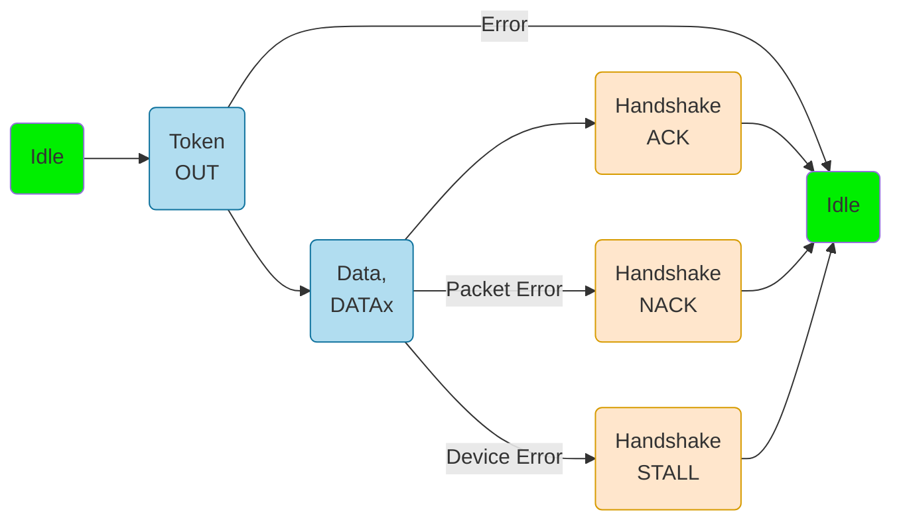

</v-click>

</div>

<div>

<v-click>

**IN** - transfer data from the device to the host
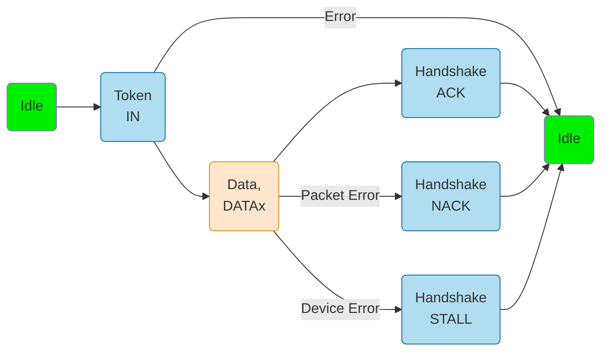

</v-click>

</div>

</div>

---
---
# Interrupt
transfer data at a minimum time interval

- the endpoint descriptor asks the host start an interrupt transfer at a time interval
- used for sending and receiving data at certain intervals

<div grid="~ cols-2 gap-5">

<div>

<v-click>

**OUT** - transfer data from the host to the device


</v-click>

</div>

<div>

<v-click>

**IN** - transfer data from the device to the host


</v-click>

</div>

</div>


---
layout: two-cols
---
# Device Organization
configuration, interfaces, endpoints

- a device can have multiple configurations
  - for instance different functionality based on power consumption
- a configuration has multiple interfaces
  - a device can perform multiple functions
  - Debugger
  - Serial Port
- each interface has multiple interfaces attached
  - endpoints are used for data transfer
  - maximum 16 endpoints, can be configured IN and OUT
- the device reports the descriptors in this order

:: right ::

<div align="center">

</div>

---
layout: two-cols
---

# Connection

<style>
img {
  background: #ffffff;
}
</style>

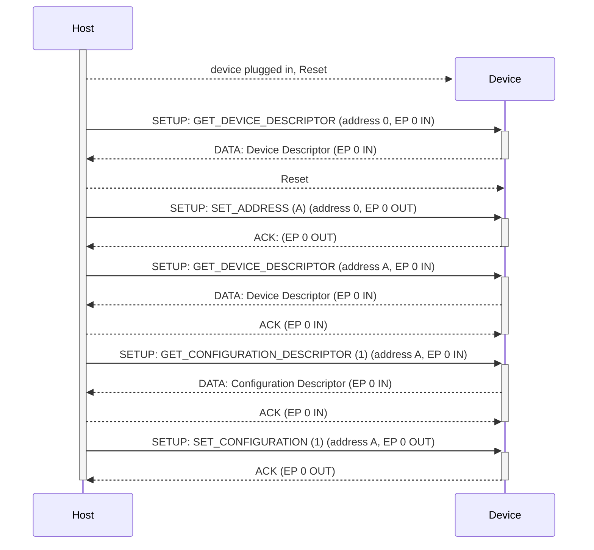

:: right ::

# Token SETUP Packet

The DATA packet of the SETUP Control Transfer

<div align="center">

</div>

*bmRequestType* field

<div align="center">

</div>


---
---
# USB 1.0 and 2.0 Modes
| Mode | Speed | Version |
|-|-|-|
| Low Speed | 1.5 Mbit/s | 1.0 |
| Full Speed | 12 Mbit/s | 1.0 |
| High Speed | 480 Mbit/s | 2.0 |

---
---

# Facts

| | | |
|-|-|-|
| Transmission | *half duplex* | data must be sent in one direction at one time |
| Clock | *independent* | the **host** and the **device** must synchronize their clocks |
| Wires | *DP* / *DM* | data is sent in a differential way |
| Devices | *1 host* <br> *several devices* | a receiver and a transmitter |
| Speed | *480 MBbit/s* |  |

---
layout: two-cols
---
# Embassy API
for RP2040, setup the device

```rust {lines: false}
use embassy_rp::usb::{Driver, Instance, InterruptHandler};
use embassy_usb::class::cdc_acm::{CdcAcmClass, State};

bind_interrupts!(struct Irqs {
    USBCTRL_IRQ => InterruptHandler<USB>;
});

let driver = Driver::new(p.USB, Irqs);

let mut config = Config::new(0xc0de, 0xcafe);
config.manufacturer = Some("Embassy");
config.product = Some("USB-serial example");
config.serial_number = Some("12345678");
config.max_power = 100;
config.max_packet_size_0 = 64;

// Required for windows compatibility.
config.device_class = 0xEF;
config.device_sub_class = 0x02;
config.device_protocol = 0x01;
config.composite_with_iads = true;
```

:: right ::

```rust {lines: false}
// It needs some buffers for building the descriptors.
let mut config_descriptor = [0; 256];
let mut bos_descriptor = [0; 256];
let mut control_buf = [0; 64];

let mut state = State::new();

let mut builder = Builder::new(
	driver,
	config,
	&mut config_descriptor,
	&mut bos_descriptor,
	&mut [], // no msos descriptors
	&mut control_buf,
);

// Create classes on the builder.
let mut class = CdcAcmClass::new(&mut builder, &mut state, 64);

// Build the builder.
let mut usb = builder.build();

// Run the USB device.
let usb_driver = usb.run();
```

---
---
# Embassy API
for RP2040, use the USB device

```rust
let echo_loop = async {
	loop {
		class.wait_connection().await;
		info!("Connected");
		let _ = echo(&mut class).await;
		info!("Disconnected");
	}
};

// Run everything concurrently.
join(usb_driver, echo_loop).await;
```

```rust
async fn echo<'d, T: Instance + 'd>(class: &mut CdcAcmClass<'d, Driver<'d, T>>) -> Result<(), EndpointError> {
    let mut buf = [0; 64];
    loop {
        let n = class.read_packet(&mut buf).await?;
        let data = &buf[..n];
        info!("data: {:x}", data);
        class.write_packet(data).await?;
    }
}

```
