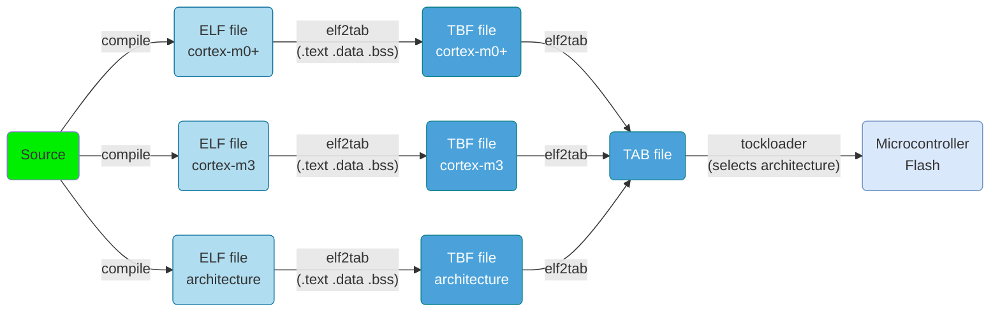
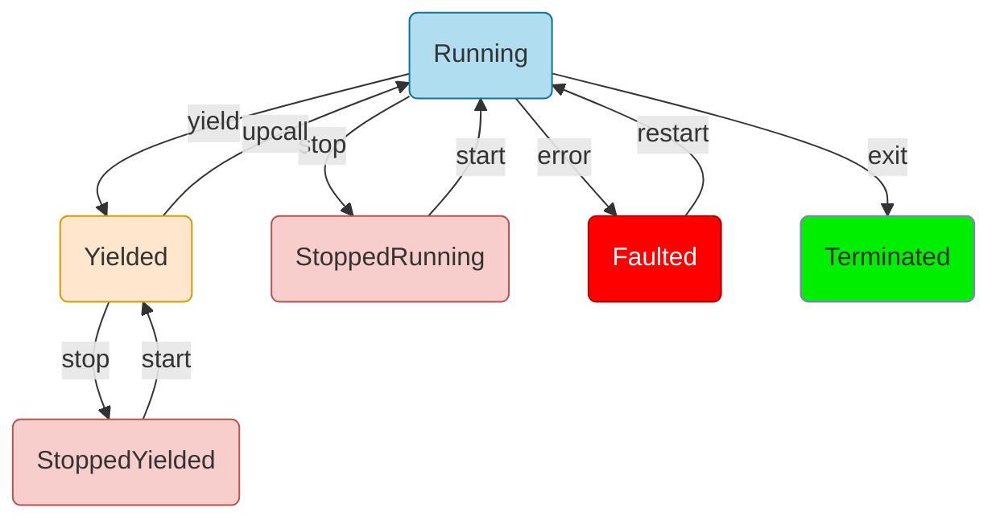

# Tock OS
An embedded operating system designed for running multiple concurrent, mutually distrustful applications on low-memory and low-power microcontrollers.

---
---
# Bibliography
for this section

**Alexandru Radovici, Ioana Culic**, *Getting Started with Secure Embedded Systems*
   - Chapter 3 - *The Tock system architecture*

---
---
# Tock OS
an embedded operating systems that works like a desktop or server one

<div grid="~ cols-3 gap-5">

<div style="grid-column-start: 1; grid-column-end: 3;">

- A **preemptive** embedded OS (runs on MCUs)
  - Cortex-M
  - RISC-V
- Uses memory protection (**MPU required**)
- Has separate **kernel and user space**
  - most embedded OS have the one piece software philosophy
- Runs untrusted apps in user space
- **Hybrid** architecture
- Kernel (and drivers) written in Rust
- Apps written in C/C++ or Rust (any language that can be compiled)

</div>


</div>

---
---
# The Stack


---
---
# Processes
separate binaries

- compiled separately from the kernel
- written in any language that compiles (C, Rust, ...)
- saved into the *Tock Binary Format* (*TBF*) / *Tock Application Bundle* (*TAB*)



---
layout: two-cols
---
# Tock Binary Format
stores

- **headers** about how to load the application
- the **binary code** and **data**
- **credential** footers


:: right ::

<div align="center">
  
</div>

---
layout: two-cols
---
# Memory Layout
for the RP2040

<style>
.two-columns {
    grid-template-columns: 5fr 3fr;
}
</style>

**Kernel**
- is written in flash separated from the apps
- loads each app at boot

**Applications**
- each application TBF is written to the flash separately
- each application has a separate 
  - *stack* in RAM  
  - *grant* section where the kernel stores data about the app
  - *data* section in RAM


:: right ::


---
layout: two-cols
---
# Memory Layout
for the RP2040 at runtime

<style>
.two-columns {
    grid-template-columns: 5fr 3fr;
}
</style>

**Kernel**
- sets up the MPU every time it switches to a process

**Applications**
- can read and execute its code
- can read and write its *stack* and *data*
- can read and write the *allocated heap*

Applications are **not allowed** to access the **kernel's memory** or **the peripherals**.


:: right ::


---
---
# Process States

- Tock runs only on *single core*
- *Running* state means the process is ready to run
- *Yielded* means the process waits for an event (*upcall*)
- *start* and *stop* are user commands
- a process is stopped only if the user asked it

<div align="center">



</div>

---
---
# Application API
libraries

Tock provides two libraries:
  - [`libtock-c`](https://github.com/tock/libtock-c) that is fully supported
  - [`libtock-rs`](https://github.com/tock/libtock-rs) that is in development ⚠️ [^rust_issue]

[^rust_issue]: Due to a Rust [compiler issue](https://github.com/tock/libtock-rs/issues/28), Rust applications are not relocatable. This means that developers have to know at compile time the load addresses for Flash and RAM.

---
---
# Example Application ( C )

```c
#include <libtock-sync/services/alarm.h>
#include <libtock/interface/led.h>

int main(void) {
  // Ask the kernel how many LEDs are on this board.
  int num_leds;
  int err = libtock_led_count(&num_leds);
  if (err < 0) return err;

  // Blink the LEDs in a binary count pattern and scale
  // to the number of LEDs on the board.
  for (int count = 0; ; count++) {
    for (int i = 0; i < num_leds; i++) {
      if (count & (1 << i)) {
        libtock_led_on(i);
      } else {
        libtock_led_off(i);
      }
    }

    // This delay uses an underlying alarm in the kernel.
    libtocksync_alarm_delay_ms(250);
  }
}
```

---
---
# Example Application ( Rust )

```rust{all|10,11}
//! A simple libtock-rs example. Just blinks all the LEDs.

#![no_main]
#![no_std]

use libtock::alarm::{Alarm, Milliseconds};
use libtock::leds::Leds;
use libtock::runtime::{set_main, stack_size};

set_main! {main}
stack_size! {0x200}

fn main() {
    if let Ok(leds_count) = Leds::count() {
        loop {
            for led_index in 0..leds_count {
                let _ = Leds::toggle(led_index as u32);
            }
            Alarm::sleep_for(Milliseconds(250)).unwrap();
        }
    }
}
```

---
layout: two-cols
---
# Faults
similar to segfaults

- the kernel and apps can fault
- a detailed debug message can be displayed
- due to MPU usage Tock apps fault on:
  - trying to access memory outside its data (includes peripheral access)
  - stack overflow
  - trying to perform privileged operations

:: right ::

```shell {lines: false}
---| Fault Status |---
Data Access Violation:              true
Forced Hard Fault:                  true
Faulting Memory Address:            0x00000000
Fault Status Register (CFSR):       0x00000082
Hard Fault Status Register (HFSR):  0x40000000

---| App Status |---
App: crash_dummy   -   [Fault]
 Events Queued: 0   Syscall Count: 0   Dropped Callback Count: 0
 Restart Count: 0
 Last Syscall: None

 ╔═══════════╤══════════════════════════════════════════╗
 ║  Address  │ Region Name    Used | Allocated (bytes)  ║
 ╚0x20006000═╪══════════════════════════════════════════╝
             │ ▼ Grant         948 |    948
  0x20005C4C ┼───────────────────────────────────────────
             │ Unused
  0x200049F0 ┼───────────────────────────────────────────
             │ ▲ Heap            0 |   4700               S
  0x200049F0 ┼─────────────────────────────────────────── R
             │ Data            496 |    496               A
  0x20004800 ┼─────────────────────────────────────────── M
             │ ▼ Stack          72 |   2048
  0x200047B8 ┼───────────────────────────────────────────
             │ Unused
  0x20004000 ┴───────────────────────────────────────────
             .....
  0x00030400 ┬─────────────────────────────────────────── F
             │ App Flash       976                        L
  0x00030030 ┼─────────────────────────────────────────── A
             │ Protected        48                        S
  0x00030000 ┴─────────────────────────────────────────── H

  R0 : 0x00000000    R6 : 0x20004894
  R1 : 0x00000001    R7 : 0x20004000
  R2 : 0x00000000    R8 : 0x00000000
  R3 : 0x00000000    R10: 0x00000000
  R4 : 0x00000000    R11: 0x00000000
  R5 : 0x20004800    R12: 0x12E36C82
  R9 : 0x20004800 (Static Base Register)
  SP : 0x200047B8 (Process Stack Pointer)
  LR : 0x000301B7
  PC : 0x000300AA
 YPC : 0x000301B6

 APSR: N 0 Z 1 C 1 V 0 Q 0
       GE 0 0 0 0
 EPSR: ICI.IT 0x00
       ThumbBit true

 Cortex-M MPU
  Region 0: base: 0x20004000, length: 8192 bytes; ReadWrite (0x3)
  Region 1: base:    0x30000, length: 1024 bytes; ReadOnly (0x6)
  Region 2: Unused
  Region 3: Unused
  Region 4: Unused
  Region 5: Unused
  Region 6: Unused
  Region 7: Unused

To debug, run `make debug RAM_START=0x20004000 FLASH_INIT=0x30059`
in the app's folder and open the .lst file.
```

---
layout: two-cols
---
# System Calls

0. Yield
1. Subscribe
2. Command
3. ReadWriteAllow
4. ReadOnlyAllow
5. Memop
6. Exit
7. UserspaceReadableAllow

:: right ::


---
---

# 5: Memop

Memop expands the memory segment available to the process, allows the process to
retrieve pointers to its allocated memory space, provides a mechanism for
the process to tell the kernel where its stack and heap start, and other
operations involving process memory.

```rust {lines: false}
memop(op_type: u32, argument: u32) -> [[ VARIES ]] as u32
```

<div grid="~ cols-2 gap-3">

<div>

**Arguments**

 - `op_type`: An integer indicating whether this is a `brk` (0), a `sbrk` (1),
   or another memop call.
 - `argument`: The argument to `brk`, `sbrk`, or other call.

Each memop operation is specific and details of each call can be found in
the [memop syscall documentation](https://github.com/tock/tock/blob/master/doc/syscalls/memop.md).

</div>

<div>

**Return**

- Dependent on the particular *memop* call.

</div>
</div>

---
---
# 6: Exit

The process signals the kernel that it has no more work to do and can be stopped or that it asks
the kernel to restart it.

```rust {lines: false}
tock_exit(completion_code: u32)
tock_restart(completion_code: u32)
```

**Return**

None 

---
---

# 2: Command

Command instructs the driver to perform a specific action.

```rust {lines: false}
command(driver: u32, command_number: u32, argument1: u32, argument2: u32) -> CommandReturn
```

<div grid="~ cols-2 gap-3">

<div>

**Arguments**

 - `driver`: integer specifying which driver to use
 - `command_number`: the requested command.
 - `argument1`: a command-specific argument
 - `argument2`: a command-specific argument

One Tock convention with the *Command* system call is that command number 0 will
always return a value of 0 or greater if the driver is present.

</div>

<div>

**Return**
- three `u32` numbers
- Errors
   - `NODEVICE` if `driver` does not refer to a valid kernel driver.
   - `NOSUPPORT` if the driver exists but doesn't support the `command_number`.
   - Other return codes based on the specific driver.

</div>
</div>

---
---

# 1: Subscribe

Subscribe assigns upcall functions to be executed in response to various
events.

```rust {lines: false}
subscribe(driver: u32, subscribe_number: u32, upcall: u32, userdata: u32) -> Result<Upcall, (Upcall, ErrorCode)>
```

<div grid="~ cols-2 gap-3">

<div>

**Arguments**

 - `driver`: integer specifying which driver to use
 - `subscribe_number`: event number
 - `upcall`: function's pointer to call upon event
```c {lines: false}
void upcall(int arg1, int arg2, int arg3, void* userdata)
```
 - `userdata`: value that will be passed back, usually a pointer

</div>

<div>

**Return**

- The previously registered upcall or `TOCK_NULL_UPCALL`
- Errors
   - `NODEVICE` if `driver` does not refer to a valid kernel driver.
   - `NOSUPPORT` if the driver exists but doesn't support the `subscribe_number`.

</div>
</div>

---
---

# 0: Yield

Yield transitions the current process from the Running to the Yielded state.

```rust
// waits for the next upcall
// The process will not execute again until another upcall re-schedules the
// process.
yield()

// does not wait for the next upcall
// If a process has no enqueued upcalls, the
// process immediately re-enters the Running state.
yield_no_wait()
```

## Return

*yield*: None 

*yield_no_wait*:
  - 1 - *upcall* ran
  - 0 - there was no queued *upcall* function to execute

---
layout: two-cols
---
# Scheduler
using command, subscribe and yield

<div align="center">

how the scheduler works
</div>

:: right ::

<div align="center">

how drivers work
</div>

---
---

# 3 and 4: AllowRead(Write/Only)

Allow shares memory buffers between the kernel and application.

```rust {lines: false}
allow_readwrite(driver: u32, allow_number: u32, pointer: usize, size: u32) -> Result<ReadWriteAppSlice, (ReadWriteAppSlice, ErrorCode)>
allow_readonly(driver: u32, allow_number: u32, pointer: usize, size: u32) -> Result<ReadWriteAppSlice, (ReadWriteAppSlice, ErrorCode)>
```

<div grid="~ cols-2 gap-3">

<div>

**Arguments**

 - `driver`: integer specifying which driver to use
 - `allow_number`: driver-specific integer specifying the purpose of this
   buffer
 - `pointer`: pointer to the buffer in the process memory space
   - null pointer revokes a previously shared buffer
 - `size`: the length of the buffer

</div>

<div>

**Return**
- The previous allowed buffer or NULL
- Errors
   - `NODEVICE` if `driver` does not refer to a valid kernel driver.
   - `NOSUPPORT` if the driver exists but doesn't support the `allow_number`.
   - `INVAL` the buffer referred to by `pointer` and `size` lies completely or
partially outside of the processes addressable RAM.

</div>
</div>

---
layout: two-cols
---
# System Call Pattern

<v-clicks>

1. *allow*: if data exchange is required, share a buffer with a driver
2. *subscribe* to the *action done* event
3. send a *command* to ask the driver to start performing an action
4. *yield* to wait for the *action done* event
   - *the kernel calls a callback*
   - verify if the expected event was triggered, if not *yield*
5. *unallow*: get the buffer back from the driver

</v-clicks>

:: right ::

