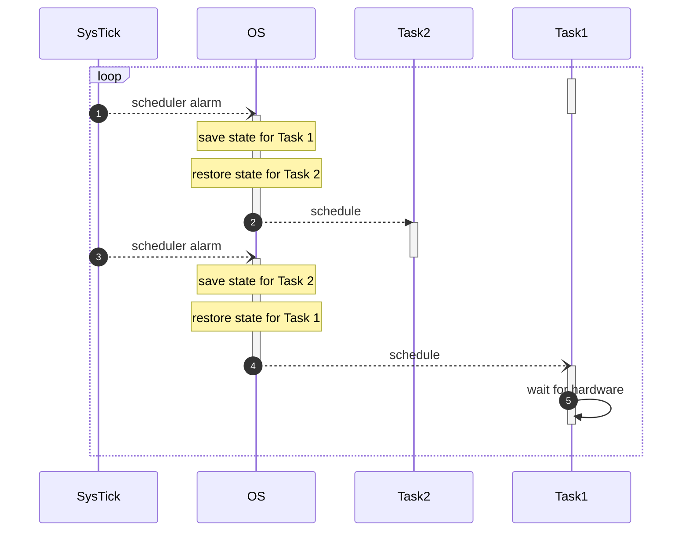
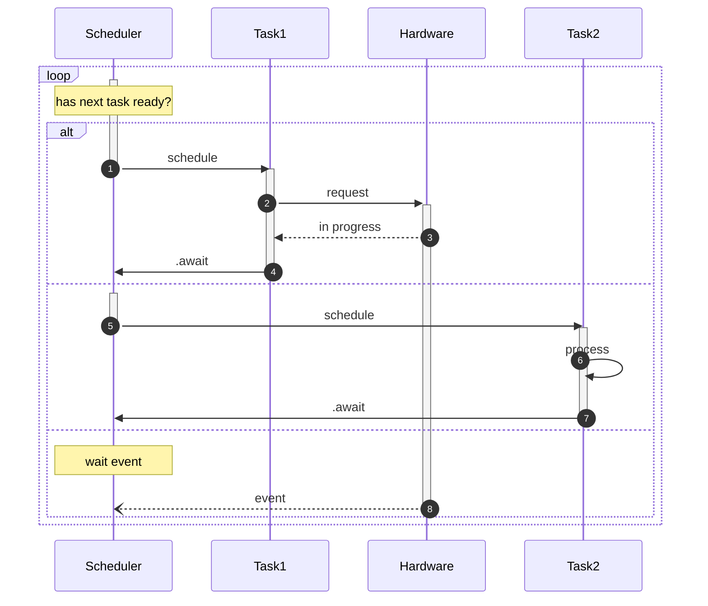

# Concurrency
Preemptive and Cooperative

---
---
# Bibliography
for this section

**Brad Solomon**, *[Async IO in Python: A Complete Walkthrough](https://realpython.com/async-io-python/)* 

---
layout: two-cols
---
# Preemptive Concurrency

- MCUs are usually *single core*[^rp2040]
- Tasks in parallel require an OS[^interrupts]
- Tasks can be suspended at any time
- **Switching** the task is **expensive**
- Tasks that do a lot of I/O which makes the **switching time longer than** the actual **processing time**

:: right ::

[^rp2040]: RP2040 is a dual core MCU, we use only one core
[^interrupts]: Running in an ISR is not considered a normal task

---
layout: two-cols
---
# Cooperative Concurrency

- tasks cannot be interrupted[^interrupts]
- **hardware** works in an **asynchronous** way
- tasks cooperate
  - give up the MCU for other tasks to use it while they wait for hardware
- there is **no need for an OS**, everything is done in **one single flow**
- **no penalty** for saving and restoring the state

[^interrupts]: except for ISR

:: right ::

