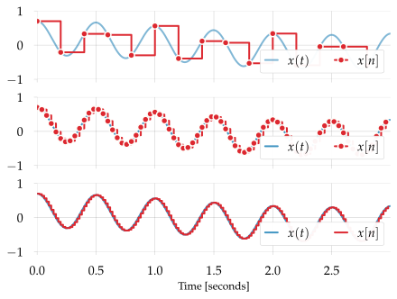
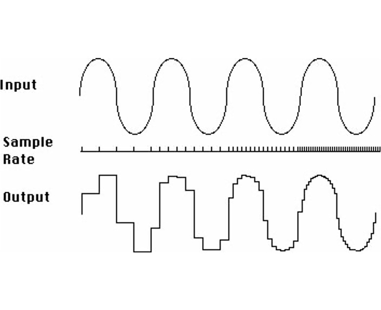
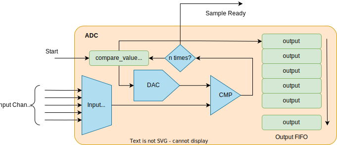
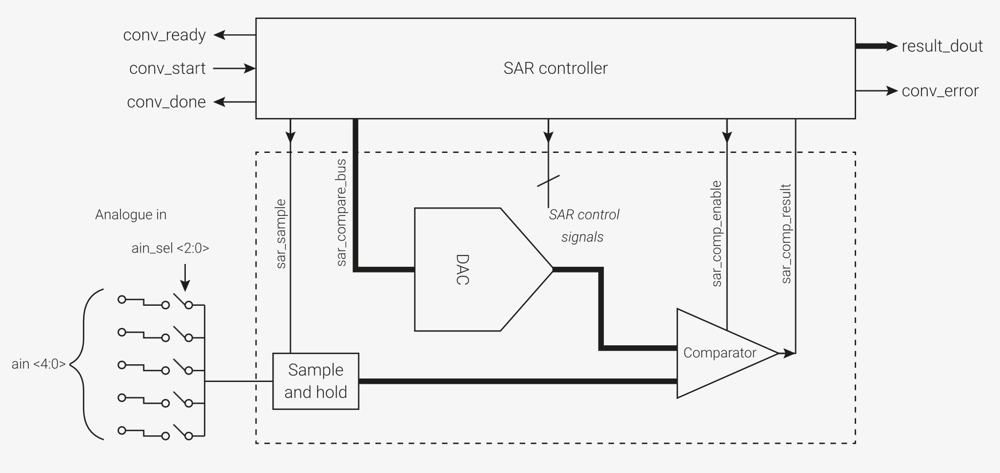

# ADC
Analog to Digital Converter

---
---
# Bibliography
for this section

**Raspberry Pi Ltd**, *[RP2040 Datasheet](https://datasheets.raspberrypi.com/rp2040/rp2040-datasheet.pdf)*
   - Chapter 4 - *Peripherals*
     - Chapter 4.9 - *ADC and Temperature Sensor*
       - Subchapter 4.9.1
       - Subchapter 4.9.2
       - Subchapter 4.9.5

---
layout: two-cols
---
# ADC
sampling an analog signal to an array of values

<style>
.two-columns {
    grid-template-columns: 3fr 5fr;
}
</style>

| | | |
|-|-|-|
| *sampling rate* | Hz | the frequency at which a new sample is read |
| *resolution* | bits | the number of bits used to store a sampled value |

:: right ::

<div align="center">

</div>

<div align="center">

Lower sample rates yield the *aliasing effect*.

</div>

---
---
# Nyquist–Shannon Sampling Theorem

<div grid="~ cols-2 gap-5">

<div>

$$
sampling_f >= 2 \times max_{f}
$$

*The **sampling frequency** has to be at least **two times higher** than the **maximum frequency** of the signal* to avoid frequency aliasing[^aliasing].

[^aliasing]: Aliasing is the overlapping of frequency components. This overlap results in distortion or artifacts when the signal is reconstructed from samples which causes the **reconstructed signal to differ from the original** continuous signal.

</div>

<div align="center">

</div>

</div>

---
layout: two-cols
---
# Sampling
how the ADC works

<style>
.two-columns {
    grid-template-columns: 3fr 6fr;
}
</style>

- assumes bit<sub>n-1</sub> of `compare_value` is `1`
- compares the input signal with a generated analog signal from `compare_value`
  - if input is lower, bit<sub>n-1</sub> is `0`
  - if input if higher, bit<sub>n-1</sub> is `1`
- repeats for bit<sub>n-2</sub>, bit<sub>n-3</sub> ... bit<sub>0</sub>

:: right ::

<div align="center">

</div>

There are different [types of ADCs](https://www.monolithicpower.com/en/analog-to-digital-converters/introduction-to-adcs/types-of-adcs) depending on the architecture. 
The most common used is SAR ([*Successive Approximation Register*](https://en.wikipedia.org/wiki/Successive-approximation_ADC)) ADC, also integrated in RP2040.

---
layout: two-cols
---

# RP2040's ADC 

<style>
.two-columns {
    grid-template-columns: 4fr 5fr;
}
</style>

| | |
|-|-|
| *channels* | 5 |
| *sampling rate* | 500 kHz |
| *resolution* | 12 bits |
| *V<sub>max</sub>* | 3.3 V |

- requires a 48 MHz clock signal
- channel 4 is connected to the internal temperature sensor

$$

t = 27 - \frac{(V_{input\_4} - 0.706)}{0.001721} [\degree C]_{SI}

$$

:: right ::

<div align="center">

</div>

<div align="center">

</div>


---
---
# ADC
in Embassy

```rust{all|1|3-5|7|8|10|13-14|15|15,16|17|12,13,15,17,18}
use embassy_rp::adc::{Adc, Channel, Config, InterruptHandler};

bind_interrupts!(struct Irqs {
    ADC_IRQ_FIFO => InterruptHandler;
});

let p = embassy_rp::init(Default::default());
let mut adc = Adc::new(p.ADC, Irqs, Config::default());

let mut p26 = Channel::new_pin(p.PIN_26, Pull::None);

loop {
    let level = adc.read(&mut p26).await.unwrap();
    info!("Pin 26 ADC: {}", level);
    let voltage = 3300 * level / 4095;
    info!("Pin 26 voltage: {}.{}V", voltage / 1000, voltage % 1000);
    Timer::after_secs(1).await;
}
```
