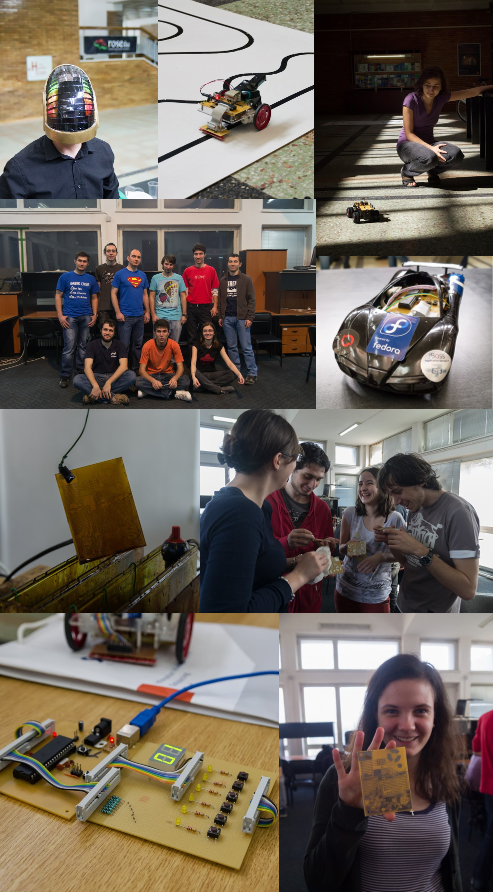

---
---
# Outline

## Lectures
  - 12 lectures
  - 1 Q&A lecture for the project

## Labs
  - 12 labs

## Project
- Build a hardware device running software written in Rust
- The cost for the hardware is around 150 RON
- Presented at PM Fair during the last week of the semester

---
---
# Grading

| Part | Description | Points |
|-----|-------------|--------|
| [Lecture](/docs/category/lecture) tests | You will have a test at every class with subjects from the previous class. | 2p |
| [Lab](/docs/category/lab) | Your work at every lab will be graded. | 2p |
| [Project](/docs/project) | You will have to design and implement a hardware device. Grading will be done for the documentation, hardware design and software development. | 5p |
| Exam | You will have to take an exam during the session. | 2p |
| **Total** | *You will need at least 4.5 points to pass the subject.* | **11p** |
